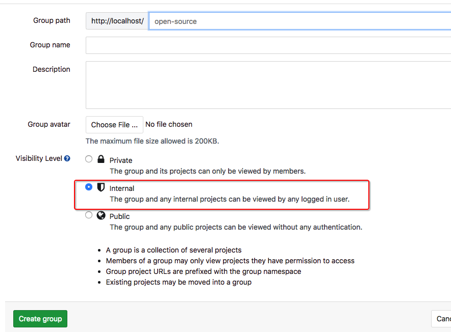
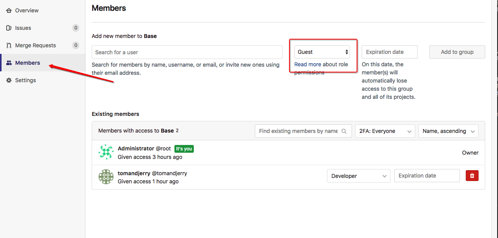
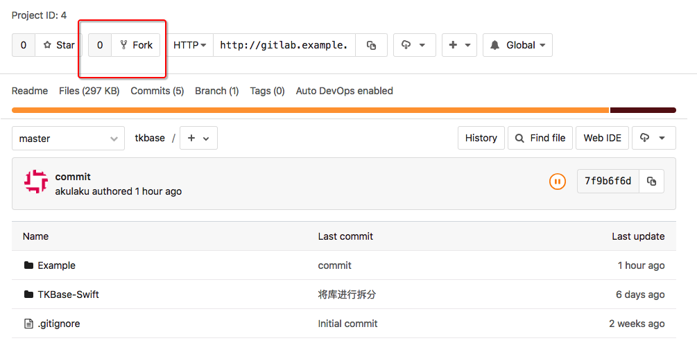
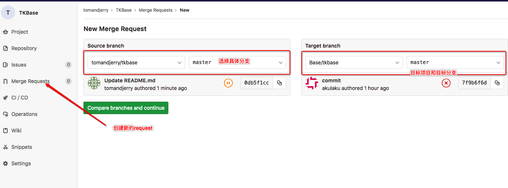
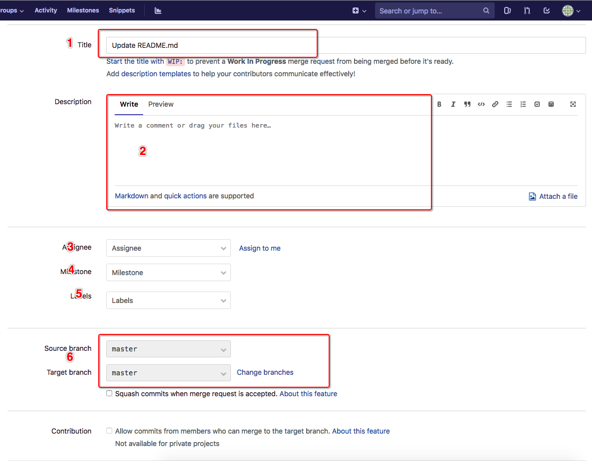
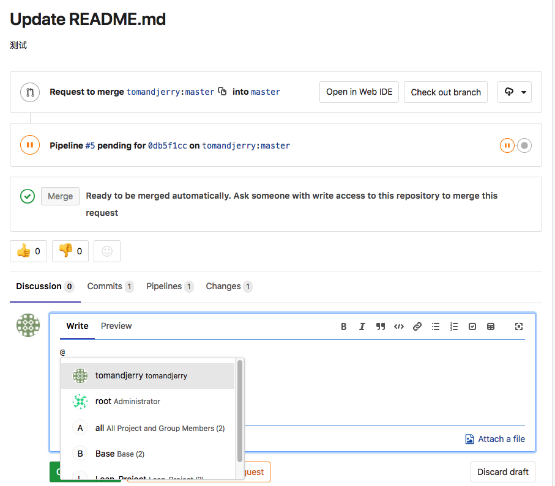
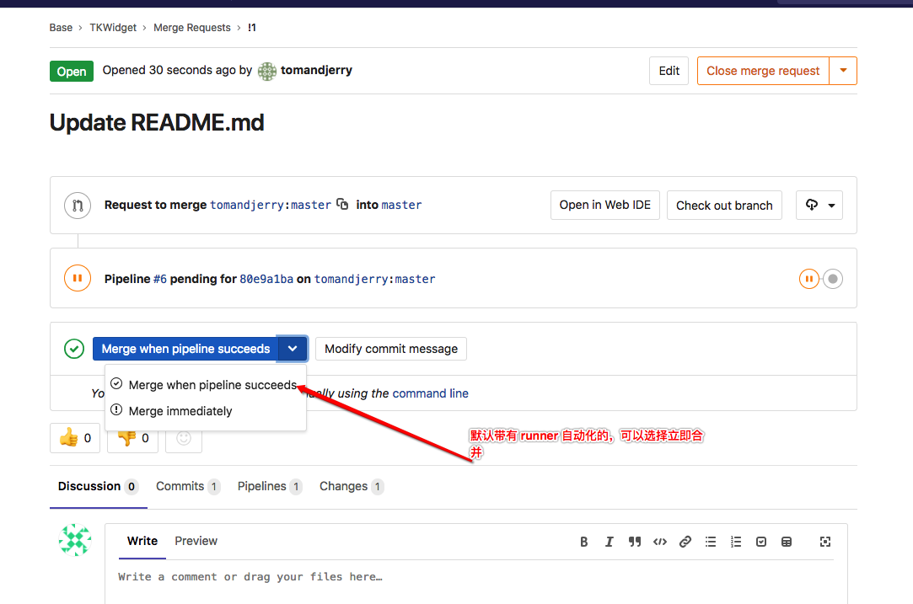
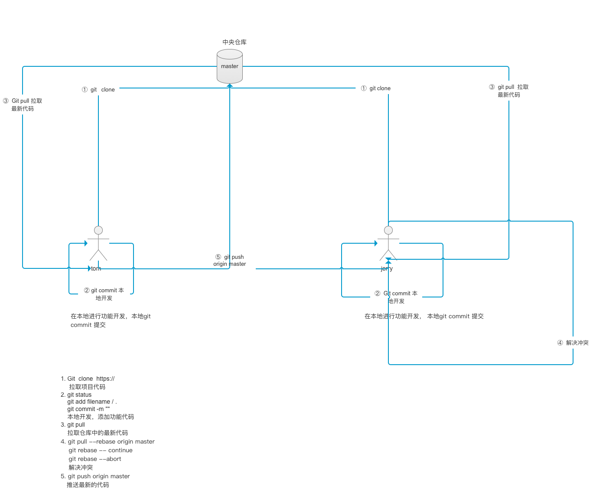
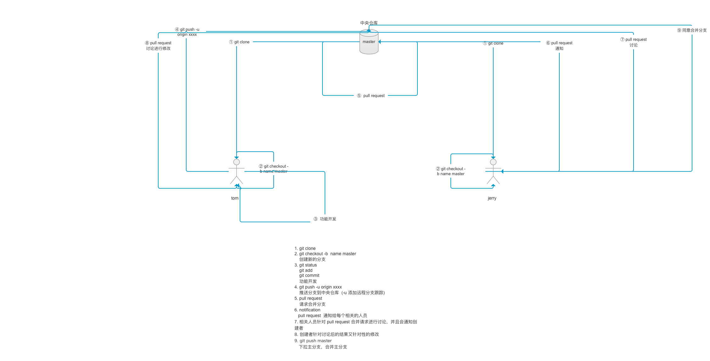

# 基于 Gitlab 实现标准化开发  

## 完成状态  

- [x] 开发中
- [ ] 未完成
- [ ] 已完成
- [ ] 维护中

在多人开发中如何实现高效快捷的开发流程是一个非常重要的部分。作为一个项目管理者，如何推动组内项目高效快速的开发，其不止是保证项目的正常开发，同时还要更多的注意代码质量以及开发进度把控。保证代码质量并不是一件容易的事情。其单体项目或者微服务(组件化等需要采用不同的处理方式)。本文将通过Gitlab 通过针对git 的合理运行来有效的推动项目组的高效运行和一定程度上保证代码质量    

## 单体应用  
单体应用是最基本的项目开发方式。整个项目采用一个项目工程的方式来实现，不过在多人开发中，虽然项目采用单体应用，但是由于并不是由一个人开发的，所以也存在多人开发中一定存在的问题   

> 工作流

## 微服务或组件化  
单体应用虽然可以正常的进行项目开发，但是其由于项目业务的不断变大，项目工程将不断变大，代码量将不断变大，一定程度上拖慢项目开发进度，并且由于开发人员的流动，每个人的开发习惯不同导致项目耦合性变大，项目不利于维护和迭代开发。微服务或组件化就是为了解决此问题而提出的开发思想，其在一定程度上通过业务或功能的不同对项目进行拆分，将一个项目拆分为多个项目，通过其合理的组合为完整的项目。(__关于什么是组件化和微服务这里不进行正式讲解，如果需要对其进行深入了解，请自行Google搜索__)   
### 微服务或组件化面临的问题  
1. 项目拆分不合理，代码重复    
    在组件化开发中，由于组件拆分分散，组件之间存在多种多层的依赖，所以针对项目组的开发人员流程造成组件不清楚。对组件内部实现功能不清楚，而在开发阶段，可能在业务组件中存在相同功能代码，造成组件引用而没有合理使用以及代码冗余的问题  
2. 同一个组件或服务多人开发,本身开发人员流失问题 
    在组件开发中，由于组件拆分细化，所以组件项目比较多，由于外部不可控原因，例如: 人员流动，项目工期赶，导致新人没有足够的时间对已有组件进行详细了解； 组件无实例，无从下手了解组件具体功能。此时为了更快速开发，会针对当前业务组件而去写一些需要的辅助性功能   

### 利用Gitlab 实现项目标准化管理  
__本处以iOS开发中组件化来说明__   
作为一个项目的管理者，你需要对整个项目有一定的把控。或者将其下放给主程。在整个项目中，不止是有业务组件，同时还存在一定的基础组件，所以如何把握组件的开发权限非常重要。接下来将一步步进行实现，并且也将说明为什么采用这种方式实现   

1. 对项目进行分组  
    每个项目都需要将其进行分组，其中基础组件将不包含在项目组中，基础组件进行单独分组。业务组只包含所有的业务组件，针对组进行开发开发成员和维护成员进行权限分发。合理的控制提交权限可以很大程度上保证代码质量  
    
    通过以上方式创建项目基础组件组 以及业务组件组 ，注意组的权限  
2. 针对组添加成员  
    每个组都不是一个人开开发的，所以需要针对组以及更细粒度的项目进行成员权限控制   
      
    注意此处，添加组成员时，需要针对其进行权限控制，默认存在 5 种等级一般开发人员选择 Developer。此处只有明确权限才能更好的控制代码质量，不过由于权限把控的严格，所以有时可能会存在代码提交权限问题。不过此处还是推荐这样做，可以将所有权添加给几个主程。   
3. 普通开发者进行项目更新  
    由于第二步的时候，进行严格的权限控制，在普通的 Developer 是没有权限直接对组件进行代码提交的，此处普通开发者如果不涉及具体的组件开发，同样拥有此组件的查看权限，每个组成员都可以进行组内项目代码查看。 如果涉及到项目开发的人员， 可以针对项目进行 fork 到自己的仓库，然后在自己的仓库中进行开发    
       
    此时，此项目在自己的仓库中有一个副本，其将不与原始项目后续开发进行关联，当前这个副本将只属于自己，所以自己可以在此仓库副本中进行任意的功能开发而不会影响原始仓库   
4. 提交pull reqeust  
    在通过步骤3后，自己针对自己的仓库副本进行开发后，此处自己开发的内容将只属于自己，所以我们需要将其内容想办法合并到原始仓库中才可以。此处通过 `pull request` 来将代码提交到原始仓库中   
    * 下来原始仓库最新代码  
        在集体提交 pull request 之前，需要先将原始仓库代码获取下来 (因为在自己开发这阶段，可能有别的开发者提交的新的更新，所以需要跟新到最新的代码) 并解决项目中可能存在的冲突  
        `git fetch --all`  
    * 创建 `merge request`  
           
        通过以上方式创建一个新的 pull request 请求，注意选择当前分支和具体的目标项目和目标分支， 
    * 填写 `pull request`  
        
        此处有几个重要的信息需要填写，
        `1` 提交的title 必须要写，通过此处简单描述此次的提交请求是作何什么工作；       
        `2`描述部分，通过此部分详细的描述自己都修改了什么，此次提交的原因，此处可以任意写，还可以写自己添加了什么类，修改了那些文件等等，此处详细讲有利于对代码的详细了解      
        `3` 需要执行针对代码 Review 的人员，通过此处执行人员，让组内人员对你的代码进行审核，一般此处制定的是当前项目的管理者或主要维护者，此处也可以指定为自己(__不建议此处指定自己,建议指定给项目负责人__)       
    * 通知组内成员进行代码 review  
        通过以上方式已经完成了 pull  request 的创建，接下来就是等待具体人员针对代码的 review 后，是否同意此次的合并请求了，不过可以通过在评论中通知组内所有人或者其他同事也可以针对当前提交进行 review  
           
        每个人员都可以在 `Commit`以及 `Changes` 中查看最新的提交以及更改变化，并且可以针对当前的代码更改进行 评论   
        
        通过以上方式，可以针对具体的代码行进行评论和说明

5. 处理 pull request  
    负责人可以针对此次请求的所有的讨论都可进行查看，并且决定是否同意此次的 合并请求     
          
    此处如果开启了 runner 自动化功能，可以选择等待 pipeline 执行成功后再合并，也可以选择立即合并   

### 工作流比较以及选择  
基于使用的版本控制工具不同以及当前项目中实施的处理方式不同，此处只是给出推荐以及各种工作流之间的比较，具体实施还是需要管理者根据项目当前情况考虑。   

#### __中心化的工作流__  
中心化工作流: 所有的工作人员都是以中央仓库的 `master` 分支为主， 仓库中同时只存在一个 master 分支，所有开发人员都在次分支上工作  
* 优点   
    1. 只会存在一个主线，简单明了  

* 缺点  
    1. 多人协作开发中，很容易出现代码冲突，需要时刻注意解决代码冲突问题  
    2. 适合小团队开发，1-3个人小项目开发   

#### __分支的工作流__   
feature 分支工作流: 在中心化工作流的基础上更加简洁方便，使开发人员不必花费大量的时间在解决冲突上，使开发人员更加专注于自己的功能开发而不需要关心代码仓库带来的问题。 同时可以结合 `pull request` 功能来集思广益，使所有的开发人员都可以在功能并入主分支之前参与决策。可以让所有人参与代码评论和讨论，有助于团队协作        

#### __Gitflow工作流__    

####__ Fork工作流__

## 总结  
此篇文章针对如何高效的使用gitlab 来快速有效的推动项目运行，通过 pull reqeust 针对代码质量把控，通过以上方式合理的利用分支和 pull reqeust 高效的推送项目组运行      

### 参考  
[git Pro](https://progit.bootcss.com/)     
[常见工作流比较]()     