# SourceTree 实现 Gitflow 可视化操作  

## 完成状态  

- [x] 开发中
- [ ] 未完成
- [ ] 已完成
- [ ] 维护中

#### Gitflow  
Gitflow:定义了一个围绕项目发布的严格分支模型。通过为功能开发，项目发布，维护修复等创建独立的分支，让发布迭代更加严谨流畅。Gitflow并没有提供新的功能，而是给予了不同分支不同意义，更加明确的管理和组织分支， 定义每个分支之间的关系和交互方式。  

通常情况下，Gitflow共分为以下几种分支：  

* master  
    master 分支主要用来记录项目的正式发版记录。只会和 release 分支有关联
* develop 
    主要开发分支，所有的功能分支都是基于此分支来开发的，并且开发完毕，所有功能分支也将合并到次分支上  
* feature 功能分支  
    每个新功能都在自己的分支上进行开发，开发完毕后，合并进develop分支  
* release  
    发布分支， 当develop 分支功能开发完毕，准备发版时，就从 develop 分支checkout 出一个发布分支。发布分支checkout出来后，之后的新功能将不能加在此分支上，此分支将只能用于bug修复，文档生成和其他部分任务。当发布完成后，发布分支将合并到 master分支上并分配一个版本号。并且之后基于此分支的修复都要合并进develop分支  
* hotfix 
    维护分支，用于产品发布后的快速修复。这是唯一可以直接从 master分支fork出来的分支。修复完成，修复应该马上合并进 master 和 develop 分支 以及当前的发布分支上。 master分支应该给定新的版本号   

__一般情况，远程端只会存在两个分支 `master` 和 `develop` 最多还会存在 `release` 分支， 这里需要注意 release 分支和 hotfix 分支， release分支也可用于 hotfix 分支修复bug。 从 master分支 fork hotfix 分支是用于修复线上bug 的。当在测试环境的时候，可以直接从 release fork 出 hotfix 分支，用来修复bug(当有多版本时)__   

  
> 图片来自 [git-workflow-tutorial](https://github.com/xirong/my-git/blob/master/git-workflow-tutorial.md#23-gitflow%E5%B7%A5%E4%BD%9C%E6%B5%81)   

## SourceTree 与 Gitflow  
0. 界面调整  
    新版的 SourceTree 可能找不到 Git flow 位置(可以在菜单栏 __仓库__ 中找到具体位置)，可以通过以下方式将其设置在界面上  
    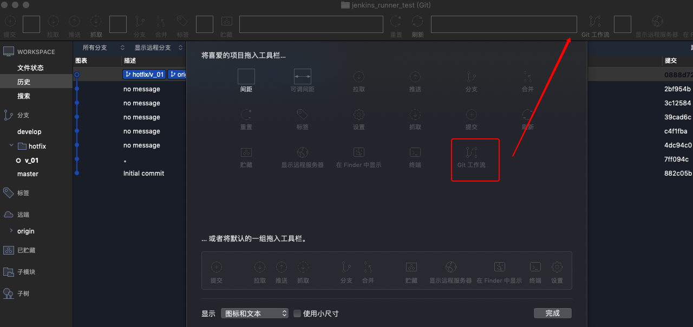  
    工具栏右击 -----> 自定义工具栏----> 拖动 Gitflow -----> 工具栏  

1. 新建仓库并 clone到本地  
    此处需要保证仓库初始化出了 `master`分支，如果没有， 可以提交一个文件，让`master`初始化   
2. 初始化 Gitflow  
    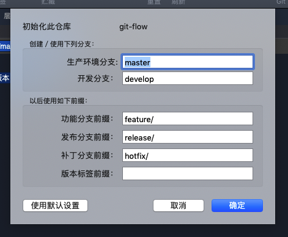  
    此处采用默认配置  
    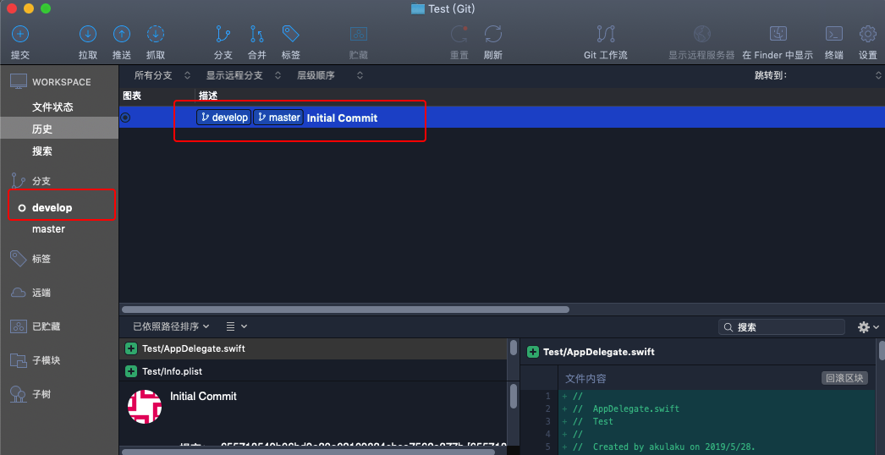  
    此处系统创建了develop并且默认切换到 develop 分支上   
    __注意__:_远端将只存在 master 和 develop 分支，其他分支不需要提交到远端_    
3. 新建功能分支  
    功能分支用来开发新的功能  
    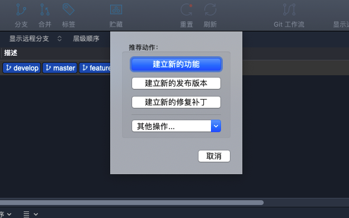 
    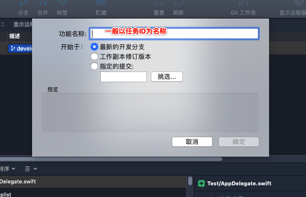   
    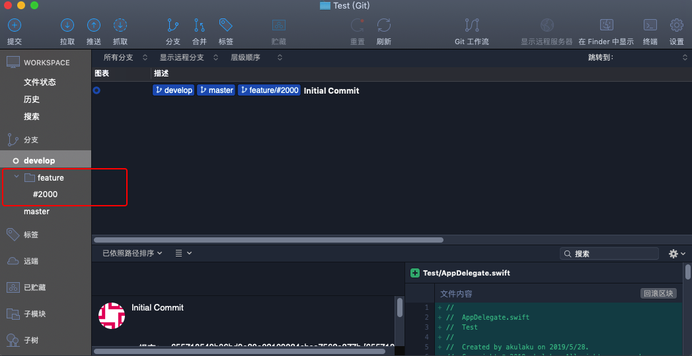  
    功能开发需要在对应的分支中开发，此处 sourceTree 针对分支创建了组，所有的功能分支将都存放在 feature组中   

4. 完成功能开发 
    当具体的功能开发完毕时，需要将功能合并到 `develop` 分支上  
    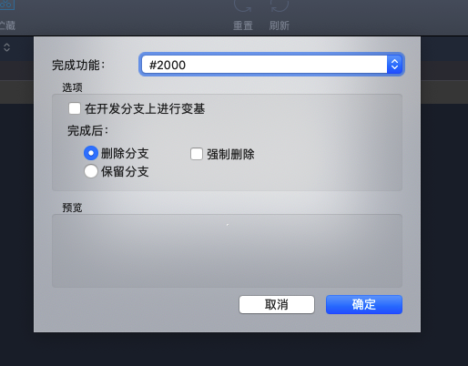  
    注意，此处默认采用的是 删除当前工作分支操作。根据具体需要，可以选择保留此分支   
    此处有一点注意点： __在开发分支上进行变基__ 选项： 如果勾选，则会保留当前功能分支的所有提交记录到develop分支上; 如果不勾选，则hi将当前功能分支的所有提交变为一个 `Merge`记录提交到 develop 分支上  
     
    > 不勾选示例图  

5. release 分支 
    当确认当前开发任务无误时，准备发布之前，可以创建一个 release 发布分支  
    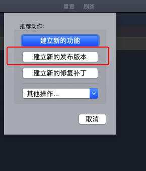  
    当前的 release 是从 develop 分支 fork 出来的，此分支包含了当前时间节点开发的所有功能。 可以在此分支上进行编译部署测试环境进行测试，并且开发团队还可以针对代码进行 Code Review ，以及基于此分支进行bug 修复等功能  

6. 完成发布版本  
    当所有工作已经完成，测试确认无误，Code Review 确认无误时， 需要完成发版工作  
     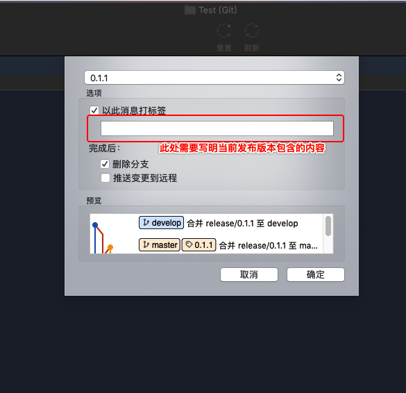   
     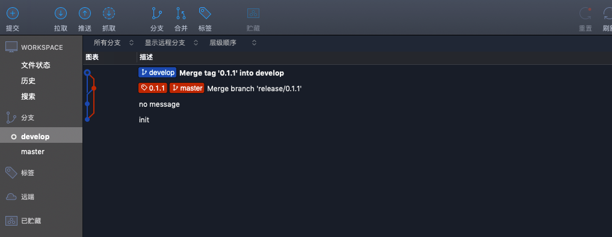 
     此处默认将 此发布分支合并到 develop 分支上   

7. hotfix 分支 
    hotfix 分支主要用来修复线上版本的bug。通常都是 fork 自最新的 master分支(当有维护多个版本时不是)  
    * issue  
        当线上版本出现bug时， 首先应该在项目的 issue 中提交bug单，描述bug详细信息(此处也可对应公司内部bug 管理系统)。 开发人员针对每个bug ，从 `master` 分支 fork 出对应的  `hotfix` 分支 进行修复,并在修复完成之后提交     
        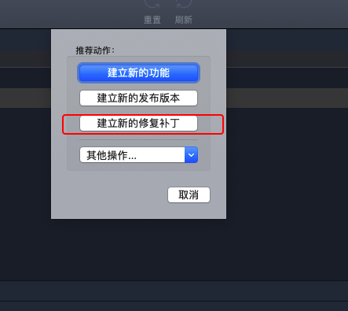   
    * 关闭 issue 
        如果修复了某个bug，可以再提交信息中添加`fix #xxx `或`close #xxx`(xxx代表bugID), git 会自动关闭此 issue  
        __此功能只针对默认的 issue 系统，公司内部使用的其他bug管理系统(例如：禅道)无法进行此操作__  

## 总结  
本文主要针对 Gitflow进行了简单描述，以及基于 sourceTree 如何更好的实现 Gitflow。Gitflow 主要涉及 5 种分支(常见模式),还有部分精简版的存在4个或者三个分支的。不同的分支完成不同的功能，各司其职。  

* master 
    * 生产环境分支 
    * 保留当前最稳定代码，记录每个正式发版版本号  
    * release / hotfix 分支有关  
* develop 
    * 开发分支 
    * 保持最新项目开发代码
    * feature/ release / hotfix  
* release 
    * 发布分支 
    * 一个正式发布版本
    * 不允许任何分支合并
    * fork develop
* feature 
    * 功能分支 
    * 任意线上 commit, 一般采用 fork develop 
    * 不允许任何分支合并 

* hotfix  
    * 修复bug 分支 
    * 不允许任何分支合并 
    * fork master (多版本维护是可是其他版本分支)
    * 合并到来源分支   

