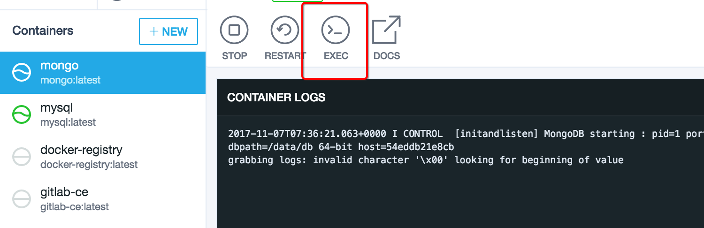
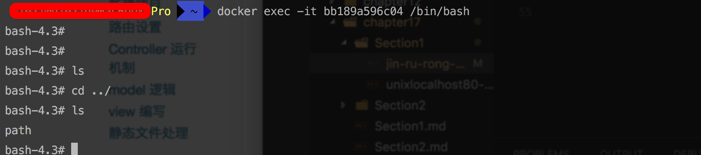

# 进入容器的几种方式
## 完成状态  

- [ ] 开发中
- [ ] 未完成
- [ ] 已完成
- [x] 维护中

刚开始使用docker的时候，使用的是 Kitematic,使用此种方式不用关心很多参数以及操作，都提供了图形化的界面。但是有时候有些操作是它所不能完成的。 比如在启动容器的时候指定参数。通过图形化界面就可以很方便的进入容器：  



通过命令行启动docker，比较关心的就是如何进入容器。进入docker有以下几种方式：

* docker attach

  `sudo docker attach bb189a596c04`  
    **使用此命令会进行多个窗口同步，如果一个窗口阻塞，那么都会阻塞**

* SSH

*  `nsenter`

  nsenter 可以访问另一个进程的名称空间。 此程序是安装在`宿主机`的

  * 安装

    ``` Bash
    wget https://www.kernel.org/pub/linux/utils/util-linux/v2.24/util-linux-2.24.tar.gz  
    tar -xzvf util-linux-2.24.tar.gz  
    cd util-linux-2.24/  
    ./configure --without-ncurses  
    make nsenter  
    sudo cp nsenter /usr/local/bin
    ```

  * 获取进程空间

    `sudo docker inspect id`  
      使用以上命令查看容器的详细信息  
      `sudo docker inspect -f {{NetworkSettings.Networks.bridge}} id`    
      
      这种方式可以查看固定的值\(缺陷就是只有值，没有对应的key，适合查询单一值\)

  * 进入容器

    `sudo nsenter --target 3333 --mount --uts --ips --net --pid`

* exec

  `sudo docker exec -it id /bin/bash`  
    一般采用此种方式，此种方式是最简单快捷的，直接进入 bash 命令界面  
    


`docker network inspect bridge`
