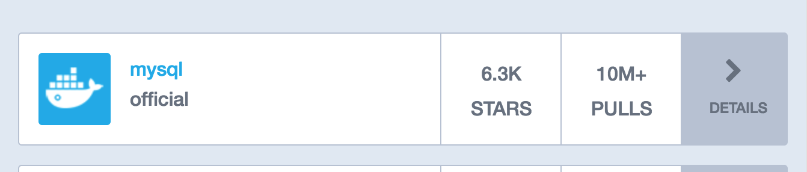
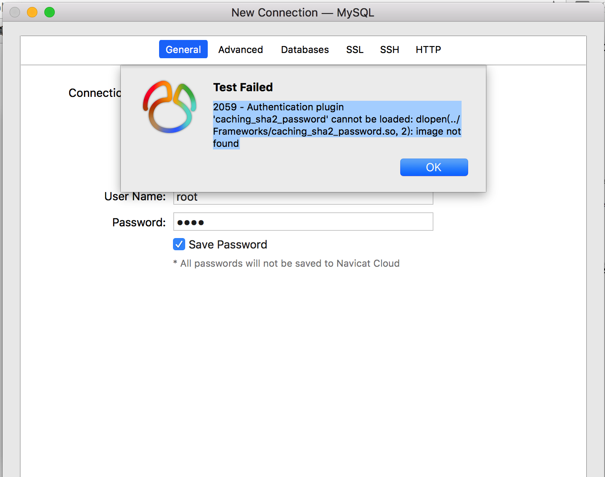

# 记一次MySQL 连接失败的问题   

## 问题情境  
由于当前使用的是Mac 系统，我又不想在当前物理系统中安太多的软件，(注意是懒，怕清理起来麻烦)，所以采用了 `Vagrant` 操作虚拟机的方式来实现的。所以我在 虚拟机中安装了docker 并运行了Docker Mysql 服务  。这样整个访问路径就是这样了：   
物理机------> vagrant(Virtual Box) ------> Docker ----> Mysql 


## 解决办法  
1. 首先要确定虚拟机本身是可以通过物理机访问的   
设置了 Vagrant 的网络模式是私有网络  

```

  # Create a private network, which allows host-only access to the machine
  # using a specific IP.
   config.vm.network "private_network", ip: "192.168.33.13"
```

2. 确保MySQL 镜像运行成功  
    如果是Docker hub 上的 
     
    这个镜像注意了 ，此镜像运行后，只能通过本机访问(在当前环境下就是 只能 Linux虚拟机访问，无法通过物理机访问)  
    
    * 查看MySQL是否运行任意地址访问  
        ```
        mysql> SELECT User, Host FROM mysql.user;
        +-----------+-----------+
        | User      | Host      |
        +-----------+-----------+
        | mysql.sys | localhost |
        | root      | localhost |
        | root      | ％        |
        +-----------+-----------+
        ```
        查看以上表中，对应的登录的MySQL账号是否是 `%` ，如果不是就代表不能任意地址访问，需要添加或者直接指定地址访问   
    * 查看是否监听对应的端口  
    * 修改MySQL 配置文件  
        1. 首先进入镜像  
            `docker exec -it e1066fe2db35 /bin/bash`  
        2. 通过vim 编辑`my.cnf`文件  
            ```
            // vim 无法使用时 听过以下访问安装  
            apt-get update 
            apt-get install vim   

            vim /etc/mysql/my.cnf  

            // 添加 
            bind-address = 0.0.0.0

            // 重启镜像  
            ```

## 问题总结 
  
此问题一般出现在 MySQL 8.0 ， `caching_sha2_password` 加密方式客户端不支持 ， 可以换个软件连接，或者修改加密方式  

#### 修改加密方式  
1. 进入mysql 客户端  
2. 查看加密方式  
    ```
    mysql>use mysql; 
    mysql>select user, host, plugin, authentication_string from user\G; 

    mysql>ALTER USER 'root'@'%' IDENTIFIED WITH mysql_native_password BY 'root'; 
    ```