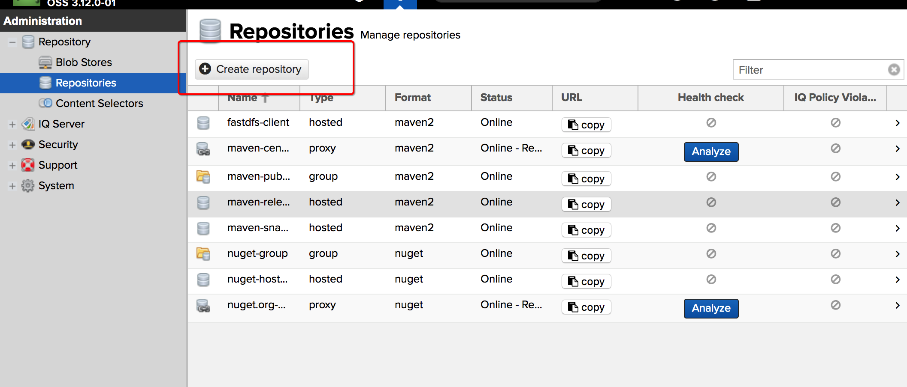
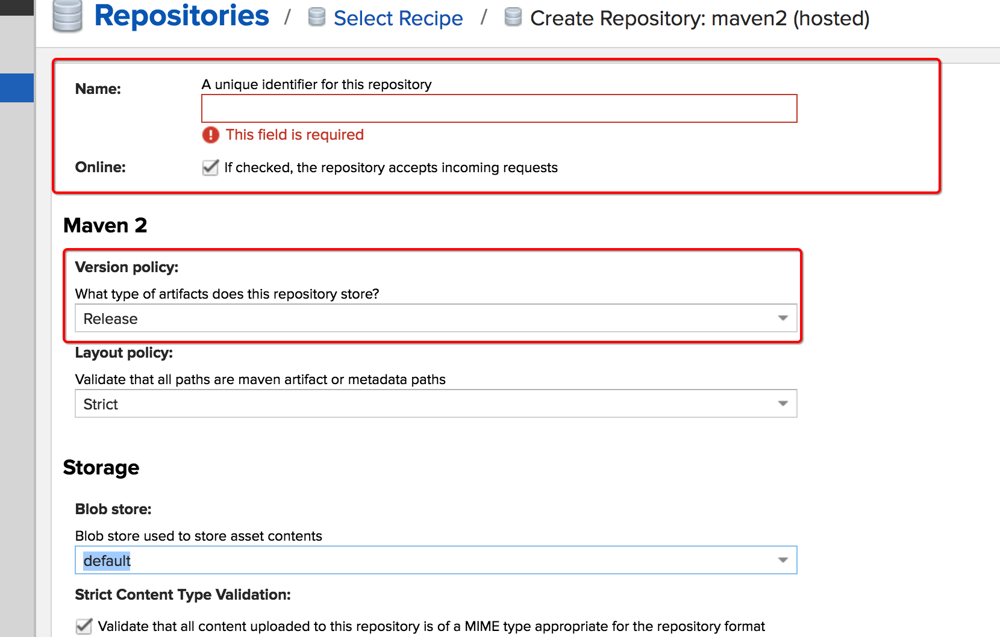
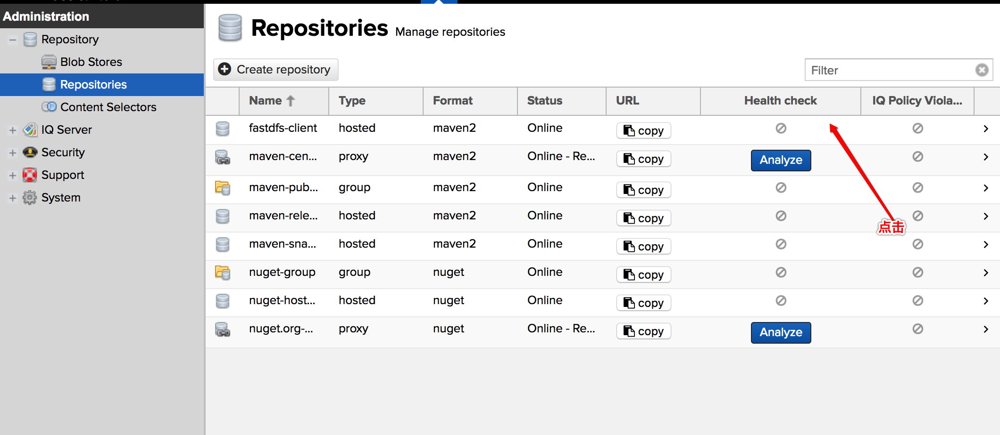
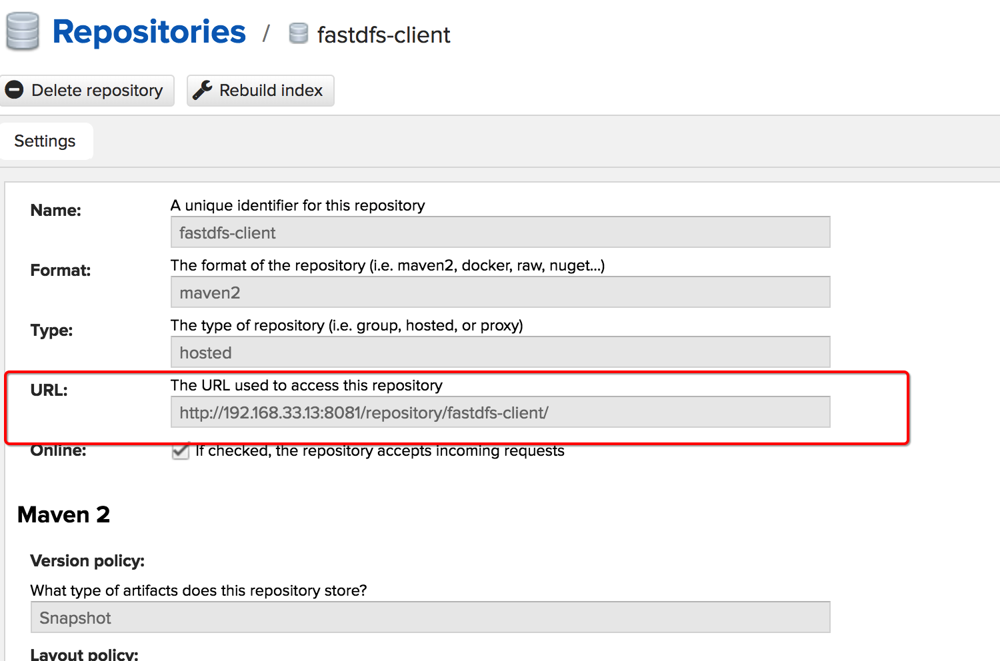
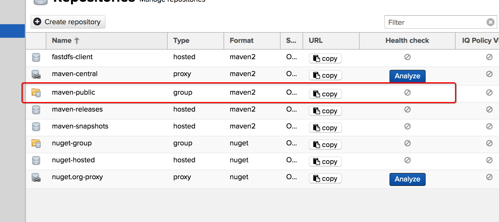
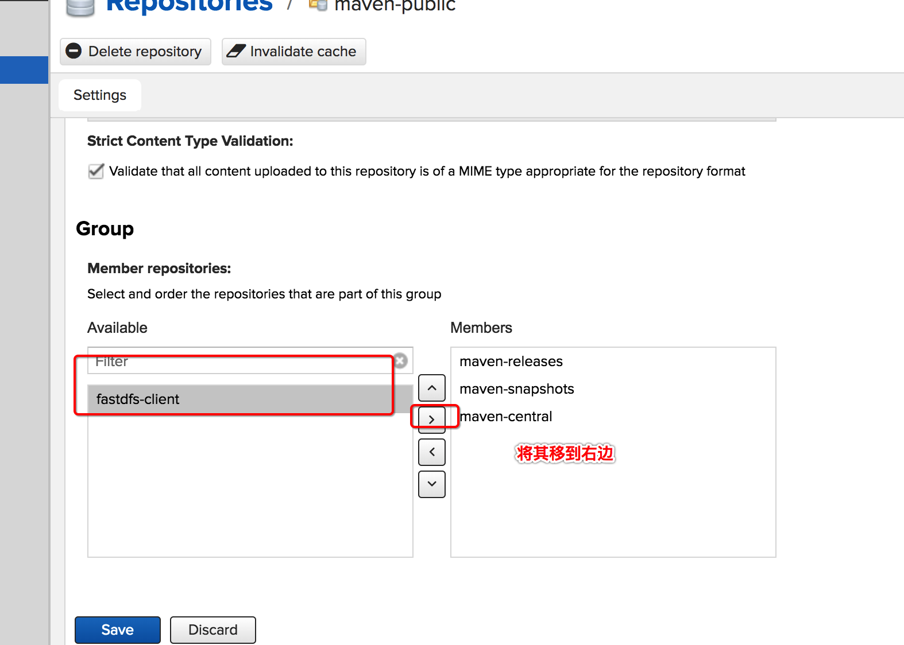

# Nexus 上传第三方包  

由于项目要用到 [`FastDFS`](https://github.com/happyfish100/fastdfs-client-java) 包,其开源项目并没有打包到 Maven 中央仓库上，并且项目还是通过Maven 管理了，不想直接引入包，正好自己根据前篇的开发环境搭建有自己的 Nexus ，所以就将其传到自己的nexus上  


1. Nexus 服务器配置存放本地第三方仓库  
      
    注意，选的时候需要选 `maven2 host` 模式，其中还有 `group ` 和 `proxy` 模式，`proxy` 模式是代理模式，比如代理 maven 中央仓库等，需要通过此模式  ，zh这里支持上传一个本地的第三方jar包，需要选 `host` 模式   
      
    这里需要填一个仓库名称，以及版本，版本可以不选，直接使用默认的  ， 创建过后就可以在 `Respositores` 中查看到了  
2. 获取仓库地址  
      
      
    通过以上方式获取仓库的名称   
3. 编译jar 文件  
    由于其实开源项目，所以需要将其编译成jar 文件并上传到 nexus 上 , clone项目[fastdfs-client-java](https://github.com/happyfish100/fastdfs-client-java) 
    并在项目目录下执行 `mvn clean install ` 对源代码进行编译  ，其编译过后会在 `target` 目录下生成对应的jar 包   
4. 配置 本地 maven 以只是上传到私有 nexus  
    由于maven本身是不支持私有的nexus的，所以需要修改 `setting.xml`文件以支持。默认此文件可在`{user}/.m2/`文件下查找到，如果没有那就在maven安装目录下的 `conf`文件下找。  
    添加一下内容到 `setting.xml`文件中     
    ```xml
    <server>
        <id>nexus-releases</id>
        <username>admin</username>
        <password>admin123</password>
        </server>

        <server>
            <id>nexus-snapshots</id>
            <username>admin</username>
            <password>admin123</password>
        </server>
    ```
5. 上传  
    ```bash  
    mvn deploy:deploy-file                      # 
    -DgroupId=org.csource                       # group  
    -DartifactId=fastdfs-client-java            # artifactID 以上两个值和其他的maven jar一个功能，需要自己填写 
    -Dversion=1.27-SNAPSHOT                     # 版本 
    -Dpackaging=jar                             
    -Dfile=./target/fastdfs-client-java-1.27-SNAPSHOT.jar   # 此处是 jar 包的位置    
    -Durl=http://192.168.33.13:8081/repository/fastdfs-client/    # 此处是服务器仓库的地址 (根据2 步骤获取的)
    -DrepositoryId=nexus-releases                               # 此处是服务器id， 根据步骤三 填写的内容 选一个就好(此处不正确会报验证错误的)
    ```
6. 设置仓库 组  
    以上步骤只是将jar 传到仓库中去了，但是在使用时却发现无法download jar 包， maven 报错，创建的仓库并不在 maven public 组中
      
       
7. 使用了  
    ```xml  
            <dependency>
                <groupId>org.csource</groupId>
                <artifactId>fastdfs-client-java</artifactId>
                <version>1.27-SNAPSHOT</version>
            </dependency>
    ```
    以上需要的三个值`group`,`artifactId`,`version` 都是 __步骤4__ 中填的值  

