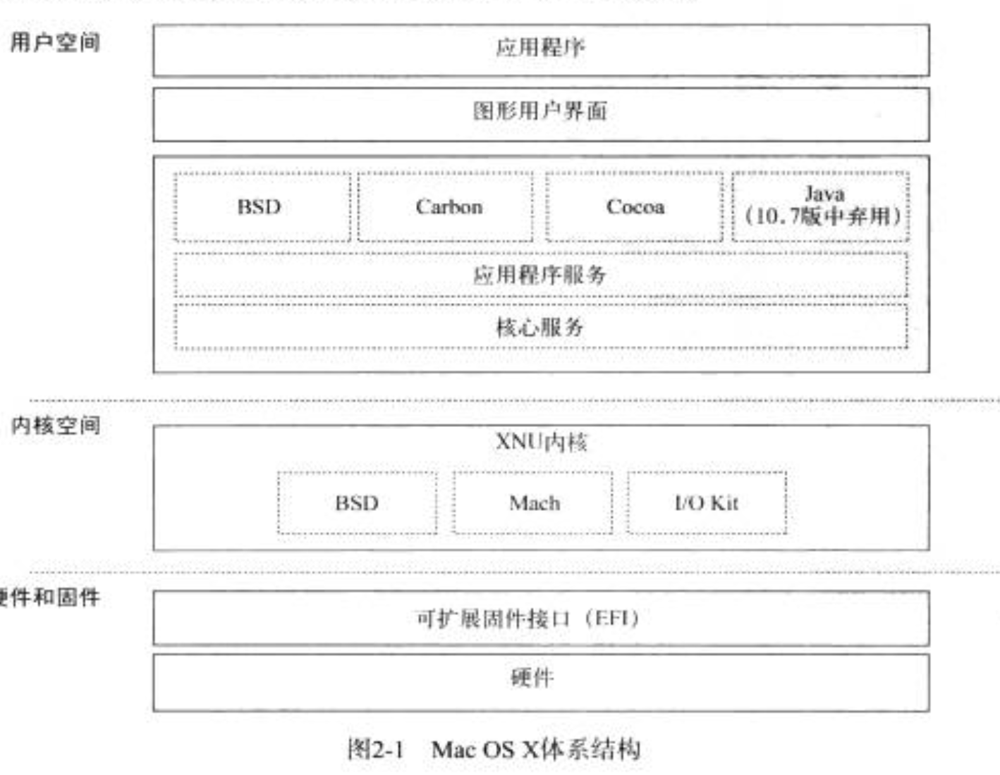
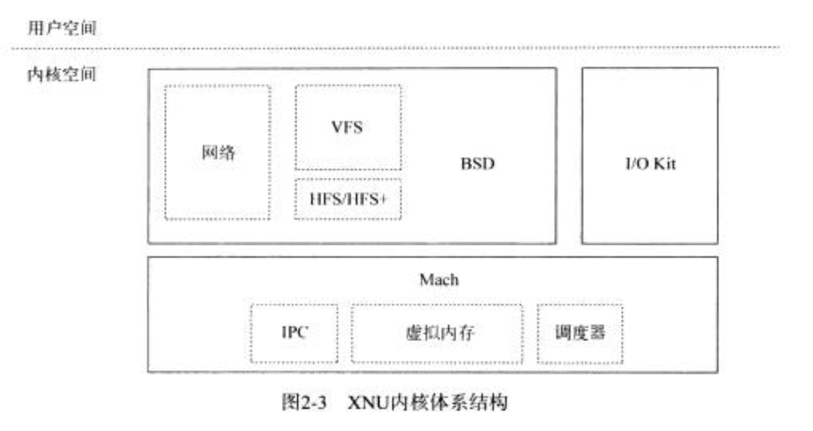
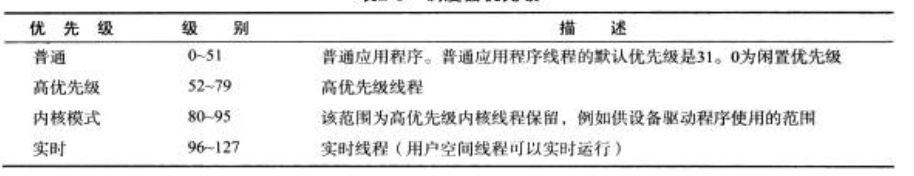
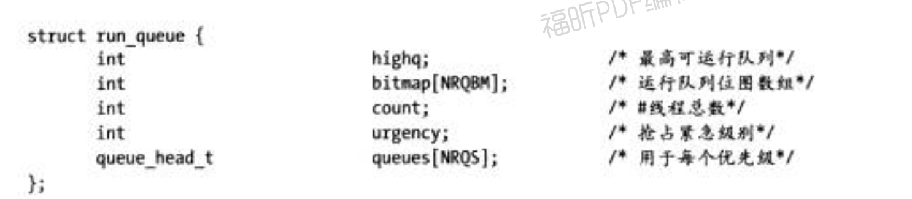
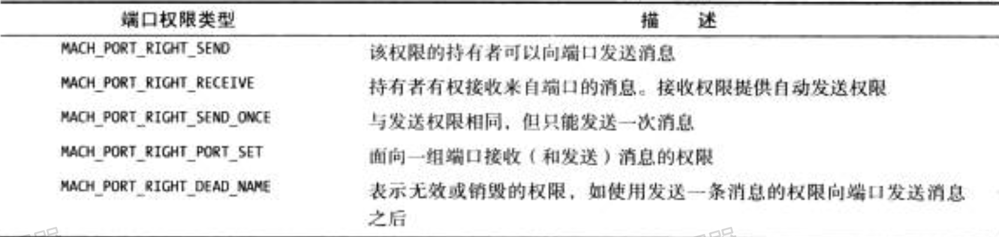

## 第一章 操作系统原理  
* 作用： 为用户提供应用软件运行环境  
* 功能
	* 管理计算机硬件资源  
	* 外部设备   

* 支持每个硬件组件的代码被分别打包成一种特殊类型的内核扩展程序__驱动程序__  
* 内核扩展无用户界面，无需与用户交互。由操作系统加载，并调用去执行自身无法独立完成的任务   

#### 作用  
操作系统决定系统的硬件配置，搜索链接到USB接口或插入PCI扩展的外部设备， 对他们进行初始化，并在必要情况下加载驱动程序。   

### 进程管理  

## 第二章  MacOS & iOS 
Mac OS 是基于 Unix 的现代操作系统   
OSX和ios 核心包括内核和该操作系统的Unix 基底，即`Darvin`   
> Darvin不包括特有的用户接口，因为它只是一个准系统，仅提供内核和Unix 系统中的典型工具和服务的用户空间基底   
Darvin操作系统(以及OSX和ios )运行`XNU`内核，该内核以`Mach内核`的代码以及FreCBSD 操作系统的一部分为基础   

  
> Mac OS 系统架构  
* `BSD层`： 
	* 不支持编写具有图形用户界面的应用程序  
	* 应用访问低级文件的途径， 可用于访问设备  
* `Cocoa`:
	GUI层 
* ` Carbon`  
	*  基于C语言的AP1  
	* 与 Cocoa 拥有相同的功能  

#### macOS 支持的图形及多媒体相关框架  
* Quartz:由Quartz 2D API和Quartz Compositor组成，Quartz Compositor提供图形窗口服务器 。Cocoa Drawing提供基于Quartz的面向对象接口，用于Cocoa应用程序。
* 0penGL:开发3D应用程序的行业标准AP1。iOS支持的OpenGL版本为OpenGL ES，它是OpenGL的一个子集，专门为嵌入式设备而设计 。
* Core Animation:一个基于分层的AP1，与Cocoa集成在一起，使创建动画内容和执行变换変得更加容易。
* CoreImage : 支持图像处理 。 包 括 添 加 特 效 . 栽 剪 或 色 彩 校 正 。  
* CoreAudio: 支持音頻回放、录制 、混合和处理。  
* QuickTime:处理多媒体的高级库。 支持音频视频(包括专业格式)的录制和回放。
* Core Text: 基手C语言的API，用于文本道染和布局 。Cocoa Text API基于Core API。

### 2. XNU 内核  
XNU内核是Mac os X和os的核心， 由三个主要部分组成的一个分层体系结构。 
  
> XNU 内核体系结构 

#### 内核扩展 
XNU内核与大多数现代操作系统类似，运行时，它可将代码动态加截到内核地址空间。  
内核扩展有两个主要类型： 
* 用于基于`1/0 Kit`的内核扩展，这些扩展用于硬件驱动程序，采用`C++`语言编写
* 用于通用内核扩展，这些扩展通常采用`C语言`编写(也可以使用c++ 编写)

#### Mach 
__Mach层可以看做内核的核心，它为高层部分(如BSD层和I/O Kit )提供底层服务__  
* __Mach 负责硬件抽象__, 隐藏CPU 架构之间的差异。 包括`处理异常`和`中断`的细节以及`管理内存`(包括虚拟内存和分页)的细节 
* __负责线程调度__

__进程间通信(IPC) 是Mach设计的核心原则__ , Mach中的IPC作为`客户端/服务器`系统而实现。  
支持抢占式多任务处理： 线程在其分配的时间片(__XUN内为10 毫秒__)结束之前中断执行  

__线程抢占触发方式__： 
* 高优先级的系统事件发生  
* 高优先级的线程需要运行 
* 等待耗时较长的I/O操作完成  
* 线程通过进入睡眠状态自动抢占自己   

##### 1. 任务和线程  
* `任务` 
	* 一个包含一个或多个可执行线程的线程组 
	* 这些线程 __共享资源和内存地址空间__  
	* __至少要有一个执行线程__
	* 任务资源为私有，通常不可以由另 一个任 务的线程访问  

Mach的任务是将线程一对一映射到Unix (BSD层)进程   
XNU内 核也是 一个包含多个线程的任务(称为`kernel_task`)   

* `线程`  
	* 一个可执行实体 
	* 由CPU进行调度和运行
	* 同一个任务中，一个线程于其他线程共享资源   
	* 同一个任务的线程，可以在不同的CPU 上并发执行  
	* 每个线程，都有自己的状态，包括 处理器状态(寄存器和指令计数器)及自己的栈   

##### 2. 调度   
__调度器也不知道Unix系统中常见的进程父子关系( 但BSD 层知道)。__
> 负责协调线程对CPU 的访问   

> 原理：现代内核使用分时调度器， 为每个线程分配有限的时间量子(xun中是10毫秒)，线程可以在该时间内执行。 一旦超过时间，线程就会被破休眠，以便其他线程执行   

__使用优先级的算法调度线程__  
  
> 调度器优先级  

* `线程运行队列`  
	* 基于双链表的数据结构  
	* 每个优先级都有一个链表    
	* 每个处理器内核，负责维护自己的运行队列结构  
	  

`为了避免线程因优先级太低而无法运行`： 调度器将会随时间变化而不断衰减线程处理器的使用量， 饼最终对其进行重置， 从而使线程的优先级随时间波动  

##### 3. Mach IPC: 端口和消息 
* 特点： 
	* 用于数据传输  
	* 用于同步或在任务之间发送通知  
* 端口 
	* 是一个单向通信断点  	
	* 双向通信需要两个端口  
		* 一个实现为消息队列， 消息会进行排队，等待线程来处理   
		* 另外一个可以接收来自多个发送者的消息  
	* 每个端口只能有一个接收器  

* 端口权限(保护机制)  
	* 只有正确权限才能交互  
	* 任务中的所有线程共享端口权限  
	* 权限可以在任务之间进行 __复制/移动__
	* __子进程不能继承父进程的端口权限__  

  
> 端口权限类型 

__可以在用户空间使用，用于在任务之间或从任务向内核传递消息__  

##### 4. Mach 异常  

##### 5. 时间管理 

##### 6. 内存管理 

##### 7. 任务地址空间 

##### 8. VM 映射和 VM 映射项

##### 9. 物理映射 

##### 10. VM 对象 

##### 11. 检查任务的地址空间

##### 12. 分页器  

#### BSD 层 

## 第三章 Xcode 和内核开发环境 

## 第四章 I/O Kit 框架 

