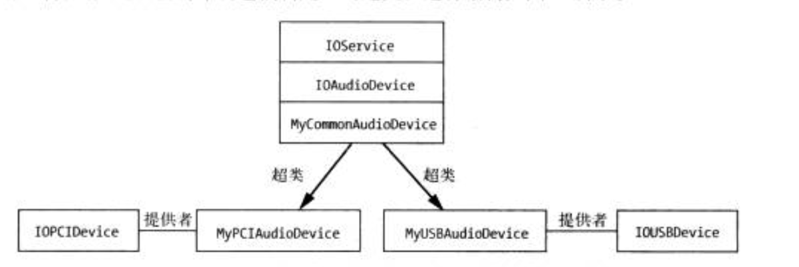

# I/O Kit 框架  


## 前言 
Mac OS 的驱动程序使用 `I/O Kit`框架开发。 `I/O Kit`提供两部分内容： 
* `Kernel.framework`: 此部分为驱动程序提供服务 
    * `IOKit`：包含了用于内核空间驱动程序开发的头文件 
    * `libkern`: 包含基础类和类型， 内核 I/O Kit 框架在此基础上构建   
* `IOKit.framework`: 为用户空间代码使用，以定位内核程序并与其交互   
    * 为用户应用程序提供函数，用于检测机器上运行的硬件设备，为特定的设备查找驱动程序， 以及为相应的驱动程序发送控制请求及请求状态   
    * 支持用户空间应用程序直接与某些硬件设备通信， 摆脱对内核驱动程序的依赖(针对某些特定设备时可行的， 尤其是无需在多个运行的应用程序之间共享的USB和 firewire 设备)  


## 1.  I/O Kit 模型
__`I/O Kit` 是面向对象的框架， 支持面向对象语言, C++实现__  
`驱动程序`： 使操作系统----最终用户---可以利用硬件实现服务。当检测到硬件时， 操作系统将加载该设备的驱动程序，使驱动程序可以访问硬件设备，并与之交互，并且为驱动程序提供接入点，将其服务接入到操作系统中。   

__`I/O Kit`为驱动开发提供超类模版__。 简化驱动开发，采用`server-client`的开发模式， `server`用于驱动程序中与硬件进行数据交互； `client`用于驱动程序与用户应用程序交互，每当一个应用程序连接到驱动程序时， IO Kit 都会创建一个对应的 `client`对象   


## 2. 对象关系 
包括两个重要的类： 一个时主驱动程序继承的超类， 另一个时驱动用于访问硬件的提供者类。这样的好处。驱动程序提供的功能与驱动程序的硬件涉笔连接到计算机的方式相分离。  
  
> I/O Kit 驱动程序及其超类和提供者类之间的关系示例  


## 3. Info.plist 文件 
驱动程序仅在其支持的设备连接到计算机时才会进行加载。  

驱动程序的属性表比较 特殊，因为它可以由用户空间应用程序， 这使它成为驱动程序和 用户空间之间传递少量数据(如整数值)的完美方式  
驱动程序可以将某些重要的变量值写人到其属性列表的键中，随后可以在IORcgistryExplorer中进行监控，以跟踪驱动程序的状态。


#### 驱动程序加载过程示例： 
1. 用户将一个 USB 设备连接到计算机
2. 创建一个新的 `IOUSBService`实例，表示该设备  
3. I/O Kit 迭代所有包含匹配字典的驱动程序， 列出 `IOUSBService`的提供者类  
4. `IOUSBService` 检查驱动程序的匹配字典中的全部内容  
5. 如果所需的匹配字段属性与该设备的属性相对应，则将该驱动程序添加到该设备的潜在驱动程序列表中  
6. I/O Kit 针对潜在列表中的驱动程序使用一个名为`检测积分`的值，指定与设备的匹配程度。 
__驱动程序是否适合特定硬件设备由提供者类决定__  
提供者类通过检查潜在驱动程序匹配字段中的属性来实现，

#### 检测积分  
1. 设置方式 
    * 在驱动程序的匹配字典中为其提供一个检测积分(设备生产公司提供驱动程序，匹配公司的产品ID等信息，检测积分高于系统默认驱动程序)  
    * `主动匹配`：I/O Kit 实例化每个潜在驱动程序，饼将其临时加载到设备硬件上，为其提供询问设备、确定检测积分的机会  

I/O Kit 允许为单个设备加载多个驱动程序   

### IORegistryExplorer 
用来查看系统上加载的驱动程序  
 I/O Registry 是一个 I/O Kit 对象树， 在系统启动时创建，之后随着 I/O Kit对象对应的驱动程序从系统上加载/卸载而动态增加/减少。 在计算器重启期间，不会写入磁盘或保存   


## 4. 内核库： libkern 
`OSObject`: 时所有 I/O Kit 类都使用的基类。具有以下特点： 
* 运行时类型信息，通过 libkern 提供的自定义宏实现 
    * 类型自省： 可以在运行时确定对象的类型，或该对象是否派生自给定的基类  
    * 动态转换： 可以将一个对象转换成其派生类的类型
* 对象创建，能够根据一个对象的类名称字符串对其进行实例化  
* 基于保留/释放语义对象引用进行计数  
* 对象追踪， 能够确定已经实例化但仍未释放的某个类的实例个数  

### OSObject 

1. 类定义
```c++
class com_oxkernel_driver_MyObject: public OSObject {
    OSDeclareDefaultStructors(com_oxkernel_driver_MyObject) // 负责c++析构函数和构造函数 
    public:
        virtual bool init(const char* name);    // 作为当前类的构造函数，可以添加任意参数
        virtual void free();                    // 当前类的析构函数 

}

```

2. 类实现 
```c++
#include "MyObject.h"


// 将super 定义为一个便捷宏，表示超类  
#define super OSObject

OSDefineMetaclassAndStructors(com_oxkernel_driver_MyObject, OSObject)


bool com_oxkernel_driver_MyObject:: init(const char* name)
{
    if (!super::init()) {
        return false;
    }
    // 其他初始化内容

    return true;
}

void com_oxkernel_driver_MyObject::free() {

    super::free();
}

```

3. 类使用 
```c++
//定义了一个静态构造函数， 
com_oxkernel_driver_MyObject * com_oxkernel_driver_MyObject::withName(const char* name) {
    com_oxkernel_driver_MyObject *ob = new com_oxkernel_driver_MyObject;
    if (ob && !ob->init(name)) {
        ob->release();
        return NULL;
    }

    return ob;
}


```
__默认对象的引用计数为 1， 当对象引用计数变为 0 时， 该对象将被释放，并将调用`free()`方法__  


#### 动态转换 
```c++ 
// 将验证provider是否派生自  IOUSBDevice， 如果是，将返回一个 IOUSBDevice 类型的对象  
IOUSBDevice * device = OSDynamicCast(IOUSBDevice, provider);
```


#### 查看实例个数 
`ioclasscount`查看


## 总结 
1. I/O Kit提供一个面向对象的框架，用于开发MacOs X上的驱动程序。  
2. 使用该框架编写的驱动程序都继承自一 个适合的基类，该基类根据驱动程序实现的功能选择  
3. 驱动程序通过一个称为其提供者的对象访问其硬件，这使它与硬件的通信像与硬件连接的总线进行通信一样 ，极其自然。  
4. 驱动程序仅在系统检测到其硬件时才进行加载，正如其属性列表中的匹配原则所述。  
5. I/O Kit 基于 libkern库构建，libkern库通过对象实例化、引用计数及容器类为内核提供运行 时 支持。   


