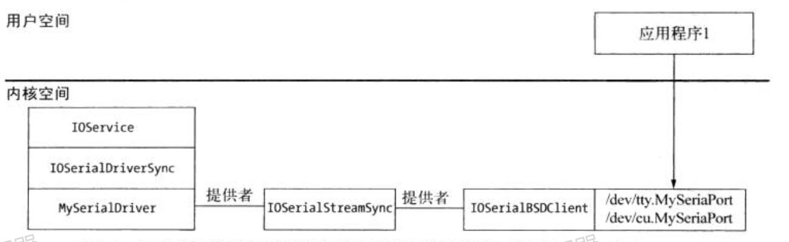
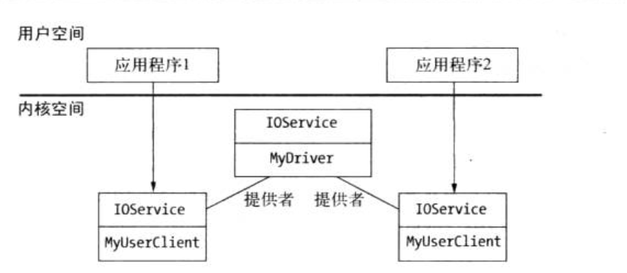

# 应用程序与驱动程序的交互

应用程序运行与用户空间， 驱动程序一般运行于内核空间。   
应用程序要使用驱动程序提供的服务，就需要跨越内核与用户空间之间的界限。  

Mac os 提供了多种不同机制，处理内核与用户空间之间的交互，其具体依赖于驱动程序实现那一类功能类型。  
  

##### 串形端口  
用户空间应用程序通过一个字符设备访问串行端口， 该设备由文件系统`/dev`路径中的一个文件表示。   
通过串形端口进行通信， 用户应用程序在打开、读取、写入文件系统任何文件时，都是用相同的函数`open()`, `read()`, `write()`  

驱动程序执行过程： 
1. 创建一个标准的I/O Kit类 `IOSerialStreamSync`的实例  
2. I/O Kit 串形家族将在`/dev` 目录创建一个设备节点  
3. 在`I/O Register`中发布该节点的路径，以便其他应用程序可以找懂啊   
  
> 用户空间应用程序与串形端口通信时调用的类。 除了 `MySerialDriver`，所有的对象及连接均由 I/O Kit 创建  


## I/O Kit 框架 
__进程与内核驱动程序之间的通信通过用户空间AP 进行，该AP1由一个名为IOkit.framework__, I/O 框架主要负责一下工作： 
*   检 測 系 统 上 的硬件设备及内核中现有的驱动程序 
* 监控热插拔硬件(如USB设备)的接入和移除  
* 与I/O Kit驱动程序交互

__I/O Kit在内核中是基于C++的框架，但在用户空间中， 它是以C语言西数集的形式提供的__


## 查找驱动程序  
 I/O Kit 框 架 提 供 了一 些函数 ， 不仅可以选代I/O Registry中符合某些标谁的所有设备和驱动程序，还可以注册回调函数，以监控符合某些标淮的驱动程序或设备的接人或移除。

```c++
int main(int argc, const char * argv[]) {
    CFDictionaryRef matchingDict = NULL;
    io_iterator_t iter = 0;
    io_service_t service = 0;
    kern_return_t  kr;
    
    // 创建一个匹配字典，查找人意的USB设备
    matchingDict = IOServiceMatching("IOUSBDevice");
    
    // 为匹配该字典的所有 I/O Registry 对象创建一个迭代器
    // 第一个参数是 mach 端口， 用于用户空间进程和I/O Kit之间通信 (IOMasterPort())
    kr = IOServiceGetMatchingServices(kIOMasterPortDefault, matchingDict, &iter);
    if (kr != KERN_SUCCESS) {
        return  -1;
    }
    // 迭代所有的匹配对象
    
    while ((service = IOIteratorNext(iter)) != 0) {
        CFStringRef className;
        io_name_t name;
        
        //列出所有的IOUSBDevice 对象，忽略 IOUSBDevice 子类的对象
        className = IOObjectCopyClass(service);
        if (CFEqual(className, CFSTR("IOUSBDevice")) == true) {
            IORegistryEntryGetName(service, name);
            printf("Found device with name: %s\n", name);
        }
        
        CFRelease(className);
        IOObjectRelease(service);
    }
    
    // 释放迭代器
    IOObjectRelease(iter);
    
    return 0;
}

```
> 迭代所有连接的USB硬件设备代码  


## 监听硬件的接入 
设备接入消息被发送到符合匹配字典所描述标准的任何设备

```c++
void DeviceAdded(void *refCon, io_iterator_t iterator) {
    io_service_t service = 0;
    
    // 迭代所有的匹配对象
    while ((service = IOIteratorNext(iterator)) != 0) {
        CFStringRef className;
        io_name_t name;
        
        //列出所有的IOUSBDevice 对象，忽略 IOUSBDevice 子类的对象
        className = IOObjectCopyClass(service);
        if (CFEqual(className, CFSTR("IOUSBDevice")) == true) {
            IORegistryEntryGetName(service, name);
            printf("Found device with name: %s\n", name);
        }
        
        CFRelease(className);
        IOObjectRelease(service);
    }
}


int main(int argc, const char * argv[]) {
   
    
    CFDictionaryRef matchingDict = NULL;
    io_iterator_t iter = 0;
    IONotificationPortRef notificationPort = NULL;
    CFRunLoopSourceRef runloopSource;
    kern_return_t kr;
    
    
    // 创建一个匹配字典， 用于查找任意的USB 设备 
    // IOServiceMatching("com_osxkernel_driver_I0KitTest"); 匹配特定的驱动程序
    matchingDict = IOServiceMatching("IOUSBDevice");
    
    notificationPort  = IONotificationPortCreate(kIOMasterPortDefault);
    runloopSource = IONotificationPortGetRunLoopSource(notificationPort);
    CFRunLoopAddSource(CFRunLoopGetCurrent(), runloopSource, kCFRunLoopDefaultMode);
    
    kr = IOServiceAddMatchingNotification(notificationPort, kIOFirstMatchNotification, matchingDict, DeviceAdded, NULL, &iter);
    DeviceAdded(NULL, iter);
    
    // 由于是一个 command line 应用，所以需要手动运行， cocoa 应用就不需要
    CFRunLoopRun();
    
    IONotificationPortDestroy(notificationPort);
    
    // 释放迭代器
    IOObjectRelease(iter);
    
    return 0;
}


```
> 通过添加通知，监听USB设备的接入   


## 观察设备移除  
只向应用程序感兴趣的特定设备发送。应用程序通常对所有打开的设备感兴趣，因为应用程序希望对它正访问的 设备在移除时做出响应。    

```c++ 

#include <stdio.h>
#include <CoreFoundation/CoreFoundation.h>
#include <IOKit/IOKitLib.h>
#include <IOKit/IOMessage.h>

typedef struct {
    io_service_t service;
    io_object_t notification;
}MyDriverData;


void DeviceNotification(void * refCon, io_service_t service, natural_t messageType, void* messageArgument) {
    MyDriverData * driveData = (MyDriverData *)refCon;
    kern_return_t kr;
    // 只处理驱动程序终止通知
    if (messageType == kIOMessageServiceIsTerminated) {
        // 输出移除设备名称
        io_name_t name;
        IORegistryEntryGetName(service, name);
        printf("Device removed: %s\n", name);
        //移除驱动程序状态改变通知
        kr = IOObjectRelease(driveData->notification);
        
        // 释放驱动程序对象的引用
        IOObjectRelease(driveData->service);
        
        // 释放保存驱动程序连接的结构体
        free(driveData);
        
    }
}


//通知端口， 用于设备接入和驱动程序状态变更
IONotificationPortRef notificationPort = NULL;

void DeviceAdded(void *refCon, io_iterator_t iterator) {
    io_service_t service = 0;
    
    // 迭代所有的匹配对象
    while ((service = IOIteratorNext(iterator)) != 0) {
        MyDriverData driverData;
        
        kern_return_t kr;
        
        // 分配一个结构体， 保存驱动程序实例
        driverData = *(MyDriverData *)malloc(sizeof(MyDriverData));
        //为该驱动程序实例保存 io_service_t
        driverData.service = service;
        
        // 安装回调，接收驱动程序状态变化通知
        kr = IOServiceAddInterestNotification(notificationPort,
                                              service,  // 驱动程序对象
                                              kIOGeneralInterest,
                                              DeviceNotification,// 回调
                                              &driverData, // 传递给回调的 refCon
                                              &driverData.notification
                                              );
    }
}


```


## 修改设备驱动程序属性  
I/O Kit 提供了两种通过用户空间于驱动程序交互的方式： 
1. 应用程序打开于驱动程序的连接， 然后使用该连接向驱动程序发送控制请求，并接收状态。如果驱动程序需要维护 客户端的状态或需要访问控制，以确保某一时刻只能有 一个客户端可以访问硬件设备，则需要采 用基于连按的方案
2. 允许应用程序向驱动程序读和写键/值属性值。该驱动程序可以执行某 些类型的操作，而无须知道是哪 一个客户端发送的请求，如读/写驱动程序首选项的值或配置硬件 设备的设置。   

> 相当死板，仅适用于非常特定的用途

```c++ 
void DeviceAdded(void *refCon, io_iterator_t iterator) {
    io_service_t service = 0;
    
    // 迭代所有的匹配对象
    while ((service = IOIteratorNext(iterator)) != 0) {
        CFStringRef className;

        
        //列出所有的IOUSBDevice 对象，忽略 IOUSBDevice 子类的对象
        className = IOObjectCopyClass(service);
        if (CFEqual(className, CFSTR("IOUSBDevice")) == true) {
            CFTypeRef vendorName; 
            vendorName = IORegistryEntryCreateCFProperty(service, CFSTR("USB Vendor Name"), kCFAllocatorDefault, 0);
            // set 
            IORegistryEntrySetCFproperty(service, CFSTR("StopMessage"), CFSTR("The driver has stopped"));
            CFShow(vendorName);
        }
        
        CFRelease(className);
        IOObjectRelease(service);
    }
}
```


## 基于状态的交互  
__基于用户应用程序和驱动程序之间的连接__: 使用连接，驱动程 序可以确定请求来自哪 一个用户应用程序，从而可以将状态与连接关联起来(一个应用程序可以对 一个驱动程序打开多个连接，所以驱动程序可以确定请求来自哪一个连接)   
* `IoUserClient`: 代表用户应用程序到驱动程序的一个连接 
  
> 驱动程序对象与其用户客户端之间的关系， 用户客户端对象提供应用程序与驱动程序连接的内核端表示   

连接到驱动程序：  
```c++ 
task_port_t owningTask = mach_task_self();
uint32_t type = 0;
io_connect_t driverConnection; 

kern_return_t kr; 
// service： 表示连接到的驱动程序 
// owningTask： 运行的应用程序
kr = IOServiceOpen(service, owningTask, type, &driveConnection);
```


## 驱动程序的通知  
默认情况下， 用户空间应用程序等待驱动程序执行完成，才会接着执行； 但针对某些特殊的操作，用户空间程序可能并不想等待驱动执行完成，特别是操作需要的时 间不确定或取决于驱动程序无法控制的事件时，如串行端口上的数据到达。  

针对这种特殊情况，有两个解决方案： 
1. Windows驱动程序模型并不允许应用程序向一个驱动程序同时发送多个控制请求。与此不同， I/O Kit 允许与应用程序所需数量相同的线程向用户客户端发送请求; 为应用程序创建一个二级线程， 在该二级线程上调用阻塞色的用户客户端方法。    
2. 实现用户客户端的异步操作， 并在操作完成时通过一个回调函数通知应用程序   

```c++ 
// 定义异步通知
IONotificationPortRef asyncNotificationPort = NULL;
IONotificationPortRef myDriverGetAsyncCompletionPort() {
    // 如果端口已分配，则返回现有实例
    if (asyncNotificationPort != NULL) {
        return  asyncNotificationPort;
    }
    asyncNotificationPort = IONotificationPortCreate(kIOMasterPortDefault);
    return  asyncNotificationPort;
}

// 在runloop 上添加回调
CFRunLoopSourceRef runloopSource;
notificationPort = myDriverGetAsyncCompletionPort();
runloopSource = IONotificationPortGetRunLoopSource(notificationPort);
CFRunLoopAddSource(CFRunLoopGetCurrent(), runloopSource, kCFRunLoopDefaultMode);


// 应用 

kern_return_t InstallTimer(io_connect_t connection, uint32_t milliseconds, IOAsyncCallback0 timerCallback, void* context) {
    io_async_ref64_t asyncRef;
    uint64_t scalarIn[1];
    
    // 设置回调函数
    asyncRef[kIOAsyncCalloutFuncIndex] = (uint64_t)timerCallback;
    asyncRef[kIOAsyncCalloutRefconIndex] = (uint64_t)context;
    
    // 设置输入参数
    scalarIn[0] = milliseconds;
    return  IOConnectCallAsyncScalarMethod(connection, kTestUserClientInstallTimer, IONotificationPortGetMachPort(notificationPort), asyncRef, kIOAsyncCalloutCount, scalarIn, 1, NULL, NULL);
}


```


## 总结 
1. 几乎所有的驱动程序都需要将其服务公开给用户运行的应用程序。  
2. 为了使应用程序可以与内核驱动程序交互，驱动程序需要跨越用户空间代码与内核代码 之间的界限。采用I/O Kit框架编写的驱动程序，通过实现 `IOUserClient`` 类的派生类来跨越这一界限。  
3. 应用程序可以迭代加载的内校驱动程序或安装 一个回调两数，接收驱动程序加载/卸载时 的通知。   
4. I/O Kit提供了一些函数，利用它们，用户应用程序可以请求驱动程序提供的服务，方法包括读写驱动程序的属性，或建立与驱动程序的连接，并通过该连接向驱动程序发送控制 请求。  


