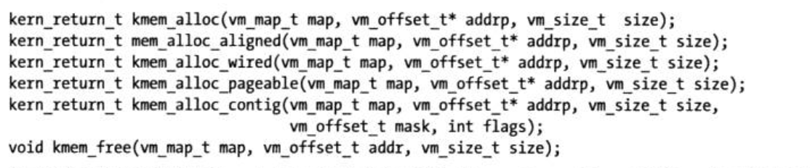
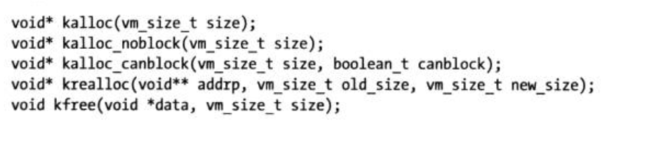
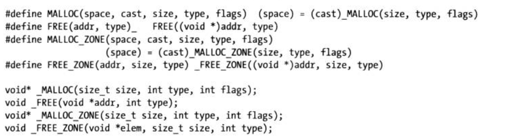
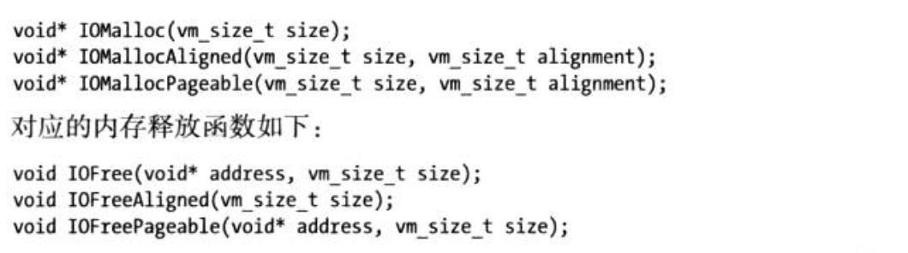
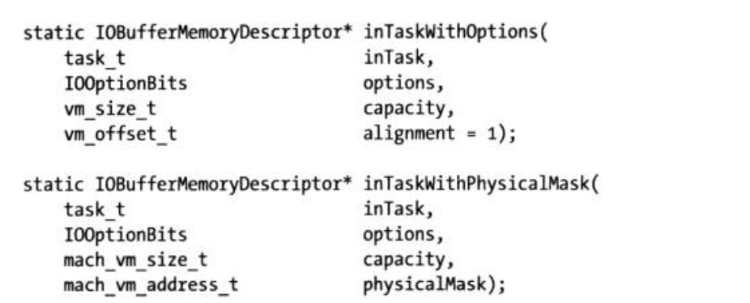
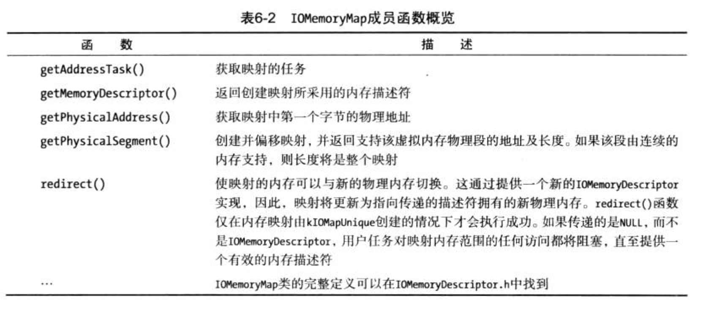

# 内存管理 

## 引言 
内核中的内存管理要比用户空间程序的内存管理复杂的多。   
用户空间程序通常处理平面线形地址空间， 可以分配任意块内存，无须关注该内存的来源或布局。  

内核必须处理多个内存空间， 其中包括自有的内存空间以及这些内存空间与物理内存之间的映射关系。  
内核常常需要知道内存是否联系及其分布位置。__因为一些硬件设备无法读取某些内存地址，或对内存对其有特定需求__  例如： 只能读取16字节边界对其的内存或无法读取地址高于32位的内存   

__内核内存管理最明显的挑战是如何尽可能少用内存__, 


## 1. 内存类型  
内存类型分为： 
* CPU物理地址  
* 总线物理地址  
* 用户和内核虚拟地址  

> 不同体系结构之间可寻址的内存数量也各不相同， 可以从32 位到 64位， 内存还会根据体系结构进行不同的排序， 可以是小端序或大端序   


### 1. CPU 物理地址  
__物理地址__: 指CPU为访问物理内存而使用的寻址系统。物理地址隐藏在CPU 的 MMU之后。 空间呈线形；对物理内存的访问会缓存在较小的内存 缓冲器中，(L1, L2), 一般包含在CPU核心中。    
__MMU__: 内存管理单元， 会将内核和用户空间常用的虚拟地址转换为物理地址  


__通常无须直接处理物理地址，即使是编写驱动程序也无需如此__  


### 2. 总线物理地址  
>  传 统 的 I / 0 总 线 ( 如 P C I 和 P C I X ) 无 法 访 问 3 2 位 以 上的内存地址
实际上是，经过 `DART` 转换后的虚拟地址   
在 `I/O Kit`使用时，使用`IOMemoryDescriptor`时， 会自动执行所需转换  
驱动程序可以使用`IOPhysicalAddress`类型处理物理地址， 该类型的长度取决于底层体系结构。   

__I/O MMU__： I/O内存管理单元，是面向直接 I/O (VT-d) 的虚拟化技术之一   


### 3. 用户和内核虚拟地址  
虚拟地址呈线性，通过CPU上 一个名为内存管理单元(MMU)的特殊芯片转换为物理地址   
每个用户空间进程都有自己的内存地址空间，从各方面看就像一个进程拥有所有的物理内存   
用 户空间进程可以使用其地址空间中任意的内存位置，即使地址位置超出了物理内存数量    
对 一个 进程来说，虚拟地址空间看起来呈线性，尽管支撑它的内存可能是碎片。  

Macos x对内核(4GB)和用户空间进程(4GB)使用了完全独立的 地址空间，但正如前文所说，__其缺点是上下文切换代价较高__  
高128 T字节预留给内核，而低128 T字节则属于当前运行的用户空间任务
__该地址空间与用户空间共享， 但因为页保护标识，任务不能访问内核内存。__  

__分页器__: 用于获取包含给定内存地址的页, 如果页不存在，那么就会发生`缺页异常`  

__进程不可以访问虚拟地址空间的第一页(0~4KB)，如果试图访问，将会发生异常。__  


与体系结构无关的类型`IOVirtualAddress`可用于处理 I/O Kit 代码中的虛拟地址。该类型又是
`mach_vm_address_t` 的别名，是Mach 层中用于虚拟内存地址的类型。   


 #### 4.  内存顺序： 大端序和小端序  
 字节序： 是内存中二进制字的组成顺序  

 ```c++ 
 int main(int argc, char *argv[]) {
    uint32_t word = 0xaabbccdd;
    uint8_t* ptr = (uint8_t*)&word;
    printf("%02x %02x %02x %02x\n", ptr[0], ptr[1], ptr[2], ptr[3]);
    return 0;
} 
 ```
 > 验证内存顺序： 结果为 `dd cc bb aa`是小端序； `aa bb cc dd`: 为大端序  


* 小端序： 
    系统上的顺序为逆向  
    所有的Mac都是小端序，`x86/arm`都是小端序架构  

* 大端序： 
    部分硬件体系结构或网络协议(如TCP/IP)使用的是大端序  

__编译器定义了`__LITTLE_ENDIAN` 和 `__BIG_ENDIAN__`宏， 用来确定编译时的字节顺序  


#### 5. 32 位和 64 位内存寻址  


## 2. 内存分配  
内核内存分配设备的范围从类似于用户空间`malloc()`接口的高层机制到对原始页的直接分配   
获得内存的不同函数有许多个，具体采用哪一个取决于你使用的子系统，例如`Mach`、`BSD`或`I/O Kit`，以及对内存的需求，如`大小`或`对齐`。   

__在最底层，内核使用`vm_page`结构体记录物理内存, 每个 vmpage 结构体都对应一个物理内存页__   

* `活动链表(Active List)`:  包 含 映 射 到 至 少 一个 虚 拟 地 址 空 间 的 物 理 内 存 页 ， 并 且 最 近 使 用过。
* `惰性链表(inactive List)`: 包含已分配但最近未使用的页。
* `空闲链表(free list)`:  包 含 未 分 配 的 页 。
 
> 要从空闲链表取得一个空闲页，可以使用`vm_page_gzab()`两数或其高层接又 `vm_page_al1oc()`，不同于`vm_page_Brab()`函数，`vm_page_alloc()`是将页放置到`vm_object` 对象中，而不是将其从空闲链表中移除。如果内核检测到空闲页的等级低于阀值，则将通知分页守护进程 。 在 这 种 情 况 下 ， 分 页 器 将 根 据 最 近 最 少 使 用 (`LRU`) 原 则 ， 从惰性链表逐出页  __磁盘文件映射的页是主要的驱逐对象，可以轻易地丢弃__ , __VM页缀存和文件系统缓存组合在一起，可以避免复制，统称为统一绥冲区缓存__  


### 底层分配机制  
内核有多个内存分配例程族。 VM 子系统位 于内核的Mach部分， 实现内存分配的底层接口。   
内核的Mach部分执行操作，需要使用`kmem_alloc*()`的数族.   

所有的两数都需要指定一个属于用户空间任务或kernel_map的VM映射。上面的所有函数都分配联动内存，这些内存无法换出，但`kmern_alloc_pageable()`除外。  
  

### Mach 内存域分配器  
Mach内存城分配器是 一种分配机制， 可以分配名为内存域的固定长度的内存块。 
`内存域`： 通常表示一个广泛使用的内核数据结构，如文件描述符或任务描述符，但也可以指向更为通用的内存块   
内存域分配器分配的数据结构示例包括：  
* 文件描述符  
* BSD套接字 
* 任务(struct task); 
* 虚拟内存结构(VM 映射， VM 对象 )  


#### 自定义内存域 
如果需要频繁、快速地分配和释放相同类型的数据对象， 可以使用`zinit()` 函数创建自己的内存域。 为了创建 一个新的内存域，你需要告诉分配器对象的大小、队列的最大 长度及分配大小，这会指定内存城耗尽时需要添加的内存量。 


### kalloc 家族  
kalloc 家族为快速分配内存提供了一个略高级的接口。   
V0 Kit和BSD层的底层内存函数基于kalloc 家族 提 供 的 A P I 进 行 构 建。  kalloc 函数还为C + + 的内存分配操作符 `new`和`new[]`提供内存。   
除 `kalloc_noblock()`外 、 `kalloc`函数及其变体可以阻塞(睡眠)以得内存
  


### BSD 中的内存分配 
  


### I/ O Kit 内存分配 
  
* `IOMalloc`使 `kalloc` 函数的包装器， 
    * 无法在原子上下文中使用。如中断处理器， __它会阻塞（睡眠）获取内存__ ,
    * 需要内存对齐也不能使用， 它无法保证内存对齐  
    * 内存用于小而快的分配， 饼不适合映射到用户空间   
    * 保留的内存来自大小固定的小型池， 过度使用将造成池泄漏， 并且在池被耗尽时会造成内核恐慌    
    * 可以从多个源获取内存， 对于较大的分配(大于 8kb),可以采用 `kmem_alloc()`； 对于较小的分配，可以通过 内存域分配器进行  
* `IOFree` 
    * 也会阻塞， 
    * 如何持有一个简单锁(OSSpinLock)时调用`IOMalloc()` 或者`IOFree()`，还 __可能造成死锁__ ,两个函数中的任何一个睡眠，该线程都kennel会被抢占。   

* `IOMallocAligend()`  
    * 与`IOMalloc`有相同的限制，不过会返回与特定值对齐的内存地址    
* `IOMallocPageable()` 
    * 分配的内存可以进行分页  
    * __分配的内存无法用于 I/O 设备__
    * 无法在只有内存固定之后才能阻塞/睡眠的代码路径中使用  
* `IOMallocContiguous()` 
    * 分配的内存是连续的  
    * 已经废弃。推荐使用`IOBufferMemoryDescriptor()`  

__每个变体都有一个对应的内存释放函数，需要调用对应的释放函数才能使用内存，否则将出错。每个变体都采用不同的底层机制进行分配内存，他们之间不能互换__  


##### 为什么需要内存对齐？  
1. 硬件无法访问未对齐到特定边界的内存，或执行速度很慢  
2. 向量计算中，使用未对齐到特定边界的内存(SSE中通常是 16字节),执行速度会非常慢。  
3. 内存需要映射到用户空间进程。 由于映射只能用于整页， 所以需要确保缓冲区始于页边界  
4. 需要一个与CPU缓存良好协作的数据结构  


### 使用C++的 `new` 操作符进行内存分配   
libkern库 实 现 了一 个 基 本 的 C + + 运 行 时 ， I/O K i t 便 是 在 该 运 行 时 的 基 础 上 构 建 的 。   
C++中内存分配采用分别面向单个对象的`new`和面向数组的`new[]`实现    

#### `new`分配内存的原理  
`new`操作符在，libkern库中通过调用`kalloc()`获得内存在内部分配。     
因为`kfree`需要最初分配的大小，所以 libkern 对传递给 new 操作符的大小进行了修改， __以包括保存分配大小的小结构体空间__  
`delete`擦作符调用`free()`, __可以获取new返回的地址之前的4字节长度__       

>源码可以在XNU`libkern/c++/OSRuntime.cpp`中找到   


## 3. 内存描述符  
 __内存描述符由`IOMemoryDescriptor`类实现，是 I/O Kit中处理内存的基础。__  

 #### IOMemoryDescriptor 作用 
 * 描述内存缓冲区的属性或内存范围。 但并不分配描述的内存   
 * 包含元数据，使某些操作可以在内存上执行   
 * 可以描述虚拟内存和物理内存  

 ```c++ 
 /**
 address: 描述符应该操作的内存缓冲区的起始地址 
 length： 指向的缓冲区的字节数。 
 options:  指定 i/o传递事件中用到的描述符的方向，会影响 prepare() 和 complete()的执行， 可以用来确定是否需要刷新处理器缓存，以确保缓存的一致性  
    如果该描述符用于 I/O 传输，必须首先调用 prepare() 执行以下操作： 
        * 如果底层内存被换出，那么换入内存 
        * 钉住该内存， 因此该内存无法换出，直到传输完成  
        * 如有必要， 配置设备地址传输映射  
 task： 指定拥有该虚拟内存的任务， 如果内核拥有该内存，则可以传递 kernel_task，这是一个指向内核的task_t结构题的全局变量    
 
  */
static IOMemoryDescriptor* withAddressRange(mach_vm_address_t address, mach_vm_size_t length, IOOptionBits options, task_t task);


/** 
    生成物理内存描述符  
*/
static IOMemoryDescriptor* withphysicalAddress(IOPhysicalAddress address, IOByteCount withLength, IODirection withDirection);
 ```   

>  `prepare()` 必须和 `complete()` 成对调用，只有调用了`prepare()` ， 才能调用 `complete()`  


### IOBufferMemoryDescriptor  
__可以分配内存, 可以获得连续内存__     
将当前分配的内存映射到用户空间， 或从内核分配的缓冲区执行设备I/O的首选方式。 __但内部使用的分配方法取决于请求长度及构造时传递的选项__  
  

使用不同的 options 控制不同的分配行为： 
* `kIOMemoryPhysicallyContiguous`: 分配的内存在物理上具有连续性  
* `kIOMemoryPagable`:分配的内存可以换出， 所有的内存默认为不可分页  
* `kIOMemoryPurgeable`: 只应用与可分页的内存，内存页可以丢弃，而不是换出  
* `kIOMemoryKernelUserShared`: 可以映射到内核和用户空间任务， 可以保证内存页对齐  

__可以睡眠， 不应该从中断上下文或持有简单锁时对其进行调用__  
__内部使用`IOMalloc()`和`IOMallocAligned()`分配内存  

> 通常不建议请求物理上连续的内存， 特别是系统已经启动后， 内存很亏会产生很多碎片。这将使寻找连续的空闲缓冲区特别是较大的缓冲区变得非常困难。  请求连续的内存，会导致一些内存被换出， 这会花费很大时间。硬件设备通常支持分散/聚集操作， 将多个较小的缓冲区链接为一个列表， 传递给设备， 设备然后读取列表，计算出数据在物理内存中的位置。 __连续的物理内存没有必要__   

#### 其他内存描述符  
* `IODeviceMemory`: 用来描述设备映射的内存范围   
* `IOMutiMemoryDescriptor`: 可以用来表示由较小的 `IOMemoryDescriptor`对象组成的较大连续缓冲区   

### 4. 映射内存 
> __映射内存是让一个任务的内存范围可用于另一个任务的功能。在最底层，映射由 Mach VM 子系统处理, 使任务无须复制内存便可以共享资 源，因为映射使相同的内存可以在任务之间使用__  
> __可写映射能够共享，直至有修改发生，这种情 况下，写时复制(COW)优化仅复制修改的内存, 内存映射可以在多个任务之间、从内核到用 户空间任务或从用户空间任务到内核之间以各种不同的方式进行__   


#### 【用户空间任务 ------->  内核空间】的内存映射  

1. 用户空间任务内存特点： 
    * 简单调用 memcpy() 函数可以实现内存复制 
    * 传入内核的内存地址是无效的，无法直接使用  
    * 传入地址仅在任务的私有地址空间中有效  

内核如何访问地址传入的内存数据呢？  
> 需要为内核自己地址空间中的物理内存缓冲区创建一个映射。该处理通过操作内核的 VM 映射实现。 通过 I/O Kit `IOMemoryDescriptor`和`IOMemoryMap`类实现。  

```c++  

void copyBufferFromUserTask(task_t userTask,void* userBuffer, uint32_t userBufferSize, void* dstBuffer) {
    uint32_t bytesWritten = 0;
    bool wasPrepared = false;
    IOMemoryDescriptor* memoryDescriptor = NULL;
    IOMemoryMap* memoryMap = NULL;
    
    // 为用户空间缓冲区创建一个  IOMemoryDescriptor
    // IOMemoryDescriptor提供一个接口，创建内存映射，还可以在我们从缓冲区复制时钉佳内存
    // 如果执行复制时音頻播 放器崩溃或用户退出该应用程序，这可防止内存被换出到一级存储器或消失。
    memoryDescriptor = IOMemoryDescriptor::withAddressRange(userBuffer, userBufferSize,kIOMemoryDirectionOut,userTask);
    
    if (memoryDescriptor == NULL) {
        goto  bail;
    }
    if (memoryDescriptor->prepare() != kIOReturnSuccess) {
        goto  bail;
    }
    
    wasPrepared = true;
    // 进行实际的内存映射  
    memoryMap = memoryDescriptor->createMappingInTask(kernel_task, 0, kIOMapAnywhere | kIOMapReadOnly);
    if (memoryMap == NULL) {
        goto bail;
    }
    
    void* srcBufferVirtualAddress = (void*)memoryMap->getVirtualAddress();
    if (srcBufferVirtualAddress != NULL) {
        bcopy(srcBufferVirtualAddress, dstBuffer, userBufferSize);
    }
    
    //与 unmap() 方法的区别： unmap 会直接销毁映射，导致内存访问无效地址； 映射可能被创建多次，release 会减少引用计数，
    memoryMap->release();// 这将取消内存映射
    memoryMap = NULL;
    
bail:
    if (memoryDescriptor) {
        if (wasPrepared) {
            memoryDescriptor->complete();
        }
        memoryDescriptor->release();
        memoryDescriptor = NULL;
    }
}
```
> 通过将内存缓冲区映射到内核的地址空间，从用户空间的音频播放器复制内存  
  
  
> 无需将内存映射到内核， 除非内核需要主动修改该内存。 如果不修改i啊，可以直接将缓冲区传输给硬件设备  


#### 【内核空间 -------> 用户空间任务 】的内存映射     
> 安全考虑， 不推荐这样使用  
__映射的最小单位是页， 如果映射的缓冲区小于 4096， 那么会直接看到缓冲区的整页内存，这将会成为安全隐患__  

```c++
#define kTestUserClientDriverBuffer 0
IOReturn com_osxkernel_TestUserClient::
clientMemoryForType(UInt32 type, UInt32 *flags, IOMemoryDescriptor **memory) {
    IOReturn ret = kIOReturnUnsupported;
    switch (type) {
        case kTestUserClientDriverBuffer:
            // 返回一个指向 iomemorydescriptor 的指针
            // 对于硬件设备，则返回一个 IODeviceMemory 指针
            *memory = driver->getBufferMemoryDescriptor();
            *memory->retain();
            ret = kIOReturnSuccess;
            break;
            
        default:
            break;
    }
    return ret;
}


// 用户空间代码  
void* addressOfMappedBuffer = NULL; // 在调用成功时保存映射地址/或首地址， 映射的最小单位时 页  
int sizeOfMappedBuffer; 
IOConnectMapMemory(openDeviceHandleHere, kTestUserClientDriverBuffer, mach_task_self(), (vm_address_t *)&addressOfMappedBuffer,&sizeOfMappedBuffer, kIOMapAnywhere);


```
> 通过`IOUserClient`将内核内存映射到用户空间  


__以上方式，任何任务都可以映射内存，并且驱动程序代码无须知道内存将映射到那个任务__   


#### 将内存映射到指定的用户空间任务   
> 不要映射使用函数获得的内存，例如: IOMalloc()/ IOMallocAligned(), 它们来自内存域分配器， 这用于私有、临时分配， 饼不用于共享分配。 __建议使用`IOBufferMemoryDescriptor`进行内存映射   

```c++ 
IOBufferMemoryDescriptor * descriptor = NULL; 
descriptor = IOBufferMemoryDescriptor::withOptions(kIODirectionOutIn | kIOMemoryKernelUserShared, sizeInBytes, 4096);
// kIOMemoryKernelUserShared: 向内存分配器表明，希望与用户任务共享内存。 
```


#### 物理地址映射  
虚拟地址只针对 CPU 可用， 对需要物理地址的硬件设备无效   
与硬件设备通信： 需要将内核或用户空间任务的虚拟地址转换为物理地址  

物理地址特点： 
    物理地址可能是分散在系统内存的多个区域， 需要计算出缓冲区由多少个碎片组成， 饼发送一个包含地址及长度的列表数组(分散/聚集表)   

* `getPhysicalAddress()`: 
    将第一个字节的地址转换为其物理地址，__只在知道缓冲区连续的情况下使用__  
* `getPhysicalSegment()`: 
    将指定的偏移量地址转换入缓冲区， 并从该偏移量返回物理段的长度，在连续的缓冲区中，这总是缓冲区的长度减去偏移量   


>__更灵活、更安全、更容易的内存转换方案是使用 `IODMACommand`类，与`IOMemoryDescriptor`协同工作   


## 总结 
1. 内核使用的内存地址类型。内核通常为其自身的线程及用户空间任务的线程处理虚拟地 址。物理内存地址可以在CPU与内存及硬件设备之间使用。  
2. 内存如何在不同的内核子系统、Mach、BSD及I0 Kit中执行分配。在VOKit 中，首选机 制 是 使 用 IOMalloc*() 函数或 IOBuffferMemoryDescriptor。  
3. 10BufferMemoryDescriptor 子类除了提供内存描述符，还可以分配各种形式的内存，如对 齐的或物理上连總的内存。  
4. IoUserClient 类如何提供一个有用的方法，即clientMemoryFor Type()，处理内核缓冲区到 用户空间的映射细节。  
5.  IOMemoryDescriptor如 何 提 供 getPhysicalSegment() 等 方 法 ， 将 虚 拟 内 存 地 址 映 射 到 物 理 地址。


