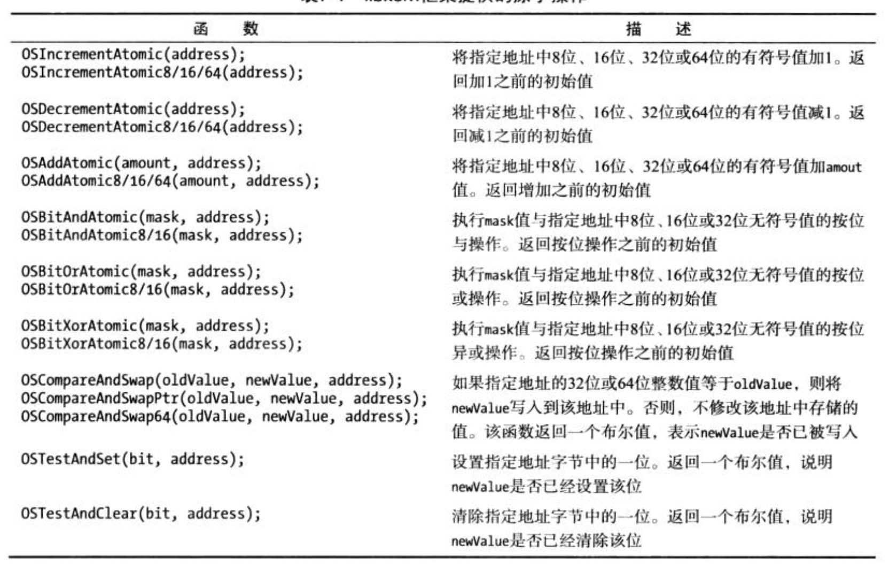
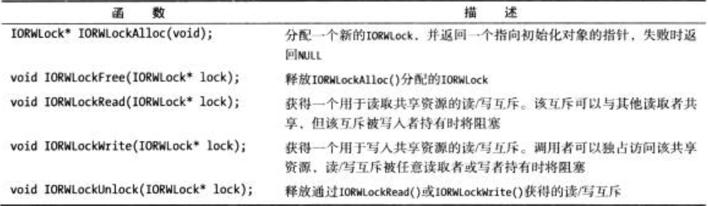

# 同步和线程  

## 前言 
驱动程序开发者的最终目标是： __驱动程序代码运行在复杂的多线程环境中， 即使驱动程序并没有创建自己的任何额外线程__  

驱动程序提供同步访问机制， 访问其内部结构体及可能由多个线程读/写的任意数据   

## 1. 同步原语  
当在两个或两个以上线程上运行的代码试图访问公共资源或结构时， 就会发生 __同步问题__   

#### 同步问题原理  
CPU在修改一个变量的值时，将经历以下三个步骤： `加载` --> `修改` ----> `存储`   
同样一行代码，在编译后，可能会拆分成多行 汇编指令， CPU是以汇编指令进行执行的  
在多线程环境中， 当线程1 将实例变量的值加载到cpu寄存器中， 增加或减少CPU寄存器的值，将结果写会到内存。 在整个过程中，操作系统会在每一步操作中都有可能触发线程调度，保存当前线程状态，并且其他线程也会针对同一个变量进行操作。这将导致，线程1在还原线程状态时，与当前变量在内存中的实际值有所差异，将导致数据不同步问题   


## 2. 原子操作   

#### 原子操作原理   
如何避免同步问题， 那么一个简单原理就是将CPU 操作值的 3个步骤，替换为等同一个步骤的操作。   采用这种方式，执行被另一个线程抢占时，不会出现操作中断。 所以，针对同步问题的解决方案： 
* 将多个步骤转变为 单个操作指令  
* 将多个步骤转变为一个指令序列， 其行为看起来像是执行单个指令  

__原子操作的实现，需要CPU的支持__  
  
>  `libkern` 框架提供的原子操作   

```c++ 

void Object::retain()  {
    OSIncrementAtomic(&retainCount);
}

void Object::release() {
    uint32_t originalValue;
    originalValue = OSDecrementAtomic(&originalValue);
    // 在if 之前这一步，还是有可能发生线程抢占，导致读到的 originalvalue 不一样  
    //假 定 一 个 线 程 已 经 执 行 r e l e a s e ( )， 将 r e t a i n c o u n t 从 2 减 至 1，并将诚少后的值写回内存。另外，假定在从内存重新加载retaincount值并测试该值是否为0 之前，该线程已被抢占。另 一个线程现在有机会运行，如果將要执行release()，retaincount 会从1减至0，该对象就会被销毁。执行返回至初始线程时，它將重新加载retaincount 的值，发现其值为0便会第二次销毁该对象。
    if (originalValue == 1) {
        this->firee();
    }
}
```
> 多线程环境中对象引用计数的实现

`CAS(compare-and-swap)`函数族： 是将一个值写入到内存地址，但是，仅在被覆写的值等于调用者提供的某个预期值时才会执行写入操作。整个操作的执行都是原子操作  
__CAS 函数可以用来构建更复杂的原子操作__  

```c++ 
uint32_t AtomicBitAndOr(uint32_t andMask, uint32_t orMask, volatile uint32_t*address) {
    uint32_t oldValue;
    uint32_t newValue; 
    do {
        oldValue = *address;
        newValue = oldValue & andMask;
        newValue = newValue | orMask;
    }while(OSCompareAndSwap(oldValue, newValue, address) == false);  
    // OSCompareAndSwap 确保 address 的值仍是初始值，程序根据初始值计算写入的新值  如果addres 被其他线程更改，那将一只执行循环操作
    return oldValue;
}
```


## 3. 锁  
__原子操作： 可以很好的解决访问一个变量的同步问题__  
__锁__: 针对复杂的代码块同步问题，通过添加互斥条件， 这个互斥条件，就是 ---->🔒   


锁的基本思想是，访间共享资源的任何代码(如驱动程序的实例变量)在执行代码之前首先 要获得一个锁， 在完成对共享资源的访问时释放该锁。  
__锁在一个时刻只可 以被一个客户端(一个线程)持有__  

### I/O Kit 提供的锁： 
* `IOSimpleLock`: 实现一个自旋锁 
* `IOLock`: 实现一个普通互斥
* `IORecursiveLock`: (递归互斥锁)实现一个互斥， 该互斥可以多次从持有锁的线程安全的获取  
* `IORWLock`: 实现一个读写锁， 读写锁可以在需要读取共享资源的多个线程之间共享，但写入共享资源是持有锁的当前线程独占   

#### 自旋锁(IOSimpleLock)  
__自旋锁是锁的最基本实现，只用原子操作就可以实现__    
`IOSimpleLock` 在锁被持有时仅用了运行线程的抢占(和可能的中断)，意味着， 一个简单锁被持有时，持有该锁的线程将不会被撤销它运行的CPU，直至锁被释放   

* 特点： 
    * 只能获得短时间，比如修改单独变量等  
    * __并且从不执行阻塞运行线程的操作，如分配内存或获得互斥，因为这会导致 死 锁__  
    * 从不暂停运行的线程   

* 缺点 
    * 不适合线程需要长时间持有锁的情况   
    * 线程执行的操作在🔒被持有时会阻塞的情况，如分配内存，或获得第二个🔒  

> 原理：一 个 自 旋 锁 可 能 只 包 含 一 个 布 尔 标 志 ， 表 示 该 锁 当 前 是 否 被 某 个 线 程 持 有. 如果该锁被持有，那么该函数将重复尝试获得该锁，直至该锁可用。__会阻塞线程__  

```c++ 
typedef uint32_t MySpinLock; 
void myAcquireSpinLock(MySpinLock * lock) {

    // 如果锁的值是0， 则将其值设置为 1
    // 不断重试，直到该🔒被成功设置  
    while(OSCompareAndSwap(0,1, lock) == false) {
        ;
    }
}
```
> 自定义自旋锁  

> 注意：持有自旋锁的线程必须注意，不要再次获得当前持有的锁。否则线程将试图获得该锁并自旋， 因为该锁当前不可用  

__死锁__: 持有锁的线程尝试获取锁，现场将无限自旋， 因为可以释放该锁的唯- 线程正在阻 塞等待该锁


#### 低效但又高效  
自 旋 锁 看 起 来 是 一 种 低 效 的 锁 机 制 ， 因 为 线 程 在 没 有 立 即 获 得 锁 时 会 花 费 C P U 周 期 进 行 自旋     
但实际上自旋锁比其他的锁机制更高效，假如锁仅被持有很短的 一段时间    
在单CPU机器 上，I0Simpl elock从不自旋，因为线程抢占被禁用，并不存在锁克争的可能。但在多核心CPU上无效，__线程抢占只对 获得锁的CPU核心禁用__  
但假如自旋锁只被持有很短的一段时间，线程等待锁释放时花费的自旋 时间，通常要比使用互斥而非自旋锁阻塞线程所花的时间少得多。    
  
> I/O Kit提供的自旋锁同步函数  


#### 互斥(IOLock)  
__解决了自旋锁的缺点__ 
__互斥特点： 只允许一个线程持有锁__  

所有试图获得已经被使用的互斥锁时， 将被挂起，直到锁可用；但互斥锁不影响线程抢占，在锁持有时对CPU执行操作没有限制   
当互斥锁被持有时， 线程可以分配内存， 将内存从用户空间映射到内核， 以及获得另一个互斥    
__互斥锁不可用于中断处理程序， 因为互斥在无法获得时会阻塞__   

> 持有互斥锁的线程，不能呢个再次获得当前互斥锁，否则将死锁   

`递归互斥`： 线程已经获得一个递归互斥后，运行在当前线程的任何代码都可以多次重新获得该互斥，不会导致死锁   
  
> I/O Kit 提供的互斥同步函数  


#### 条件变量  
`__条件变量__： 提供了一种机制， 其中线程可以暂停其执行， 直到特定的条件发生，从而实现在多线程之间同步   

```c++
void MyDriver:: read(void* buffer , uint32_t* bytesRead) {
    IOLockLock(m_lock);
    do {
        // 试图从硬件读取数据 
        *bytesRead = readFromHardware(buffer);
        // 如果没有课用数据，就一直睡眠， 直到硬件接收到数据  
        if(*bytesRead == 0) {
            int result;
            // 在睡眠时会自动释放该锁(m_lock)， 在收到事件通知之后会重新获得该锁
            result = IOLockSleep(m_lock, m_readEvent, THREAD_ABORTSAFE);  // 类似于 pthread_cond_wait()
            if(result != THREAD_AWAKENED) {
                break;
            }
        }
    }while(*bytesRead == 0) 
    IOLockUnlock(m_lock);
}

void MyDriver:: DataAvailable() {
    // 唤醒在 m_readEvent 上睡眠的所有线程 
    IOLockWakeup(m_lock, m_readEvent, false);
}
```
  
> I/O Kit 提供的条件变量同步函数   


#### 读/写互斥(IORWLock)  
  
> I/O Kit 提供的读写互斥同步函数   

> I/O Kit锁基于 Mach 类型构建。 包括取得底层 mach 锁类型的函数， 其中包括 `IOSimpleLockGetMachLock()`, `IOLockGetMachLock()`, `IORecursiveLockGetMachLock()`,`IORWLockGetMachLock()`, __可以利用mach 层提供的但是 I/O Kit 层未提供的功能__  


## 4. 同步异步事件： 工作环  

#### 原因 
驱动程序需要处理在多个线程执行间同步，还必须与运行在多个线程上的代码和响应异步事件的运行代码进行同步竞争。 这变得非常复杂  


#### 解决方案  
__I/O Kit 提供了 `IOWorkLoop`创建单线程，处理异步事件, 称为工作环， __  


#### 原理 
大多数时候都是空闲状态，不消耗CPU 时间， 等待事件发生。 事件发生后， 对应的事件源将会通知工作环。 工作环线程被唤醒， 处理事件， __所有的事件都在一个线程上处理， 解决了一个驱动程序中的多个源的同步问题__  


#### 应用工作环  
工作环的获取方式由两种： 一种是获取驱动提供者现有的； 一种是自己创建自己独有的  

* 获取驱动程序
```c++ 
// 获取提供者现有的 
m_workLoop = getWorkLoop();
if(m_workLoop == NULL) {
    abort with error;
}
m_workLoop-> retain();


//自己创建新的 
// 这种方式需要考虑复写 getWorkLoop 函数，将工作环提供给自己的子驱动程序  
m_workLoop = IOWorkLoop::workLoop();
if(m_workLoop == NULL) {
    abort with error;
}

```

* 注册希望在工作环线程上处理的事件源  
    * `IOInterruptEventSource`: 为 PCI 卡的中断处理程序创建事件源 
    * `IOTimerEventSource`: 为定时器事件创建事件源  
```c++
// TimerFiredFunc: 回调函数 
m_timerEventSource = IOTimerEventSource::timerEventSource(this, TimerFiredFunc);
if(m_timerEventSource == NULL) {
    abort with error;
}

result = m_workLoop->addEventSource(m_timerEventSource);
if (result != kIOReturnSuccess) {
    abort with error;
}

```


### IOCommandGate 
驱动程序可能将运行在自身线程上的代码与运行在工作环线程上的事件进行同步。
> 例如： 磁盘设备驱动程序， 他会接收与哦那个户空间应用程序读写事务的请求。 由于该硬件在某一时刻，只能为一个事务提供服务， 其他事务将被添加到一个队列中， 每当一个事务完成(通过中断通知)。驱动程序将从队列的头部移除下一个事务，为它服务。 由于该假设的驱动程序从其中断处理程序(运行在工作环上)及用户客户端操作该事务队列， 所以需要一种方法， 将运行在工作环线程上的代码与运行在线程上下文中的代码同步。   

`IOCommandGate`: 命令门事件， 安装在工作环上， 本身并不生成事件， 用来执行工作环线程上的任意回调函数。通过`IOCommandGate`执行的函数， 并不在工作环线程执行。 只是串行化所有其他的工作环源。 实际在调用`runAction()`的线程上运行。  

```c++ 
//门之外调用的方法 
IOReturn MyDriver:: startTransaction(Transaction*transaction) {
    // 通过命令门调用函数 
    return m_commandGate->runAction((IOCommandGate::Action)StartTransactionAction);
}

IOReturn MyDriver:: StartTransactionAction(MyDriver *self,Transaction*transaction) { 
    // 该静态方法与所有的工作环方法同步 
}
```

### 定时器(IOTimerEventSource) 
提供一个基本的、非周期性的定时器。  
创建一个看门狗定时器，以取消一定时间内未完成的工作。   

__本身无法设置周期性的定时器， 但是可以在回调函数中，重新设置过期时间，已实现类周期性的特点__   


### 释放工作环  
在驱动程序卸载时，需要释放创建的工作环。主要分为两步：
* 移除工作环上的事件  
* 释放 IOWorkLoop对象。   

```c++
void MyDriver::stop(IOService* provider) {
    // 移除饼释放命令门事件源 
    if (m_commandGate != NULL) {
        m_workLoop->removeEventSource(m_commandGate);
        m_commandGate->release();
        m_commandGate = NULL;
    }

    // 移除饼释放定时器事件源
    if (m_timer != NULL) {
        m_timer->cancelTimeout();
        m_workLoop->removeEventSource(m_timer);
        m_timer->release();
        m_timer = NULL;
    }

    super::stop(provider);
}


void MyDriver::free() {
    // 释放工作环 
    if(m_workLoop != NULL) {
        m_workLoop->release();
        m_workLoop = NULL;
    }

    super::free();
}
```


## 5. 内核线程  
__驱动程序处于活动状态时， 并没有一直运行的主线程__ , 驱动程序通常在现有线程上执行， 响应事件。    
> 当用户空间进程通过驱动程序的用户客户端进行控制请求， 驱动程序在用户进程拥有的线程上下文中执行。   
> 驱动程序的硬件发生中断时， 驱动程序的二级中断处理程序从工作环线程执行   


__内核线程__: 通过创建自身的内核线程，来解决驱动程序需要持续执行代码；周期性轮询硬件；执行耗时操作等情况    
通过`kernel_thread_start`创建内核线程  


## 总结 
1. 驱动程序运行在多线程环境中  
2. 驱动程序类的方法可能会从任意线程调用。这意味者，即使驱动程序不创建自己的线程， 也不可避免地需要同步访向它共享的实例变量及硬件。  
3. i/o kit 提供了同步函数，驱动程序可以使用这些函数防止多个线程同时修改共享数据。  
4. 自旋锁同步机制适合仅在短时间内持有锁的代码，或在主中断处理程序内部执行的代码   
5. 如果要长时间持有锁，那么使用互斥是较好的选择，但在主中断处理程序内部无法使用。
6.  为 了 同 生 任 何 时 刻 发 生 的 事 件 ， 如 硬 件 中 断 或 软 件 定 时 器。I/O Kit 提 供 了 一个 专 用 线 程, 这些事件的处理程序在该线程上运行,  这就是工作环线程，I O Kit 可以确保安装在工作环上的所有事件源都按串行方式执行。   


