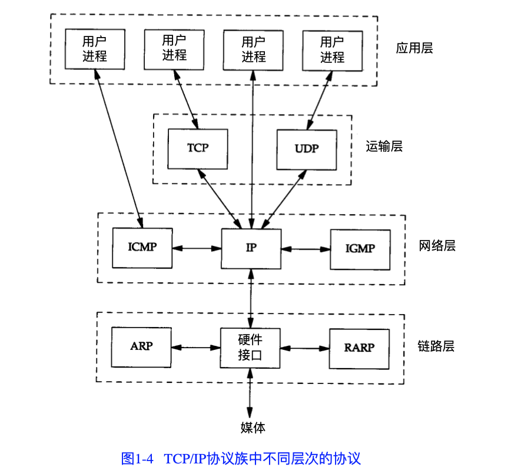
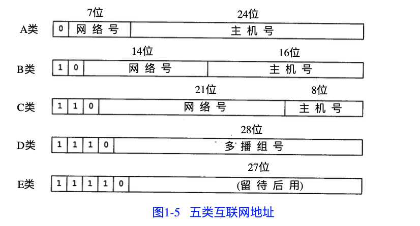
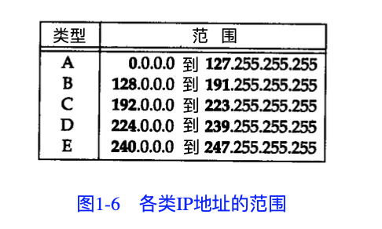
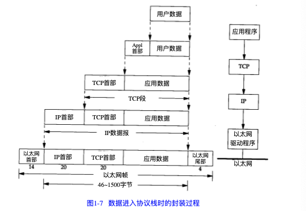
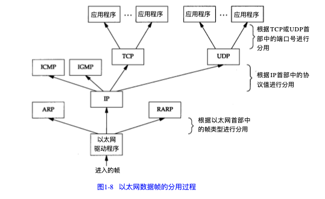

# TCP-IP详解卷1： 协议  

## 概述 
__协议簇:__ 是一组不同层次上的多个协议的组合   

* TCP/IP 协议： 链路层， 网络层， 运输层， 应用层  
    * 链路层：  
        _数据链路层或网络接口层_, 通常包括操作系统中的设备驱动程序和计算机中对应的网络接口卡。 一起处理与电缆的物理接口细节  
    * 网络层：  
        包括 `IP`(网际协议), `ICMP`(internet互联网控制报文协议), `IGMP`(internet组管理协议)    
    * 运输层： 
        主要为两台机器应用程序提供端到端的通信。包含 `TCP` 协议和 `UDP` 协议   
        * TCP: 
            提供高可靠性的数据通信，负责将应用程序交给它的数据分成合适的小块交给下边的网络层，确认接收到的分组，发送确认
    * 应用层：  
        处理特定的应用程序细节， 一般提供一下几种应用： 
        * Telnet 远程登录  
        * FTP 文件传输协议  
        * SMTP 简单邮件传送协议  
        * SNMP 简单网络管理协议   
    __在TCP/IP协议簇中，网络层IP 提供的是一种不可靠服务。它只是尽可能快的把分组从源节点送到目的节点，并不提供任何可靠性保证。TCP在不可靠的IP层上提供了一个可靠的运输层。为提供这种可靠性，TCP采用了超时重传， 发送和接收端到端的确认分组等机制__  

__网桥:__ 另外一种连接网络的方式。  
__网桥在链路层上对网络进行互连， 路由器则是在网络层上对网络进行互连。__ 网桥使得多个局域网组合在一起， 对上层来说好像是一个局域网   

TCP/ IP 倾向于使用路由器而不是网桥来连接网络。   

### TCP/IP 分层  
  
* `TCMP`： 是IP协议的附属协议， IP层用它来与其他主机或路由器交换错误报文和其他重要信息。尽管ICMP主要被IP 使用，但其他应用程序也可能访问(Ping和Traceroute等程序)  
* `TGMP`:是Internet 组管理协议。把一个UDP数据报多播到多个主机   

### 互联网的地址   
互联网中每个接口必须有一个唯一的地址(IP地址)。 __IP地址长 32 bit__   
    

* `InterNIC(nic.ddn.mil)`:只分配主网络号，主机号的分配由系统管理员来负责。 其主要分为三部分： 注册服务(rs.internic.net)，目录和数据库服务(ds.internic.net)， 信息服务(is.internic.net)  
* IP 地址分类：
    * 单播地址 
    * 广播地址  
    * 多播地址  

### 域名系统  
__域名系统(DNS)__: 是一个分布式的数据库，由它提供IP地址和主机名之间的映射信息。  

### 封装  
以太网数据帧的物理特性是 __其长度必须在 46 ~ 1500 字节之间__。 
  
> UDP 传给IP 的信息单元称作 UPD数据报， UDP 的首部长为 8 字节  

由于 TCP, UDP, ICMP, IGMP 都向IP 传送数据，因此IP必须在生成的IP首部加入某种标识，标明属于那一层。其为一个长度为 8 bit的数值，称为协议域。 __1表示ICMP协议，2 表示IGMP协议，6 表示 TCP协议， 17 表示UDP 协议__  

__运输层协议在生成报文首部时要存入一个应用程序标识符。__ TCP/UDP 都用 16 bit 的端口号表示不通的应用程序。其将源端口号和目标端口号分别存入报文首部  

### 分用  
当目的主机接收到一个以太网数据帧时， 数据开始从协议栈由底向上同时去掉各层协议加上的报文首部  
  

### 端口 
知名端口号 `1 ~ 1023` 其中 `256 ~1023` 通常都是由 Unix 系统占用，以提供一些特定服务。  

大多数TCP/IP 实现给临时端口分配 `1024 ~5000`。大于 5000 的是给其他服务器预留的。

### 互联网  
* `internet`: 用一个共同的协议族吧多个网络连接在一起  
* `Internet`: 指的是世界范围内通过TCP/IP 互相通信的所有主机集合   
__Internet 是一个 internet,但internet不等于Internet__  

## 总结 
* TCP/IP 协议族： 链路层， 网络层， 运输层， 应用层  
* 网络层(IP) 提供点到点的服务， 运输层(TCP/UDP) 提供端到端的服务  
* 构造互联网的共同基石是路由器。他们在 IP 层把网络连在一起。  

## 第二章 链路层  

* 链路层作用：  
    * 为IP 模块发送和接收IP数据报  
    * 为ARP 模块发送ARP 请求和接收ARP 应答  
    * 为RARP 发送 RARP 请求和接收 RARP 应答。  

### 以太网和 IEEE 802封装 
__以太网:__ 指数字设备公司， 英特尔公司和Xerox 公司在 1982 年公布的标准。是当今TCP/IP 采用的主要的局域网技术。采用一种`CS,A/CD`的媒体接入方法，它的速率为 10Mb/s,地址未 48 bit。  
__IEEE 802:__ 802.3 针对整个 CSMA/CD 网络， 802.4 针对令牌总线网络， 802.5 针对令牌环网络。

