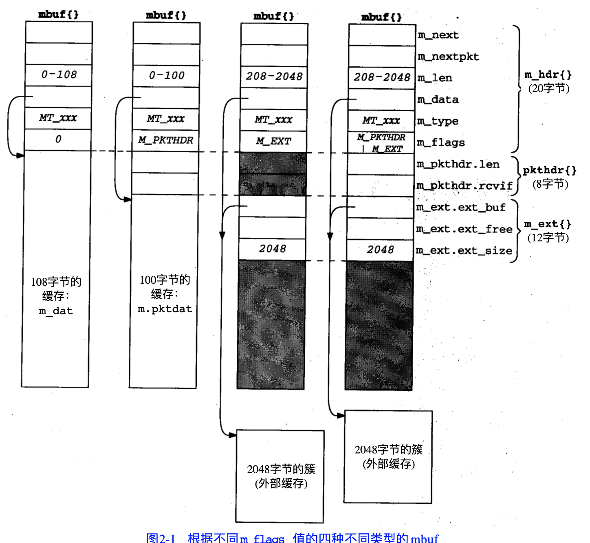
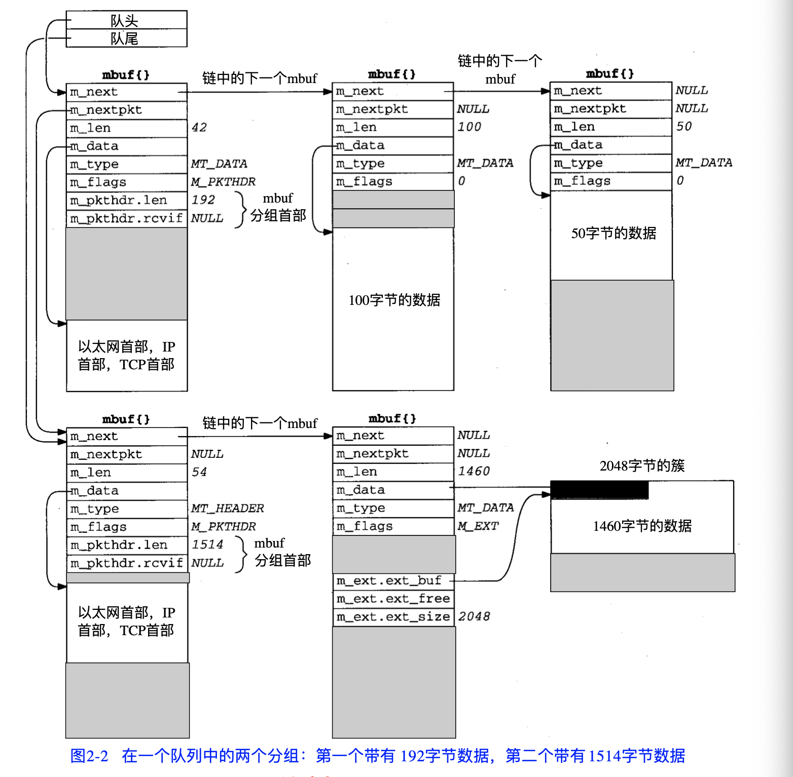

# TCP/IP 协议： 实现  

## 第二章 mbuf: 存储器缓存  

##### 网络协议对内核存储器的性能要求： 
* 方便操作可变长缓存。能在缓存头部和尾部添加数据(底层封装来自上层的数据)  
* 能充缓存中移除数据(当数据分组向上经过协议栈时去掉首部)   
* 尽量减少针对数据的复制操作  

__mbuf:__ 保存在进程和网络接口之间互相传递的用户数据。也用于保存其他数据： 源与目标地址、插口选项   

#### mbuf不同类型： 
* `m_flags = 0`: 
    只包含数据。__mbuf中有108字节数据空间__, 
    `m_data`: 可以指向任意位置。
    `m_len`: 是从 m_data 开始的数据字节数  
    `m_hdr`: 有6个成员，总长度为 20 字节，其中前四个成员每个占用 4个字节，后两个成员每个占用 2 字节。  

* `m_flags = M_PKTHDR`: 
    指示这是一个分组首部，描述一个分组数据的第一个 mbuf , 由于分组首部占用了 8 字节，实际的数据部分存储在 剩余的 100 字节中(`m_pktdat`)。  
    `m_pkthdr.len`:为所有数据总长度  

* 不包含分组首部，但包含超过 208字节的数据。用到了`簇`的外部缓存(设置`M_EXT`)。但仍然给分组首部结构分配了空间，没有使用。
一般簇分为 1024 和 2048 大小。新的系统都采用2048字节来提高性能.(由于以太网的每帧为1500)   
  

* 包含一个分组首部，并包含超过 208 字节的数据。同时设置了 M_PKTHDR 和 M_EXT    

    

