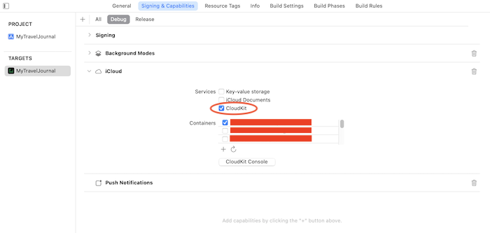
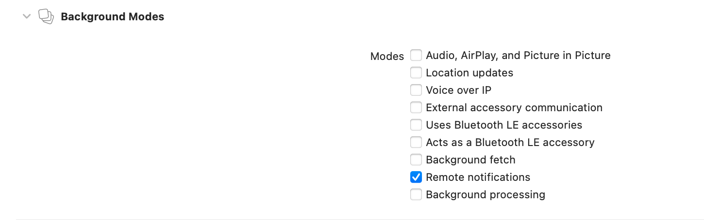
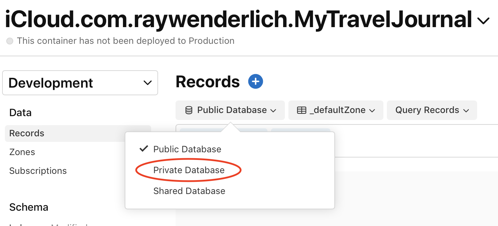
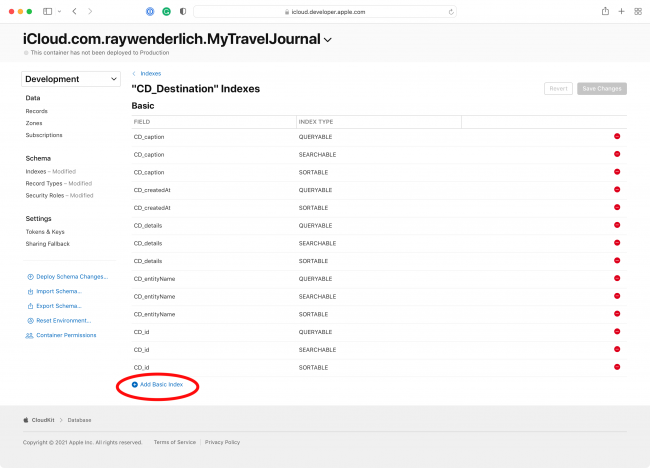

# Core Data With iCloudKit 


## 开启iCloud支持 
1. 开启iCloud功能
      
2. 创建对应的容器 
    在 iCloud 部分，点击容器下方的+按钮以添加自定义容器。在出现的窗口中，输入容器的名称。一般准则是使用. Xcode 在容器名称前加上 iCloud 前缀。
      

3. 最后一步是添加后台模式功能并启用远程通知。这允许 CloudKit 在 iCloud 中的数据发生更改并且您的设备需要更新以反映此更改时向您的设备发送静默推送通知。
      


## CloudKit 控制台仪表板
通过 CloudKit 存储数据时，CloudKit 控制台允许您与相关数据进行交互并执行其他一些功能，例如查看日志。登录控制台后，打开CloudKit Database。

进入此部分后，您需要指定要查看的容器。在屏幕顶部，选择下拉菜单并单击您之前从 Xcode 创建的容器。

在“数据”部分下方，单击“记录”。选择私有数据库。这是数据写入的默认数据库。
      
如果您尝试将记录类型选择为CD_Destination并从此处查询记录，您会收到一条错误消息，指出Field recordName 未标记为可查询。现在，您将解决此错误。

在Schema部分下，选择Indexes。选择CD_Destination。这是您Destination在 Core Data 中的实体。CloudKit 为您的实体加上CD前缀，以区别于传统的 CloudKit 记录。

单击添加基本索引。从列表中选择recordName并确保索引类型是Queryable。保存更改。
      

 现在您已经使您的记录可查询，单击“数据”部分下的“记录” 。选择私有数据库。将记录类型指定为CD_Destination。将所选区域从 defaultZone 更新为自动生成的com.apple.coredata.cloudkit.zone。


## SwiftUI与 Core Data 优雅结合

### Core Data 的优缺点
1. 在创建实体后， 之后开发中不容易更改 
2. 懒加载
    该对象被托管上下文所创建并持有。仅在需要的时候，才从数据库（ 或行缓存 ）中加载所需的数据。 
3. 实时响应变化
    托管对象（ NSManagedObject ）符合 ObservableObject 协议，当数据发生变化时，可以通知视图进行刷新


### swiftUI 特点 
1. 优先在构建过程中使用  结构体


### 先创建 实体 -----> swiftUI (非最优解)

1. 创建对应的实体 
```swift
class C_Goup:NSManagedObject {


}

```

2. 创建swiftUI 中使用的中间结构体 
```swift
struct TodoGroup {
    var title: String
    var taskCount: Int // 当前 Group 中包含的 Task 数量
}

extension C_Group {
    func convertToGroup() -> TodoGroup {
        .init(title: title ?? "", taskCount: tasks?.count ?? 0)
    }
}


```
3. swiftUI视图 
```swift

struct GroupCellView:View {
    @ObservedObject var group:C_Group
    var body: some View {
        let group = group.convertToGroup()
        HStack {
            Text(group.title)
            Text("\(group.taskCount)")
        }
    }
}

```


#### 缺点：
1. 必须先创建对应的实体 
2. 在 swiftUI 中强引入了 实体对象 


> 如何在保留 实体的优势的情况下，又能有效的解耦， 避免实体对 swiftUI的侵入  


## 面向协议 ----->  解决以上问题 

### 先 swiftUI 使用 ------> 创建实体
1. 创建 value protocol协议 
```swift
public protocol BaseValueProtocol: Equatable, Identifiable, Sendable {

    var id: WrappedID { get }
}
// Equatable: 用于针对某些关联类型的参数
// Sendable： 能有效避免出现多线程方面的问题

```

2. 针对将实体对象转换为对应的结构体对象
```swift 

public protocol ConvertibleValueObservableObject<Value>: ObservableObject, Identifiable where ID == WrappedID {
    associatedtype Value: BaseValueProtocol
    func convertToValueType() -> Value
}

```


3. 针对 数据结构体中 ID的处理 
* 仅仅通过实现以上 `BaseValueProtocol` 协议，那么 🆔还是需要`NSManagedObjectID`类型， 这就又回到的原来的问题 --------> 没有解耦
```swift

struct TodoGroup: BaseValueProtocol {
    var id: NSManagedObjectID // 一个可以联系两种之间的纽带，目前暂时用 NSManagedObjectID 代替
    var title: String
    var taskCount: Int
}

```

* 通过协议 

```swift 

public enum WrappedID: Equatable, Identifiable, Sendable, Hashable {
    case string(String)
    case integer(Int)
    case uuid(UUID)
    case objectID(NSManagedObjectID)

    public var id: Self {
        self
    }
}

```
同样出于该类型可能被用于 Action 的关联参数以及作为 ForEach 中视图的显式标识，我们需要让该类型符合 Equatable、Identifiable、Sendable,、Hashable 这些协议。 
`extension NSManagedObjectID: @unchecked Sendable {}`  


============================
## Mock 数据处理 

在不创建 Core Data 模型的情况下，完成绝大多数的视图和逻辑代码。因此，我们必须能够让 swiftUI 视图接受一种仅从  结构体 即可创建的与托管对象行为类似的通用类型。

1. 创建协议
```swift

@dynamicMemberLookup
public protocol TestableConvertibleValueObservableObject<WrappedValue>: ConvertibleValueObservableObject {
    associatedtype WrappedValue where WrappedValue: BaseValueProtocol
    var _wrappedValue: WrappedValue { get set }
    init(_ wrappedValue: WrappedValue)
    subscript<Value>(dynamicMember keyPath: WritableKeyPath<WrappedValue, Value>) -> Value { get set }
}

public extension TestableConvertibleValueObservableObject where ObjectWillChangePublisher == ObservableObjectPublisher {
    subscript<Value>(dynamicMember keyPath: WritableKeyPath<WrappedValue, Value>) -> Value {
        get {
            _wrappedValue[keyPath: keyPath]
        }
        set {
            self.objectWillChange.send()
            _wrappedValue[keyPath: keyPath] = newValue
        }
    }

    func update(_ wrappedValue: WrappedValue) {
        self.objectWillChange.send()
        _wrappedValue = wrappedValue
    }

    static func == (lhs: Self, rhs: Self) -> Bool {
        lhs._wrappedValue == rhs._wrappedValue
    }

    func convertToValueType() -> WrappedValue {
        _wrappedValue
    }

    var id: WrappedValue.ID {
        _wrappedValue.id
    }
}


```


2. 测试。创建对应的mock 数据类型 
```swift 

public final class MockGroup: TestableConvertibleValueObservableObject {
    public var _wrappedValue: TodoGroup
    public required init(_ wrappedValue: TodoGroup) {
        self._wrappedValue = wrappedValue
    }
}


```


3. 由于@ObservedObject 只能接受具体类型的数据（ 无法使用 any ConvertibleValueObservableObject ）需要创建一个类型擦除容器， 让 C_Group 和 MockGroup 都能在 GroupCellViewRoot 视图中使用 

```swift 

public class AnyConvertibleValueObservableObject<Value>: ObservableObject, Identifiable where Value: BaseValueProtocol {
    public var _object: any ConvertibleValueObservableObject<Value>
    public var id: WrappedID {
        _object.id
    }

    public var wrappedValue: Value {
        _object.convertToValueType()
    }

    init(object: some ConvertibleValueObservableObject<Value>) {
        self._object = object
    }

    public var objectWillChange: ObjectWillChangePublisher {
        _object.objectWillChange as! ObservableObjectPublisher
    }
}

public extension ConvertibleValueObservableObject {
    func eraseToAny() -> AnyConvertibleValueObservableObject<Value> {
        AnyConvertibleValueObservableObject(object: self)
    }
}

```


4. 测试 
```swift 

struct GroupCellViewRoot:View {
    @ObservedObject var group:AnyConvertibleValueObservableObject<TodoGroup>
    var body:some View {
        let group = group.wrappedValue
        GroupCellView(group:group)
    }
}


let group1 = TodoGroup(id: .string("Group1"), title: "Group1", taskCount: 5)
let mockGroup = MockGroup(group1)

struct GroupCellViewRootPreview: PreviewProvider {
    static var previews: some View {
        GroupCellViewRoot(group: mockGroup.eraseToAny())
            .previewLayout(.sizeThatFits)
    }
}


```


## 整合及测试 
0. 实体----> 在开发结束再创建

1. 创建对应结构体(会与最终的实体对应) 
```swift
struct TodoGroup: BaseValueProtocol {
    var id: WrappedID
    var title: String
    var taskCount: Int // 当前 Group 中包含的 Task 数量
}


```

2. 创建swiftUI 
```swift 
struct TodoGroupView:View {
    @ObservedObject var group:AnyConvertibleValueObservableObject<TodoGroup>
    var body:some View {
        let group = group.wrappedValue
        HStack {
            Text(group.title)
            Text("\(group.taskCount)")
        }
    }
}


```

3. 定义 mock 数据结构 
```swift 
public final class MockGroup: TestableConvertibleValueObservableObject {
    public var _wrappedValue: TodoGroup
    public required init(_ wrappedValue: TodoGroup) {
        self._wrappedValue = wrappedValue
    }
}

let group1 = TodoGroup(id: .string("id1"), title: "Group1", taskCount: 5)
let mockGroup = MockGroup(group1)


```

4. 创建预览
```swift 
struct GroupCellViewPreview: PreviewProvider {
    static var previews: some View {
        GroupCellView(group: mockGroup.eraseToAny())
    }
}


```


## 总结
1. 对应创建协议及作用 
    * `BaseValueProtocol`
        用于结构体实现协议， 
    * `ConvertibleValueObservableObject`
        用于将 实体 转换为 swiftUI 中使用的结构体
    * `WrappedID `
        用于统一 ID 

    * `AnyConvertibleValueObservableObject` 
        用于类型擦除的， 由于 `@ObservedObject` 只能接受具体类型的数据，无法使用 `AnyConvertibleValueObservableObject` , 通过处理 实体 和 mock 对象，都能在swiftUI中使用 
2. 用于mock 相关的 
    * `TestableConvertibleValueObservableObject`
        仅从 结构体 即可创建的与托管对象行为类似的通用类型  
