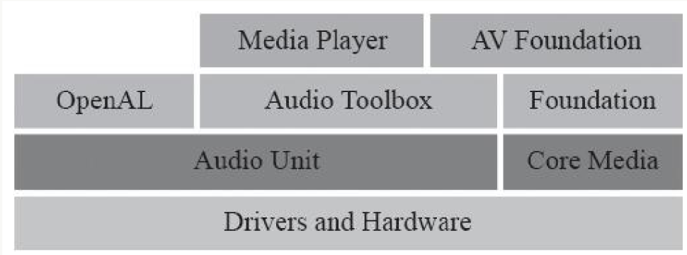
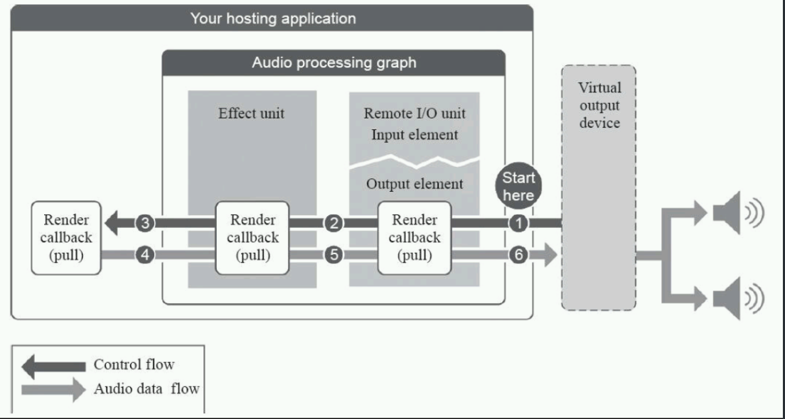
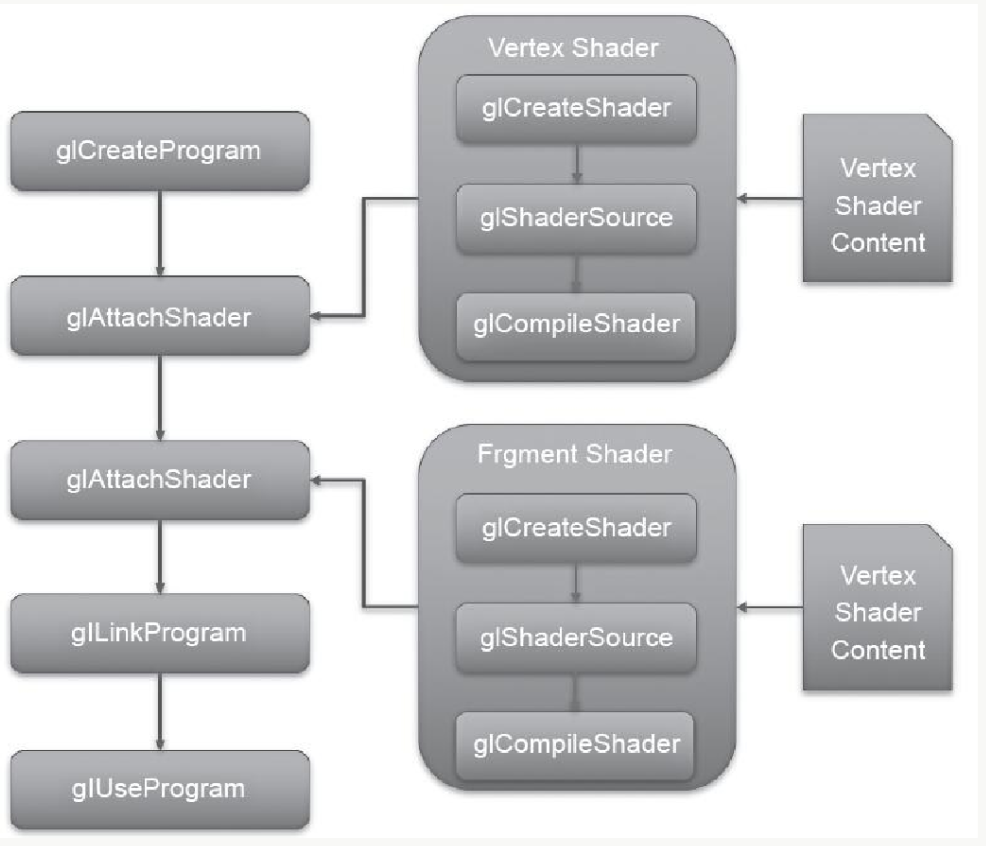
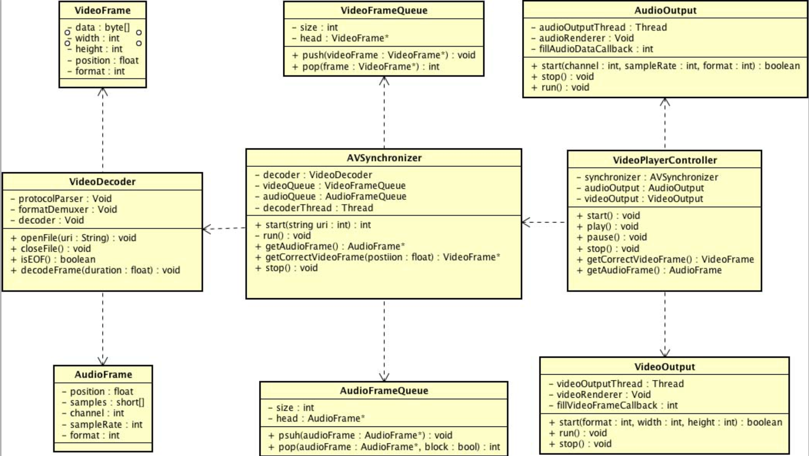
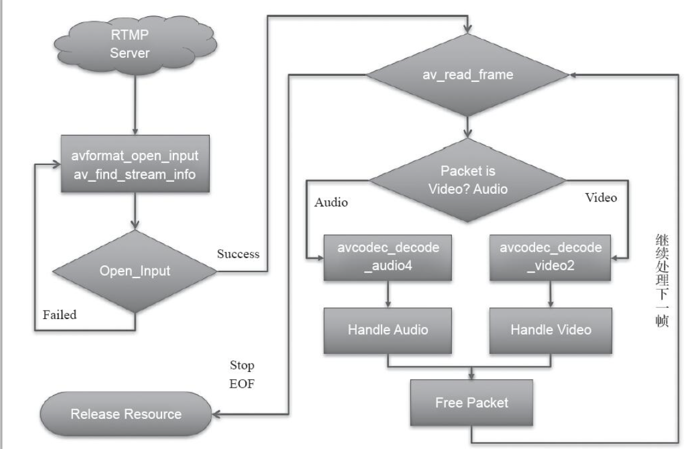
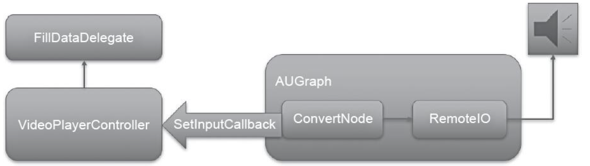

## Audio Unit

  

__在iOS平台上，所有的音频框架底层都是基于 Audio Unit实现的__  


#### 应用场景  
* 想使用低延迟的音频 I/O 比如在 VoIP的应用  
* 多路声音的合并并且回放， 比如游戏或音乐合成器的应用  
* 使用AudioUnit 中提供的特殊功能，比如： 回声消除、Mix两轨音频、均衡器、压缩器、混响器等效果器   
* 需要图状结构处理音频， 可以将音频处理模块组装到灵活的图装结构中   

###重要结构介绍  


#### AudioUnit    

##### 分类(按照用途)  
1. Effect Unit (kAudioUnitType_Effect)
	主要提供音频特效处理能力   
	* kAudioUnitSubType_NBandEQ(均衡器效果)
		主要作用为声音的某些频带增强或者减弱能量， 该效果需要提供多个频带，各个频带设置宽度和增益，最终将改变声音的频域上的能量分布   
	* kAudioUnitSubType_DynamicsProcessor(压缩效果器)  
		当声音较小的时候，可以提高声音的能量，当声音超过设置阈值，可以降低声音能量，使得最终可以将声音在时域上的能量压缩到一定范围之内   
	* kAudioUnitSubType_Reverb2(混响效果器)   
	* 高通 (High Pass)  
	* 低通  (Low Pass)
	* 带通  (Band Pass)
	* 延迟 (Delay)
	* 压限 (Limiter)
2. Mixer Units(kAudioUnitType_Mixer)  
	* 3D mixer  
		__移动设备无法使用__  
	* MultiChannelMixer(kAudioUnitSubType_MultiChannelMixer)  
		多路声音混音的效果器， 可以接收多路音频的输入， 还可以调整每一路音频的增益与开关，并将 __多路合并为一路__
3. I/O Units(kAudioUnitType_Output)  
	主要提供I/O 功能  
	* RemoteIO(kAudioUnitSubType_RemoteIO)     
		__用来采集和播放音频的__ , 
	* Generic Output(kAudioUnitSubType_GenericOutput)
		当需要进行离线处理， 或者说在 AUGraph 中不适用 Speaker(扬声器) 来驱动整个数据流， 而是希望采用一个输出(可以放入内存队列或进行磁盘I/O 操作)来驱动数据流时  

4. Format Converter Units (kAudioUnitType_FormatConverter)  
	__主要用于格式转换功能__    
	* AUConverter(kAudioUnitSubType_AUConverter)
		  
	* TimePitch(kAudioUnitSubType_NewTimePitch)  
		变速变调效果器， 堆声音的音高、速度进行调整   

5. Generator Units (kAudioUnitType_Generator) 
	__常用来提供播放功能__  
	* AudioFilePlayer(kAudioUnitSubType_AudioFilePlayer)  
		
	


* 作用： __用于管理与获取iOS设备音频的硬件信息，并以单利的形式存在__     
* 创建session   
	
	```
	let session = AVAudioSession.instance
	
	```
* 设置 session  
	
	```
	[session.setCategory:AVAudioSessionCategoryPlayAndRecord error:&error];
	// 设置I/O buffer , buffer 越小说明延迟越低
	let bufferDuration = 0.002;
	[session setPreferredIOBufferDuration:bufferDuration error:&errro]; 
	// 设置采样率  ， 让硬件设备按照设置的采样率来采集或播放音频   
	[session setPreferredSampleRate: 44100.0 error:&error];
	
	// 激活 
	[session setActive:YES error:&error];
	
	```

* __构建AudioUnit__  
	* 要素
		* type
		* sybtype 
		* manufacture(厂商)  
		一般情况固定写 `kAudioUnitfacturer_Apple`
	
	* 示例代码  
		
		```
		// 构建一个描述结构体
		AudioComponentDescription ioUnitDescrition;  
		ioUnitDescrition.componentType = kAudioUnitType_Output;  
		ioUnitDescrition.componentSubType = kAudioUnitSubTyoe_RemoteIO;
		ioUnitDescrition.componentManufacturer = kAudioUnitfacturer_Apple; 
		
		ioUnitDescrition.componentFlags = 0; 
		ioUnitDescrition.componentFlagsMask = 0;
		
		
		```
	* 创建方式  
		* 使用 AudioUnit裸的创建方式     
			
			```
			AudioComponent ioUnitRef = AudioCpomponentFindNext(NULL, & ioUnitDescrition);
			
			AudioUnit ioUnitInstance; 
			AudioComponentInstanceNew(ioUnitRef, & ioUnitInstance);
			
			```
		* 使用AUGraph 和 AUNode(__推荐__) 
			
			```
			AUGraph processingGraph; 
			NewAUGraph(&processingGraph);
			// 按照描述增加 Node 
			
			AUNode ioNode; 
			AUGraphAddNode(processingGraph, & ioUnitDescrition, &ioNode);
			
			
			// 打开 graph , 也是实例化所有 node的过程  
			AUGraphOpen(processingGraph);
			
			// 从 graph 中的某个Node 中获得  AudioUnit 的引用  
			AudioUnit ioUnit;  
			AUGraphNodeInfo(processingGraph, ioNode, NULL, &ioUnit);
			```
	* 参数设置  
		 
		> 此处以RemoteIO Unit 为示例  
		
		```
		// 如果想要使用扬声器的声音播放功能， 必须将 Element0的 Output Scope 和 Speaker 进行连接  
		// 如果想要使用录音功能， 需要将 Element1 的 InputScope 和 麦克风相连     
		
		
		// 使用扬声器 
		OSStatus status = noErr; 
		UInt32 oneFlag = 1; 
		UInt32 busZero = 0;		// element 0  
		status = AudioUnitSetProperty(remoteIOUnit, kAudioOutputUnitProperty_EnableIO, kAudioUnitScope_Output, busZero, &oneFlag, sizeof(oneFlag));  
		CheckStatus(status, "Could not Connet To Speaker", YES);
		
		static void CheckStatus(OSStatus status, NSString *message, BOOL fatal) {
			if (status != noErr) {
				char fourcc [16]; 
				*(UInt32 *)fourCC = CFSwapInt32HostToBig(status);
				fourCC[4] = '\0'; 
				if(isprint(fourCC[0]) && isprint(fourCC[1]) && isprint(fourCC[2])&& isprint(fourCC[3])) {
					NSLog(, message, fourCC);
				}else {
					NSLog(, message, (int)status);
				}
			} 
			if (fatal) {
			exit(-1);
			}
		}
		
		
		// 使用麦克风  
		UInt32 busOne = 1;  // element 1 
		AudioUnitSetProperty(remoteIOUnit, kAudioOutputUnitProperty_EnableIO, kAudioUnitScope_Input, busOne, &oneFlag, sizeof(oneFlag));  
		
		
		```
		
		* Element0 : 控制输出端  
			* Input Scope: 
			* Output Scope:  
		* Element1 ：控制输入端
			* Input Scope: 
			* Output Scope:  

	* 设置数据格式  
		__输入和输出两部分__
		
		```
		UInt32 bytePerSample = sizeof(Float32);  
		
		AudioStreamBasicDescription asbd;   
		
		bzero(&asbd, sizeof(asbd)); 
		asbd.mFormatID = kAudioFormatLinearPCM;        //指定编码格式
		asbd.mSampleRate = _sampleRate;		 // 设置声道
		asbd.mChannelsPerFrame = channels;       
		asbd.mFramesPerPacket = 1;
		asbd.mFormatFlogs = kAudioFormatFlagsNativeFloatPacked | kAudioFormatFlagIsNonInterleaved;    // 
		// 非交错的， 实际音频数据会存在在一个 AudioBufferList 结构体中变量 mBuffers, 非交错的， 左声道存在在 [0]， 右声道存在在[1], 交错的， 左右存在在 [0]
		asbd.mBitsPerChannel = 8 * bytesPerSample;
		asbd.mBytesPerFrame = bytePerSample; 
		asbd.mBytesPerPacket = bytePerSample;
		//如果是非交错的， bytePerSample， 如果是交错的 bytePerSample * channels		
		```
	* 绑定到 AudioUnit 上  

		```
		AudioUnitSetProperty(remoteIOUnit, kAudioUnitProperty_StreamFormat, kAudioUnitScope_Output, 1, &asbd, sizeof(asbd));
		
		```


#### AUGraph  
例如K歌应用中， 会对用户发出的声音进行处理， 并立即返回给用户，基于 AUGraph 将声音的采集、声音处理、声音输出的整个过程管理起来   
  
> 最右端的 Speaker 来驱动，会向上级AUNode 要数据，然后它前一级会继续向上一级要数据，最终到麦克风  
> 离线状态下： 使用 Mixer Unit 下的 Generic Output的AudioUnit来做驱动

1. Node 的连接方式  
	* 直接连接  
		
		```
		AUGraphConnectNodeInput(mPlayerGraph, mPlayerNode, 0, mPlayerIONode, 0);
		
		```
	* 通过回调方式连接  
		
		```
		AURenderCallbackStruct renderProc; 
		renderProc.inputProc = &inpurAvailableCallback; 
		renderProc.inputProcRefCon = (__bridge void*)self; 
		AUGraphSetNodeInputCallback(mGraph, ioNode, 0, & finalRenderProc);
		
		static OSStatus renderCallback(void *inRefCon, AudioUnitRenderActionFlags * ioActionFlags, const AudioTimeStamp *inTimeStamp, UInt32 inBusNumber, UInt32 inNumberFrames, AudioBufferList *ioData) {
			OSStatus result = noErr;
			AUGraphRecorder *THIS = (AUGraphRecorder *)inRefCon; 
			// 1. 通过驱动 MixerUnit 获取数据，将MixerUnit 和RemoteIO Unit 连接起来
			AudioUnitRender(THIS->mixerUnit, ioActionFlags, inTimeStamp, 0, inNumberFrames, ioData);
			// 2. 将声音编码并写入磁盘
			result = ExtAudioFileWriteAsync(THIS->finalAudioFile, inNumberFrames, ioData); 
			return result;
		}
		```


#### GLSL 语法  
* const  
	用于声明__非可写__ 的编译时常量  
* attribute  
	用于经常更改的信息， 只能在顶点着色器中使用   
* uniform  
	用于不经常更改的信息， 可用于顶点着色器和片元着色器  
* varying 
	用于修饰从顶点着色器向片元着色器传递的变量   

* 向量    
	`attribute vec4 position`
* 矩阵  
	`uniform lowp mat4 colorMatrix;`  
* 纹理  
	`uniform sampler2D texSampler` 


##### 内置函数和变量  
1. `vec4 gl_position`  
	Vertex Shader 的输出变量， __一定会去跟新这个值__  

2. `float gl_pointSize`  
	Vertex Shader 的输出变量， 在粒子效果场景下， 改变该值， 可设置每个粒子矩形的大小  

3. `vec4 gl_FragColor`
	Fragment Shader 内置变量， 代表当前纹理坐标锁代表的像素点的最终颜色值   


##### 常用内置函数  
1. abs  
	绝对值函数  

2. floor  
	向下取整函数  

3. ceil  
	向上取整函数  

4. mod  
	取模函数

5. min 
	最小值

6. max 
	取最大值函数  
7. clamp  
	取中间值函数  

8. step  
9. smoothstep  


#### Shader 应用  

> Program 创建流程  


##### 2. 应用 Program  
在iOS 上，不允许直接使用 OpenGL ES 操作屏幕，必须使用 FrameBuffer 和 RenderBuffer 进行渲染。    

1. 创建 RenderBuffer  , OpenGL ES 渲染到其上  
2. 绑定 CAEAGLLayer 到 RenderBuffer  
3. 调用 EAGLContext 的 presentRenderBuffer 渲染内容到屏幕   

```
+(class) layerClass {
	return [CAEAGLLayer class];
}

-(id)initWithFrame(CGRect )frame {
	CAEAGLLayer (*layer = [self layer]; 
	NSDictionary *dic = [NSDictionary dictionary]; 
	dic[kEAGLDrawablePropertyRetainedBacking] = NO; 
	dic[kEAGLColorFormatRGB] = NO;
	dic[kEAGLDrawablePropertyColorFormat] = NO;  
	
	[layer setOpaque:YES];
	[layer setDrawableProperties: dic];
}
```
__必须为每隔线程绑定一个 OpenGL 上下文，此处先开辟一个线程, 在新线程执行以下操作__  

```
EAGLContext *context; 
context = [EAGLContext alloc] initWithAPI: kEAGLRenderingAPIOpenGLES];

[EAGLContext setCurrentContext: context];

创建帧缓冲区
glGenFramebuffers(1, &_FrameBuffer); 
创建绘制缓冲区
glGenRenderbuffers(1, & renderBuffer);
绑定帧缓冲区到渲染管线  
glbindFramebuffer(GL_FRAMEBUFFER, _FrameBuffer);
绑定绘制缓冲区到渲染管线  
glbindRenderbuffer(GL_RENDERBUFFER, _renderBuffer); 

为魂之缓冲区分配存储区， 此处将layer 的绘制存储区作为绘制缓冲区存储区  
[context renderbufferStorage: GL_RENDERBUFFER fromDrawable: self.layer];

获取缓冲区的像素宽度  
glGetRenderBufferParameteriv(GL_RENDER_BUFFER, GL_RENDER_BUFFER_WIDTH, &_backingWidth);  

获取绘制缓冲区的高度  

将绘制缓冲区绑定到帧缓冲区  
glFramebufferRenderbuffer(GL_FRAMEBUFFER, GLCOLOR_ATTACHMENT0, GL_RENDERFBUFFER, _renderbuffer);  

在当前线程绘制完一帧 后， 调用  一下代码进行刷新显示

[context presendRenderbuffer: GL_RENDERBUFFER];
```


##### 纹理  
__OpenGL 中的纹理可以标识图像、照片、视频画面等数据， 在视频渲染中， 只需要处理二维纹理， 每隔二维纹理由许多小纹理组成__  


## 视频播放器  
#### 播放器功能  
1. 从零开始播放(需要保证音画对齐)  
2. 支持暂停和继续播放  
3. seek 功能(随意推动到具体位置)  
4. 快进、快退  

##### 播放器考虑问题  
1. 输入是什么？        
	* 本地文件
		* FLV  
		* MP4 
		* MOV
		* AVI 等 
	* 网络流媒体文件  
		* HTTP 
		* RTMP  
		* HLS
2. 输出是什么？    
	* 音频  
		扬声器播放视频中的声音  
	* 视频  
		屏幕显示视频画面  
3. 可以划分为几个模块？   
	* 输入模块  
		一般的视频都会有两个流， 音频流和视频流。 需要将这两路流解码为裸数据。   需要为音视频各自建立一个队列将裸数据存储，此处还需要一个单独的线程。用来在后台进行解码，处理解封装以及解码， 最终将裸数据放到音频和视频的队列     
	* 输出模块  
		* 音频输出(单独线程)
			从音频队列中获取数据，并进行渲染，将最终结果传输给扬声器    
		* 视频输出(单独线程)
			从视频队列获取数据，并进行渲染，将结果显示在屏幕上     
	* 音视频同步模块  
		由于音视频都在单独的线程进行处理，此处其两个模块的播放频率和线程控制没有任何关系。   
	* 调度器模块  
		通过调度器，将几个模块组装起来， 先将输入模块，封装到同步模块中。然后将输出模块、封装到调度器，为外部提供统一接口   
4. 每个模块的职责是什么？  


###具体实现  
#### 类划分及职责  
  

1. VideoPlayerController  
	调度器， 内部维护音视频同步模块、音频输出、视频处处，为客户端提供播放、暂停、继续播放、停止播放等接口。为音频输出和视频输出提供两个获取数据的接口   
	
2. AudioOutput  
	音频输出模块。 由于不同平台有不同实现，所以此处真正渲染API 为 Void类型。 但是音频的渲染要放在一个单独的线程。 所以这里又一个线程变量，在运行过程中会调用注册过来的回调函数获取音频数据   

3. VideoOutput  
	视频输出模块。 虽然这里统一使用OpenGL ES 来渲染视频。但是在不同平台也有自己的上下文， 此处采用 Void 类型实现。必须主动开启一个线程来作为 Open GL ES 的渲染线程。 会在运行过程中调用注册过来的回调函数来获取视频数据    
	
4. AVSynchronizer
	音视频同步模块。 会组合输入模块， 音频队列、视频队列，主要为 `VideoPlayerController ` 提供接口。 会唯一一个解码线程， 并且根据音视频队列中的元素数目来继续或暂停界面线程运行   

5. Audio Frame  
	音频帧。 其中记录了音频的数据格式以及这帧的具体数据、 时间戳等信息   
6. AudioFrame Queue  
	音频队列。 主要用于存储音频帧， 为同步模块提供压入和弹出操作， __由于解码线程和声音播放线程会作为生产者和消费者同时访问该队列中的元素， 所以该队列要保证线程安全__  
7. VideoFrame  
	视频帧。  记录视频的格式以及这帧的具体数据、宽、高、以及时间戳等信息     
8. VideoFrame Queue
	视频队列。 主要用于存储视频帧， 为同步模块提供压入和弹出操作， __由于解码线程和声音播放线程会作为生产者和消费者同时访问该队列中的元素， 所以该队列要保证线程安全__  


9. VideoDecoder  
	输入模块。 由于还没有确定具体的技术实现， 所以这里先根据前面的分析， 暂时是实现3个实例变量。 一个协议层解析器、一个格式解析器、 一个解码器， 并同时向 `AVSynchronizer ` 提供接口。 打开文件， 关闭文件资源、解码出一定长度的音视频帧    
	


#### 问题及技术选型  
* libavformat   
	进行各种不同协议以及不同的封装格式  
* 解码器  
	* 系统自带 硬解码器
	* libavcodec
* 音频输出  
	* Open GLES  
	* AudioQueue  
		更高层的API， 简历在 AudioUnit 之上。 
	* AudioUnit 

* 视频输出  
	* OpenGLS ES 

* 音视频同步模块  
	此处和平台无关，考虑维护解码线程，采用 `pthread`更加方便 。 此外，维护两个队列， 由于STL 中提供的队列不能保证线程安全性，所以对音视频队列， 我们需要自行编写一个保证线程安全的链表来实现。  
	这里采用视频向音频同步的策略   

* 控制器  
	需要将以上的模块组长起来。开始播放时，将资源地址传递给 AVSynchronizer,  如果可以成功打开，实例化 VideoOutput 和 AudioOutput. 在实例化的同时，传入回调函数， 回调函数又调用  AVSynchronizer 的获取音频和视频帧的方法  


#### 架构风险评估和部分测试用例  
* 风险评估  
	* 设备平台架构  
	* 测试性能问题， CPU消耗、 内存占用、耗电量、 发热量  
	* 软解码部分，从长期来看，需要切换到硬解码方案  

* 测试用例  
	* 输入测试  
		包括协议层， 封装格式， 编码根式等  
	* 音视频同步  
		应该在地网速的条件下，观看网络资源的对齐程度。   
	* 输出模块  
		测试硬覆盖iOS系统和Android系统的大部分系统版本   


### 代码实现  
#### 解码模块实现(VideoDecoder)
此处采用的时 FFMpeg 的开源库， 来实现输入模块的协议解析、 封装格式拆分、 解码操作等行为。 

1. 操作流程  
	* 建立连接、 准备资源阶段  
	* 不断读取数据进行解封装、 解码、 处理数据阶段 (此阶段是个额循环，放在单独线程去运行) 
	* 释放资源阶段   
	  
	

2. 代码细节部分  
	* openFile   
		负责建立与媒体资源的连接通道，并且分配一些全局需要的资源。同时在建立连接时， 会找出该资源所包含的流信息。
		`av_find_stream_info` 函数可以通过设置参数控制方法的执行时间。因为次函数在查找过程中需要解码数据。(解码越多，所花费时间越多，对应得到的 metadata越准确)， 可以通过设置`probesize`,`max_analyze_duration` 来探测数据的大小和最大的解析数据长度。一般设为 50 x 1024 和 75000. 
		对于每个流， 需要分配一个 `AVFrame`作为解码之后数据存放的结构体。 __对于饮品流，需要额外分配一个重采样的上下文， 对解码之后的饮品格式进行重采样。 使其成为需要的 pcm 格式__
	* decodeFrames  
		主要负责解码音视频压缩数据成为原始格式， 并且封装成自定义的数据结构体。  
		1. 读取一个数据压缩帧(`AVPacket`)  
			__对于视频帧，一个 AVPacket 就是一帧视频帧； 对于音频帧，一个 AVPacket 有可能包含多个音频帧__
			(_视频只需要解码一次， 音频需要判定AVPacket中的数据是否已经被消耗完毕_)

		2. 音视频格式转换   
			* 音频
				对于音频格式转换, FFMpeg 提供了 `libswresample`，传入数据(声道，采样率， 格式)，初始化上下文`swr_alloc_set_opts`, 然后调用`swr_convert`将解码器输出的 AVFrame传递进来。最后，调用 `swr_free`进行释放   
			* 视频
				FFmpeg提供了 `libswscale`用于转换视频的裸数据, `非 YUV420P -----> YUV420P`. 传入数据(视频宽，高，表示格式), 初始化上下文`sws_getCachedContext`, 调用`sws_scale`将解码器输出的 AVFrame传递进来。解码后存储在 `AVPicture`中， 调用`sws_freeContext` 进行销毁      

			__销毁资源阶段，与打开流阶段相反， 首先要销毁音频相关的资源，包括分配的 AVFrame以及解码器，然后在销毁 视频资源，最后断开连接通道__  
		3. 超时设置(主要作用于网络资源)  
			建立连接通道之前 `AVFormatContext` 结构体的`interrupt_callback`变量赋值设置回调函数。


#### 音频播放模块实现(AudioOutput)  
iOS平台上使用`AudioUnit(AUGraph封装的就是AudioUnit)`来渲染音频，通过协议方法，客户端填充音频 PCM 数据    

1. iOS实现方式 
	```objective-c 
	@protocol FillDataDelegate<NSObject>
		/**
			参数1: 要填充的缓冲区  
			参数2: 缓冲区中的音频帧个数  
			参数3: 声道数
		*/

		-(NSInteger)fillAudioData:(SInt 16 *)sampleBuffer numsFrames:(NSInteger) frameNum numChannels:(NSInteger) channels;
	@end
	```

2. 构建流程  
	* 构造`AVAudioSession`, 并设置用途类型以及采样率等  
	* 设置音频被中断的监听器   
	* 构造`AUGraph`,用来实现音频播放    
	__应配置一个ConvertNode 将客户端代码填充的 SInt16格式的音频数据转换伟RemoteIONode可以播放的Float32格式的音频数据,为ConvertNode配置InputCallback，并在实现中掉用  fillAudioData方法，让客户端填充数据。__  
	  
	* 调用 `AUGraphInitialize`初始化整个` AUGraph`     
	* play 
		直接调用`AUGraphStart`方法，会从 RemoteIO这个AudioUnit开始播放音频数据
	* pause
	* dealloc  
		* 停止 AUGraph  
		* 关闭 AUGraph 调用 `AUGraphClose`方法  
		* 移除所有的 Node  
		* `DisposeAUGraph` 彻底销毁整个 AUGraph  


#### 画面播放模块(VideoOutput) 
__使用 Open GL ES 渲染视频画面，都需要单独开启一个线程，并为该线程绑定一个 上下文__  

##### iOS 平台的实现 
1. 实现`VideoOutput`类， 继承自 UIView   
	* 重写 `layoutClass` 设置为 `CAEAGLLayer`    
2. 线程模型选择`NSOperationQueue`  
	在队列 中积攒的operation超过一定阀值得时候，清除掉最老的 ，只保留 新的 绘制任务。    
3. 前后台事件处理  
	修改共同变量，绘制时对其进行判断  
4. 初始化 NSOperation-Queue 以及 Open GL  ES  
	* 分配  EAGLContext  
	* 创建 FrameBuffer, RenderBuffer将其的 storage 设置为wei layer  


#### AVSync 模块(AVSynchronizer)  

###### 实现步骤  
* 初始化时，根据打开的资源初始化解码器，并将解码器维护为 全局变量，以便后续使用  
* 当外界需要使用该类填充音频数据时，音频队列已经存在音频数据，直接 使用，病记录音频帧时间戳，如果无数据，则填充空数据      
* 当外界需要该类返回视频帧时，根据当前播放器的音频帧事件戳找到合适的视频帧并返回      
* 当外界调用销毁方法时， 会先停止解码线程，然后销毁解码器，最后销毁音视频队列   


1. 维护解码线程  
	解码线程扮演一个 __生产者__ 角色。产生的数据存放到 __音频队列__ 和 __视频队列__.    
	解码出 的音视频帧转换为自定义的  `AudioFrame`和 `VideoFrame`并且将其放入对应队列中。   
	解码线程解码：  
	
	```c
	while(isOnDecoding) {
		pthread_mutex_lock(&videoDecoderLock); 
		pthread_cond_wait(&videoDecoderCondition, & videoDecoderLock); 
		pthread_mutex_unlock(&videoDecoderLock);
		isDecodingFrames = true; 
		decodeFrames();  
		isDecodingFrames  = false;
	}
	```   
	 此处有点设计技巧：  
	 解码器并不需要一次性将所有数据解码出来，存放到内存中去。可以设置一个缓存的最大值和最小值，当达到最大值时，利用锁原理，停止解码， 当小于最小值时，进行解码   

	 ```c 
		bool isBuffedDurationDecreasedToMin = bufferedDuration <= minBufferedDuration;  

		if(isBuffedDurationDecreasedToMin && !isDecodingFrames) {
			int  getLockCode = pthread_mutex_lock(&videoDecoderLock);
			pthread_cond_signal(&videoDecoderCondition);
			pthread_mutex_unlock(&videoDecoderLock);
		}  

		__此处需要注意，销毁的时候，需要先将 `isOnDecoding`设置为false， 然后额外发送一次 signal，避免线程成为僵尸线程。
	 ```

2. 音视频同步  
* 常见的音视频同步策略： 
	* 音频向视频同步 
	* 视频向音频同步  
	* 音频视频统一向外部 时间钟同步   


######  音频向 视频同步
__视频维持一种未定的刷新率， 或 根据渲染视频帧的时长来决定当前视频帧的渲染时长。在处理音频时，会根究当前视频的时间戳进行比较，如果在阈值范围外，就需要做对齐操作。


######  视频向音频同步  


###### 音频视频统一向外部 时间钟同步


### 总结  
首先实现输入模块(解码模块)， 输出音频帧是 `AudioFrame`, 其中主要数据时 PCM 数据; 
输出视频帧是 `VideoFrame`, 其中主要数据时 YUV 420P 的裸数据   
音频播放模块，输入是  `AudioFrame`，直接就是 SInt 16 表示的 sample格式的数据   
视频播放模块， 输入是 `VideoFrame`，渲染过程中是使用 OpenGL ES 的  Program 将YUV 格式数据转换为 RGBA 格式数据，并显示   
音视频同步模块， 负责维护解码线程， 音视频同步，向外部提供填充音频数据的接口和获取视频帧的接口，保证说有数据是同步的   
中控系统， 负责将 AVSync 模块，AudioOutput 模块，VideoOutput 模块组织起来。需要注意 __多线程问题__  


## 音视频的采集与编码   

### iOS音频采集 
1. iOS平台提供的多种采集方式  
	* `AVAudioRecorder`：简单易用，直接写入文件  
	* `AudioQueue`: 可以获取到内存中的数据  
	* `AudioUnit`: 更加底层，可以使用更多的音效处理以及实时监听。(耳返， 音效实时处理)   

2. 音频采集  
	* 需要通过`AVAudioSession`开启硬件设备和设置   
		*  获取`AVAudioSession`示例  
		* 为 `AudioSession` 设置类别，__AVAudioSessionCategoryPlayAndRecord__(由于需要耳返，所以需要设置这个类别)    
		*  设置采样率  
		*  启用 AudioSession  
		* 设置 路由监听，目的就是在采集音频 或者音频线路发生变化时(插拔耳机、蓝牙设备 连接成功)进行回调。    
	* 构建 `AUGraph`  
		使用录音功能，需要启动 RemoteIO(inputElement = 麦克风， outElement = 扬声器) 这个 AudioUnit 的InputElement。增加 MultiChannelMixer ,并且添加 AudioConvert用于格式转换   

	* 音频数据写入文件  
		* 设置回调，获取音频采样数据  
			```Objective-C
				static  OSStatus renderCallback(void * inRefCon, AudioUnitRenderActionFlags *ioActionFlags, const AudioTimeStamo * inTimeStamp, UInt32 inBusNumber, UInt32 inNumberFrame , AudioBufferList *ioData) {

					OSStatus result = noErr; 
					__unsafe_unretained AudioRecorder *THIS = ()inRefCon;
					AudioUnitRender(THIS->_mixerUnit, ioActionFlags, inTimeStamp, 0, inNumberFrames,ioData);

					// 写入文件
					return result;
				}
			```

		*  写入文件(AudioToolbox, ExtAudioFile)两种方式   
			```Objective-C
				AudioStreamBasicDescription destinationFormat;
				CFURLRef destinationURL; 
				result = ExtAudioFileCreateWithURL(destinationURL, kAudioFileCAFType,&destinationFormat,NULL, kAudioFileFlags_EraseFile, &audioFile);
				result = ExtAudioFileSetProperty(audioFile, kExtAudioFileProperty_ClientDataFormat, sizeof(clientFormat), &clientFormat);

				UInt32 codec = kAppleHardwareAudioCodecManufacturer;
				result = ExtAudioFileSetProperty(audioFile, kExtAudioFileProperty_CodecManufacturer,sizeof(codec), &codec);
				// 直接写入文件 
				ExtAudioFileWriteAsync(audioFile, inNumberFrames, ioData);

				// 关闭 
				ExtAudioFileDispose(audioFile);
			```

3. 视频采集  
	首先利用Camera 采集出 YUV 数据， 然后渲染到一个纹理对象上， 将该纹理对象作为 Filter 的输入纹理对象，条用Filter 进行图像处理。  
	* `ELImageProgram`: 用于把OpenGL 的Program 的构建、查找属性、使用等这些封装  
	* `ELImageTextureFrame`: 用于将纹理对象和帧缓存对象的创建、绑定、销毁等操作封装  
	*  预览线程、编码线程，共享OpenGL 上下文，