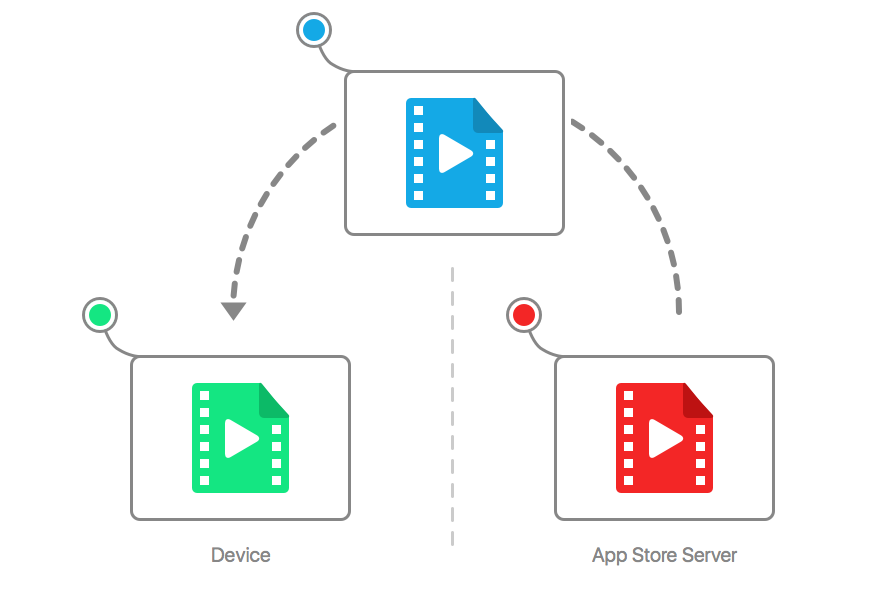
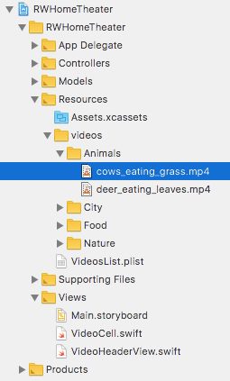
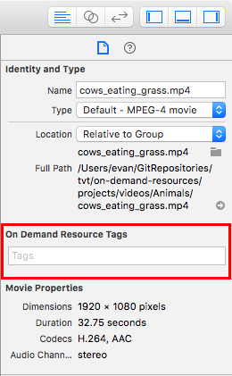
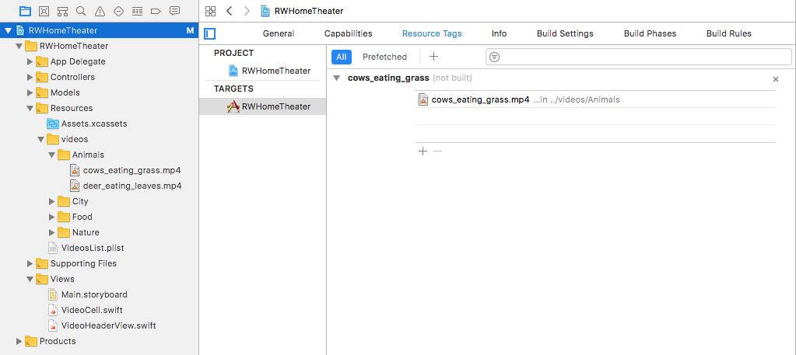
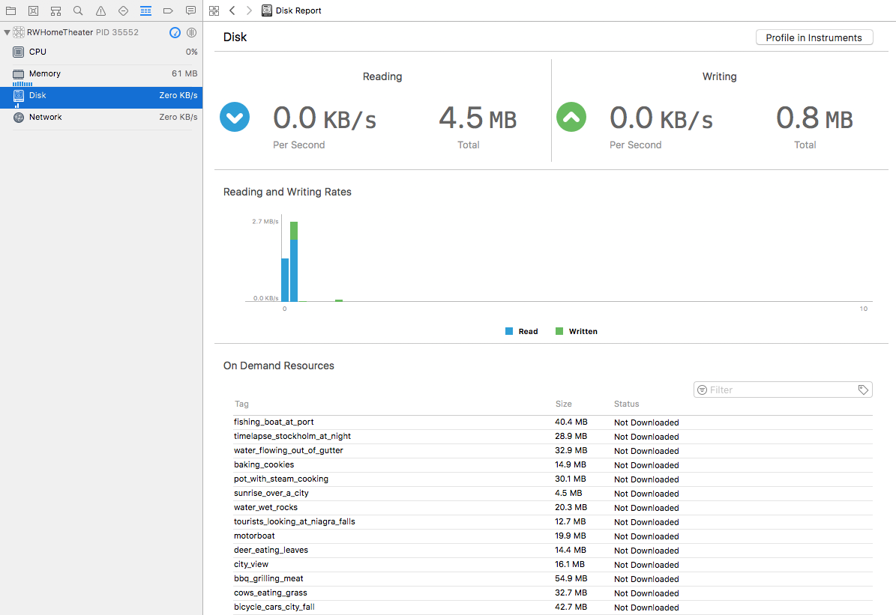
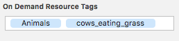

# 动态下载


## 简介 
默认情况下， tvOS 应用程序大小限制在 200m 内， 如果应许程序需要超过此限制，那么可以通过胴体啊下载的方式已实现------ 按需资源(ODR) . 原理就是应用程序仅在需要时检索所需的资源。   

针对文件主要包括 视频、图像、声音、3D 模型和着色器等资源 


__不能在 ODR 中包含 Swift、Objective-C 或 C++ 源代码__


#### 优点
* 更快的初始下载： 用户下载应用程序的速度越快，他们就会越快爱上它。 
* 较小的应用程序大小： 当存储空间有限时，最大的应用程序通常是用户最先删除的。您希望将应用程序的存储空间足迹隐藏起来！  


## NSBundleResourceRequest and Tags  

默认情况下， Bundle.main用作主要捆绑包， 应用中所有资源都包含在主包中。  

但是，当使用 ODR 时，下载的资源不在主包中；它们位于一个单独的包中，其中包含给定标签的所有资源。操作系统仅在需要时下载标签的资源。  


当请求标签时，操作系统会下载该标签的所有资源并将其存储在一个Bundle. 然后，无需使用主包来查找资源，只需查看这个替代包的内部即可。 


  

通过 `NSBundleResourceRequest` 发送请求， 以对应资源标签的字符串作为参数。 
加载资源后，可以使用资源请求的bundle属性访问包中的文件。
在完成请求后， 可以调用 `endAccessingResources()` 通知系统接触限制， 这让系统知道已经完成了资源的使用，并且可以在必要时删除它们。 


## 针对资源添加标签 

1. 找到项目中对应的资源文件 
      

2. 给资源文件添加标签 
      
    __避免标签重名__ 

3. 查看标签设置 
      

4. Xcode run 时查看标签对应资源状态
      


## 资源下载 
为了更方便的进行资源管理， 通过 `ResourceManager` 进行资源统一管理下载。   

1. 创建 `ResourceManager` 
    ```swift 
        class ResourceManager {
        static  let shared =  ResourceManager () 
        }
    ```

2. 创建对应的 request
    ```swift 
        
        func requestVideoWith(tag: String,
        onSuccess: @escaping () -> Void,
        onFailure: @escaping (Error) -> Void)
        -> NSBundleResourceRequest {

        
        let videoRequest = NSBundleResourceRequest(tags: [tag])
        videoRequest.loadingPriority
            = NSBundleResourceRequestLoadingPriorityUrgent // 优先级，系统知道用户正在等待内容加载并且应该尽快下载 优先级必须在 0.0 到 1.0 之间

        /** 开始加载资源， 异步操作的，下载完成，回调到主线程 */
        videoRequest.beginAccessingResources { error in
            OperationQueue.main.addOperation {
            if let error = error {
                onFailure(error)
            } else {
                onSuccess()
            }
            }
        }      
        
        return videoRequest
        }
    ```
3. 正确的设置bundle 获取资源
    默认情况下是通过 `Bundle .main` 获取资源，此处是通过 `ODR` 进行资源下载的，所以不在 `Bundle .main`中 。
    ```swift 
        static func videoFrom(dictionary: [String: String]) -> Video {
            let previewImageName = dictionary["previewImageName"]!
            let title = dictionary["videoTitle"]!
            let videoName = dictionary["videoName"]!
            return Video(previewImageName: previewImageName,
                title: title, videoName: videoName, videoURL: nil)
        }

    ```

4. 优化性能， 在选择时取消上一个请求，并请求心的资源 
    ```swift 
        var currentVideoResourceRequest: NSBundleResourceRequest？


        func  didSelectVideoAt ( _  indexPath : IndexPath ) {
        /** 1  */
        currentVideoResourceRequest ? .progress.cancel()
        /** 2  */
        guard  var video = collectionViewDataSource 
            .videoFor(indexPath: indexPath), let videoCategory = collectionViewDataSource 
            .videoCategoryFor(indexPath: indexPath) else {
            return 
        } 
        /** 3  */
        currentVideoResourceRequest = ResourceManager .shared 
            .requestVideoWith(tag: video.videoName,
            
        
            onSuccess: { [ weak  self ] in
                guard let currentVideoResourceRequest = self?.currentVideoResourceRequest else { return }
                /** 资源地址 */
                video.videoURL = currentVideoResourceRequest.bundle
                .url(forResource: video.videoName, withExtension: "mp4")
                let viewController = PlayVideoViewController
                .instanceWith(video: video, videoCategory: videoCategory)
                self?.navigationController?.pushViewController(viewController,
                animated: true)

            }, 
            onFailure: { [ weak  self ] error in
                self?.handleDownloadingError(error as NSError)
            } 
        ) 
        }


        /** 失败处理 */
        func handleDownloadingError(_ error: NSError) {
            switch error.code{
            case NSBundleOnDemandResourceOutOfSpaceError:
                let message = "You don't have enough storage left to download this resource."
                let alert = UIAlertController(title: "Not Enough Space",
                message: message,
                preferredStyle: .alert)
                alert.addAction(UIAlertAction(title: "OK",
                style: .cancel, handler: nil))
                present(alert, animated: true, completion: nil)
            case NSBundleOnDemandResourceExceededMaximumSizeError:
                assert(false, "The bundle resource was too large.")
            case NSBundleOnDemandResourceInvalidTagError:
                assert(false, "The requested tag(s) (\(currentVideoResourceRequest?.tags ?? [""])) does not exist.")
            default:
                assert(false, error.description)
            }
        }

    ```
    要检查应用程序是否正在使用按需捆绑包，请打开调试导航器并选择磁盘；选择的视频的状态列现在将显示“正在使用”。

5. 清除使用过后的资源 
    * 调用 `NSBundleResourceRequest` 的  `endAccessingResources()` 
        在合适的时机调用 `endAccessingResources`方法， 一般是在 用户看完视频后 或者 列表重新加载时。  
        ```swift 
            override  func  viewWillAppear ( _  animated : Bool ) {
                super .viewWillAppear(animated) 

                currentVideoResourceRequest ？.endAccessingResources() 
                currentVideoResourceRequest =  nil 
            }
        ```

    * dealloc 资源 


6. 优化用户体验，显示下载进度 
    通过 ` Key-Value Observing` 监测 NSBundleResourceRequest  
    
    ```swift 
    /**ResourceManager 添加属性*/
    let progressObservingContext: UnsafeMutableRawPointer? = nil

    /** 更改方法名，添加参数 progressObserver 参数 */
    func  requestVideoWith ( tag : String ,
    progressObserver : NSObject ?,
    onSuccess : @escaping () -> Void ,
    onFailure : @escaping ( Error ) -> Void ) -> NSBundleResourceRequest {
        if let progressObserver = progressObserver {
            videoRequest.progress.addObserver(progressObserver,
                forKeyPath: "fractionCompleted",
                options: [.new, .initial],
                context: progressObservingContext)
        }

    }


    /** 注意： 移除 kvo 监听 OperationQueue.main.addOperation 中*/ 
    if let progressObserver = progressObserver {
    videoRequest.progress.removeObserver(progressObserver,
        forKeyPath: "fractionCompleted")
    }

    ```
    实现 kvo 监听回调 
    ```swift 


        override func observeValue(forKeyPath keyPath: String?,
            of object: Any?,
            change: [NSKeyValueChangeKey : Any]?,
            context: UnsafeMutableRawPointer?) {

        if context == progressObservingContext
            && keyPath == "fractionCompleted" {

            OperationQueue.main.addOperation {
                self.progressView.progress
                = Float((object as! Progress).fractionCompleted)
            }
        }
        }


    ```


7. 预加载 
    通过对资源进行分类， 添加对应的分类标签， 当用户选择一个资源时，下载该类别下的所有资源。以优化用户体验 
      
    ```swift 

        func requestCategoryWith(tag: String)
            -> NSBundleResourceRequest {
        let currentCategoryBundleRequest
            = NSBundleResourceRequest(tags: [tag])
        currentCategoryBundleRequest.loadingPriority = 0.5
        currentCategoryBundleRequest
            .beginAccessingResources { error in }
        return currentCategoryBundleRequest
        }

    ```

    ```swift 
        var selectedIndexPath: IndexPath?
        var currentCategoryResourceRequest: NSBundleResourceRequest?

        if let selectedIndexPath = selectedIndexPath,
        selectedIndexPath.item + 1 == collectionView
            .numberOfItems(inSection: selectedIndexPath.section) {

        currentCategoryResourceRequest?.endAccessingResources()
        currentCategoryResourceRequest = nil
        }

    ```


## 不同类型的 标签
在 ODR 中，资源标签分为三种类型： 
* 初始安装标签 
    这些资源与应用程序一起下载，但可以在不再需要时清除 
    初始安装标签的一种可能用途是用于您在应用程序介绍期间需要的资源
* Prefetch Tag Order 
    这些资源在应用安装完成后，按照排列的顺序进行依次下载 
* 按需下载 
    这与本教程中一直使用的类型相同;它们仅在您请求时下载。