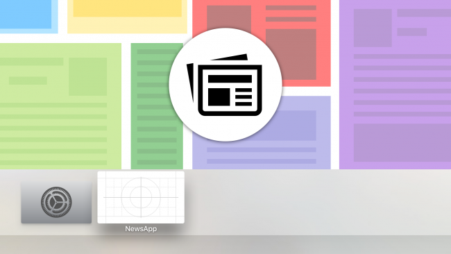
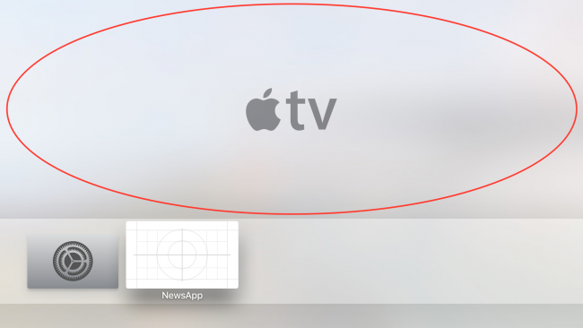
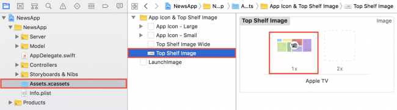
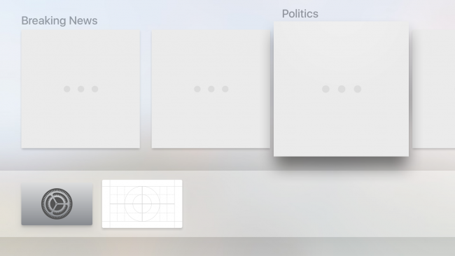
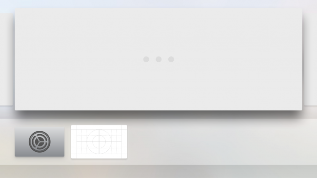
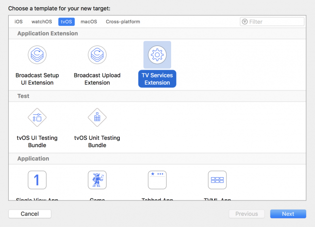
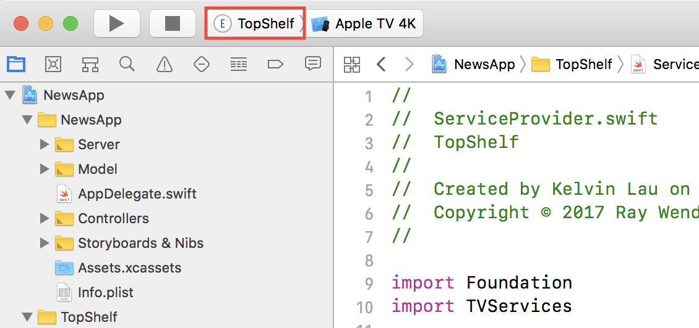
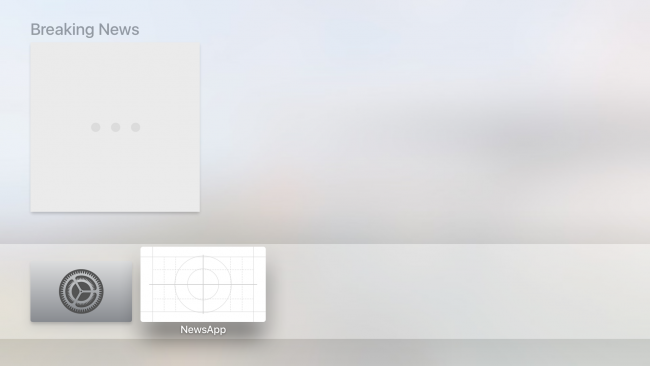
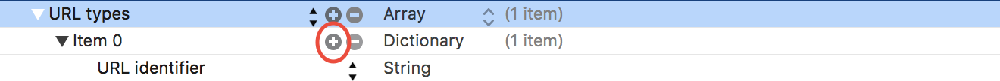
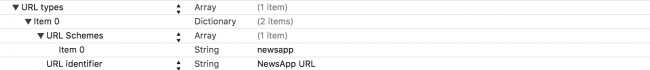

# Top Shelf 


## 简介
在安装到用户的 Apple TV 的众多应用程序中，有五个应用程序的地位较高。  
用户明确选择这些应用程序驻留在他们的 Apple TV 屏幕上的特权位置：__最上面的架子__
这个空间为您（开发者）提供了一个展示您的应用程序的机会。将顶层搁板想象成一个广告牌，用于展示您应用中的出色内容。
当顶行中的顶级应用程序之一选中时，用户电视的整个上半部分会填充一个或多个横幅以吸引用户：
  


在本教程中，您将学习如何掌握顶级货架，并让您未来的 tvOS 大片应用程序在市场上比其他应用程序更具决定性优势！  


## 入门 
  

### 静态显示图像 
与应用相关的高质量 1920 x 720图片 
将此图像拖放到Top Shelf Image隔间中的Assets.xcassets文件夹中。为简单起见，只需添加@1x图像分辨率：
  

> 在上传用于分发的版本之前，还需要提供顶层图片的宽幅版本，其尺寸为 2320 像素 x 720 像素。


### 交互式顶层货架 
目前有两种不同的交互式顶架布局：分段式顶架和嵌入式顶架

#### 分段式
顾名思义，就是将内容分成几部分的顶层货架。 
  

分段式顶层搁板非常适合展示组合在一起时有意义的信息；这使的新闻类应用为其展示每个新闻主题的热门新闻文章的绝佳选择。一般来说，如果应用程序的目的是尽快向用户提供信息，则分段布局是一个不错的选择。


#### 嵌入式
嵌入的顶部搁板非常适合展示应用的总体主题，尤其是当您的应用是游戏时。 每个项目都被赋予了屏幕的整个宽度，以向用户展示应用中的功能。
  


这两种布局都允许用户滚动和浏览应用内容——而且它们非常容易实现


### 交互式实现方式
__通过  TV Services Extension(TV Top Shelf Extension)  的方式实现__ 

  


1. TVTopShelfProvider 
    当创建新的 TV Services Extension 目标时，Xcode 会自动生成新目标以及一个名为`ServiceProvider.swift`的新文件。此文件包含`ServiceProvider`类，您将在其中定义交互式顶层货架的界面。 
    * `topShelfStyle`: 变量定义了您想要呈现给用户的顶层货架类型：分段布局或嵌入布局 
        ```swift 
            var topShelfStyle: TVTopShelfContentStyle {
            return .sectioned
            }
        ```
    * `topShelfItems`: 顾名思义，将定义给定布局的顶部架子中的 UI 元素     
        ```swift 
            
            var topShelfItems: [TVContentItem] {
                /***/  
                let breakingNewsIdentifier = TVContentIdentifier(identifier:
                    "Breaking News", container: nil)!
                let breakingNewsSection = TVContentItem(contentIdentifier:
                    breakingNewsIdentifier)!
                breakingNewsSection.title = "Breaking News"

                /***/  
                let martianRiotIdentifier = TVContentIdentifier(identifier:
                    "Martian Riot", container: nil)!
                let martianRiotItem = TVContentItem(contentIdentifier:
                    martianRiotIdentifier)!

                /***/  
                breakingNewsSection.topShelfItems = [martianRiotItem]

                return [breakingNewsSection]
            }


        ```

2. 测试
      
      


3. 添加用户交互 
    在用户选择顶部货架中的任何内容时调用`AppDelegate.swift` 中的`application(_:open:options)`. 但前提是必须设置`displayURL`或`playURL`. 最上面的架子可以监听遥控器上的两个事件：按下触摸屏和按下播放按钮。
    给向应用程序的Info.plist文件添加一个新值------URL 类型(__必须是应用程序而不是Extensions__) . 
      
      

    * 更新 `ServiceProvider.swift` . 
        ```swift 

        private func urlFor(identifier: String) -> URL {
        var components = URLComponents()
        components.scheme = "newsapp"
        components.queryItems = [URLQueryItem(name: "identifier",
                                                value: identifier)]

        return components.url!
        }
        ```
    * 给对应的 `topShelfItems` 每个元素添加 `displayURL` 
        ```swift 
            cometItem.displayURL = urlFor(identifier: "comet" ) 

            asteroidItem.displayURL = urlFor(identifier: "asteroid" )

        ```

    * 根据不同的URL 跳转到对应的的 tab 
        ```swift 
        
        func application(_ app: UIApplication, open url: URL,
            options: [UIApplicationOpenURLOptionsKey: Any] = [:])
            -> Bool {
        guard let initialViewController = window?.rootViewController
            as? UITabBarController else { return false }

        let urlString = url.absoluteString
        switch urlString {
        case "newsapp:?identifier=martianRiot":
            initialViewController.selectedIndex = martianTab
        case "newsapp:?identifier=comet",
            "newsapp:?identifier=asteroid":
            initialViewController.selectedIndex = milkyWayTab
        default:
            return false
        }
        return true
        }


        ```


