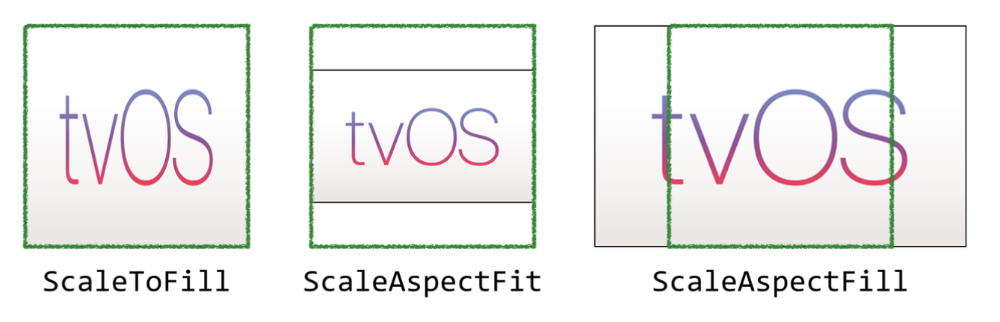
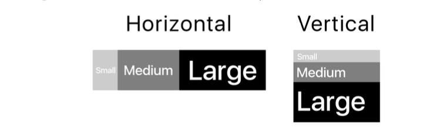
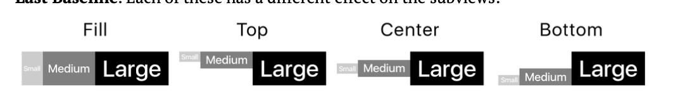
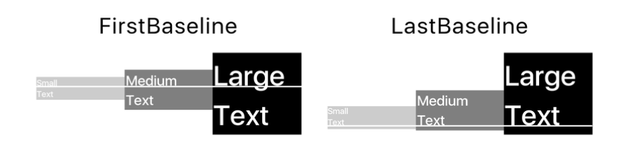
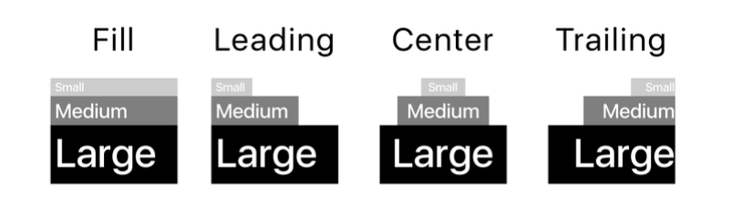
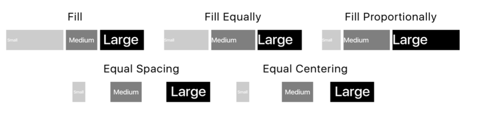
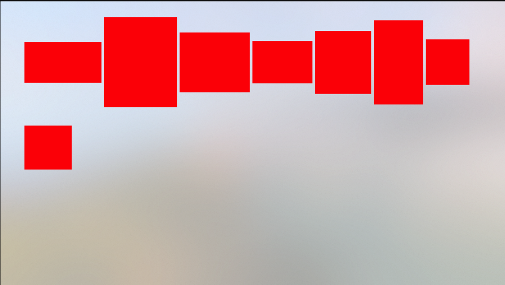
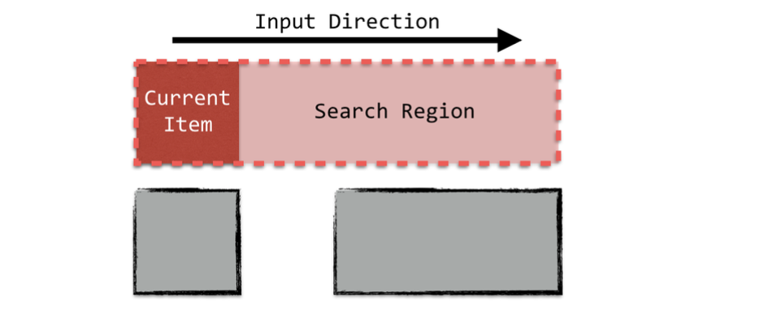
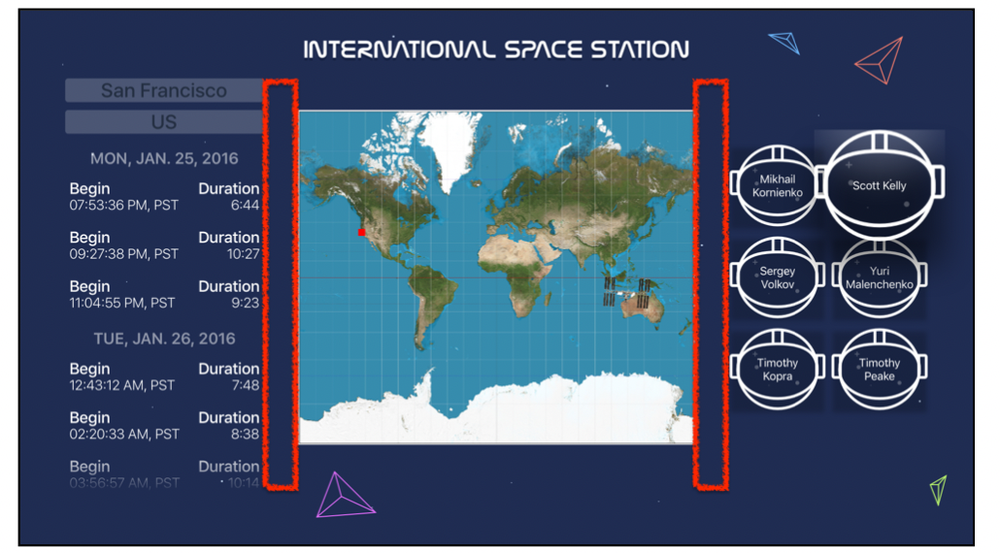

# Traditional App 


## UI 
1. 界面样式 
    Apple引入了根据用户在明暗之间的视觉偏好自定义用户界面的概念。通过 ` Info.plist.` 中进行自定义设置 
    
    ```
    User Interface Style: Automatic /Light/ Dark

    ```

2. 代码更改样式(__全局的__)
    __在全局有效，但不允许更精细的自定义__
    ```swift

    /** 1 */
    if #available(tvOS 10.0, *) {
        /** 2 */
        let light = UITraitCollection(userInterfaceStyle: .light)
        let dark = UITraitCollection(userInterfaceStyle: .dark)
        /** 3 */
        UILabel.appearance(for: light).textColor = .blue
        UILabel.appearance(for: dark).textColor = .red
    }

    ```
3. UIViewController 级别进行更加精细的UI 控制 
    ```swift 

    override func traitCollectionDidChange(_ previousTraitCollection: UITraitCollection?) {
        super.traitCollectionDidChange(previousTraitCollection)
        if #available(tvOS 10.0, *) {
            guard traitCollection.userInterfaceStyle != previousTraitCollection?.userInterfaceStyle else {return}

            switch traitCollection.userInterfaceStyle {
            case .light:
                label.textColor = .black
            case .dark:
            label.textColor = .green
            default:
                return
            } 
        }
    }

    ```


 ## Basic Controls 
 * UITextField 
 * UISegmentedControl 
 * UILabel
 * UIButton 
 * UIImageView 
      

* UIActivityIndicatorView 
* UIProgressView 
* UIPageControl 
* UITextView 

* UIStackView 
    具有四种不同的可自定义属性，这些属性会影响其子视图的布局方式：
    * Axis
        确定子试图的布局方向 Vertical and Horizontal。
          

    * Alignment     
        对其方式 
        * horizontal stack view 的四种对其方式：
              
            两种特殊的对其方式：
              
        *  vertical 纵向的对其方式： 
              

    * Spacing
        视图中相邻视图之间的距离。 此属性根据堆栈视图的`distribution`而有所不同。 它是绝对距离，或者是子视图之间允许的最小间距

    * Distribution
          


* UICollectionView 
    ```swift 

        /** MARK: - UICollectionViewDelegateFlowLayout */
        extension MovieCollectionViewController:
        UICollectionViewDelegateFlowLayout {
        /** 1 */
        func collectionView(_ collectionView: UICollectionView,
            layout collectionViewLayout: UICollectionViewLayout,
            sizeForItemAt indexPath: IndexPath) -> CGSize {
            /** 2 */
            let width = CGFloat(150 + arc4random_uniform(200))
            let height = CGFloat(150 + arc4random_uniform(200))
            return CGSize(width: width, height: height)
        }
        /** 3 */
        func collectionView(_ collectionView: UICollectionView,
            layout collectionViewLayout: UICollectionViewLayout,
            insetForSectionAt section: Int) -> UIEdgeInsets {
            return UIEdgeInsets(top: 0, left: 90, bottom: 70, right: 90)
        }
        }


    ```
      

    选中效果 

    ```swift 


        override func collectionView(_ collectionView: UICollectionView,
            willDisplay cell: UICollectionViewCell,
            forItemAt indexPath: IndexPath) {

        cell.alpha = 0.0

        UIView.animate(withDuration: 1.0) {
            cell.alpha = 1.0
        }
        }


        override func collectionView(_ collectionView: UICollectionView,
            willDisplaySupplementaryView view: UICollectionReusableView,
            forElementKind elementKind: String,
            at indexPath: IndexPath) {

        view.frame.origin.x += 50
        view.alpha = 0.0

        UIView.animate(withDuration: 1.0) {
            view.frame.origin.x -= 50
            view.alpha = 1.0
        }
        }

    ```


## Navigatoion 
1. 通过 Segue 进行跳转 
    ```swift 
    private let detailSegueIdentifier = "DetailSegue"
    override func collectionView(_ collectionView: UICollectionView,
    didSelectItemAt indexPath: IndexPath) {
    performSegue(withIdentifier: detailSegueIdentifier,
        sender: nil)
    }

    ```
    传递数据 
    ```swift 


    override func prepare(for segue: UIStoryboardSegue,sender: Any?) {
        if let destinationViewController =
        segue.destination as?
        MovieDetailViewController, let selectedIndex =
        collectionView?.indexPathsForSelectedItems?.first {
        
        let sectionMovies = moviesForSection(selectedIndex.section)
        destinationViewController.movie =
            sectionMovies[selectedIndex.item]

        }
    }
    ```

2. UISplitViewController 
3. TabViewController 


## Focus 
焦点引擎根据用户的输入决定将焦点移动到何处。它在运动路径中创建一个搜索区域，以查找所有可聚焦的内容。此路径的宽度与当前焦点视图的大小直接相关
  

* UIFocusGuide
    可以将 UIFocusGuide 类相当于一个不可见的 view ，来引导 focus 引擎指定到 正确的 view 上去。通过 UIFocusGuide 可以拦截 focus 事件，并将其重定向到对应的view 上 
    * 定义对应的 UIFocusGuide
        ```swift 
        var leftFocusGuide = UIFocusGuide()
        var rightFocusGuide = UIFocusGuide()
        ```
    * 添加辅助约束方法 
          

        ```swift 
        func setupFocus() {
            view.addLayoutGuide(leftFocusGuide)
            leftFocusGuide.leftAnchor.constraint(
                equalTo: cityTextField.rightAnchor).isActive = true
            leftFocusGuide.topAnchor.constraint(
                equalTo: cityTextField.topAnchor).isActive = true
            leftFocusGuide.bottomAnchor.constraint(
                equalTo: tableView.bottomAnchor).isActive = true
            leftFocusGuide.rightAnchor.constraint(
            equalTo: mapView.leftAnchor).isActive = true
            view.addLayoutGuide(rightFocusGuide)
            rightFocusGuide.leftAnchor.constraint(
                equalTo: mapView.rightAnchor).isActive = true
            rightFocusGuide.topAnchor.constraint(
                equalTo: cityTextField.topAnchor).isActive = true
            rightFocusGuide.bottomAnchor.constraint(
                equalTo: tableView.bottomAnchor).isActive = true
            rightFocusGuide.rightAnchor.constraint(
                equalTo: collectionView.leftAnchor).isActive = true
            }

        ```
    * 为每个 focus guide 设置 preferredFocusEnvironments
        此属性定义当指南聚焦时焦点将重定向到的位置。通常需要根据焦点的来源更改此属性，需要在焦点更改时保持更新。通过实现`didUpdateFocus(in:with:)`代理方法， 每次系统将焦点更新到新视图时，都会调用此方法。

        ```swift

        override func didUpdateFocus(in context: UIFocusUpdateContext,
        with coordinator: UIFocusAnimationCoordinator) {
        super.didUpdateFocus(in: context, with: coordinator)
        /**1  确保焦点上下文具有下一个焦点视图*/ 
        guard let nextFocusedView = context.nextFocusedView else {
        return
        }
        switch nextFocusedView {
        /** 2 然后检查下一个视图是否是文本字段之一。如果是这样，请更新左侧焦点指南以重定向到集合视图*/
        case cityTextField, countryTextField:
            leftFocusGuide.preferredFocusEnvironments = [collectionView]
        /** 3 */
        case is FlyByCell:
            leftFocusGuide.preferredFocusEnvironments = [collectionView]
        /** 4 设置正确的焦点guide 以重定向回以前获得焦点的视图 */
        case is PersonCell:
            if let previousFocusedView = context.previouslyFocusedView {
            if previousFocusedView is FlyByCell {
                rightFocusGuide.preferredFocusEnvironments = [tableView]
            } else if previousFocusedView is UITextField {
                rightFocusGuide.preferredFocusEnvironments =
                [previousFocusedView]
            }
        } default:
        break
        } }

        ``` 


#### Collection and table view focus
UICollectionView and UITableView 有类似的代理方法，用于处理 focus 事件 
* collectionView(_:canFocusItemAt:): 允许您指定哪些索引路径可以接收焦点。  
* collectionView(_:shouldUpdateFocusIn:): 提供有关焦点更改的信息
* collectionView(_:didUpdateFocusIn:with:): 在焦点更新后调用，这可以自定义其焦点动画。
* indexPathForPreferredFocusedView(in:): 指定要在集合视图中聚焦的默认索引路径。

```swift
func indexPathForPreferredFocusedView(in tableView:
  UITableView) -> IndexPath? {
  let lastSection = tableView.numberOfSections - 1
  let lastRow = tableView.numberOfRows(inSection:
    lastSection) - 1
  return IndexPath(row: lastRow, section: lastSection)
}
```
每当表视图成为焦点时，此方法都会执行, 默认实现是返回第一行

```swift
func tableView(_ tableView: UITableView, didUpdateFocusIn
  context: UITableViewFocusUpdateContext, with
  coordinator: UIFocusAnimationCoordinator) {
  // 1
  if let previousCell = context.previouslyFocusedView as?
    FlyByCell {
    previousCell.setLabelColor(.white)
  }
// 2
  if let nextCell = context.nextFocusedView as? FlyByCell {
    nextCell.setLabelColor(.black)
  }
}

```
此方法在焦点更新到表视图中的某个单元格后调用

* remembersLastFocusedIndexPath : 此属性可以让 collection 记住上次焦点的位置，并将其设置为首选的焦点视图 

```swift
// setupFocus() 方法中添加
collectionView.remembersLastFocusedIndexPath = true

```

* focus 的放大效果 
```swift 
// MARK: UICollectionViewDelegate
extension ViewController: UICollectionViewDelegate {
  func collectionView(_ collectionView: UICollectionView,
      didUpdateFocusIn context:
      UICollectionViewFocusUpdateContext,
      with coordinator: UIFocusAnimationCoordinator) {
    if let nextFocusedView = context.nextFocusedView {
      collectionView.bringSubview(toFront: nextFocusedView)
    }
} }
``` 
在焦点更新到集合视图中的某个单元格后调用,从上下文对象获取下一个焦点单元格，并将其置于视图层次结构的前面。  


### Custom focus behavior 

UIFocusEnvironment 协议定义了一个计算属性 preferredFocusedView，该属性决定在焦点更新期间是否应聚焦实现视图或其子视图之一。UIView 子类的默认返回值是自身，而 UIViewController 返回其根视图。


```swift
// 更改默认的 focus 视图
override var preferredFocusedView: UIView? {
  return stationMarker
}
lazy var stationMarker: FocusImageView = {
  let markerView = FocusImageView(image: UIImage(named: "ISS"))
... }
``` 
这使得ViewController默认聚焦于stationMarker而不是其主视图。

```swift
import UIKit
class FocusImageView: UIImageView {
    // 1
override init(image: UIImage?) {
  super.init(image: image)
  // 2
  isUserInteractionEnabled = true
  // 3
  adjustsImageWhenAncestorFocused = true
}
// 4
required init?(coder aDecoder: NSCoder) {
  super.init(coder: aDecoder)
}
}

extension FocusImageView {
override var canBecomeFocused: Bool {
return true
}

}

```


* self.setNeedsFocusUpdate() 更新焦点


#### Animating focus changes 
UIFocusAnimationCoordinator 类在焦点更新期间协调自定义动画和系统动画。 


```swift

// 禁用默认的动画样式
adjustsImageWhenAncestorFocused = false

// 1 coordinator 执行动画
override func didUpdateFocus(in context: UIFocusUpdateContext,
  with coordinator: UIFocusAnimationCoordinator) {
  // 2
  if context.nextFocusedView == self {
// 3
    coordinator.addCoordinatedAnimations({ () -> Void in
      self.transform = CGAffineTransform.identity.scaledBy(x: 2,
        y: 2)
    }, completion: nil)
    // 4
  } else if context.previouslyFocusedView == self {
    coordinator.addCoordinatedAnimations({ () -> Void in
      self.transform = CGAffineTransform.identity
    }, completion: nil)
} }


```


### Debugging focus events

通过设置断点`didUpdateFocus(in:with:) `，来查看 focus 决策的过程 


#### UIFocusDebugger 
`po UIFocusDebugger.status()`
`po UIFocusDebugger.simulateFocusUpdateRequest(from: tableView)`
可以使用此命令模拟在任何给定时间以编程方式从特定视图请求焦点更新时会发生什么情况。  

`po UIFocusDebugger.checkFocusability(for: cityMarker)`
当您无法弄清楚为什么视图不会成为焦点时，您将看到的最后一个命令非常有用。


