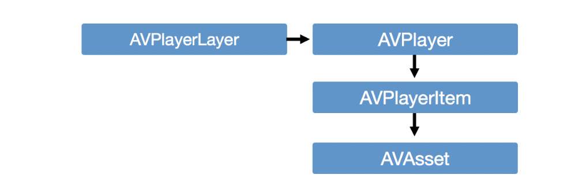

## Video Playback


#### AVKit 简介
  
* AVPlayer提供视频接口并管理AVPlayerItem。 
* AVPlayerItem 存储视频设置，并具有对 AVAsset 的引用。
* AVAsset 是音频和视频数据的模型 


#### AVKit 最佳实践
1. 当需要有关 AVAsset 实例的信息（如持续时间、元数据或任何其他属性）时，应首先调用 `loadValuesAsynchronously(forKeys:completionHandler:)`以确保异步加载值。如果不这样做，可能会提前下载整个视频资源，并可能早地将数据加载到内存中，这两者都可能导致应用性能不佳。

2. `loadValuesAsynchronously(forKeys:completionHandler:)` 无法加载通过 URL 创建的远程资源信息。应该通过`statusOfValue(forKeys:completionHandler:)`在使用之前检查键的状态。 

3. `loadValuesAsynchronously(forKeys:completionHandler:)` 次方发最好一次查询多个值，而不是每个调用一次。 比单独加载它们要高效得多。 


### AVFoundation
  


1. 处理遥控器上的 暂停/播放 事件
```swift 
lazy var playPauseGesture: UITapGestureRecognizer = {
  let playPauseGesture = UITapGestureRecognizer(target: self,
    action: #selector(playPausePressed(_:)))
  let playPauseType = NSNumber(
    value: UIPressType.playPause.rawValue)
  playPauseGesture.allowedPressTypes = [playPauseType];
  return playPauseGesture
}()
@objc private func playPausePressed(
    _ gesture: UITapGestureRecognizer) {
    guard let queuePlayer = queuePlayer else {
        return
    }
    if queuePlayer.rate == 0 {
        queuePlayer.play()
    } else {
        queuePlayer.pause()
    }
}
```
