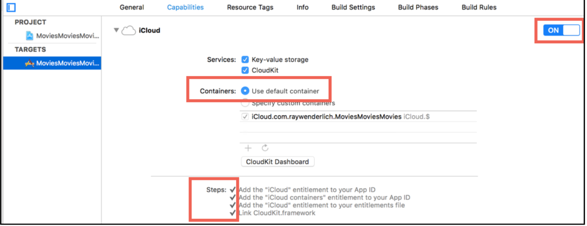

# CloudKit 
tvOS 应用捆绑包的最大大小为 4 GB。此外，你的应用只能访问设备本地的 500 KB 持久存储（使用 NSUserDefaults 类）
在此有限的本地存储之外，当空间不足时，操作系统必须可清除所有其他数据 


### 配置 cloud kit 
需要一个全局唯一的名称，默认为 bundle identifier。 
设置 iCloud 
  


### 使用 
1. 创建对应的额 record 对象 
    ```swift
        var record: CKRecord {
        let record = CKRecord(recordType: MovieRecordType)
        record.title = title
        record.synopsis = synopsis
        record.year = year
        return record
        }
    ```

2. 插入数据 
    ```swift 
    func createNewMovie(_ movie: Movie,
                        handler: @escaping (CKRecord) -> Void) {
    let movieRecord = movie.record
    publicDatabase.save(movieRecord) { record, error in
        guard let record = record, error == nil else {
        showError(error, inController: nil)
    return
    }
        handler(record)
    }
    }
    ```


3. 查询
    ```swift 
    func movieForTitle(_ title: String,completion: @escaping (CKRecord?, Error?) -> ()) {
        let titlePredicate = NSPredicate(format: "title == %@", title)
        let query = CKQuery(recordType: MovieRecordType, predicate: titlePredicate)
        publicDatabase.perform(query, inZoneWith: nil) { records,
            error in
            guard let records = records, records.count > 0 && error == nil else {
                completion(nil, error)
                return
            }
            let record = records[0]
            completion(record, nil)
        } 
    }
    ```


```swift
func checkAccountStatus(_ completion:
  @escaping (CKAccountStatus) -> Void) {
  container.accountStatus { status, error in
    if error != nil {
      showError(error, inController: nil)
    }
    DispatchQueue.main.async {
      completion(status)
    }
} }

init() {
  NotificationCenter.default.addObserver(
    forName: .CKAccountChanged, object: nil, queue: nil)
  { [weak self] _ in
    DispatchQueue.main.async {
      NotificationCenter.default
        .post(name: MyMovieNotification, object: self)
    }
} }


``


