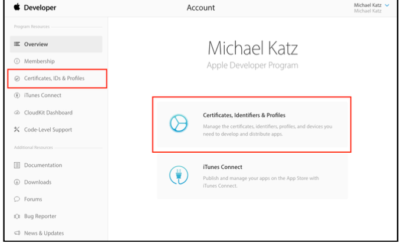
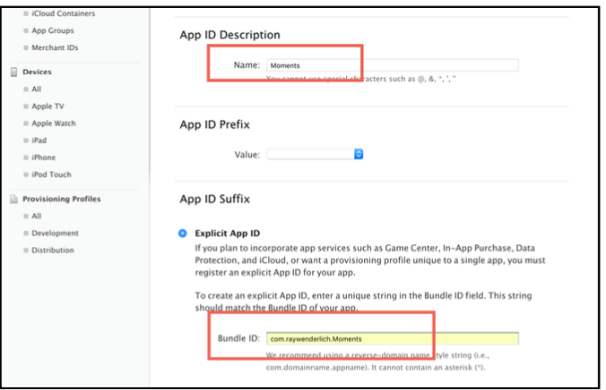
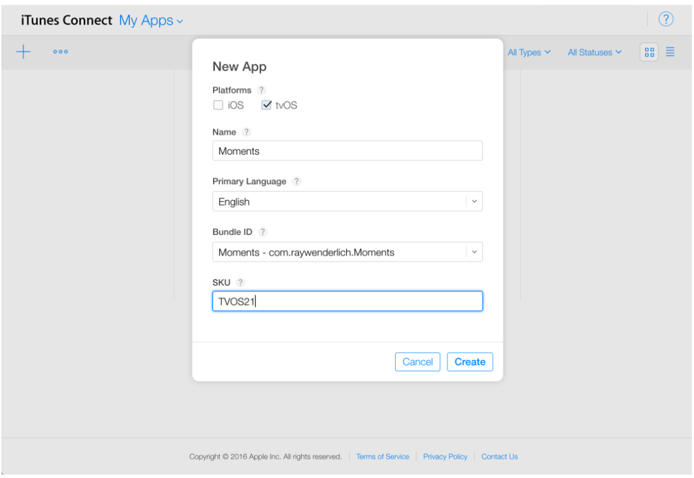
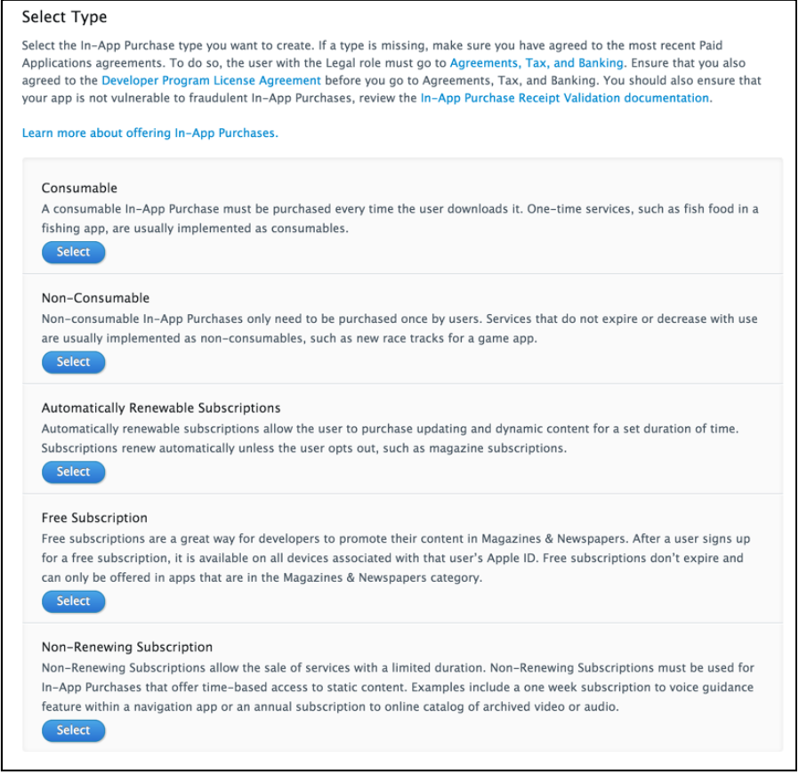
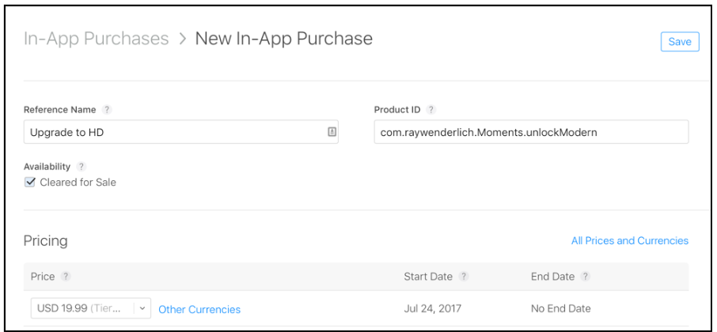
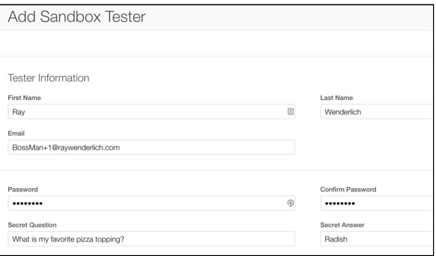

# 应用内购 


## 添加非消耗性购买 
1. 设置 bundle identifier
  
  

2. 设置 [iTunes Connect](https://itunesconnect.apple.com/)
  

3. 创建非消耗性
    * 从“我的应用”中选择新创建的应用
    * 选择`Features`选项卡;可以在此处添加应用内购买。
    * 单击 + 按钮添加新的应用内购买项目 
          
    * select Non-Consumable.
          

4. 添加逻辑功能代码 
    ```swift 


    ```


## 测试用户 
1. 返回iTunes Connect。
2. 选择用户和角色。
3. 在选项卡栏中，选择沙盒测试人员。
4. 单击 + 创建新的测试帐户。(这回创建一个新的真实用户) 
5. 输入测试用户的信息
    可以在用户名中添加“+”，以便为同一电子邮件帐户创建新的 Apple ID。
      


### 问题处理 
* 使用的是实际的 Apple TV 设备，而不是模拟器。
* 应用程序的捆绑 ID 与 ITC 中的捆绑 ID 匹配。
* 团队设置正确。
* 产品标识符与 ITC 中设置的产品标识符匹配。
* 您已输入所有税务信息并接受 ITC 中的所有合同和协议。
* 您使用了沙盒测试凭据，并在购买过程中输入了这些凭据。