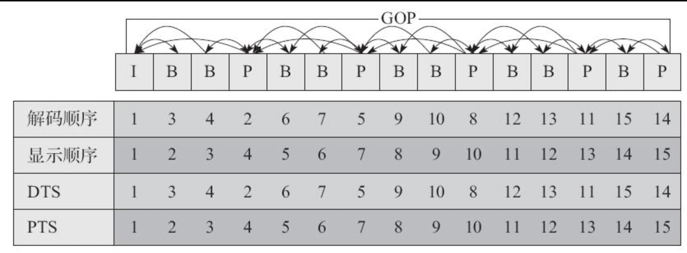

# 音视频基础概念  

## 音频基础  
* 声音: 声音是由于物体振动对周围空气产生挤压，从而产生声音。__声音是一种压力波__.  
* 声波： 声波的三要素__频率，振幅,波形__.频率代表音阶的高低，振幅代表响度，波形代表音色。   
  * 频率越高，波长越短。低频波长较长，很容易绕开障碍物，因此能量衰减较小， 声音会传的更远  

#### 数字音频  
* 采样： 在时间轴上对信号进行数字化。
* 44.1kHZ: 根据奈奎斯特定理（也称为采样定理），按比声音最高频率高2倍以上的频率对声音进行采样.人耳能听到的频率范围 20Hz ~ 20kHz,所以一般采样频率为  44.1kHZ. __本质是一秒钟采样44100次__  
* 量化： 在幅度轴上对信号进行数字化。比如用16比特的二进制信号来表示声音的一个采样，而16比特（一个short）所表示的范围是［-32768，32767］，共有65536个可能取值，因此最终模拟的音频信号在幅度上也分为了65536层

* 编码：按照一定的格式记录采样和量化后的数字数据。

#### 音频编码  
    主要是去除冗余信息，从而实现数据的压缩     
* 压缩  
    * 有损压缩 
    * 无损压缩： 压缩后的数据可以完全恢复  
#####  常见格式  
* WAV 编码 
    在PCM(脉冲编码调制)数据格式的前面加上44字节，分别用来描述PCM的采样率、声道、数据格式等   
    * 特点： 音质非常好 
    * 使用场景： 多媒体开发中的中间文件、保存音乐和素材  
* MP3 编码  
    使用 LAME编码  
    * 特点： 音质在 128Kbit/s以上表现不错，压缩比比较高，兼容性豪  
    * 使用场景： 高比特率下对兼容性有要求的音乐  

* AAC编码  
    有损压缩技术，它通过一些附加的编码技术（比如PS、SBR等），衍生出了LC-AAC、HE-AAC、HE-AAC v2三种主要的编码格式。
    * LC-AAC： 传统 AAC， 主要应用于中高码率场景(>=80Kbit/s)  
    * HE-AAC: 主要用于中低码率（<= 80Kbit/s）  
    * HE-AAC V2: 主要用于低码率(<= 48Kbit.s)   
    * 特点： 在 小于128Kbit/s的码率下表现优异， 并且多用于视频中的音频编码  
    * 使用场景： 多用于视频中音频轨道的编码  
* OGG  
    在各种码率下都表现不错，尤其中低码率下。  
    * 特点： 兼容性不豪，流媒体特性不支持  
    * 使用场景： 语音聊天中的音频消息场景  

## 图像  

#### 图像数值表示 
* RGB  
    * 浮点表示： 取值范围在 `0.0 ~ 1.0`，在 OpenGL ES 中就是采用此种方式实现的  
    * 整数表示： 取值范围 `0 ~ 255` 或者 `00 ~ FF`, 8 个比特表示一个子像素， 32 比特表示一个像素
* YUV  
    主要应用于视频帧的裸数据表示。应用于优化彩色视频信号的传输。 
    只占用极少的频宽   
    * Y: 表示明亮度，灰阶值  
    * U/V: 表示色度， 描述影响的色彩和饱和度  

YUV----> RGB: 
`CMSampleBufferRef` 后，调用`CVBufferGetAttachment`决定采用那个矩阵进行转换   

#### 视频编码   
    视频压缩是通过去除冗余信息来进行压缩的， 相较于音频数据， 视频数据又极强的相关性，包括空间上的冗余信息和时间上的冗余信息    

* 时间上的冗余  
    使用帧间编码技术可以去除时间上的冗余  
    * 运动补偿：运动补偿是通过先前的局部图像来预测、补偿当前的局部图像， 它是减少帧序列冗余信息的有效方法      
    * 运动表示：不同区域的图像需要使用不同的运动矢量来描述运动信息   
    * 运动估计：运动估计是从视频序列中抽取运动信息的一整套技术   

* 空间上的冗余  
    使用帧内编码技术可以去除   

#### 编码概念  
1. IPB 帧  
    * I帧： 帧内编码帧， 通常是每个 GOP 的第一帧，经过适度的压缩，作为随机访问的参考点，可以当成静态图像。   
    * P帧： 前向预测编码帧， 需要参考前面的一个 I 帧或者 P 帧来解码成一张完整的视频画面  
    * B帧： 双向预测内插编码帧， 需要参考前面的一个 I 帧或者 P 帧，以及后面的一个 P 帧来生成一个完整的视频画面。   
    __p 帧和 b 帧去掉的是视频帧在时间维度上的冗余信息__  

    > 一般来说 ，I的压缩率是7（与JPG差不多），P是20，B可以达到50，可见使用B帧能节省大量空间，节省出来的空间可以用来更多地保存I帧，这样就能在相同的码率下提供更好的画质

2. IDR帧 
    H264采用了多帧预测，所以I帧之后的P帧有可能会参考I帧之前的帧，这就使得在随机访问的时候不能以找到I帧作为参考条件，因为即使找到I帧，I帧之后的帧还是有可能解析不出来，而IDR帧就是一种特殊的I帧，即这一帧之后的所有参考帧只会参考到这个IDR帧，而不会再参考前面的帧  
    __解码器中，一旦收到了一个 IDR 帧，就会立即清理参考帧缓冲区__  

3. PTS / DTS  
    * DTS(Decoding Time Stamp): 主要用于视频的解码 
    * PTS(Presentation Time Stamp): 主要用于在解码阶段进行视频的同步和输出  
    __在没有B帧的情况下，DTS和PTS的输出顺序是一样的。因为B帧打乱了解码和显示的顺序，所以一旦存在B帧，PTS与DTS势必就会不同__  

  
> 编解码和DTS/PTS 的关系原理   

