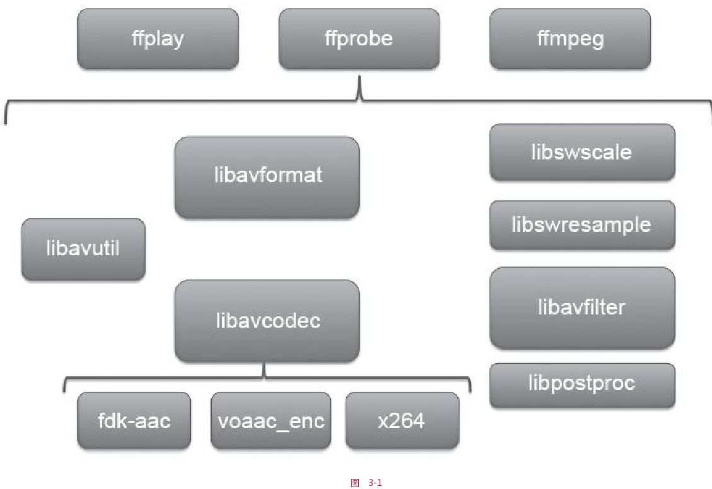

# 音视频渲染(iOS)  


## 音频
### AudioUnit 介绍及事件  
  

#### 应用场景  
1. 想要使用低延迟的音频 I/O   
2. 多路声音的合成并且回放， 比如游戏或者音乐合成器的应用   
3. 使用AudioUnit 提供的特有功能： 回声消除、Mix两轨音频、均衡器、压缩器、混响器等   
4. 需要图装结构来处理音频， 可以将音频处理魔魁啊组装到灵活的图状结构中    

#### AudioSession  
__用于管理与获取iOS设备音频硬件信息__  

```objective-c
/** 
* 获取单例对象  
* 设置硬件功能  
* 设置I/O 的buffer，越小说明延迟越低   
* 设置采样率    
* 激活session  
 */
AVAudioSession *session = [AVAudioSession sharedInstance];

[session setCategory:   AVAudioSessionCategoryPlayAndRecord error:&error]; 

[session setPreferredIOBufferDuration:0.002 error:&error]; 

diyvke hwSampleRate = 44100.0;
[session setPreferredSampleRate:hwSampleRate error:&error]; 

[session setActive:YES error:&error];
```

#### AudioUnit  
构建session之后，开始构建AudioUnit . 需要指定类型、子类型、厂商。   

```Objective-C
// 实例： RemoteIO类型的AudioUnit 

AudioComponentDescription desc; 
desc.componentType = kAudioUnitType_Output; 
desc.componentSubType = kAudioUnitSubType_RemoteIO; 
desc.componentManufacturer = kAudioUnitManufacturer_Apple;
desc.componentFlags = 0; 
desc.componentFlagsMask = 0;


```
具体构建AudioUnit 两种方式：  
* 直接使用AudioUnit 创建  
    ```
    AudioComponent ioUnitRef = AudioComponentFindNext(NULL, & desc); 
    AudioUnit io; 
    AudioComponentInstanceNewioUnitRef,&io);

    ```

* 使用AUGraph和AUNode(一个AUNode就是对AudioUnit的封装，可以理解为AudioUnit的Wrapper)构建  __推荐__  
    ```
    AUGraph graph;  
    NewAUGraph(& graph); 

    // 增加 Node  
    AUNode node;
    AUGraphAddNode(graph, &desc, & node); 

    // 打开 graph， 必须在获取 Audio Unit之前打开，否则无法获取  
    AUGraphOpen(graph); 

    // 获取  
    AudioUnit unit; 
    AUGraphNodeInfo(graph, node, NULL, &unit);

    ```

#### 通用参数  
RemoteIO 分为两个 Element: 
* Element0:
    控制输出端  
    * Input Scope 
    * Output Scope  
    如果使用扬声器播放声音，需要将 `Output Scope` 与Speaker 相连接    
    ```Objective-C
        // 连接  
        OSStatus status = noErr; 
        UInt32 oneFlag = 1; 
        UInt32 busZero = 0 // Element0 
        status = AudioUnitSetProperty(unit, kAudioOutputUnitProperty_EnableIO, kAudioUnitScope_Output, busZero, &oneFlag, sizeof(oneFlag)); 

        // 检测状态


    ```
* Element1:
    控制输入端  
    * Input Scope 
    * Output Scope
    如果使用麦克风录制声音，需要将 `Input Scope` 与 麦克风 相连接  


连接成功后， 需要设置具体的数据格式， 分为`输入`和`输出`两部分    

```Objective-C
UInt32 bytesPerSample = sizeof(Float32);  
AudioStreamBasicDescription asbd; 

bzero(&asbd, sizeof(asbd)); 

// 指定音频编码格式  
asbd.mFormatID = kAudioFormatLinearPCM; 
asbd.mSampleRate = _sampleRate; 
asbd.mChannelsPerFrame = channels; 
asbd.mFramesPerPacket = 1; 
// 声音格式参数
asbd.mFormatFlags = kAudioFormatFlagsNaviteFloatPacked | kAudioFormatFlagInNointerleaved; 
// 一个声道的音频数据用多少位表示   
asbd.mBitsPerChannel = 8 * bytesPerSample; 
asbd.mBytesPerFrame = bytesPerSample;
asbd.mBytesPerPacket = bytesPerSample;

```

设置给对应的Audio：  

```
AudioUnitSetProperty（ remoteIOUnit，kAudioUnitProperty_StreamFormat，
kAudioUnitScope_Output，1，&asbd，sizeof（asbd））;

```


#### AudioUnit 分类  
根据用途将其分为 5 大类   

1. Effect Unit  
    类型位 `kAudioUnitType_Effect`: 主要提供声音特效处理。    
    * 均衡效果器：`kAudioUnitSubType_NBandEQ`, 位声音的某些频带增强或这减弱， 需要指定多个频带，然后位每个频带设置宽度以及增益， 最终将该边声音在频域上的分布       
    * 压缩效果器：`kAudioUnitSubType_DynamicsProcessor`  当声音较小的时候， 可以提高声音的能量，当声音较大时，可以降低   
    * 混响效果器：`kAudioUnitSubType_Reverb2`  象自己身处在一个空房子中，如果有非常多的反射声和原始声音叠加在一起，那么从听感上可能会更有震撼力，但是同时原始声音也会变得更加模糊，原始声音的一些细节会被遮盖掉，所以混响设置的大或者小对于不同的人来讲会很不一致，可以根据自己的喜好来进行设置。   

    还有 高通、低通、带通、延迟、压限   
2. Mixer Units  
    类型为 `kAudioUnitType_Mixer`: 主要提供 Mix 多路声音功能  
    * 3D Mixer: 移动设别无法使用  
    * MultiChannelMixer: `kAudioUnitSubType_MultiChannelMixer` 多路声音混音效果器。可以接收多路音频的输入，还可以分别调整每一路音频的增益与开关，并将多路音频合并成一路，该效果器在处理音频的图状结构中非常有用。    

3. I/O Units  
    类型为 `kAudioUnitType_Output` 
    * RemoteIO: `kAudioUnitSubType_RemoteIO` 用来采集音频与播放音频的
    * Generic Output:`kAudioUnitSubType_GenericOutput` 者需要进行离线处理，或者说在AUGraph中不使用Speaker（扬声器）来驱动整个数据流，而是希望使用一个输出（可以放入内存队列或者进行磁盘I/O操作）来驱动数据流时，就使用该子类型。  

4. Format Converter Units  
    类型为`kAudioUnitType_FormatConverter`： 主要提供格式转换的功能  
    * AUConverter: `kAudioUnitSubType_AUConverter`, 格式转换效果器，例如： ffmepg 解码出来的PCM 数据是 SInt16格式的，不能直接给 RemoteIO Unit进行播放，需要转换为 Float32 才能正常播放   
    * Time Pitch: `kAudioUnitSubType_NewTimePitch`, 变速变调效果器，可以对声音的音高、速度进行调整， 

5. Generator Units 
    类型为`kAudioUnitType_Generator`，主要用来播放功能  
    * AudioFilePlayer: `kAudioUnitSubType_AudioFilePlayer`,作为输入源来提供数据，


### 构建 AUGraph  
将声音采集、声音处理以及声音输出管理起来   
  
> 首先要知道数据可以在通道中传递是由最右端Speaker（RemoteIO Unit）来驱动的，它会向其前一级——AUNode要数据，然后它的前一级会继续向上一级节点要数据，并最终从RemoteIOUnit的Element1（即麦克风）中要数据，这样就可以将数据按照相反的方向一级一级地传递下去，最终传递到RemoteIOUnit的Element0（即Speaker）并播放给用户听到  
##### AUNode 连接方式 
* 直接将 AUNode 连接起来   
```c++
AUGraphConnectNodeInput（mPlayerGraph，mPlayerNode，0，mPlayerIONode，0）;
```
* 通过回调的方式 将 AUNode 连接起来  
```c++
AURenderCallbackStruct renderProc;
renderProc.inputProc = &inputAvailableCallback; // 回调函数 
renderProc.inputProcRefCon = （__bridge void *）self;
AUGraphSetNodeInputCallback（mGraph，ioNode，0，&finalRenderProc）;


static OSStatus renderCallback（void *inRefCon，AudioUnitRenderActionFlags
*ioActionFlags，const AudioTimeStamp *inTimeStamp，UInt32
inBusNumber，UInt32 inNumberFrames，AudioBufferList *ioData）
{
    OSStatus result = noErr;
    __unsafe_unretained AUGraphRecorder *THIS = （__bridge
    AUGraphRecorder *）inRefCon;
    // 通过调用AudioUnitRender的方式来驱动Mixer Unit获取数据，得到数据之后放入ioData中，从而填充回调方法中的参数，将Mixer Unit与RemoteIO Unit连接了起来；
    AudioUnitRender（THIS->mixerUnit，ioActionFlags，inTimeStamp，0，
    inNumberFrames，ioData）;
    // 利用ExtAudioFile将这段声音编码并写入本地磁盘的一个文件中
    result = ExtAudioFileWriteAsync（THIS->finalAudioFile，inNumberFrames，
    ioData）;
    return result;
}

```


#### 代码实例
* [AUPlayer]: 利用AudioFilePlayer Unit和RemoteIO Unit做了一个最简单的播放器；  
* [AudioPlayer]: 利用FFmpeg进行解码操作，解码出来的是SInt16格式表示的数据，然后再通过一个ConvertNode将其转换为Float32格式表示的数据，最终输送给RemoteIO Unit进行播放。


## 视频  
#### OpenGL 
> 更多详细内容，参考 OpenGL 模块  

OpenGL中的纹理可以用来表示图像、照片、视频画面等数据
  


## other
  


