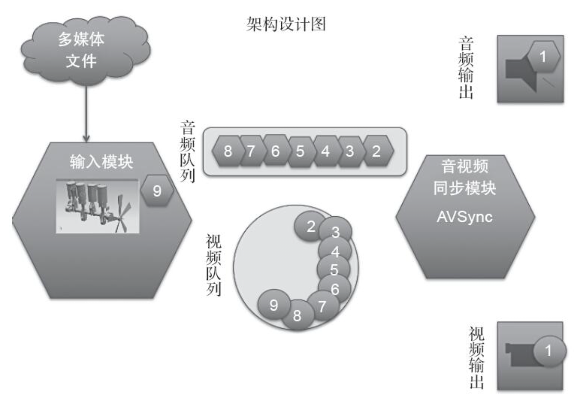
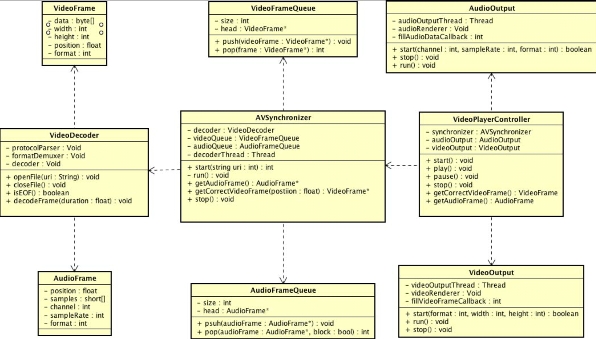
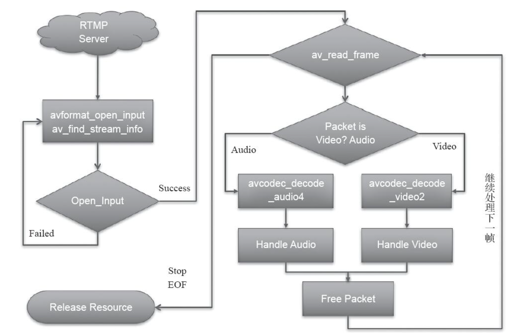

# 实现一个视频播放器  

## 架构设计  

### 基本要求 
* 能够从零开始播放（当然要保证音画对齐）
* 支持暂停和继续播放功能  
* 支持seek功能（就是可以随意拖动到任意位置并仍然可以继续播放），有的播放器还支持快进、快退15s  

### 需求拆分
  

1. 输入是什么？ 
    可以是本地磁盘上的一个媒体文件（可能是FLV、MP4、AVI、MOV等格式的文件），也可以是网络上的一个媒体文件（可能是HTTP、RTMP、HLS等协议） 
2. 输出是什么？   
    扬声器可以播放声音； 屏幕可以显示画面； 声音与画面同步  
3. 模块划分及职责   
    * 输入模块  
        针对输入的数据进行解码，分解为音频流和视频流， 需要建立一个队列存储解码后的数据， 单独分配一个解码线程， 用于解析协议，处理解封装以及解码，并最终将裸数据放到音频和视频的队列中   
    * 输出模块  
        一个单独线程来进行管理，这两个模块应该先从队列中获取音视频的裸数据，然后分别进行音视频的渲染，并最终发布到扬声器和屏幕上   
    * 同步模块  
        由于输出模块都在各自的线程中，音频和视频均是单独播放，这就导致了两个输出模块的播放频率以及线程控制没有任何关系，从而无法保证音画对齐。 需要同步模块来负责音视频的同步问题    
    * 调度器模块  
        将这几个模块组装起来。 先把输入模块、音频队列、视频队列都封装到音视频同步模块中，然后为外界提供获取音频数据、视频数据的接口，这两个接口必须保证音视频的同步，内部将负责解码线程的运行与暂停的维护  
        把音视频同步模块、音频输出模块、视频输出模块都封装到调度器中，调度器模块会分别向音频输出模块和视频输出模块注册回调函数，回调函数允许两个输出模块获取音频数据和视频数据  

### 代码架构  
  
* `VideoPlayerController`: 调度器，内部维护音视频同步模块、音频输出模块、视频输出模块，为客户端代码提供开始播放、暂停、继续播放、停止播放接口；为音频输出模块和视频输出模块提供两个获取数据的接口。   
* `AudioOutput`: 音频输出模块，由于在不同平台上有不同的实现，所以这里真正的声音渲染API为Void类型，但是音频的渲染要放在一个单独的线程进行， 所以这里有一个线程的变量，在运行过程中会调用注册过来的回调函数来获取音频数据。
* `VideoOutput`: 视频输出模块，虽然这里统一使用OpenGL ES来渲染视频 。 OpenGL ES的具体实现在不同的平台上也会有自己的上下文环境，所以这里采用了Void类型的实现， 必须开启一个线程作为渲染线程，会在运行过程中调用注册过来的回调函数来获取视频数据    
* `AVSynchronizer`:  音视频同步模块，会组合输入模块、音频队列和视频队列，其主要为它的客户端代码VideoPlayerController调度器提供接口，包括：开始、结束，以及最重要的获取音频数据和获取对应时间戳的视频帧。此外，它还会维护一个解码线程，并且根据音视频队列里面的元素数目来继续或者暂停该解码线程的运行。
* `AudioFrame`: 音频帧，其中记录了音频的数据格式以及这一帧的具体数据、时间戳等信息   
* `AudioFrameQueue`:  音频队列，主要用于存储音频帧，为它的客户端代码音视频同步模块提供压入和弹出操作，由于解码线程和声音播放线程会作为生产者和消费者同时访问该队列中的元素，所以该队列要保证线程安全性。
* `VideoFrame`: 视频帧，记录了视频的格式以及这一帧的具体的数据、宽、高以及时间戳等信息。  
* `VideoFrameQueue`: 视频队列，主要用于存储视频帧，为它的客户端代码音视频同步模块提供压入和弹出操作，由于解码线程和视频播放线程会作为生产者和消费者同时访问该队列中的元素，所以该队列要保证线程安全性。  
* `VideoDecoder`: 输入模块，其职责在前面已经分析过了，由于还没有确定具体的技术实现，所以这里先根据前面的分析暂时写了三个实例变量，一个是协议层解析器，一个是格式解封装器，一个是解码器，并且它主要向AVSynchronizer提供接口：打开文件资源（网络或者本地）、关闭文件资源、解码出一定时间长度的音视频帧。

### 架构的风险评估和部分测试用例
* 平台评估，平台的碎片化以及系统架构评估  
* 性能测试， 包括CPU消耗、内存占用、耗电量与发热量

### 技术选型  
1. 输入模块  
    选择FFmpeg开源库的libavformat模块来处理各种不同的协议以及不同的封装格式；使用FFmpeg的libavcodec模块来进行解码；(长期支持应该采用各自平台的硬件解码)   
2. 音频输出模块  
    AudioQueue和AudioUnit进行音频输出  
    AudioQueue是更高层次的音频API，是建立在AudioUnit的基础之上的，其所提供的API更加简单  
    AudioUnit 提供的功能更加丰富，针对可能存在的音频格式转换，等采用这个 更合适  
3. 音视频同步 
    pthread线程模型，跨平台的一个解决方案  
    对于音视频队列，我们可以自行编写一个保证线程安全的链表来实现  
    采用视频向音频对齐的策略，即只需要把同步这块逻辑放到获取视频帧的方法里面就好了

##### 测试用例考虑  
1. 输入模块，包括协议层（网络资源、本地资源）、封装格式（FLV、MP4、MOV、AVI等）、编码格式（H264、AAC、WAV）等；  
2. 音视频同步模块，应该在低网速的条件下观看网络资源的对齐程度  
3. 输出模块，测试应该要覆盖iOS系统和Android系统的大部分系统版本，以及最终应用运行的Top10的所有设备的音频和视频播放的兼容性。

## 代码实现 

### 1. 解码器模块实现(输入模块)  
#### 运行流程 
1. 建立连接、准备资源阶段 
2. 不断读取数据，进行解封装、解码、处理数据阶段(__循环进行， 放在单独线程中__)    
3. 释放资源阶段  

  

### 2. 音频播放模块 

### 3. 视频播放模块  

### 4. 同步模块  

### 5. 控制模块  