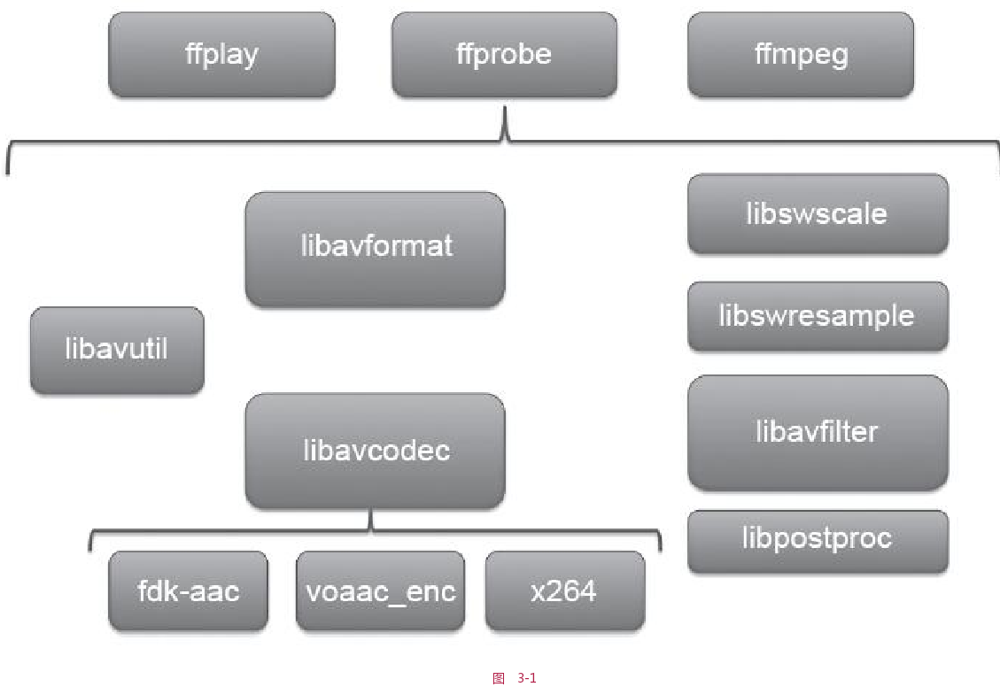
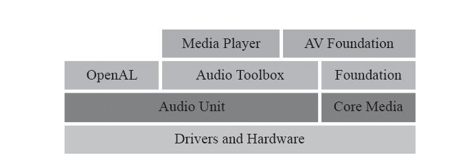

# 音视频开发进阶  

## 基础  
* 声音: 声音是由于物体振动对周围空气产生挤压，从而产生声音。__声音是一种压力波__.  
* 声波： 声波的三要素__频率，振幅,波形__.频率代表音阶的高低，振幅代表响度，波形代表音色。   
  * 频率越高，波长越短。低频波长较长，很容易绕开障碍物，因此能量衰减较小， 声音会传的更远  

#### 数字音频  
* 采样： 在时间轴上对信号进行数字化。
* 44.1kHZ: 根据奈奎斯特定理（也称为采样定理），按比声音最高频率高2倍以上的频率对声音进行采样.人耳能听到的频率范围 20Hz ~ 20kHz,所以一般采样频率为  44.1kHZ. __本质是一秒钟采样44100次__  
* 量化： 在幅度轴上对信号进行数字化。比如用16比特的二进制信号来表示声音的一个采样，而16比特（一个short）所表示的范围是［-32768，32767］，共有65536个可能取值，因此最终模拟的音频信号在幅度上也分为了65536层

* 编码：按照一定的格式记录采样和量化后的数字数据。

#### 音频编码  
    主要是去除冗余信息，从而实现数据的压缩     
* 压缩  
    * 有损压缩 
    * 无损压缩： 压缩后的数据可以完全恢复  
#####  常见格式  
* WAV 编码 
    在PCM(脉冲编码调制)数据格式的前面加上44字节，分别用来描述PCM的采样率、声道、数据格式等   
    * 特点： 音质非常好 
    * 使用场景： 多媒体开发中的中间文件、保存音乐和素材  
* MP3 编码  
    使用 LAME编码的中高码率的MP3文件，  
    * 特点： 音质在 128Kbit/s以上表现不错，压缩比比较高，兼容性豪  
    * 使用场景： 高比特率下对兼容性有要求的音乐  

* AAC编码  
    有损压缩技术，它通过一些附加的编码技术（比如PS、SBR等），衍生出了LC-AAC、HE-AAC、HE-AAC v2三种主要的编码格式。
    * LC-AAC： 传统 AAC， 主要应用于中高码率场景(>=80Kbit/s)  
    * HE-AAC: 主要用于中低码率（<= 80Kbit/s）  
    * HE-AAC V2: 主要用于低码率(<= 48Kbit.s)   
    * 特点： 在 小于128Kbit/s的码率下表现优异， 并且多用于视频中的音频编码  
    * 使用场景： 多用于视频中音频轨道的编码  
* OGG  
    在各种码率下都表现不错，尤其中低码率下。  
    * 特点： 兼容性不豪，流媒体特性不支持  
    * 使用场景： 语音聊天中的音频消息场景  

### 图像  

#### 图像数值表示 
* RGB  
    * 浮点表示： 取值范围在 `0.0 ~ 1.0`，在 OpenGL ES 中就是采用此种方式实现的  
    * 整数表示： 取值范围 `0 ~ 255` 或者 `00 ~ FF`, 8 个比特表示一个子像素， 32 比特表示一个像素
* YUV  
    主要应用于视频帧的裸数据表示。应用于优化彩色视频信号的传输。

#### 视频压缩  
    视频压缩是通过去除冗余信息来进行压缩的， 相较于音频数据， 视频数据又极强的相关性，包括空间上的冗余信息和时间上的冗余信息    

* 时间上的冗余  
    使用帧间编码技术可以去除时间上的冗余  
    * 运动补偿：运动补偿是通过先前的局部图像来预测、补偿当前的局部图像， 它是减少帧序列冗余信息的有效方法      
    * 运动表示：不同区域的图像需要使用不同的运动矢量来描述运动信息   
    * 运动估计：运动估计是从视频序列中抽取运动信息的一整套技术   

* 空间上的冗余  
    使用帧内编码技术可以去除   


## FFMpeg
  


### FFMpeg 简单使用  

1. 引入头文件   
```
#include "libavformat/avformat.h"
#include "libswscale/swscale.h"
#include "libswresample/swresample.h"
#include "libavutil/pixdesc.h"
```

2. 


## 移动平台下的音视频渲染   

### AudioUnit 介绍及事件  
  

#### 应用场景  
1. 想要使用低延迟的音频 I/O   
2. 多路声音的合成并且回放， 比如游戏或者音乐合成器的应用   
3. 使用AudioUnit 提供的特有功能： 回声消除、Mix两轨音频、均衡器、压缩器、混响器等   
4. 需要图装结构来处理音频， 可以将音频处理魔魁啊组装到灵活的图状结构中    

#### AudioSession  
* 获取单例对象  
* 设置硬件功能  
* 设置I/O 的buffer，越小说明延迟越低   
* 设置采样率    
* 激活session  


```
AVAudioSession *session = [AVAudioSession sharedInstance];
[session setCategory:   AVAudioSessionCategoryPlayAndRecord error:&error]; 
[session setPreferredIOBufferDuration:0.002 error:&error]; 

[session setPreferredSampleRate:hwSampleRate error:&error]; 

[session setActive:YES error:&error];
```

#### AudioUnit  
构建session之后，开始构建AudioUnit . 需要指定类型、子类型、厂商。   

```
// 实例： RemoteIO类型的AudioUnit 

AudioComponentDescription desc; 
desc.componentType = kAudioUnitType_Output; 
desc.componentSubType = kAudioUnitSubType_RemoteIO; 
desc.componentManufacturer = kAudioUnitManufacturer_Apple;
desc.componentFlags = 0; 
desc.componentFlagsMask = 0;


```
具体构建AudioUnit 两种方式：  
* 直接使用AudioUnit 创建  
    ```
    AudioComponent ioUnitRef = AudioComponentFindNext(NULL, & desc); 
    AudioUnit io; 
    AudioComponentInstanceNewioUnitRef,&io);

    ```

* 使用AUGraph和AUNode(一个AUNode就是对AudioUnit的封装，可以理解为AudioUnit的Wrapper)构建   
    ```
    AUGraph graph;  
    NewAUGraph(& graph); 

    // 增加 Node  
    AUNode node;
    AUGraphAddNode(graph, &desc, & node); 

    // 打开 graph， 必须在获取 Audio Unit之前打开，否则无法获取  
    AUGraphOpen(graph); 

    // 获取  
    AudioUnit unit; 
    AUGraphNodeInfo(graph, node, NULL, &unit);

    ```

#### 通用参数  
RemoteIO 分为两个 Element: 
* Element1:
    控制输出端  
    * Input Scope 
    * Output Scope  
    如果使用扬声器播放声音，需要将 `Output Scope` 与Speaker 相连接    
    ```
        // 连接  
        OSStatus status = noErr; 
        UInt32 oneFlag = 1; 
        UInt32 busZero = 0 // Element0 
        status = AudioUnitSetProperty(unit, kAudioOutputUnitProperty_EnableIO, kAudioUnitScope_Output, busZero, &oneFlag, sizeof(oneFlag)); 

        // 检测状态


    ```
* Element2:
    控制输入端  
    * Input Scope 
    * Output Scope
    如果使用麦克风录制声音，需要将 `Input Scope` 与 麦克风 相连接  


连接成功后， 需要设置具体的数据格式， 分为`输入`和`输出`两部分    

```
UInt32 bytesPerSample = sizeof(Float32);  
AudioStreamBasicDescription asbd; 

bzero(&asbd, sizeof(asbd)); 

// 指定音频编码格式  
asbd.mFormatID = kAudioFormatLinearPCM; 
asbd.mSampleRate = _sampleRate; 
asbd.mChannelsPerFrame = channels; 
asbd.mFramesPerPacket = 1; 
// 声音格式参数
asbd.mFormatFlags = kAudioFormatFlagsNaviteFloatPacked | kAudioFormatFlagInNointerleaved; 
// 一个声道的音频数据用多少位表示   
asbd.mBitsPerChannel = 8 * bytesPerSample; 
asbd.mBytesPerFrame = bytesPerSample;
asbd.mBytesPerPacket = bytesPerSample;

```

设置给对应的Audio：  

```
AudioUnitSetProperty（ remoteIOUnit，kAudioUnitProperty_StreamFormat，
kAudioUnitScope_Output，1，&asbd，sizeof（asbd））;

```


#### AudioUnit 分类  
根据用途将其分为 5 大类   

* Effect Unit  
    类型位 `kAudioUnitType_Effect`: 主要提供声音特效处理。    
    * 均衡效果器：`kAudioUnitSubType_NBandEQ`, 位声音的某些频带增强或这减弱， 需要指定多个频带，然后位每个频带设置宽度以及增益， 最终将该边声音在频域上的分布       
    * 压缩效果器：`kAudioUnitSubType_DynamicsProcessor`  当声音较小的时候， 可以提高声音的能量，当声音较大时，可以降低   
    * 混响效果器：`kAudioUnitSubType_Reverb2`  象自己身处在一个空房子中，如果有非常多的反射声和原始声音叠加在一起，那么从听感上可能会更有震撼力，但是同时原始声音也会变得更加模糊，原始声音的一些细节会被遮盖掉，所以混响设置的大或者小对于不同的人来讲会很不一致，可以根据自己的喜好来进行设置。   

    还有 高通、低通、带通、延迟、压限   
* Mixer Units  
    类型为 `kAudioUnitType_Mixer`: 主要提供 Mix 多路声音功能  
    * 3D Mixer: 移动设别无法使用  
    * MultiChannelMixer: `kAudioUnitSubType_MultiChannelMixer` 多路声音混音效果器。可以接收多路音频的输入，还可以分别调整每一路音频的增益与开关，并将多路音频合并成一路，该效果器在处理音频的图状结构中非常有用。    

* I/O Units  
    类型为 `kAudioUnitType_Output` 
    * RemoteIO: `kAudioUnitSubType_RemoteIO` 用来采集音频与播放音频的
    * Generic Output:`kAudioUnitSubType_GenericOutput` 者需要进行离线处理，或者说在AUGraph中不使用Speaker（扬声器）来驱动整个数据流，而是希望使用一个输出（可以放入内存队列或者进行磁盘I/O操作）来驱动数据流时，就使用该子类型。  

* Format Converter Units  
    


