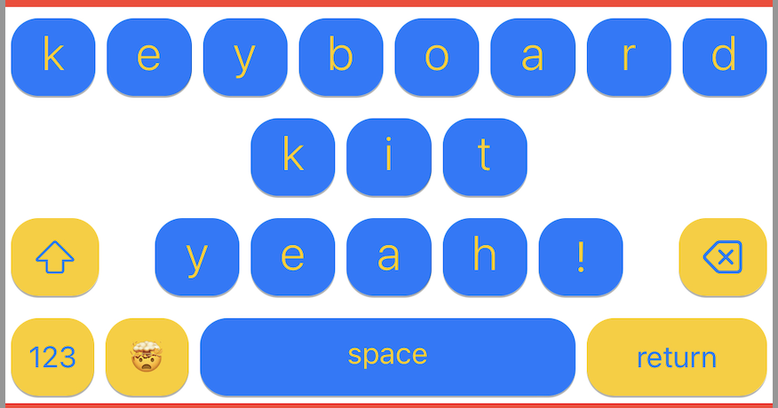

# Documentation 


## 使用 
安装 KeyboardKit 后，只需导入 KeyboardKit 并使您的 KeyboardViewController 继承 `KeyboardInputViewController` 而不是 UIInputViewController：  
```swift 
import KeyboardKit

class KeyboardController: KeyboardInputViewController {}

```
这使自定义的控制器可以访问其他功能， 例如： 
* 新的生命周期函数，如 `viewWillSetupKeyboard()`  
* 可观察状态对象， `keyboardContext` 
* 服务 , ` keyboardActionHandler`  以及更多内容 

` KeyboardInputViewController` 默认初始化一个 英文的 `SystemKeyboard` 键盘。  
当创建或者更新键盘视图时， 将调用`viewWillSetupKeyboard() ` 方法  


使用自定义键盘视图， 可以覆盖 `viewWillSetupKeyboard()`方法，并且调用`setup(with:)` 自定义键盘视图 
```swift 
class KeyboardViewController: KeyboardInputViewController {

    func viewWillSetupKeyboard() {
        super.viewWillSetupKeyboard()
        setup { controller in
            VStack(spacing: 0) {
                MyCustomToolbar()
                //  CustomKeyboard 这样的自定义视图
                SystemKeyboard(
                    controller: controller,
                    autocompleteToolbar: .none
                )
            }
        }
    }
}
```

在这里， 自定义试图需要一个 弱引用 `KeyboardViewController`  

```swift 
struct CustomKeyboard: View {

    unowned var controller: KeyboardViewController 

    var body: some View {
        ... 
    }
}

class KeyboardViewController: KeyboardInputViewController {

    func viewWillSetupKeyboard() {
        super.viewWillSetupKeyboard()
        setup { controller in
            CustomKeyboard(controller: controller)
        }
    }
}

```
> 此处避免♻️引用和内存泄漏  


### 如何使用标准键盘配置 
默认情况下，`KeyboardInputViewController `将配置一堆服务实例和可观察状态。  
例如，`keyboardActionHandler`设置为`StandardKeyboardActionHandler`，`calloutActionProvider`设置为`StandardCalloutActionProvider`等。   
控制器还具有许多可观察的状态属性, 例如：`keyboardContext`, `autocompleteContext`,`calloutContext`等 

然后，可以将各种服务传递到需要它们的任何视图中，并将任何可观察状态作为环境对象访问：  

```swift 
struct CustomKeyboard: View {

    let actionHandler: KeyboardActionHandler

    @EnvironmentObject
    private var context: KeyboardContext

    var body: some View {
        VStack {
            Text("Space only keyboard")
            Button {
                actionHandler.handle(.space)
            } label: {
                Text("My cool space only keyboard")
            }
        }
    }
}

```

请注意，某些状态类型由控制器设置。例如，必须手动添加`ExternalKeyboardContext`  

```swift 
struct CustomKeyboard: View {

    @StateObject
    private var externalContext = ExternalKeyboardContext()

    var body: some View {
        Text("My custom view")
            .environmentObject(externalContext)
    }
}

```
环境对象很方便，但库中的视图使用 `init` 参数来清楚地传达它们的依赖关系   


### 如何自定义配置  
可以通过将任何标准服务替换为自定义实现来轻松自定义标准配置
例如，这里我们将默认的键盘动作处理程序替换为自定义的键盘动作处理程序： 

```swift 
class CustomActionHandler: StandardActionHandler {

    open override func canHandle(_ gesture: KeyboardGesture, on action: KeyboardAction) -> Bool {
        false   // Wow, what a useless action handler! 
    }
}

class KeyboardViewController: KeyboardInputViewController {

    override func viewDidLoad() {
        keyboardActionHandler = CustomActionHandler(inputViewController: self)
        super.viewDidLoad()
    }
}

```
> 由于服务实例是懒加载的，应尽早自定义它们，以确保键盘的所有部分都使用正确的服务类型


## 关键类及作用说明 
### 1. keyboardLayoutProvider(StandardKeyboardLayoutProvider) 
> 负责键盘布局

1. 自定义布局
```swift 
class DemoLayoutProvider: StandardKeyboardLayoutProvider {
    
    init() {
        super.init(
            baseProvider: EnglishKeyboardLayoutProvider(
                alphabeticInputSet: .init(rows: [
                    .init(chars: "KEYBOARD"),
                    .init(chars: "KIT"),
                    .init(chars: "YEAH!")
                ])
            )
        )
    }

    // TODO: 此处会在⌨️双击后变大 I 键的大小
    override func keyboardLayout(for context: KeyboardContext) -> KeyboardLayout {
        let layout = super.keyboardLayout(for: context)
        let widerItem = KeyboardLayoutItem(
            action: .character("I"),
            size: KeyboardLayoutItem.Size(
                width: .inputPercentage(2),
                height: layout.idealItemHeight),
            insets: layout.idealItemInsets)
        layout.itemRows.replace(.character("I"), with: widerItem)
        return layout
    }
}

// TODO: // keyboardLayout此处还可以插入自定义键  
override func keyboardLayout(for context: KeyboardContext) -> KeyboardLayout {
    let layout = super.keyboardLayout(for: context)
    layout.tryInsertRocketButton()
    return layout
}
func tryInsertRocketButton() {
    guard let button = tryCreateBottomRowItem(for:  .character("🚀")) else { return }
    itemRows.insert(button, after: .space, atRow: bottomRowIndex) // 插入位置在空格键之后
}

```


2. 应用自定义布局 
```swift
class KeyboardViewController: KeyboardInputViewController { 

        override func viewDidLoad() {
        /// 💡 Setup a demo-specific layout provider.
        /// 应用自定义布局
        /// You can change this provider's implementation to
        /// see how the layout changes.
        keyboardLayoutProvider = DemoLayoutProvider()

        super.viewDidLoad()
    }
}

```


### 2. keyboardStyleProvider(StandardKeyboardStyleProvider) 
> 负责键盘按键风格样式  

1. 自定义键盘样式 

```swift 
class DemoStyleProvider: StandardKeyboardStyleProvider {
    // 按钮背景图
    override func buttonImage(for action: KeyboardAction) -> Image? {
        if action == .keyboardType(.emojis) { return nil }
        return super.buttonImage(for: action)
    }
    // 按钮样式
    override func buttonStyle(
        for action: KeyboardAction,
        isPressed: Bool
    ) -> KeyboardStyle.Button {
        var style = super.buttonStyle(for: action, isPressed: isPressed)
        style.cornerRadius = 15
        style.backgroundColor = action.isSystemAction ? .yellow : .blue
        style.foregroundColor = action.isSystemAction ? .blue : .yellow
        return style
    }
    // 按钮文本样式
    override func buttonText(for action: KeyboardAction) -> String? {
        if action == .keyboardType(.emojis) { return "🤯" }
        return super.buttonText(for: action)
    }
    
    // TODO: 长安弹出多个字符选择的view样式
    override var actionCalloutStyle: KeyboardStyle.ActionCallout {
        var style = super.actionCalloutStyle
        style.callout.backgroundColor = .blue
        style.callout.textColor = .yellow
        style.selectedBackgroundColor = .black.opacity(0.2)
        return style
    }
    // TODO: 单击弹出字符放大view 样式
    override var inputCalloutStyle: KeyboardStyle.InputCallout {
        var style = super.inputCalloutStyle
        style.callout.backgroundColor = .blue
        style.callout.textColor = .yellow
        return style
    }
}


```

2. 应用键盘样式
```swift 

class KeyboardViewController: KeyboardInputViewController {

    /**
     This function is called when the controller loads. Here,
     we make demo-specific service configurations.
     */
    override func viewDidLoad() {
        /// 💡 Setup a demo-specific style provider.
        ///
        /// You can change this provider's implementation to
        /// see how the keyboard style changes.
        keyboardStyleProvider = DemoStyleProvider(
            keyboardContext: keyboardContext)

        /// 💡 Call super to perform the base initialization.
        super.viewDidLoad()
    }
```


### 3. autocompleteProvider(AutocompleteProvider)
> 自动完成功能提供 

1. 创建自定义的自动完成类 
```swift 
class FakeAutocompleteProvider: AutocompleteProvider {

    init(match: String = "match") {
        self.match = match
    }

    private var match: String
    
    var locale: Locale = .current
    
    var canIgnoreWords: Bool { false }
    var canLearnWords: Bool { false }
    var ignoredWords: [String] = []
    var learnedWords: [String] = []
    
    func hasIgnoredWord(_ word: String) -> Bool { false }
    func hasLearnedWord(_ word: String) -> Bool { false }
    func ignoreWord(_ word: String) {}
    func learnWord(_ word: String) {}
    func removeIgnoredWord(_ word: String) {}
    func unlearnWord(_ word: String) {}
    
    func autocompleteSuggestions(
        for text: String,
        completion: AutocompleteProvider.Completion
    ) {
        guard text.count > 0 else { return completion(.success([])) }
        if text == match {
            completion(.success(matchSuggestions()))
        } else {
            completion(.success(fakeSuggestions(for: text)))
        }
    }
}

private extension FakeAutocompleteProvider {
    
    func fakeSuggestions(for text: String) -> [AutocompleteSuggestion] {
        [
            AutocompleteSuggestion(text: text + "-1"),
            AutocompleteSuggestion(text: text + "-2", subtitle: "Subtitle"),
            AutocompleteSuggestion(text: text + "-3")
        ]
    }
    
    func fakeSuggestion(_ text: String, _ subtitle: String? = nil) -> AutocompleteSuggestion {
        AutocompleteSuggestion(text: text, subtitle: subtitle)
    }

    func matchSuggestions() -> [AutocompleteSuggestion] {
        [
            AutocompleteSuggestion(text: match, isUnknown: true),
            AutocompleteSuggestion(text: match, isAutocorrect: true),
            AutocompleteSuggestion(text: match),
        ]
    }
}

```


2. 应用 
```swift 
class KeyboardViewController: KeyboardInputViewController {

    /**
     This function is called when the controller loads. Here,
     we make demo-specific service configurations.
     */
    override func viewDidLoad() {
         autocompleteProvider = FakeAutocompleteProvider()
    }
}
```


### 4. keyboardActionHandler (StandardKeyboardActionHandler) 
> 处理键盘的事件问题  

