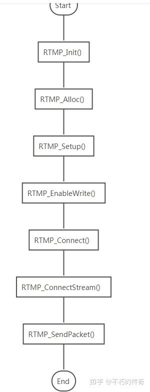
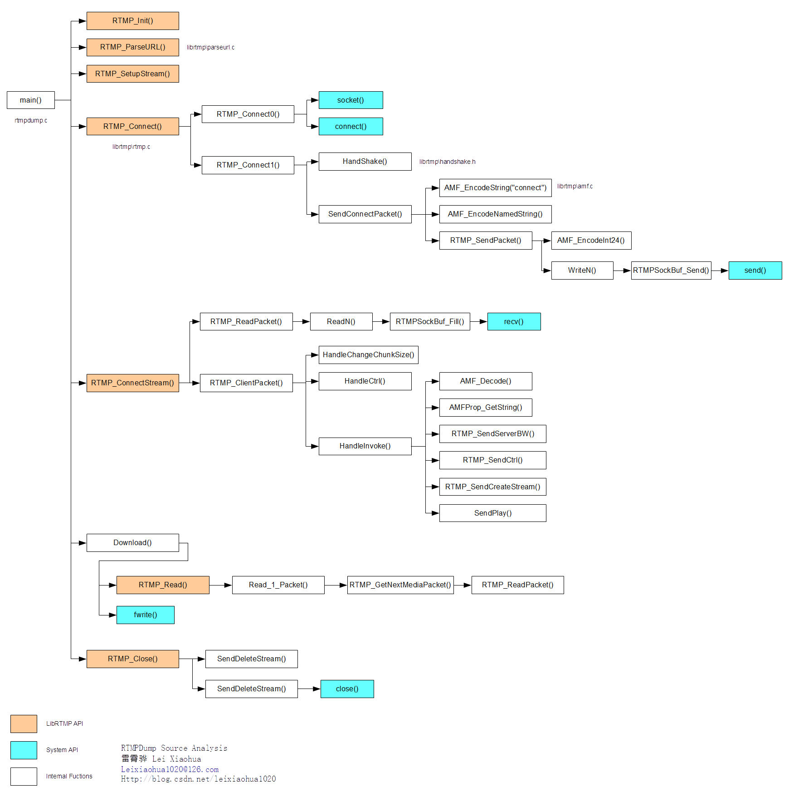

## RTMP Dump 源码阅读 

## 文件目录介绍  
- RTMP Dump  
    - librtmp/
    - thread.h
    - thread.c
    - rtmpdump.c 
    - rtmpgw.c
    - rtmpsrv.c 
    - rtmpsuck.c  

### 目录详细说明  
* librtmp 
    次文件夹下是 rtmp 的主体功能  
* thread.c/h 
    此文件是一个线程， rtmpdump 等会通过此创建线程  
* rtmpdump.c  
    rtmpdump 的主体程序  
* rtmpgw.c  
    HTTP-RTMP流网关 
* rtmpsrv.c 
    简单的RTMP服务器  
* rtmpsuck.c 
    RTMP代理服务器

 

### librtmp API 
- RTMP_Init()//初始化结构体
- RTMP_Free()
- RTMP_Alloc()
- RTMP_SetupURL()//设置rtmp server地址
- RTMP_EnableWrite()//打开可写选项，设定为推流状态
- RTMP_Connect()//建立NetConnection
- RTMP_Close()//关闭连接
- RTMP_ConnectStream()//建立NetStream
- RTMP_DeleteStream()//删除NetStream
- RTMP_SendPacket()//发送数据
  

  
