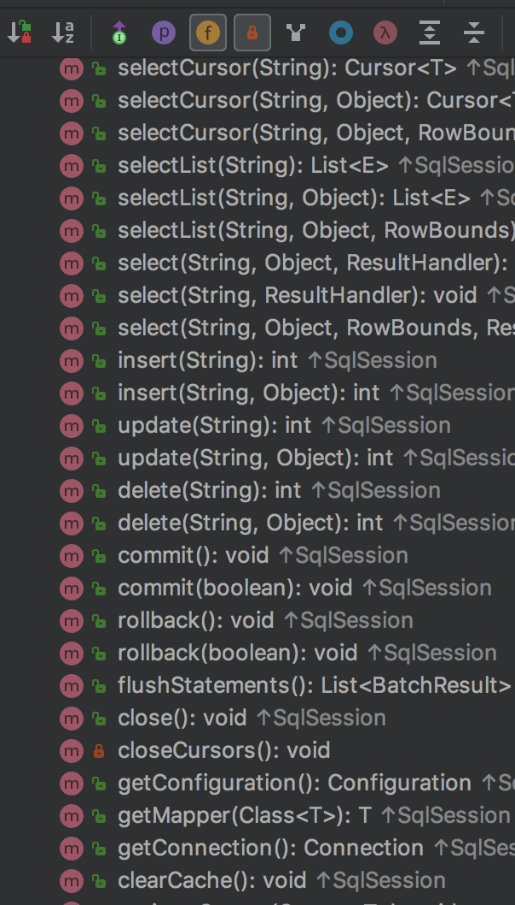

#Mybatis 源码分析 ----- SqlSession    
## 完成状态  

- [x] 开发中
- [ ] 未完成
- [ ] 已完成
- [ ] 维护中


## 前言 
通过本系列前面的文章，详细的分析了整个项目运行初始阶段的初始化工作细则，本节及之后章节将围绕测试代码中后半段的实现原理进行讲解和源码分析说明  

## SqlSession  
通过前面的内容，我们分析到获取`SqlSessionFactory`实例步骤，回顾第一节的示例代码中，接下来是 SqlSession操作不部分  
```java
// 获取session
        SqlSession session = sqlSessionFactory.openSession();
        try {
            // 执行查询操作
            UserMapper userMapper = session.getMapper(UserMapper.class);
            List<User> users = userMapper.selectUserList();
            for (User user : users) {
                System.out.printf(user.toString());
            }
        } finally {
            session.close();
        }
```
此处通过`sqlSessionFactory`(此处据前文了解到是`DefaultSqlSessionFactory`实例)获取一个Session，那么此处是如何获取一个数据库操作 Session 的呢？   

```java 
private SqlSession openSessionFromDataSource(ExecutorType execType, TransactionIsolationLevel level, boolean autoCommit) {
    Transaction tx = null;
    try {
     final Environment environment = configuration.getEnvironment();
      // 1. 通过环境变量获取事务工厂
      final TransactionFactory transactionFactory = getTransactionFactoryFromEnvironment(environment);
      // 2. 通过数据库连接获取事务对象
      tx = transactionFactory.newTransaction(environment.getDataSource(), level, autoCommit);
      //3.  事务对象获取一个执行器
      final Executor executor = configuration.newExecutor(tx, execType);
      // 4. 根据以上内容构建一个新的Session
      return new DefaultSqlSession(configuration, executor, autoCommit);
    } catch (Exception e) {
      closeTransaction(tx); // may have fetched a connection so lets call close()
      throw ExceptionFactory.wrapException("Error opening session.  Cause: " + e, e);
    } finally {
      ErrorContext.instance().reset();
    }
  }

  private SqlSession openSessionFromConnection(ExecutorType execType, Connection connection) {
    try {
      boolean autoCommit;
      try {
        autoCommit = connection.getAutoCommit();
      } catch (SQLException e) {
        // Failover to true, as most poor drivers
        // or databases won't support transactions
        autoCommit = true;
      }
      final Environment environment = configuration.getEnvironment();
      final TransactionFactory transactionFactory = getTransactionFactoryFromEnvironment(environment);
      final Transaction tx = transactionFactory.newTransaction(connection);
      final Executor executor = configuration.newExecutor(tx, execType);
      return new DefaultSqlSession(configuration, executor, autoCommit);
    } catch (Exception e) {
      throw ExceptionFactory.wrapException("Error opening session.  Cause: " + e, e);
    } finally {
      ErrorContext.instance().reset();
    }
  }
```
`DefaultSqlSessionFactory` 类提供了两种获取Session 的方式: 1. 通过数据库获取； 2. 通过连接获取   
通常情况下，由于在配置文件中进行了数据库配置，并且直接使用的是 `openSession();`方法来打开Session 的，此处调用的是`openSessionFromDataSource`方法，采用通过数据库来获取Session  其中比较重要的就是 `Executor` 创建过程  

```java
  public Executor newExecutor(Transaction transaction, ExecutorType executorType) {
    executorType = executorType == null ? defaultExecutorType : executorType;
    executorType = executorType == null ? ExecutorType.SIMPLE : executorType;
    Executor executor;
    if (ExecutorType.BATCH == executorType) {
      executor = new BatchExecutor(this, transaction);
    } else if (ExecutorType.REUSE == executorType) {
      executor = new ReuseExecutor(this, transaction);
    } else {
      executor = new SimpleExecutor(this, transaction);
    }
    // 
    if (cacheEnabled) {
      executor = new CachingExecutor(executor);
    }
    // 添加插件
    executor = (Executor) interceptorChain.pluginAll(executor);
    return executor;
  }
```
mybatis 提供了多种不同的执行器(__Simple, Batch, Reuse__)，默认情况下是 `Simple`的，可以通过配置指定. 此处还是针对是否开启缓存，来进行缓存配置执行器(此执行器并不是真正的执行器，只是对以上三种的封装)。 注意最后一句，`interceptorChain.pluginAll(executor);` 此句是对执行器添加插件，上一节中说到， mybatis支持插件，并且支持executor插件，此处就是将注册的插件与execute绑定   


通过以上方式，获取到一个 `SqlSession`实体对象。接下来通过此对象获取到Mapper代理对象以执行SQL操作     

## Mapper 代理对象  
在具体的获取代理对象之前，首先先了解下 Session 提供的不同方式：

> `DefaultSqlSession`类提供方法  

mybatis 提供了两种方式与数据库进行交互 ：   
* 传统API  
    传统API 通过传递`Statement ID` 和查询参数给 SqlSession 对象，SqlSession 对象通过这些参数来完成数据库交互。例如上图中的 `select`, `selectList`, `update`, `delete` 等方法     

* mapper 接口  
    mybatis 将每个`<mapper>` 节点对象的配置文件抽象给一个 Mapper 接口。并且以其中对应的`<select|update|delete|insert>`节点的ID 对应Mapper 接口的方法名。`parameterType` 对应Mapper 的入参类型，`resultMap` 值则对应了Mapper 接口表示的返回值类型或者返回结果集的元素类型。 
    * 通过Mapper 生成 代理类  
        mybatis 中，Mapper 都是接口类，如果需要调用其内部定义的方法那么久必须具备实现此接口的实现类来构建对象。根据面向接口编程以及mybatis 本身的特点，并不适合让用户来定义接口的实现类。此处就需要通过某种方式来获取接口的实现类 myabtis 利用反射机制，获取代理类  
        ```java 
            UserMapper userMapper = session.getMapper(UserMapper.class);
            // 通过以上方式获取一个代理类
        ```
        以上方法的内部调用实际是调用`MapperRegistry`的以下方式获取代理对象   
        ```java 
        public <T> T getMapper(Class<T> type, SqlSession sqlSession) {
            // 先在缓存中查找
            final MapperProxyFactory<T> mapperProxyFactory = (MapperProxyFactory<T>) knownMappers.get(type);
            if (mapperProxyFactory == null) {
            throw new BindingException("Type " + type + " is not known to the MapperRegistry.");
            }
            try {
                // 获取代理类
            return mapperProxyFactory.newInstance(sqlSession);
            } catch (Exception e) {
            throw new BindingException("Error getting mapper instance. Cause: " + e, e);
            }
        }
        ```
        通过接口类来在初始化时构建的存储中获取对应的`MapperProxyFactory`对象。顾名思义，此对象时`MapperProxy`的工厂类，通过此对象来获取具体的`MapperProxy`  
        ```java 
        protected T newInstance(MapperProxy<T> mapperProxy) {
            return (T) Proxy.newProxyInstance(mapperInterface.getClassLoader(), new Class[] { mapperInterface }, mapperProxy);
        }

        public T newInstance(SqlSession sqlSession) {
            // 初始化出 MapperProxy
            final MapperProxy<T> mapperProxy = new MapperProxy<T>(sqlSession, mapperInterface, methodCache);
            return newInstance(mapperProxy);
        }
        ```
        `MapperProxy` 是一个实现了`InvocationHandler` 接口的类，其`invoke` 方法时关键，通过以上方式调用`Proxy.newProxyInstance` 方法，生成对应的代理对象。 现在 代理对象已经获得，调用Mapper 接口中的方式时，其内容是通过代理对象的`invoke` 方法来实现调用的  
        ```java  
            public Object invoke(Object proxy, Method method, Object[] args) throws Throwable {
                try {
                if (Object.class.equals(method.getDeclaringClass())) {
                    return method.invoke(this, args);
                } else if (isDefaultMethod(method)) {
                    return invokeDefaultMethod(proxy, method, args);
                }
                } catch (Throwable t) {
                throw ExceptionUtil.unwrapThrowable(t);
                }
                // 方法调用进行缓存  
                final MapperMethod mapperMethod = cachedMapperMethod(method);
                return mapperMethod.execute(sqlSession, args);
            }
        ```
        `invoke`方法是通过反射机制调用方法时必不可少的一个方法实现，其`proxy`是代理对象，`method` 是当前被调用的代理对象函数对象， `args` 是调用此函数的所有入参。其中最重要的是最后两句   
        ```java 
        private MapperMethod cachedMapperMethod(Method method) {
            MapperMethod mapperMethod = methodCache.get(method);
            if (mapperMethod == null) {
            mapperMethod = new MapperMethod(mapperInterface, method, sqlSession.getConfiguration());
            methodCache.put(method, mapperMethod);
            }
            return mapperMethod;
        }
        ```  
        从当前代理对象处理类`MapperProxy`的`methodCache`属性中获取当前调用method方法的详细信息。如果没有进行缓存，那么久先创建再存储, 只有调用`execute()`方法来执行具体的数据库操作   

* 总结    
    以上介绍了`SqlSession` 写获取过程以及 Mapper 代理类生成的过程，接下来讲介绍具体的SQL执行部分内容    


## SQL 执行  
通过上文内容表述，具体的SQL执行是`MapperMethod.execute`实现的。在没执行一个方法时，系统会为此方法创建一个对象的`MapperMethod`对象  

```java 
  public Object execute(SqlSession sqlSession, Object[] args) {
    Object result;
    switch (command.getType()) {
      case INSERT: {
    	Object param = method.convertArgsToSqlCommandParam(args);
        result = rowCountResult(sqlSession.insert(command.getName(), param));
        break;
      }
      case UPDATE: {
        Object param = method.convertArgsToSqlCommandParam(args);
        result = rowCountResult(sqlSession.update(command.getName(), param));
        break;
      }
      case DELETE: {
        Object param = method.convertArgsToSqlCommandParam(args);
        result = rowCountResult(sqlSession.delete(command.getName(), param));
        break;
      }
      case SELECT:
        if (method.returnsVoid() && method.hasResultHandler()) {
          executeWithResultHandler(sqlSession, args);
          result = null;
        } else if (method.returnsMany()) {
          result = executeForMany(sqlSession, args);
        } else if (method.returnsMap()) {
          result = executeForMap(sqlSession, args);
        } else if (method.returnsCursor()) {
          result = executeForCursor(sqlSession, args);
        } else {
          Object param = method.convertArgsToSqlCommandParam(args);
          result = sqlSession.selectOne(command.getName(), param);
          if (method.returnsOptional() &&
              (result == null || !method.getReturnType().equals(result.getClass()))) {
            result = OptionalUtil.ofNullable(result);
          }
        }
        break;
      case FLUSH:
        result = sqlSession.flushStatements();
        break;
      default:
        throw new BindingException("Unknown execution method for: " + command.getName());
    }
    if (result == null && method.getReturnType().isPrimitive() && !method.returnsVoid()) {
      throw new BindingException("Mapper method '" + command.getName() 
          + " attempted to return null from a method with a primitive return type (" + method.getReturnType() + ").");
    }
    return result;
  }
```   


