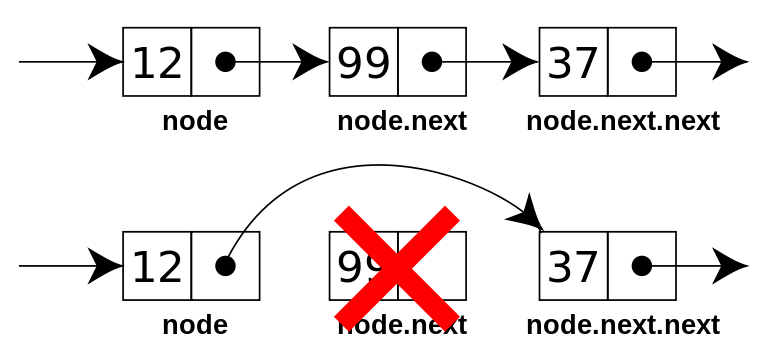

#  链表 

在数据存储结构分类中，其中链式存储的实现就是链表结构 

链式存储:对逻辑上相邻的元素不要求其物理位置相邻，元素间的逻辑关系通过指针字段来表示，链式存储借助程序设计语言中的指针类型来实现  


__链表：是由数据节点组成的线性集合，每个节点可以利用指针指向其他节点，是一种包含多个节点，可用于表示顺序的数据结构(与数组同类)__  

 
> 图片来自 https://visualgo.net/en
通过以上动图，形象的表示了链表结构  

链表由于其不需要连续的内存块资源，其结构可以充分的利用内存空间，实现灵活的内存管理。但是链表结构也有其弊端：其在插入与删除上，不需要过多的操作内存而一定程度降低了时间复杂度，但其在查找上就不那么灵活。以下链表中不同操作的时间复杂度：

* 索引`O(n)`
* 搜索`O(n)`
* 插入`O(1) `
* 移除`O(1)`  

__本部分会采用部分伪代码来介绍操作，其具体的实现会有相对应的实现__  

## 链表的基本操作 
以上内容，介绍了链表是如何的数据结构，以及通过动图的形式形象的展示了链表的简单结构，但并没有对链表有个更直接以及详细的了解。链表作为一种基本的数据结构，其如何操作如何运行呢？通常，在链表操作中，有一下几种基本操作：  

1. 初始化  
    初始化链表结构，构建一个空的线性表 
2. 长度     
    返回表的所含元素的个数  
3. 获取节点     
    获取指定位置的元素节点  
4. 查找节点     
    通过给定的值，超找包含此数据的节点位置  
5. 插入节点     
    在链表中插入新的节点 
6. 删除节点    
    在链表中删除已有节点  
7. 遍历链表    
    循环遍历链表中的所有节点


## 链表分类  
虽然在大体实现上都是连式结构，不过链表在具体实现由于其采用的方式不同，链表也可以细分为以下几类：
1. 单向链表    
2. 双向链表   
3. 循环链表    
4. 块状链表     


接下来将针对以上四种不同实现方式进行具体的介绍以及其链表的基本操作中的需要主要的地方    

### 单向链表  
链表中的节点都是单向操作的，从上个节点指向下个节点，最后一个节点指向空。通常单向链表节点需要包含两部分内容：    
1. 指针域     
    指针域包含的是下一个节点的内存地址。
2. 数据域     
    数据域存放的是具体的数据内容  


> 图像来自维基百科  

针对于单链表相对来说简单，其只能访问下一个节点，并不能反向访问上一个节点。并且其在遍历时，只能按照顺序遍历

#### 单链表实现
1. 定义链表节点  
```java 
class ListNode {
    int val ;
    ListNode next;
    public ListNode(int val){
        this.val = val;
        this.next = null;
    }
}
```
2. 获取链表的长度  
```java  
public int getListLen(ListNode head){
    int len = 0;
    while(head != null){
        len ++;
        head = head.next;
    }
    return len;
}
```
3. 查找节点
```java 
 public ListNode findElem(ListNode head,int k){
        if(k<1||k>this.length())
            return null;
        ListNode p1=head;
        ListNode p2=head;
        for (int i = 0; i < k-1; i++) 
            p2=p2.next;
        while (p2.next!=null) {
            p2=p2.next;
            p1=p1.next;
        }
        return p1;
    }
```

4. 插入节点
    ```java
    public void addNode(int d, ListNode head){
        ListNode node = new ListNode(d);
        if(head == null){
            head = node;
            return;
        }
        // 循环遍历获取链表的末尾节点
        ListNode node2 = head;
        while(node2.next != null){
            node2 = head.next;
        }
        //在末尾添加节点
        node2.next = node;
    }
    ```
    
    > 图像来自维基百科   

5. 删除节点  
    在单链表结构中，要根据一个index 删除一个节点，其我们先 回顾下链表的结构特点，链表是没有索引的， 但是此处需要通过一个索引来删除节点， 我们首先要通过这个索引，找到对应的节点，同时也要找到其前后节点，将前节点的下一个节点指向其后一个节点就可以了， 主要在查找的这个过程，需要的几个要素要明白    
    1. 索引计数  
    2. 当前节点上一个节点  
    3. 当前节点  
    4. 当索引计数等于索引时， 找到节点，将其pre 节点指向 当前节点next 节点    

    ```java
    public Boolean deleteNode(int index, ListNode head){
        if(index<0 || index>length()){
            return false;
        }
        if(index == 0){
            head = head.next;
            return true;
        }
        int i = 0;
        ListNode preNode = head;
        ListNode nextNode = head.next;
        while(nextNode != null){
            if(i == index){
                preNode.next = nextNode.next;
                return true;
            }
            preNode = nextNode;
            nextNode = nextNode.next;
            i++;
        }
        return true;
    }
    ```
    
    > 图像来自维基百科     


6. 遍历链表 

    ```java 
    public void printList(){
            ListNode tmp=head;
            while(tmp!=null){
                System.out.print(tmp.data+" ");
                tmp=tmp.next;
            }
            System.out.println();
        }
    ```

7. 反转链表 

    反转链表将尾节点变为头结点， 将整个链表反转过来的过程  

    ```java 
    // 通过的是遍历的方式实现的反转的
    public ListNode reverseList(ListNode head){
        ListNode pre = null;
        while(head != null){
            ListNode next = head.next;
            head.next = pre;
            pre = head;
            head = next;
        }
        return pre;
    }
    ```
    通过遍历整个链表可以实现链表的反转，同时也可以通过递归的方式实现链表的反转过程  

    ```java 
    public ListNode reverseList(ListNode head){
        if(head == null || head.next== null) return head;
        ListNode resetHead = reverseList(head.next);
        head.next.next = head;
        head.next = null;
        return resetHead;
    }
    ```

8. 获取链表的中间节点 
    获取链表的中间节点，是一个比较常见的问题，在链表结构中获取中间节点，我们不能通过索引来获取。通过遍历也不是很方便获得链表中间节点。 其有一种取巧的方式就是通过步进的方式实现 

    ```java 
    public ListNode searchMid(ListNode head){
            ListNode q=head;
            ListNode p=head;
            while (p!=null&&p.next!=null&&p.next.next!=null) {
                q=q.next;
                p=p.next.next;
            }
            return q;
        }
    ```

### 双向链表 
和单链表的单向不同，双向链表中的节点都是双向操作的，一个节点中，同时又两个指针域，一个指向它的上一个节点，一个指向它的下一个节点，最后一个和第一个节点都有一个指针域是指向空的。通常双向链表节点需要包含三部分内容：    
1. 指针域     
    指向是上一个节点的内存地址。    
2. 数据域     
    数据域存放的是具体的数据内容   
3. 指针域 
    指向下一个节点的内存地址   


> 图像来自维基百科  


#### 双链表操作  
1. 初始化  
    ```java  
    class ListNode {
        int val ;
        ListNode next;
        ListNode pre;
        public ListNode(int val){
            this.val = val;
            this.next = null;
            this.pre = null;
        }
    }
    ```
2. 长度     
    获取长度部分和单链表结构使相同的 
    __见单链表实现__  

3. 获取节点     
    __见单链表实现__    
4. 查找节点       
5. 插入节点     
    双链表与单链表的不同之处在于插入节点时，需要的是操作两个指针的，一个指向前节点，一个指向后继节点，如果在末尾插入节点，那么操作时和单链表相同的  

    ```java  
    public void addNode(int d, ListNode head){
        ListNode node = new ListNode(d);
        if(head == null){
            head = node;
            return;
        }
        // 循环遍历获取链表的末尾节点
        ListNode node2 = head;  
        while(node2.next != null){
            node2 = head.next;
        }
        // node2 为链表的尾节点了
        //在末尾添加节点
        node2.next = node;
    }
    ```  
    以上是基于末尾插入节点，接下来是在中间位置插入节点,可以通过index 或者节点的值来进行插入节点，相同的部分就是必须都要查找到需要插入的那个节点  
    ```java  
    // 此处实现了两种不同的，通过内容和索引插入
    public void addNode(int d / int index, ListNode head){
        ListNode node = new ListNode(d);
        if(head == null){
            head = node;
            return;
        }
        // 1. 通过值插入    
        ListNode current = head;  
        while(current.value == d) {
            break;
        }

        // 2. 通过索引获取  
        int i = 0;
        ListNode current = head;
        while(current.next != null){
            if(i == index){
                break;
            }
            current = head.next;
            i++;
        }

        // 添加节点  
        node.prev = current;
        node.next = current.next;
        current.next.prev = node;
        current.next = node;
    }
    ``` 
    __总结:先搞定需要插入的节点前驱后继，再搞定后结点的前驱，最后解决前驱结点的后继__  

6. 删除节点    
    删除操作和添加操作相同，不过删除操作时需要先找到需要删除的那个节点，然后更改其前节点的后继以及后节点的前驱    

    ```Java
    ListNode current // 为需要删除的节点   
    // 将当前节点的下一个节点的前继节点改为当前节点的前继节点
    current.next.pre = current.pre;
    // 将当前节点的前继节点的后继节点改为当前节点的后继节点,绕过当前节点
    current.pre.next = current.next;
    ```
7. 遍历链表    
    __见单链表实现__  

### 循环链表  
环链表和单链表和双链表不同，单双链表都是有头有尾的，并且头尾不相连，而环链表是在单双链表的基础上，将头尾相连(这里也不一定是首尾相连，只要和链表中其他的节点构成环壮)，组成一个环装， 所以称为环链表，所以环链表有双向环链表和单向环链表  


> 图像来自维基百科  

#### 环链表操作  
1. 判断链表是否有环问题    
    在判断链表是否有环问题时，主要就是判断链表中是否有一个节点指向了链表中的其他节点(链表中与之不相邻的节点)  
    常用的解决方式有以下几种： 
    1. 空间复杂度高的  
        在针对链表遍历时，通过每遍历一个节点，然后将此节点放到Map(Set) 中去，如果在操作过程中，数组中存在当前操作的节点，那么久说明有环存在，或者放入Set 中利用set 的无重复元素的特性，如果操作失败，那么久说明已经存在此节点，也就是存在环了     
        ```java 
            public boolean hasLoop(ListNode head){
                HashSet<ListNode> set = new HashSet<ListNode>();
                ListNode current = head;
                while(current!=null){
                    if(set.add(current)){
                        return true;
                    }
                    current = current.next;
                }
                return false;
            }
        ``` 
    2. 时间复杂度高  
        在遍历链表时，通过双层遍历的形式，从头结点开始，当给定节点，然后遍历之后的所有节点是否有与之相等的节点，如果存在，那么久说明存在环， 如果不存在，那么久遍历下一个节点，然后遍历此节点之后的所有节点，依次操作，查看是否存在环    
    3. 通过两个指针，同时从头结点开始，同步步长不同，然后判断两个指针是否会相遇，如果相遇就会存在环，不相遇就不存在环(注意： 此种方式访问一遍是无法判断出的，所以需要循环访问多次应该为 n/2次)     


2. 找到环的入口节点  
    首先，针对此问题，不能只看表面，如果只是单纯的找环的入口节点，那么将无从下手，这个要结合环的特性，环是什么样的？ 环是一个首尾相连的结构，那么环的首节点是不是尾节点？ 而且在链表中要形成环，其需要有一个节点被连接两次，此节点就是环的首节点，也同样可以称为环的尾节点(或者与之相连的第二个相连的节点)，此处问题就又演变为判断链表是否有环结构了，那么问题就简单多了，以上就有三种方式来判断  

3. 环的长度  
    在求环的长度时，需要用到以上两个问题的结果，第一先要判断有环，然后获取环的头结点，然后从头结点重新遍历，在此相遇之时之间经过的节点就是环的长度了，


### 块状链表 
块状链表本身是一个链表，但是其每个节点并不是单个的数据，而是一个数据集。其每个节点是一个数组结构，数组结构中才是存储的真正意义上的数据。每个节点都是一个块，所有才叫块状链表。


## 总结  

针对链表的操作以上做了大致的介绍和总结，不过回顾以上内容，不难发现，其实不管是块状链表还是环形链表甚至是双链表结构，都是基于单链表作为根本来实现的。所以掌握了针对单链表的操作后，明白块以及环链表的概念，那么具体的操作将不难实现    

链表结构在日常业务代码开发中虽然不常用到，但是其隐藏于多种底层的数据结构中，所以掌握链表结构的操作时非常有必要的。

1. 链表存在单向链表、双向链表、循环链表、块状链表 
2. 链表插入与删除操作快，查找操作慢  


## 参考 
[interviews](https://github.com/kdn251/interviews/blob/master/README-zh-cn.md)    
[链表-维基百科](https://zh.wikipedia.org/wiki/%E9%93%BE%E8%A1%A8#%E5%85%B6%E5%AE%83%E6%89%A9%E5%B1%95)    
[判断是否有环](http://blog.csdn.net/u011373710/article/details/54024366)    
[块状链表](http://dongxicheng.org/structure/blocklink/)     