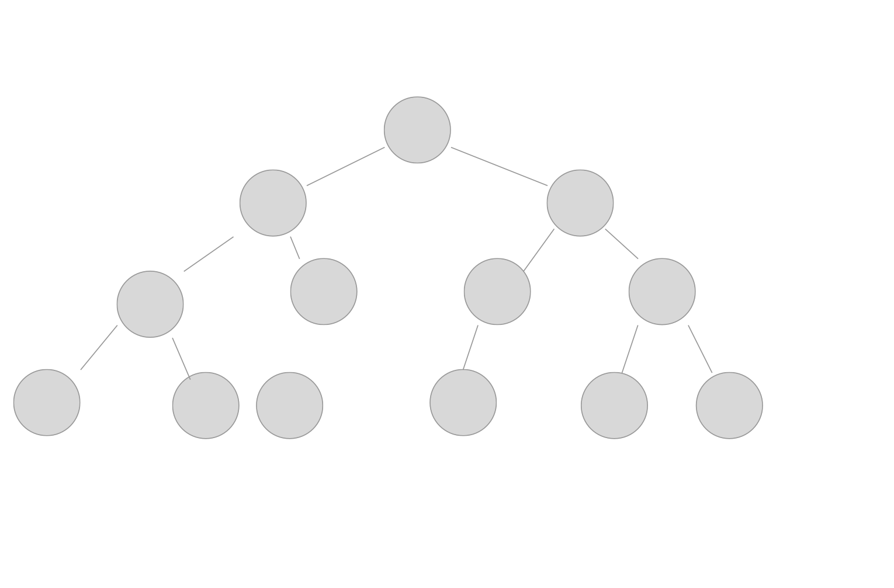
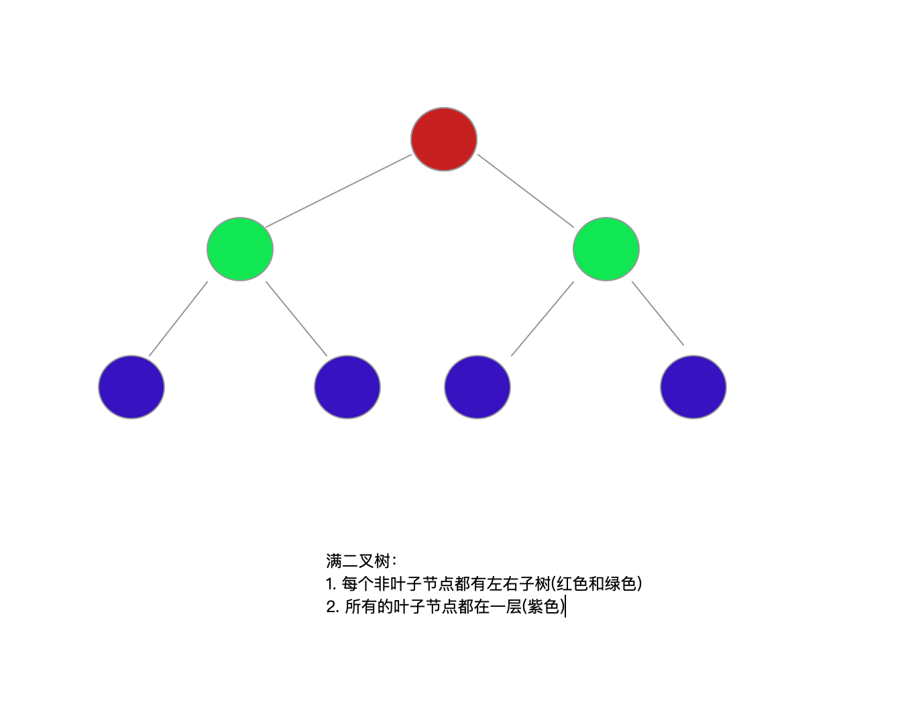

# 树  
🌲结构在整个数据结构体系中扮演着很重要的角色，树是数据结构中比重相对很重的一部分，在日常的各种操作系统以及软件中都或多或少的用到了树结构。在数据结构中，存在多种树结构，有简单的二叉树，也有很复杂的B树。很多经典实用的算法中，都存在树结构或者是基于树数据结构实现的。树结构主要包含以下几种结构：  
* 二叉树 
* 红黑树
* B树
* B+树
* B*树
* Trie树


## 二叉树  
二叉树是最常见的树结构，其相对来说比较简单，其实其他复杂树结构的基础。不过虽然其相对来说简单，但是其也是最最基础并且基于二叉树衍生出了不同的二叉树   
__二叉树的定义__： 每个节点最多只有两个分支子节点(不存在大于2的节点)，通常分支被称作“左子树”或“右子树”。二叉树的分支具有左右次序，不能随意颠倒。二叉树的第n层最多有 `2^n-1` 个节点。
> 以上定义来自维基百科  



### 二叉树的遍历方式及序列化  
二叉树的遍历是__通过某种次序，  二叉树的遍历操作通常分为以下4种：
* 中序遍历   
    核心思想： `左子树 ---> 根节点 ------> 右子树`

* 前序遍历  
    核心思想： `根节点 ----> 左子树 ------> 右子树`

* 后序遍历  
    核心思想： `左子树 -----> 右子树 -----> 根节点`

* 层遍历 
    核心思想： `按层次遍历`  


### 满二叉树 
__满二叉树:__ 如果一个二叉树的每个非叶子节点都存在左右子树，并且二叉树中所有的叶子节点都在同一层中，那么这种二叉树称为满二叉树  



### 完全二叉树 

### 二叉查找树  
查找树： 是一种数据结构，支持多种动态集合操作，即可以用作字典，也可以用作优先队列    
在二叉查找树上执行的基本操作的时间与树的高度成正比。对于一棵n个节点的完全二叉树，操作的最坏情况是 `O(lg n)`.如果树是含有n个节点的线性链，这些槽子哦的最坏情况运行时间是 `O(n)`

##### 特性  
* 设 x 为二叉查找树中的一个节点。 如果y 是 x 的左子树中的一个节点， 则 `key[x] >= key[y]`. 如果 y 是 x 的右子树中的一个节点， 则 `key[x] <= key[y]`

__遍历一棵有 n 个节点的二叉查找树所需时间为 `O(n)`__  

#### 二叉树查找  

```
// x : 为树跟节点 
// value: 查找的值
func tree_search(x, value) {
    
}

```


#### 平衡二叉树 


#### 平衡二叉树 AVL树  


#### 平衡二叉树 红黑树 


## B 树  


### B+ 树  


### B* 树 


## trie 树  


## 总结  
* 二叉查找树与最小堆性质之间的区别？能否利用最小堆在 `O(n)` 内，按序输出n个节点？

