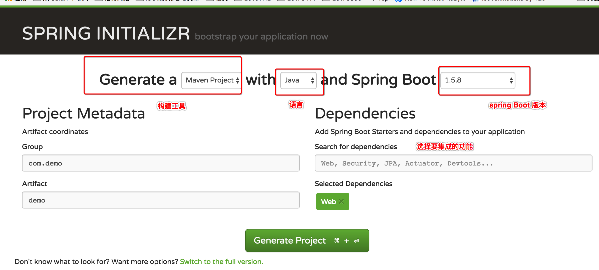
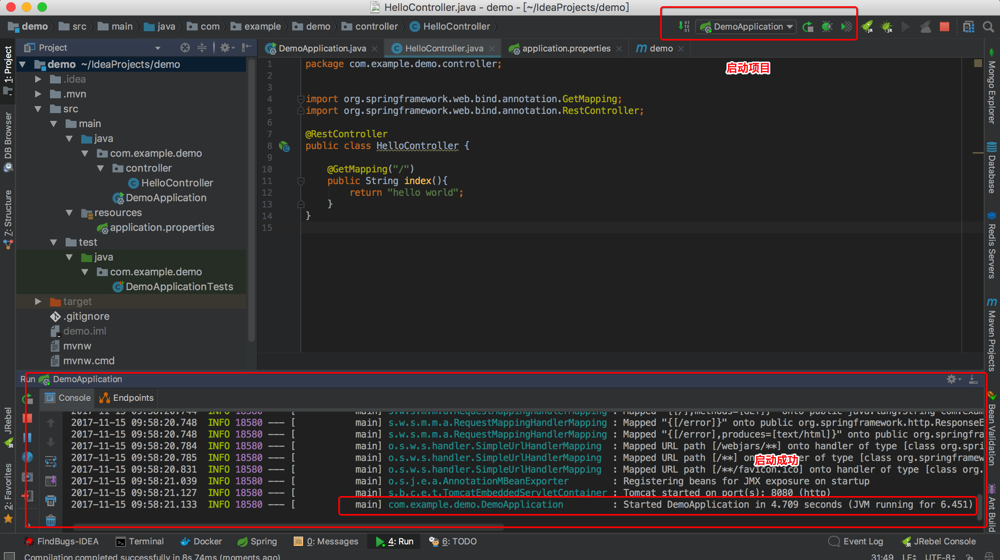
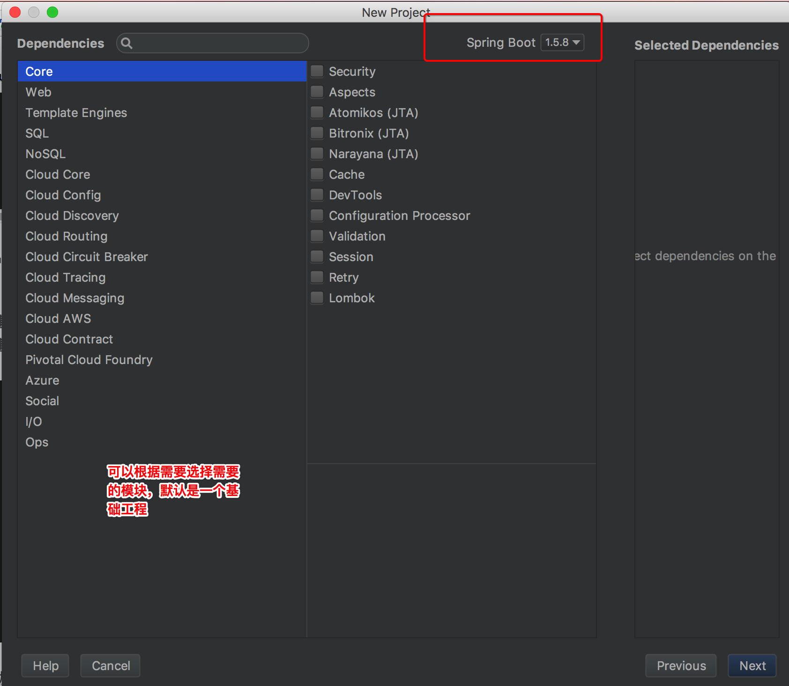

# Spring Boot 体验  

## 简介  
在第一次接触 Spring 你会发现其核心配置文件是一个XML格式的，所有的配置都是通过XML来实现的。大量的配置繁琐而复杂，稍有不慎项目将无法运行。配置环境将花费大量的时间和精力。很多人都或多或少的在如何配置上出问题而浪费大量的时间。甚至有人因为无法正确配置最终放弃学习 Spring。 结合种种原因，Spring 社区痛定思痛，所以 Spring  Boot 来啦。。。。 Spring  Boot 更加轻量化， 更加快捷方便的构建Spring 应用。到底有多快捷方便，多说无益，体验一般就好。 


#### 说明  
本系列都将以 [IDEA](https://www.jetbrains.com/idea/) 集成开发环境来进行开发   

## 快速入门  
本章将根据 Spring  Boot 创建基本工程并运行，实现一个基本REST ful的HTTP请求。  
Spring  Boot 针对快速创建基本工程专门提供了一个在线的构建网站，并且IDEA 也针对其进行了集成  

### 通过 `Spring Initializr` 生成基础工程  
1. 访问 `http://start.spring.io/`  
2. 选择对应的构建工具，例如 `Maven`， `Gradle`等构建工具工程. (本次使用Maven)  
	  
3. `Generate Project`下载压缩包   
4. IDEA 导入项目
	* `File`---->`Project from Existing Source`   

#### 项目结构  
通过以上方式创建项目并导入项目，等待 index 成功 就会看到如下的项目结构  
	  

以上创建的是一个标准的 Spring Boot 基础工程模板  
	
* `src/main/java` 是程序的入口  
* `src/main/resource` 是配置文件，Spring Boot 规定 所有的配置项都放在此包下，项目会进行自动管理
* `src/test/` 测试入口


#### Web 模块 
Maven 是通过 `pom.xml` 文件来进行项目管理和配置的，查看此文件 可以发现 Spring Boot 默认引入了两个个模块：

*  `spring-boot-starter`， 此模块是核心模块，包括自动配置，日志以及 YAML 解析等等基础功能  
* `spring-boot-starter-test`: 测试模块，包括JUnit 等测试相关的功能


要实现REST ful 请求，需要引入的是web 模块，我们可以通过一下方式引入   

```xml
<dependency>
	<groupId>org.springframework.boot</groupId>
	<artifactId>spring-boot-starter-web</artifactId>
</dependency>
```

_小提示: IDEA 集成开发工具还是很智能哦，如果不知道具体的`groupId` 可以直接输入web 关键字，一般系统会给出提示哦_

#### 实现REST ful  请求  
1. 创建`controller`包  
2. 创建 `HelloController`类,并添加 `@RestController`注解
3. 添加如下代码

   ```Java
	@GetMapping("/")
    public String index(){
        return "hello world";
    }
   ```

4. 启动项目   
	

5. 测试  
	等待程序启动成功，可以在浏览器访问`http://localhost:8080/`可以查看到页面输出`hello world`  
	


### 通过IDEA 创建项目    
IDEA 针对 Spring Boot 进行了很好的集成， 可以通过IDEA 启动的实现Spring Boot 的创建和操作  

1. `Start New Project`  
2. 创建方式  
	

3. 配置项目  
	

4. 导入需要的 `starter` 库
	IDEA 通过图形化界面实现  
	

5. next --->next   

	直接下一步下一步了  
	


## 温馨提示

* 在通过Spring boot 开发时，尽量不要试图去配置导入库的版本，让Spring boot 来自己决定使用什么版本。如果自己手动指定版本，可能会存在不兼容等问题  
