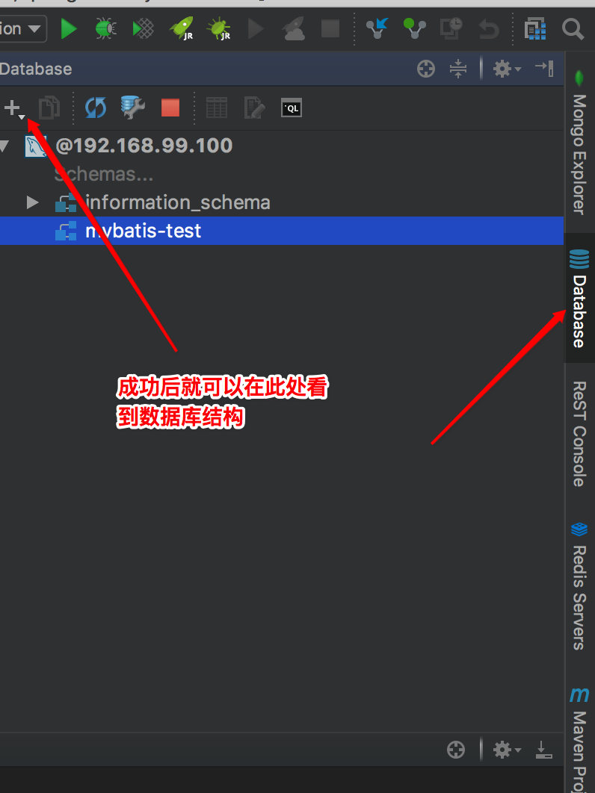
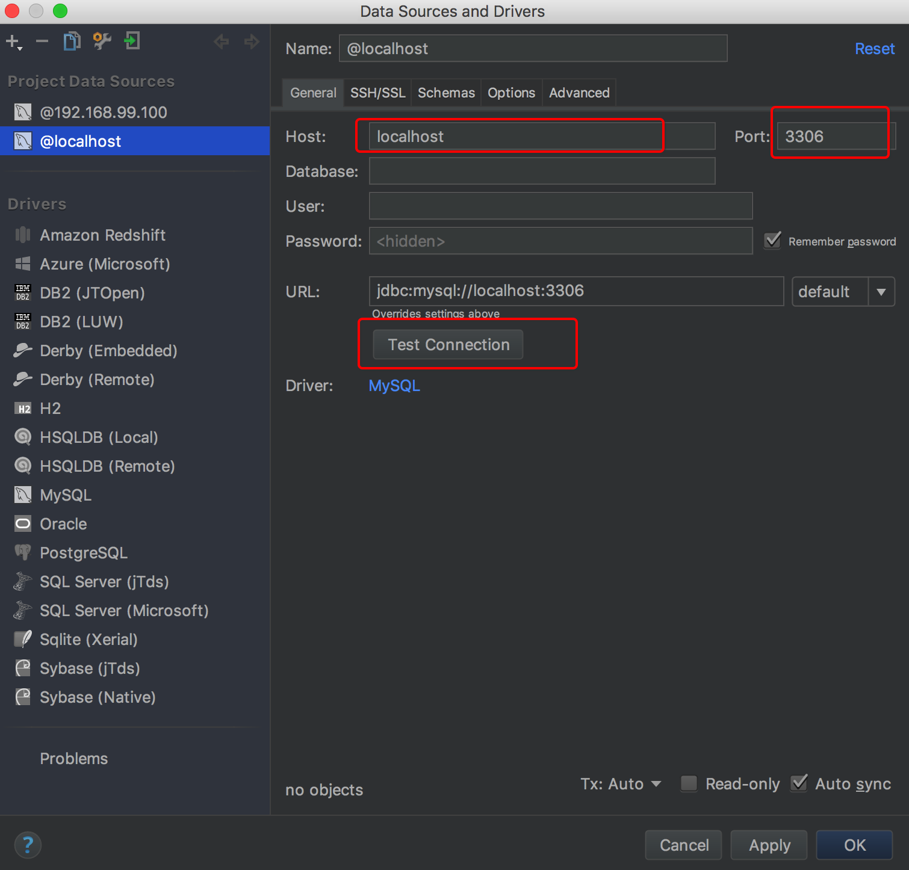
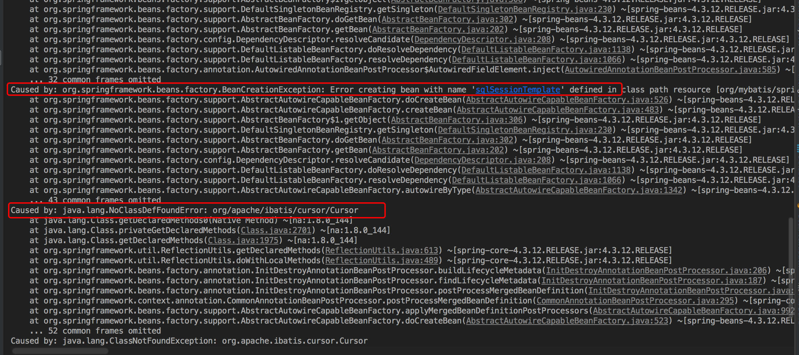
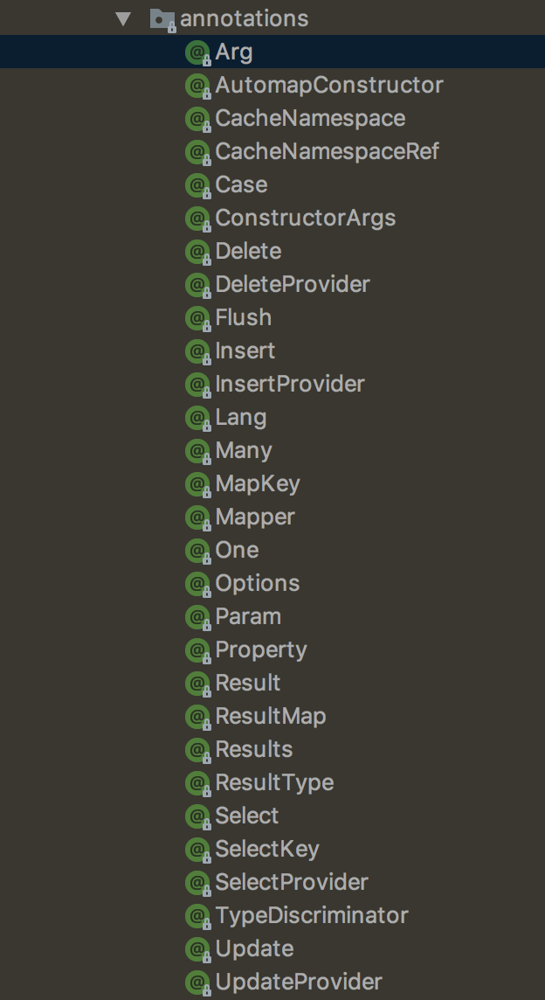
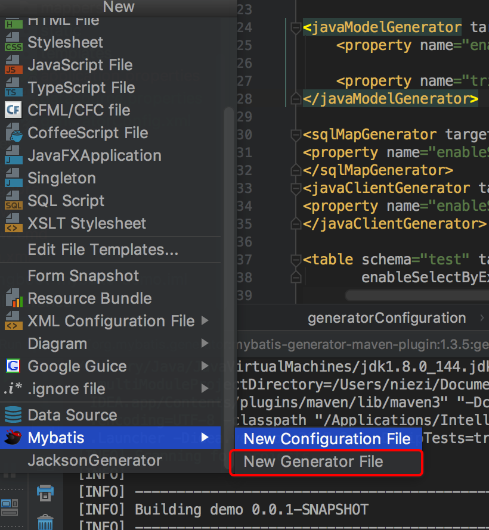
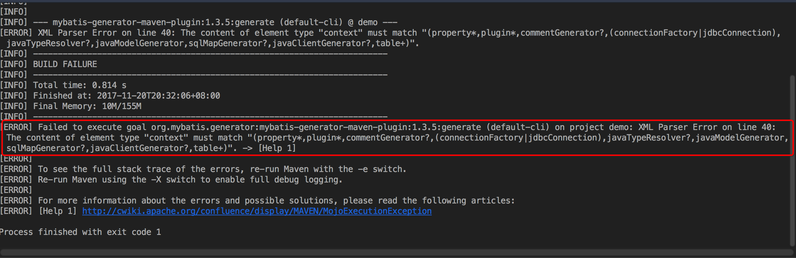

# Spring Boot 整合 Mybatis  

### 完成状态
  
- [x] 编写中
- [ ] 已完成
- [ ] 维护中

### mybatis  
> MyBatis 是一款优秀的持久层框架，它支持定制化 SQL、存储过程以及高级映射。MyBatis 避免了几乎所有的 JDBC 代码和手动设置参数以及获取结果集。MyBatis 可以使用简单的 XML 或注解来配置和映射原生信息，将接口和 Java 的 POJOs(Plain Old Java Objects,普通的 Java对象)映射成数据库中的记录。(摘自mybatis 官方文档)  

本章将基于mybatis 持久层框架进行数据库访问，本文将包含以下内容：  

* mybatis 与spring boot 整合  
* mybatis 全注解开发  
* mybatis xml 配置开发  
* mybatis Genterator 使用  
* mybatis 多数据源实现  
* mybatis page 分页实现  
* mybatis 事务  


## mybatis 与 spring boot 整合  
spring boot 针对mybatis 有专门的 starter 包，可以轻松的将 mybatis 集合到 spring boot 项目中去， 接下来将简单的实现一个 spring boot 与 mybatis 的集成项目  

> 本demo 是基于 注解形式实现，如果需要XML配置实现方式请查看对应部分内容  

1. 创建基础功能，添加mybaits 支持  
    根据上几章的基本学习，可以通过IDEA 创建 Spring boot 项目，在添加启动库时，需要添加一下 `mybatis`, `web`, `jdbc`,`myssql` 等支持。映射到 `pom.xml`文件中就是如下内容：  

    ``` xml   
        <dependency>
			<groupId>org.mybatis.spring.boot</groupId>
			<artifactId>mybatis-spring-boot-starter</artifactId>
			<version>1.3.1</version>
		</dependency>
        <dependency>
			<groupId>mysql</groupId>
			<artifactId>mysql-connector-java</artifactId>
			<scope>runtime</scope>
		</dependency>
        <dependency>
			<groupId>org.mybatis</groupId>
			<artifactId>mybatis-spring</artifactId>
			<version>1.3.1</version>
		</dependency>
    ```
2. 配置数据库  
    * 配置IDEA 数据库访问
        为了方便起见，我们需要先配置 IDEA ， 其本身也针对数据库有相应的功能集成，不需要专业的数据库管理软件。 通过以下配置，可以让 IDEA 访问数据库  
        
        
    * 配置项目数据库连接  
        Spring boot 项目的所有配置操作都默认在 `application.properties`文件中，以下是数据库配置  

        ```  
            spring.datasource.driver-class-name=com.mysql.jdbc.Driver
            spring.datasource.url=jdbc:mysql://192.168.99.100:32776/test?useUnicode=true&useSSL=false&characterEncoding=utf-8
            spring.datasource.username=root
            #spring.datasource.password=oore4ooPo1aiyoo1OmaC2veongooraeB
            spring.datasource.password=root
            spring.datasource.max-active=20
            spring.datasource.max-idle=8
            spring.datasource.min-idle=8
            spring.datasource.initial-size=10
        ```
3. 配置mybatis  
    spring boot 针对mybatis 有完善的支持，可以通过多种形式来进行mybatis 配置，比如 原始的配置方式 xml，直接 Java 代码形式进行配置   
    具体的内容将在后续有针对性的说明，本处只是通过 配置文件简单配置

    ```
    mybatis.mapper-locations=classpath:mapper/*.xml
    mybatis.type-aliases-package=com.springboot.mybatis.demo.domain
    ```
    __需要对配置进行说明__  

4. spring boot 项目配置以支持  
    配置 spring boot 自动扫描 Mapper 功能  

    ``` java  
    @SpringBootApplication
    @MapperScan("com.springboot.mybatis.demo.mapper")
    public class DemoApplication {

        public static void main(String[] args) {
            SpringApplication.run(DemoApplication.class, args);
        }
    }
    ``` 
    通过 `@MapperScan`注解来配置mapper 的自动扫描功能，项目在启动时会自动扫描给定包下的 所有mapper 接口类  

5. 示例代码  
    __mybatis 需要在项目之前进行数据库表创建__  

    * 创建 实体类  
    
    ``` java
    public class Product {
        private  Long id;
        private  String name;
        private  String desc;
        //getter setter 方法
    }
    ```
    * Mapper 接口类实现  

        ``` java 
        public interface ProductMapper {

            @Select("SELECT * FROM product")
            public ArrayList<Product> findAll();
        }
        ```
    * Service 层

        ``` java  
            @Service
            public class ProductServiceImpl implements ProductService {

                @Autowired(required = false)
                private ProductMapper mapper;

                @Override
                public ArrayList<Product>  findAll()
                {
                    return  mapper.findAll();
                }

            }
        ```
        此处需要注意，在低版本的 IDEA 中，由于 mybatis采用的mapper 具体实现类是在运行时才生成，此时没有具体实现类，自动注入会报错，这个是IDEA 的检查报错，不会影响项目运行，需要在 ` @Autowired` 中设置属性`required`为 `false`， 此属性默认为`true`  
    * controller 层 

        ``` java
            @RestController
            public class ProductController {

                @Autowired
                private ProductService productService;

                @GetMapping("/productList")
                public ResponseEntity findAll()
                {
                    System.out.println("测试");
                return new ResponseEntity(productService.findAll(), HttpStatus.OK);
                }
            }
        ```
        __以上示例代码只是为了测试 springboot 与 mybatis的整合，接下来会针对性功能实现__  

6. 测试  
    根据以上内容可以正常运行项目，不过如果你是之后通过修改 pom.xml 文件添加的 mybatis 的支持，那么有可能会在项目运行时出现如下错误   
      
    此问题是由于mybatis 的版本不一致造成的，具体的说明以及解决办法在[此处]()   


## mybatis 全注解开发   
mybatis 也支持基于注解的开发，通过注解来实现 mapper映射，不需要臃肿的 XML 来配置。 接下来将介绍mapper 映射中  CURD 不同的注解使用  



以上是 mybatis 提供的所有注解，接下来将对其中常用的进行具体说明     

1. 普通查询   

    简单的SQL操作都可以通过特定的注解进行实现，针对CURD 操作，提供了`@Select`、`@Update`、`@Delete`、`@Insert`注解，还提供了部分辅助注解  

    ```java

        @Select("SELECT * FROM product")
        List<Product> findAll();

        // 获取主键
        @Insert("INSERT INTO user(name,desc) VALUES (#{name}, #{desc}) ")
        @Options(useGeneratedKeys = true, keyProperty = "id")
        int insert(Product product);

        @Delete("DELETE FROM user WHERE id = #{id}")
        int delete(@Param("id") Integer id);

        @Update("UPDATE user SET name = #{name}, desc = #{desc} WHERE id = #{id}")
        int update(Product product);

        @Select("SELECT id, name, desc FROM user WHERE id = #{id}")
        @Results(id = "userMap", value = { @Result(column = "id", property = "id", javaType = Long.class),
                @Result(column = "name", property = "name", javaType = String.class),
                @Result(column = "desc", property = "desc", javaType = String.class) })
        Product findById(@Param("id") Integer id);

        @Select("SELECT * FROM user")
        @ResultMap("userMap")
        List<Product> fingAll();

        @SelectProvider(type = ProductMapperProvider.class, method = "findByNameAndType")
        List<Product> findByNameAndType(@Param("name") String name,@Param("type") String type);
    ```
   * 注解说明  
        - `@Result`  
            修饰返回结果集，将数据库查询字段与实体属性相对应.(有时候查询与插入使用的字段名不同，需要通过此种方式建立对应关系)  
        - `@param`  
            在带有参数查询时， 必须通过此注解 mybatis 才能获取参数   
        - `@Options`  

   * `#{xxx}` 与 `${xxx}` 的区别    
        `#{}` : 形式会在SQL解析阶段解释为 JDBC 预编译语句 ，一个 `#{ }` 被解析为一个参数占位符 `?` 。    
        `${}` : 是简单的字符串替换    
        使用`#{}` 可以有效的避免SQL注入问题    

2.  复杂查询(动态SQL)     

    动态SQL操作并不能像普通查询那样，通过一个注解来实现，由于动态SQL的不确定性。SQL语句是根据条件生成的，所以不同通过一个注解来直接实现。不过mybatis 针对动态SQL提供了其他方式实现，通过`@XXXProvider` 注解，标注具体的实现类和方法来实现动态SQL ,CURD 每种操作都有其对应的动态SQL查询注解   

    |----- 基础-|------复杂(动态) ----|     
    |  :------: |     :------:      |     
    | `@Insert` | `@InserProvider`  |    
    | `@Delete` | `@DeleteProvider` |     
    | `@Update` | `@UpdateProvider` |     
    | `@Select` | `@SelectProvider` |     

   ``` java  
        @SelectProvider(type = ProductMapperProvider.class, method = "findByNameAndType")
    List<Product> findByNameAndType(String name, String type);
   ```   
   通过`@SelectProvider`标记，此方式需要的是一个动态SQL操作，其具体的实现需要`ProductMapperProvider`类的`findByNameAndType`返回SQL语句  

    ``` java  
        public class ProductMapperProvider {

            public  String findByNameAndType(String name, String type)
            {
                return new SQL() {
                    {
                        SELECT("id, name, type","desc");
                        FROM("product");
                        WHERE("name = " + name);
                        AND();
                        WHERE("type = " + type);
                    }
                }.toString();
            }
        }
    ```

   通过 创建SQL 对象，根据条件拼装SQL语句返回， 此方法会在具体的调用时调用，并根据参数返回一条SQL语句以供具体的调用,此类是一个普通的Java类，其中可以包含任意Java代码。(可以通过任意Java代码形式拼装SQL语句)   
> 通过以上方式主要针对的是mybatis的功能实现，并没有针对其本身更改配置，使用了spring boot 默认配置，如果需要对其更改配置，需要自行配置，具体方式查看 [mybatis 多数据源实现配置]()   


## mybatis xml 配置开发  
mybatis 虽然支持 基于注解的开发，不过由于注解功能还相对不够完善，其支持并没有XML来的实在，有些功能基于注解的开发反而比基于XML的更复杂，比如：动态sql查询等。mybatis 官方也更加的推荐使用XML来进行 mapper 映射开发  

1. 创建mybatis配置文件  
    ```xml  


    ```   

2. 加载配置文件  
    在`application.properties`文件中添加配置信息  

    ```
    mybatis.config=mybatis-config.xml
    ```


##### 注解与XML配置选择  
两种方式各有特点， 注解版 对多表联合查询等动态SQL操作支持较弱，不过期简洁快速。XML配置更适合传统的SOA 项目，可以灵活的动态生成SQL，方便调试。具体使用哪种形式，需要自己根据需求选择  


## mybatis Genterator 使用  
虽然通过以上两种方式都可以实现功能，并且主接班更加简洁， 不过针每张表都需要创建 实体类、mapper映射类甚至更多的东西，如果表少还可以，如果有成百上千的表，那。。。不知道创建到什么时候，伟大的程序员都是懒得，所以通过 `Genterator` 辅助性的插件库就应运而生。通过简单的配置，系统自动生成需要的模板代码。接下来就来看看如何通过简单配置实现自动化生成需要的模板类   

OK， 在具体的操作之前需要先安装一个插件 `Mybatis Plugin`, 需要在 IDEA 的插件中心安装此插件，此插件对mybaits 的支持非常好。有利于接下来的代码实现   

1. maven 配置  
    * 添加引入包  
    
        ``` xml  
            <dependency>
                <groupId>org.mybatis.generator</groupId>
                <artifactId>mybatis-generator-core</artifactId>
                <version>1.3.5</version>
            </dependency>
        ``` 
    * 插件引入  

        ``` xml   
            <plugin>
				<groupId>org.mybatis.generator</groupId>
				<artifactId>mybatis-generator-maven-plugin</artifactId>
				<version>1.3.5</version>
			</plugin>
        ```

2. generator 配置   
    在 `resource`目录下创建 `generatorConfig.xml` 配置文件 
> 最新版本插件 是可以直接通过IDEA 创建出 模板配置文件 

    

    ```xml   
            <?xml version="1.0" encoding="UTF-8" ?>
        <!DOCTYPE generatorConfiguration PUBLIC
                "-//mybatis.org//DTD MyBatis Generator Configuration 1.0//EN"
                "http://mybatis.org/dtd/mybatis-generator-config_1_0.dtd" >
        <generatorConfiguration>
            <properties resource="datasource.properties"/>

            <classPathEntry location="/Users/niezi/.m2/repository/mysql/mysql-connector-java/5.1.44/mysql-connector-java-5.1.44.jar"/>

            <context id="context" targetRuntime="MyBatis3">
                <!--序列化-->
                <plugin type="org.mybatis.generator.plugins.SerializablePlugin"/>
                <commentGenerator>
                    <property name="suppressAllComments" value="false"/>
                    <property name="suppressDate" value="true"/>
                </commentGenerator>
                <!-- 数据库连接 -->
                <jdbcConnection userId="${db.username}" password="${db.password}" driverClass="${db.driverClassName}" connectionURL="${db.url}"/>
                <!-- 是否进行数据转换 -->
                <javaTypeResolver>
                    <property name="forceBigDecimals" value="false"/>
                </javaTypeResolver>
                <!-- 实体类 -->
                <javaModelGenerator targetPackage="com.springboot.mybatis.demo.domain" targetProject="${db.targetProject}">
                    <property name="enableSubPackages" value="false"/>

                    <property name="trimStrings" value="true"/>
                </javaModelGenerator>
                <!-- mapeprs 映射文件 -->
                <sqlMapGenerator targetPackage="mappers" targetProject="${db.targetResource}">
                <property name="enableSubPackages" value="false"/>
                </sqlMapGenerator>
                <!-- mapper 接口 -->
                <javaClientGenerator targetPackage="com.springboot.mybatis.demo.mapper" type="XMLMAPPER" targetProject="${db.targetProject}">
                <property name="enableSubPackages" value="false"/>
                </javaClientGenerator>
                <!--  -->
                <table schema="test" tableName="%" enableCountByExample="false" enableDeleteByExample="false"
                    enableSelectByExample="false" enableUpdateByExample="false"/>
                <!--<table schema="test" tableName="t_user" enableCountByExample="false" enableDeleteByExample="false"-->
                    <!--enableSelectByExample="false" enableUpdateByExample="false"/>-->
            </context>
        </generatorConfiguration>

    ``` 
    这里有篇文章，针对配置中的参数进行了详细说明 [generator参数说明](http://www.jianshu.com/p/e09d2370b796),如果需要了解其他参数，请查看此文章  

3. 生成需要的类  
    执行 `mvn mybatis-generator:generate -e` 命令或者通过IDEA 操作生成  
      
__注意__     
    此处可能会遇到如下错误，其主要原因是没有按照给定的顺序进行配置  
    
    解决方式就是按照途中给定顺序进行配置

## mybatis 多数据源实现  
通过以上方式，针对mybatis已经可以熟练掌握，不过在高并发的情况下，问了提高性能会针对数据库做读写分离实现，接下来是针对mybatis如何实现读写分离操作的配置


## mybatis page 分页实现  
分页操作在开发中是必不可少的，那么mybatis如何实现分页操作  
mybatis 可以集成插件实现分页实现也可以通过 `mybatis generator`集成插件来实现分页查询功能，以下将通过两种方式实现分页功能  

#### mybatis 插件实现  
基于PageHelper 包来实现分页效果  

* 引入包  

    ```xml  
    <dependency>
        <groupId>com.github.pagehelper</groupId>
        <artifactId>pagehelper</artifactId>
        <version>4.1.6</version>
    </dependency>
    ```   
* 在 mybatis 配置中添加分页功能  
    * XML配置形式  

    * Java 配置形式  
    ```java  
        @Configuration
        public class MyBatisConfiguration {
            @Bean
            public PageHelper pageHelper() {
                PageHelper pageHelper = new PageHelper();
                Properties p = new Properties();
                p.setProperty("offsetAsPageNum", "true");
                p.setProperty("rowBoundsWithCount", "true");
                p.setProperty("reasonable", "true");
                pageHelper.setProperties(p);
                return pageHelper;
            }
        }
    ```


#### mybatis generator 集成插件实现  
mybatis generator 可以通过插件，实现不同的功能，针对默认的更加完善功能。以下网址是收集的一部分插件及使用方式
[mybatis-generator-plugin](https://github.com/itfsw/mybatis-generator-plugin.git) 


## mybatis 事务  
事务是数据库管理系统执行过程中的一个逻辑单元，由一个有限的数据库操作序列构成。一个数据库事务通常包含了一系列的读写操作。事务存在的目的就是满足以下两点:  
* 为数据库操作序列提供一个从失败中回复到正常状态的方法，提供了数据在异常状态下保持一致性的方法   
* 当并发访问数据库时，提供一个隔离方法，以防止彼此的操作互相干扰。  
以上是对事务的简单介绍，具体的介绍请参考维基百科关于数据库事务部分[数据库事务](https://zh.wikipedia.org/wiki/%E6%95%B0%E6%8D%AE%E5%BA%93%E4%BA%8B%E5%8A%A1)  

mybatis本身并没有提供单独的事务管理器，其通过`mybatis-spring`使用的是基于 Spring提供的事务管理能力-----`DataSourceTransactionManager`。  


## 总结  
通过以上几点的介绍，可以熟练掌握mybatis的使用，不过还是有很多不详细的地方，如果需要更加详细的介绍mybatis的读书笔记文章   
* [如何在单个Boot应用中配置多数据库？](http://emacoo.cn/backend/spring-boot-multi-db/)   
