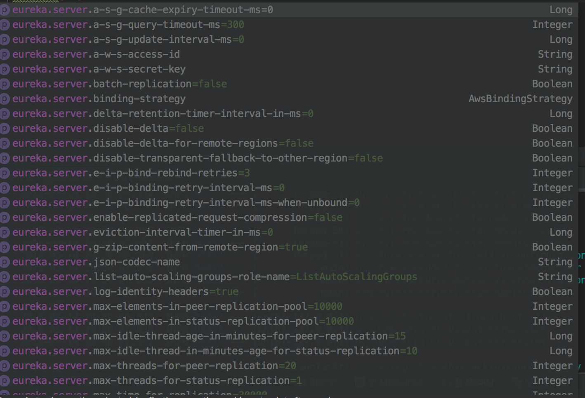
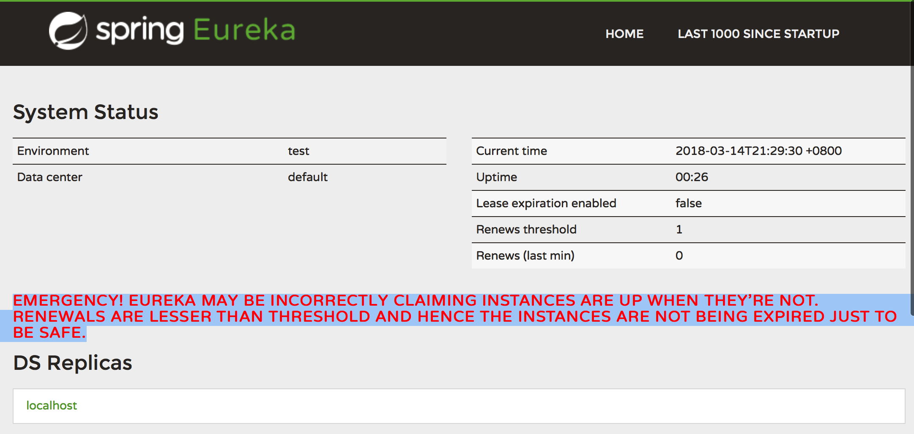
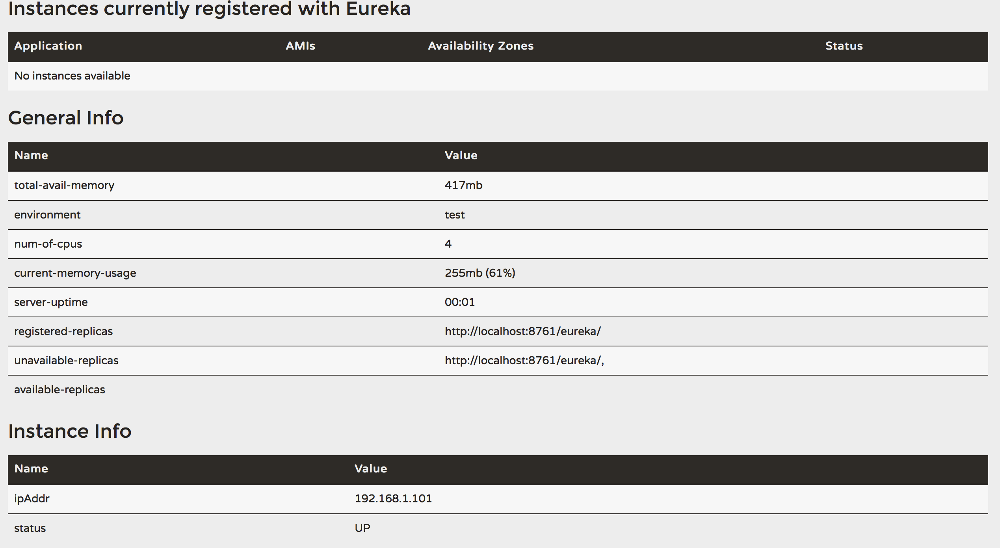

# Spring Cloud Netflix -----Eureka   
在基础介绍中已经指出 Spring Cloud Netflix (以下简称Netflix) 是一个工具集，其中Eureka 是其中很重要的一部分。Eureka 是一个服务发现以及服务注册组件。其在微服务架构中充当着服务注册中心的职责。在微服务架构中，如果所有的服务都通过手动来进行配置和管理，那将是几乎不可能和繁琐的工作。Eureka 是一个优秀的服务注册发现组件，其同时包括了服务端和客户端。可以通过简单的注解和配置就可以解决服务端与客户端的通信问题，其同时支持高可用部署。 接下来将围绕 Eureka 和 Spring Boot 结合同时介绍其服务端与客户端的使用    

####说明:
1. __以下内容全部都是基于Spring Boot 来实现__   
2. __推荐使用IDEA集成开发环境__  

## Eureka Server     
Eureka Server 服务端用于服务的注册和服务的管理，其本质上还是一个Java web 程序，只是不对外提供服务，而只用于内部其他微服务的注册和管理功能。Eureka Server 提供了丰富的配置功能，可以根据自身的需求进行多细粒度的配置。  

以上是部分的提供的配置功能。接下来将介绍其中重要的配置项    

在微服务架构中，注册中心是所有服务的核心，只有注册中心正常工作，其他服务才可以正常的向外部提供服务。所以在微服务架构中，注册中心是所有服务中第一个启动的服务，所以在接下来的内容中，将先部署Eureka Server   

1. 导入pom jar 包  
    Eureka Server 一个基本的Spring Boot 项目。  
    ```xml  
		<dependency>
			<groupId>org.springframework.cloud</groupId>
			<artifactId>spring-cloud-starter-netflix-eureka-server</artifactId>
		</dependency>
    ```  
2. 添加 eureka sever服务功能   
    要想一个普通的Spring Boot 项目具备 Eureka Server的功能，其实很简单，简单的一个注解就可以实现，这就是 Eureka 一直强调的只需要通过简单的配置就可以使用   
    ```java 
    @SpringBootApplication
    @EnableEurekaServer
    public class ServerApplication {

        public static void main(String[] args) {
            SpringApplication.run(ServerApplication.class, args);
        }
    }
    ```
    主要就是 `@EnableEurekaServer` 注解，通过给`XXXApplication` 的入口类添加此注解就OK    
3. 启动项目  
    就是如此简单   
    Eureka Server 默认提供了一个简单的控制台程序。通过访问`host:port` 来访问此程序  
    
      
    以上是Eureka Server 自带的控制中心。接下来对其中的主要模块进行说明   
    * System Status  
    * DS Replicas 
    * instances currently registered with eureka 
    * general info  
    * instance info  

在Eureka Server 服务端中，并没有针对服务注册表的存储，其将服务注册表是存储到内存环境中的，并没有存储到比如数据库这样的持久化存储环境中，那么Eureka 是如果保证注册表中的服务实时可用性呢？    
__Eureka 采用的是通过心跳机制，让Client 端持续的与服务端保持联通来维护之间关系，并且Client 的内存中，有一个服务注册表的缓存，客户端不需要每个请求都去查找注册表，从而提高了性能__    
并且 Eureka Server 同时也是一个客户端，所以它在启动时也会去查找服务端，一般，在启动作为服务端的 Enreka 时，都会通过设置`eureka.client.registerWithEureka = false`然后让其不进行注册自己本身 。 下面给出一个简单的配置模板 ：  

```properties
spring.application.name=eureka-server
server.port=8991
#eureka.instance.hostname=localhost
# 防止注册中心自我注册
#eureka.client.register-with-eureka=false
#eureka.client.fetch-registry=false
## 注册地址
#eureka.client.serviceUrl.defaultZone=http://${eureka.instance.hostname}:${server.port}/eureka/
## 关闭安全模式
#eureka.server.enable-self-preservation=false
```


## Eureka Client  
Eureka Client 客户端是存在于服务中的，其Eureka通过client将其注册到Eureka server中。
在client将服务注册到server端时，其会将当前服务的 host， port 以及健康指标地址和首页等数据作为元数据提交到服务器端。当前是服务的注册过程，不过由于HTTP 服务的特性，为了保证服务的高可用和及时响应，客户端与服务器端通过发送跳机制来保证当前服务还处于激活状态，如果服务端在超过一定时间内没有接收到来自客户端的心跳消息，那么服务器端将会将当前对应的服务从服务列表中剔除。通过心跳的方式以保证在服务端的服务都是可以提供服务的     

### Eureka Client 使用  
1. 引入pom 包  
    在使用之前首先需要先在创建的 Spring Boot 中引入需要的包 
    ```xml 
    <dependency>
			<groupId>org.springframework.cloud</groupId>
			<artifactId>spring-cloud-starter-netflix-eureka-client</artifactId>
	</dependency>
    ```


