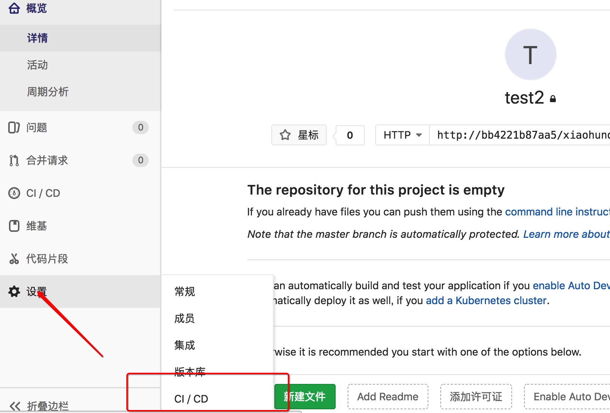
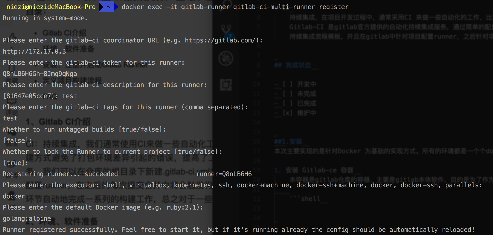

# 基于Docker 实现Gitlab CI Runner  

* CI 
    持续集成，在项目开发过程中，通常采用CI 来做一些自动化的工作，比如单元测试，部署的等等。通过自动化的实现，避免了人工造成的低效以及错误问题，提高了工作效率   
    Gitlab-CI 是gitlab官方提供的自动化持续集成服务，通过简单的配置来实现自动化集成功能。 Gitlab 的使用需要在项目根目录下创建`.gitlab-ci.yml`配置文件，灵活的自定义持续集成流程模板，并且在gitlab中针对项目配置runner，之后针对项目特定的操作下就会触发持续集成工作，比如: 提交代码，添加tag等等    


## 完成状态  

- [ ] 开发中
- [ ] 未完成
- [ ] 已完成
- [x] 维护中


##1.安装  
本次主要实现的是针对Docker 为基础的实现方式。所有的环境都是一个个docker 容器。  

1. 创建 Gitlab-ce 容器  
    本容器是gitlab仓库的容器，主要是gitlab本体软件，目的是为了作为git 代码存储仓库   
    
    ```bash 
    docker run -d --name gitlab-ce -p 3000:80  --hostname 172.17.0.3 -v gitlab-config:/etc/gitlab -v gitlab-logs:/var/log/gitlab -v gitlab-data:/var/opt/gitlab twang2218/gitlab-ce-zh
    ```
    * 修改gitlab 服务器地址  
        默认生成项目的URL访问地址是按容器的hostname来生成的，但是这样就无法是正确的URL地址了,所以需要配置为一个特定的URL地址  
        ```ruby
        docker exec -it gitlab bash    
        vi /etc/gitlab/gitlab.rb
        # 配置http协议所使用的访问地址
        external_url 'http://127.0.0.1'
        # 配置ssh协议所使用的访问地址和端口
        gitlab_rails['gitlab_ssh_host'] = '127.0.0.1'
        gitlab_rails['gitlab_shell_ssh_port'] = 10022
        ```
        执行`gitlab-ctl reconfigure` 或重启容器  
    
    * 卸载容器  
        ```
        docker stop gitlab
        docker rm gitlab
        docker network rm gitlab-net
        docker volume rm gitlab-config gitlab-data gitlab-logs
        ```


2. 创建 gitlab-runner 容器  

    ```bash
    docker run -d --name gitlab-runner --restart always \                                   
    -v /var/run/docker.sock:/var/run/docker.sock \
    gitlab/gitlab-runner
    ```


## 2. 初始化 gitlab  
通过 `localhost:port` 访问 gitlab, 并创建需要的代码仓库。接下来针对代码仓库进行CI 配置  
  
通过以上方式找到CI/CD 配置
在CI 配置中有针对 Runner 的配置，其中分为全局配置和针对项目的独立配置，一般我们需要配置独立配置就好了  
 
__注意__: 其中的地址和token会在接下来使用到，需要特别记住   


## 3. 注册 gitlab runner 
gitlab runner 是需要注册才可以使用的(整个注册的过程就是讲仓库与对应的runner相关联)。 注册的过程中有几点需要特别注意的：  

1. URL 地址的获取  
    * 宿主机部署  
        宿主机直接部署，可以直接回去到gitlab 的地址，也就是上图中圈住的重点URL地址部分   
    * docker 模式部署 
        * linux 系统     
            docker 默认会创建一个`docker0`网桥。其在内核层将物理或虚拟网卡连接，通过此地址，可以实现容器与容器之间的访问以及容器与物理机的访问,可以通过`ifconfig docker0`来查看IP地址       

        * Mac 系统  
            由于Mac系统的安全限制，无法创建docker0 所以无法通过Linux的方式获取IP地址，不过发现可以通过一下方式获取到对应容器分配的IP地址 
            `docker network inspect bridge`  
                

2. 注册runner  

    `docker exec -it gitlab-runner gitlab-runner register`
    ```bash  
    Please enter the gitlab-ci coordinator URL (e.g. https://gitlab.com/):
    http://url
    Please enter the gitlab-ci token for this runner:
    token 
    Please enter the gitlab-ci description for this runner:
    [a61e96bfe835]: test
    Please enter the gitlab-ci tags for this runner (comma separated):
    test
    Whether to run untagged builds [true/false]:
    [false]:
    Whether to lock the Runner to current project [true/false]:
    [true]:
    ```


   

__注意__  
1. tags 
    tags 设置部分，此部分是会在构建文件中用到的，通过指定不同的tag来匹配不同的runner  
2. executor
    这里系统会列出多种不同的方式，这里使用docker，方便构建执行。   
3. docker image  
    构建Docker image时填写的image名称  


## 4. 定义 项目构建流程  
在gitlab-ci构建时，需要在项目中有一个 `.gitlab-ci.yml` 文件，在此文件中定义构建流程，此文件可以自定义，同时 gitlab 也提供了针对不同的语言的模板文件，可以使用系统提供的模板文件   

```yaml


```


## 5. 通过 docker-compose 实现  

```yaml 
version: '2'

services:
  gitlab-ce:
    image: twang2218/gitlab-ce-zh
    restart: always
    environment:
      TZ: 'Asia/Shanghai'
      GITLAB_OMNIBUS_CONFIG: |
        external_url 'http://172.19.0.3'    # 需要是container的IP地址通过 docker inspect id 查看
        gitlab_rails['time_zone'] = 'Asia/Shanghai'
        # 需要配置到 gitlab.rb 中的配置可以在这里配置，每个配置一行，注意缩进。
        # 比如下面的电子邮件的配置：
        # gitlab_rails['smtp_enable'] = true
        # gitlab_rails['smtp_address'] = "smtp.exmail.qq.com"
        # gitlab_rails['smtp_port'] = 465
        # gitlab_rails['smtp_user_name'] = "xxxx@xx.com"
        # gitlab_rails['smtp_password'] = "password"
        # gitlab_rails['smtp_authentication'] = "login"
        # gitlab_rails['smtp_enable_starttls_auto'] = true
        # gitlab_rails['smtp_tls'] = true
        # gitlab_rails['gitlab_email_from'] = 'xxxx@xx.com'
    ports:
      - '8000:80'
      - '4430:443'
      - '2200:22'
    volumes:
      - config:/etc/gitlab
      - data:/var/opt/gitlab
      - logs:/var/log/gitlab

  gitlab-runner:
    image: gitlab/gitlab-runner
    container_name: gitlab-runner
    volumes:
      - ${HOME}/gitlab-runner/config:/etc/gitlab-runner
      - /var/run/docker.sock:/var/run/docker.sock
    environment:
      - CI_SERVER_URL=http://172.19.0.3
      - REGISTRATION_TOKEN=ovznG8ucs_nTyVXUUutc
      - RUNNER_NAME=go_docker
      - RUNNER_EXECUTOR=docker
      - DOCKER_IMAGE=golang:alpine
volumes:
    config: 
    data: 
    logs: 
```


----------------------------------------------  

```bash
#启动postgresql容器
docker run --name gitlab-postgresql -d \
--env 'DB_NAME=gitlabhq_production' \
--env 'DB_USER=gitlab' --env 'DB_PASS=password' \
--env 'DB_EXTENSION=pg_trgm' \
--volume /srv/docker/gitlab/postgresql:/var/lib/postgresql \
index.alauda.cn/sameersbn/postgresql
#启动redis容器
docker run --name gitlab-redis -d \
--volume /srv/docker/gitlab/redis:/var/lib/redis \
index.alauda.cn/sameersbn/redis
#最后启动gitlab容器

docker run --name gitlab -d \ 
--link postgresql:postgresql --link redis:redis \
--publish 10022:22 --publish 10080:80 \
--env 'GITLAB_PORT=10080' --env 'GITLAB_SSH_PORT=10022' \
--env 'GITLAB_SECRETS_DB_KEY_BASE=gitlab' \
--volume ${HOME}/docker/gitlab/gitlab:/home/git/data \
index.alauda.cn/sameersbn/gitlab  

# docker run --name gitlab-ci-multi-runner -d --restart=always \
# --volume /srv/docker/gitlab-runner:/home/gitlab_ci_multi_runner/data \
# --link gitlab:gitlab --env='CI_SERVER_URL=http://gitlab/ci' \
# --env='RUNNER_TOKEN=你gitlab生成的token' \
# --env='RUNNER_DESCRIPTION=myrunner' --env='RUNNER_EXECUTOR=shell' \
# index.alauda.cn/sameersbn/gitlab-ci-multi-runner

docker run --name gitlab-runner -d --restart=always \ 
--volume ${HOME}/docker/gitlab-runner:/home/gitlab-runner/data --volume  unix:///private/var/run/docker.sock:/var/run/docker.sock \
--link gitlab:gitlab --env='CI_SERVER_URL=http://gitlab/ci' \
--env='RUNNER_TOKEN=wLJ58kgJ_k5sxSPQHxWr' \
--env='RUNNER_DESCRIPTION=myrunner' --env='RUNNER_EXECUTOR=shell' \  gitlab/gitlab-runner
```
通过以上方式实现了连接以及构建