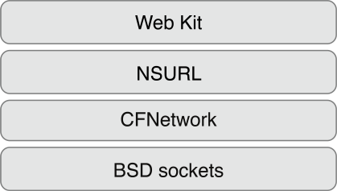
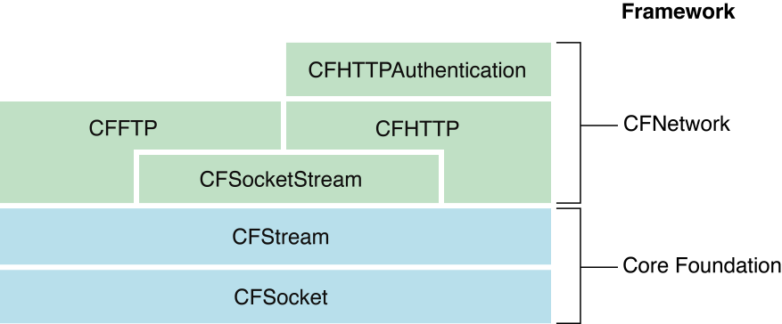

# CFNetwork  
CFNetwork 是 MacOS/iOS 系统较底层的网络框架，通过C 语言实现,dui BSD socket 的轻量级封装。在系统实现中，将网络编程部分分为4部分： WebKit, NSURL, CFNetwork, BSD sockets  

* WebKit ： 属于cocoa层， 主要用于页面渲染 WKWebview 等web 框架  
* NSURL： 属于cocoa层，对各种请求的封装  
* CFNetwork： 属于 Core Foundation 层，基于C 实现  
* BSD sockets: 属于OS层，基于C 实现  

#### CFNetwork 主要功能
1. 使用 BSD socket  
2. 通过 SSL/TLS 创建加密链接  
3. 解析 DNS  
4. 验证与使用 HTTP/HTTPS 
5. 使用FTP 服务  
6. 发布，解析和浏览Bonjour服务(此部分在[ NSNetServices and CFNetServices Programming Guide](https://developer.apple.com/library/archive/documentation/Networking/Conceptual/NSNetServiceProgGuide/Introduction.html#//apple_ref/doc/uid/TP40002736)查看)
  


## CFNetwork Concepts  
CFNetwork是一个低级，高性能的框架，够对协议栈进行详细控制，针对标准socket API 提供对象性抽象API，简化操作，例如： FTP 和HTTP 以及 DNS 解析。 CFNetwork 无论在理论和实现上都是基于 BSD socket 的  

  
> 来源官方文档   


### When to Use
与BSD socket 相比，CFNetwork 具有很多优点。其与 run-loop 可以很好的结合， 可以通过runloop 协助处理网络请求。CFNetwork 包含很多对象，可以帮助你实现各种网络需求，无需进行更多的底层设置开发。例如： 可以通过 `CFFTP API` 方便的实现 FTP协议，不需要实现很多细节。   

__总结:__ __当你需要对网络操作进行更底层的控制时，但又 不想基于Socket 来实现时，可以使用 CFNetwork__   
  


### 基础架构  
CFNetwork 主要依赖于 `CFSocket` 与 `CFStream` 两部分来实现     


> CFNetwork 架构图  此部分来自官方文档    


#### CFSocket  
此部分是所有网络操作最基础部分，它允许任意两个 socket（本地或者网络） 进行连接，并进行数据交换  
最常见的 socket 是 [`BSD socket`](https://zh.wikipedia.org/wiki/Berkeley%E5%A5%97%E6%8E%A5%E5%AD%97), CFSocket 是基于 BSD socket 实现的。CFSocket几乎提供了BSD套接字的所有功能， 并且对其提供了 run-loop 支持。__CFSocket不仅限于基于流的套接字， 可以处理任何类型的socket__    


可以使用以`CFSocketCreate` 开头的函数来创建一个 CFSocket 对象， 或者使用 `CFSocketCreateWithNative` 函数从 BSD socket 来创建。 然后通过`CFSocketCreateRunLoopSource ` 函数来创建一个runloop 源，通过`CFRunLoopAddSource ` 函数添加进 Runloop 循环中。这将在CFSocket对象收到消息时运行CFSocket回调函数

##### 总结 
1. CFSocket 是基于 BSD Socket 实现的， 并提供RunLoop 支持
2. `CFSocketCreate` 开头的函数都可以创建 CFSocket 对象    
3. `CFSocketCreateWithNative` 可以将一个 BSD socket 转换为 CFSocket 对象  
4. 通过`CFSocketCreateRunLoopSource`创建RunLoop 源，并通过`CFRunLoopAddSource`添加到循环中以处理回调  


#### CFStream  
读写流提供一种与设备无关的简单高效的数据交换方式。可以为 内容中数据、文件、或者使用sockets的网络创建一个流对象，也可以通过流避免一次性将数据读到内存中。流是通过通信路径串行传输的字节序列。流是单向，为了实现双向通信，输入流和输出流必须是相对出现的，除基于文件的流外，您无法在流中进行搜索;一旦提供或消费了流数据，就无法再从流中检索它  

`CFStream` 提供两个CF类型的对象`CFReadStream `和`CFReadStream ` 为流操作提供抽象API实现。两个类中所有API 都遵循 常见的 `Core Foundation API`规范。 `CFStream` 是构建与`CFSockets`之上，是CFHTTP和CFFTP的基础。     

在使用读写流时，可以像UNIX 文件描述符一样简单。首先， 通过指定流类型和其他参数来初始化流; 接下来打开流；最后，在使用关闭，关闭流。(可以通过流对象，获取其内部的属性信息)  

流操作会阻塞当前进程，直到流才做成功(写入或读取到至少一个字节)， 可以通过基于runloop异步函数回调来实现非阻塞调用  

此外， CFStream还内置了对安全套接字层（SSL）协议的支持。通过设置一个包含SSL 信息的字典(例如所需的安全级别或自签名证书)，将其作为`kCFStreamPropertySSLSettings `属性的参数传递给流，使流百纳威 SSL流


##### 总结  
1. 提供了读写流，就要 CFSockets实现  
2. 整个流程 初始化，打开，读写，关闭  
3. 提供了 SSL 支持，通过设置属性内容实现


### API 概念  
在具体的了解其API功能之前，首先先要了解整个框架的组成架构。 CFNetwork框架分为多个单独的API模块，每个API模块都涵盖特定的网络协议。这些模块可以组合使用，也可以单独使用。 CFNetwork 主要包含以下功能：      

#### CFFTP API  
主要用于与 FTP 服务进行连接以实现文件的上传和下载， 主要包含以下功能：   

* 从FTP服务器下载文件  
* 上传文件到FTP 服务器 
* 从 ftp 服务器下载目录列表(查看文件列表)  
* 创建目录  

在FTP操作中与其他操作是相同的，例如： 可以通过调用`CFReadStreamCreateWithFTPURL` 函数创建 FTP操作没通过可以通过`CFReadStreamGetError ` 函数检查状态等， 通过设置不同的属性，以实现自定义操作    

`CFFTP` 分为 __同步__ 和 __异步__ 。要打开与创建FTP连接，使用`CFReadStreamOpen ` , 要从流中读取数据，使用`CFReadStreamRead `函数并提供在`CFReadStreamRef `创建FTP读取流返回的引用。


#### CFHTTP API  
`CFHTTP `是针对 HTTP 协议的抽象，可以实现HTTP请求的发送与接收   
> HTTP(超文本传输协议) 是客户端与服务器之间的请求/响应协议。 客户端创建请求消息，并针对消息序列化转化为原始字节流，然后将请求消息发送到服务器，服务器针对消息做出具体的响应处理，返回结果   

创建HTTP请求需要的内容：
  
1. 请求方式， 可以是协议中定义的多种请求方式中一种 `OPTIONS`，`GET`，`HEAD`，`POST`，`PUT`，`DELETE`，`TRACE`，`CONNECT`
2. URL  
3. HTTP协议版本  
4. 消息标题  
5. 消息正文   


#### CFHTTPAuthentication API 
提供了网络请求鉴权服务，当处于一个没有凭证的访问时，服务器返回授权质询(通常为401或407响应)。`CFHTTPAuthentication ` 将身份凭证应用于质询HTTP消息。其支持一下几种方案：   

* Basic
* Digest
* NT LAN Manager (NTLM)
* Simple and Protected GSS-API Negotiation Mechanism (SPNEGO)


#### CFHost API 
提供了获取主机信息功能，包括名称、地址、可访问性等信息   

使用方式与CFStream 相同：    

1. 创建CFHost 对象 
2. 开始解析 CFHost 对象  
3. 检索地址，主机名或可访问性  
4. 销毁 CFHost 对象  

与所有CFNetwork功能一样，__CFHost与IPv4和IPv6兼容__ .  使用CFHost，您可以编写完全透明地处理IPv4和IPv6的代码。    
CFHost与CFNetwork的其他部分紧密结合。例如，调用CFStream函数CFStreamCreatePairWithSocketToCFHost将直接从CFHost对象创建CFStream对象。    


#### CFNetServices API  
如果你希望应用程序使用Bonjour注册服务或发现服务，请使用CFNetServices API。    
> Bonjour是Apple的零配置网络（ZEROCONF）实现，它允许您发布，发现和解析网络服务。    

CFNetServices API定义了三种对象类型：`CFNetService`，`CFNetServiceBrowser`和`CFNetServiceMonitor`。CFNetService对象表示单个网络服务，例如打印机或文件服务器。它包含另一台计算机解析该服务器所需的所有信息，例如名称，类型，域和端口号。`CFNetServiceBrowser`是用于发现域内域和网络服务的对象。`CFNetServiceMonitor`对象用于监视CFNetService对象的更改，例如iChat中的状态消息。


#### CFNetDiagnostics API  
连接到网络的应用程序依赖于稳定的连接。如果网络出现故障，则会导致应用程序出现问题。通过采用CFNetDiagnostics API，用户可以自我诊断网络问题，例如：   
 
* 物理连接故障（例如，电缆已拔下）
* 网络故障（例如，DNS或DHCP服务器不再响应）
* 配置失败（例如，代理配置不正确）


通过向CFNetDiagnostics提供网络故障的上下文，您可以调用该CFNetDiagnosticDiagnoseProblemInteractively功能引导用户完成提示以找到解决方案。此外，您可以使用CFNetDiagnostics查询连接状态并向用户提供统一的错误消息。     


## Streams   
本章主要关于流操作，包括： 流创建， 如何在读取或写入流时阻塞等操作   
### 1. Read Streams  
Core Foundation流可用于读取或写入文件或使用网络套接字。除了创建过程有所差异，其他行为类似    

1. 创建流   

	```
	CFReadStreamRef myReadStream = CFReadStreamCreateWithFile（kCFAllocatorDefault，fileURL）;    
	kCFAllocatorDefault:参数标明使用当前系统默认的策略为流分配内存
	```

2. 打开流   

	```
	if（！CFReadStreamOpen（myReadStream））{
    CFStreamError myErr = CFReadStreamGetError（myReadStream）;
    	 // 发生了错误。
        if（myErr.domain == kCFStreamErrorDomainPOSIX）{
        		//将myErr.error解释为UNIX错误。
        } else if（myErr.domain == kCFStreamErrorDomainMacOSStatus）{
        	//将myErr.error解释为MacOS错误代码。
            OSStatus macError =（OSStatus）myErr.error;
        		//检查其他错误域。
	    }
	}
	```  
	
	> `CFReadStreamOpen` 该函数返回 true / false ，当返回 false 时，可以通过`CFReadStreamGetError`函数获取到具体的错误信息。此返回返回一个 `CFStreamError`结构体，包括了 `domain code and an error code`其中 `domain code` 标记的是此错误的类型  
	> __此函数并没有真正打开流，而是标记打开动作开始，避免阻塞，需要通过`CFReadStreamGetStatus`和`CFWriteStreamGetStatus`函数来获取此刻状态。不过。读写操作都必须阻塞直到完全打开__  
	
3. 读取  
	要从流中读取数据，需要使用`CFReadStreamRead` 函数，该函数和 UNIX `read()`函数类似。都需要指定缓冲区和缓冲区长度，返回读取到的字节数，0 表示正常处于流或文件末尾，-1 表示发生错误。     
	
	```
	CFIndex numBytesRead;
	do {
	    UInt8 buf[myReadBufferSize]; // define myReadBufferSize as desired
	    numBytesRead = CFReadStreamRead(myReadStream, buf, sizeof(buf));
	    if( numBytesRead > 0 ) {
	        handleBytes(buf, numBytesRead);
	    } else if( numBytesRead < 0 ) {
	        CFStreamError error = CFReadStreamGetError(myReadStream);
	        reportError(error);
	    }
	} while( numBytesRead > 0 );
	```


4. 关闭流  
	读取所有数据后，应调用该CFReadStreamClose函数关闭流，从而释放与之关联的系统资源。然后通过调用该函数释放流引用CFRelease   
	
	```
	CFReadStreamClose（myReadStream）;
	CFRelease（myReadStream）;
	myReadStream = NULL;
	```

### 2. Write Streams   
写入流与读取流类似。唯一的区别就是`CFWriteStreamWrite`并不保证一次性接收内容所有字节，所有词操作是一个循环写入的过程    

```
// 1. 创建流
CFWriteStreamRef myWriteStream =
        CFWriteStreamCreateWithFile(kCFAllocatorDefault, fileURL); 
// 2. 打开流
if (!CFWriteStreamOpen(myWriteStream)) {
    CFStreamError myErr = CFWriteStreamGetError(myWriteStream);
    // An error has occurred.
    if (myErr.domain == kCFStreamErrorDomainPOSIX) {
    // Interpret myErr.error as a UNIX errno.
    } else if (myErr.domain == kCFStreamErrorDomainMacOSStatus) {
        // Interpret myErr.error as a MacOS error code.
        OSStatus macError = (OSStatus)myErr.error;
        // Check other error domains.
    }
}
UInt8 buf[] = “Hello, world”;
CFIndex bufLen = (CFIndex)strlen(buf);
 
// 3. 写入
while (!done) {
    CFIndex bytesWritten = CFWriteStreamWrite(myWriteStream, buf, (CFIndex)bufLen);
    if (bytesWritten < 0) {
        CFStreamError error = CFWriteStreamGetError(myWriteStream);
        reportError(error);
    } else if (bytesWritten == 0) {
        if (CFWriteStreamGetStatus(myWriteStream) == kCFStreamStatusAtEnd) {
            done = TRUE;
        }
    } else if (bytesWritten != bufLen) {
        // Determine how much has been written and adjust the buffer
        bufLen = bufLen - bytesWritten;
        memmove(buf, buf + bytesWritten, bufLen);
 
        // Figure out what went wrong with the write stream
        CFStreamError error = CFWriteStreamGetError(myWriteStream);
        reportError(error);
 
    }
}

4. 关闭

CFWriteStreamClose(myWriteStream);
CFRelease(myWriteStream);
myWriteStream = NULL;
```


### 3. 流阻塞问题解决   
在使用流操作时， 可能会遇到数据传输需要长时间，如果使用同步流，则整个应用都将阻塞等待流操作完成，需要通过其他方式解决流阻塞问题   
在流操作中，可以通过两种方式来解决阻塞问题：    

* 使用 `Runloop`，注册以接收与流相关的事件并在运行循环上调度流。发生与流相关的事件时，将调用您的回调函数   
* 轮询，对于读取流，在读取之前，查明是否有要读取的字节。 对于写入流，在写入之前，确定是否可以再不阻塞的情况下写入流    

#### Run Loop  
通过Runloop 的方式，注册事件， 避免轮询导致线程阻塞   

```


```


## 参考  
* [Introduction to CFNetwork Programming Guide](https://developer.apple.com/library/archive/documentation/Networking/Conceptual/CFNetwork/Introduction/Introduction.html)