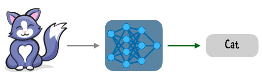
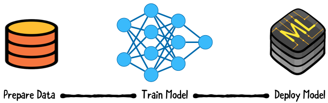
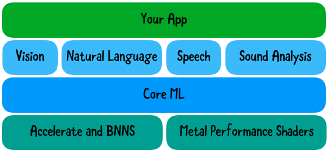

[原文地址](https://www.kodeco.com/7960296-core-ml-and-vision-tutorial-on-device-training-on-ios) 


## 什么是机器学习 
人工智能或 AI 是以编程方式添加到机器以模仿人类行为和思想的能力。 
机器学习或 ML 是 AI 的一个子集，它训练机器执行某些任务。例如，您可以使用 ML 训练机器识别图像中的猫或将文本从一种语言翻译成另一种语言。  

深度学习是训练机器的一种方法。该技术模仿人脑，人脑由组织成网络的神经元组成。深度学习根据提供的数据训练人工神经网络。 


## 模型训练 
将模型视为一个函数，它接受输入，对给定的输入执行最佳的特定操作，例如学习，然后进行预测和分类，并产生合适的输出。  

  
使用标记数据进行训练称为—__监督学习__. 需要大量好的数据来构建好的模型


训练是计算密集型的，通常在服务器上完成

  


## Apple 的机器学习框架和工具 

Core ML 使用特定领域的框架，例如用于图像分析的 Vision。Vision 提供高级 API 以在图像和视频上运行计算机视觉算法。Vision 可以使用 Apple 提供的内置模型或您提供的自定义 Core ML 模型对图像进行分类。  

  


## 将 Core ML 模型集成到应用程序中
* 将模型导入到项目中 
* 生成模型对应的类文件 
* 创建 一个或多个请求 
* 创建并运行请求处理程序 


### 创建请求 
```swift 

import CoreML
import Vision


// 1
private lazy var classificationRequest: VNCoreMLRequest = {
  do {
    // 2
    let model = try VNCoreMLModel(for: SqueezeNet().model)
    // 3
    let request = VNCoreMLRequest(model: model) { request, _ in
        if let classifications = 
          request.results as? [VNClassificationObservation] {
          print("Classification results: \(classifications)")
        }
    }
    // 4
    request.imageCropAndScaleOption = .centerCrop
    return request
  } catch {
    // 5
    fatalError("Failed to load Vision ML model: \(error)")
  }
}()


```
> 说明： 
* 定义在首次访问时创建的图像分析请求。
* 创建模型的实例。
* 根据模型实例化图像分析请求对象。完成处理程序接收分类结果并打印出来。
* 使用 Vision 裁剪输入图像以匹配模型的预期。
* 通过终止应用程序来处理模型加载错误。该模型是应用程序包的一部分，因此永远不会发生这种情况。

#### 整合请求 
```swift 

func classifyImage(_ image: UIImage) {
  // 1
  guard let orientation = CGImagePropertyOrientation(
    rawValue: UInt32(image.imageOrientation.rawValue)) else {
    return
  }
  guard let ciImage = CIImage(image: image) else {
    fatalError("Unable to create \(CIImage.self) from \(image).")
  }
  // 2 
  DispatchQueue.global(qos: .userInitiated).async {
    let handler =
      VNImageRequestHandler(ciImage: ciImage, orientation: orientation)
    do {
        // 使用请求
      try handler.perform([self.classificationRequest])
    } catch {
      print("Failed to perform classification.\n\(error.localizedDescription)")
    }
  }
}


```


## 在设备上个性化模型  

### k-最近邻 
k-NN算法假设相似的事物彼此接近。  
它通过比较特征向量来做到这一点。特征向量包含描述对象特征的重要信息。一个示例特征向量是由 R、G、B 表示的 RGB 颜色。

比较特征向量之间的距离是查看两个对象是否相似的一种简单方法。k-NN 使用输入的k个最近邻居对输入进行分类。


