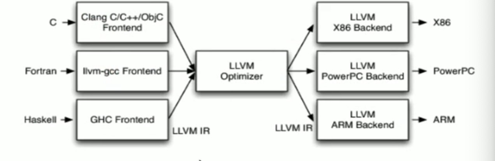
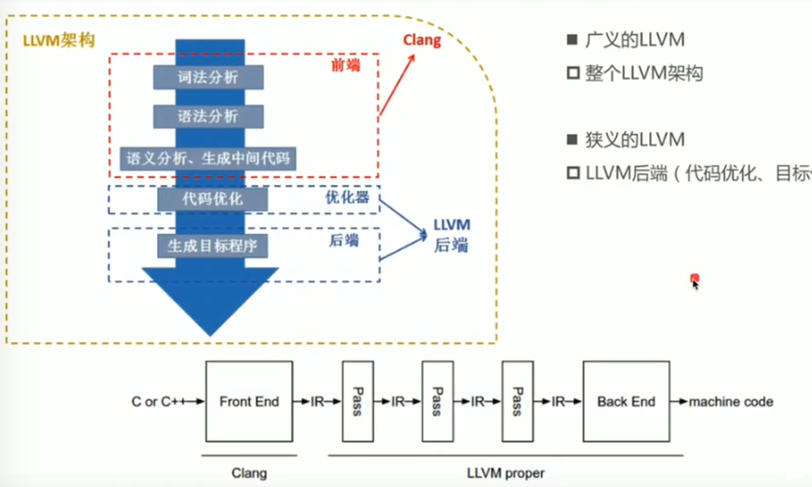

## LLVM   

### 简介  
> 查看官方网站   


##### 编译器  
* GCC 
* LLVM  
* Clang  

##### 编译器架构  
* Frontend(前端)  
	编译器前端， 对代码进行词法分析，语法分析，语义分析，生成中间代码  

* Optimizer(优化器)  
	中间代码优化    
	
* Backend(后端)
	生成机器码 


##### LLVM 架构  
   
> 不同的前端后端使用统一的中间代码 LLVM Intermediate Representation(LLVM IR)


##### Clang  
是一个 LLVM 的子项目  
基于 LLVM 架构的 C/C++/Objective-C 编译器前端  

* 优点 ：
	* 编译速度快，在某些平台下，Clang 编译速度快过 GCC  
	* 占用内存小： Clang 生成的AST 锁占用内存是GCC五分之一  
	* 模块化设计： 基于库的模块化设计，易于IDE集成  
	* 诊断信息可读性强：   




### 编译过程    
0. 测试代码  

```
include <stdio.h> 

#define A 50 

int main(int argc, const char * argv[]){
	int a = 10;
	int b = 20; 
	int c = a + b + A; 
	return 0; 
}

```


1. 获取编译阶段  
	`clang -ccc-print-phases mian.m` 打印编译阶段   
	```
	0: input "main.m", objective-c  
	// 找到文件
	1: preprocessor, {0}, objective-c-cpp-output  
	// 预处理器，处理宏定义等
	2: compiler,{1} ir 
	// 编译
	3: backend, {2}, assembler 
	// 生成目标代码 
	4: assembler,{3} , object  
	// 链接
	5: linker,{4},image 
	// 针对架构编译
	6:bind-arch,"x86_64",{5}, image
	
	```
	
	1. 预处理器阶段  
		`clang -E main.m`   
		针对头文件的引用以及宏定义进行替换  
2. 词法分析   
	将所有的源代码生成 token
	`clang -fmodules -E -Xclang -dump-tokens main.m`  
	将整个代码中的所有内容进行拆分，只要是隔开的都会拆分，标点符号也会，并且带有当前内容在源码中的位置信息  

3. 语法分析  
	生成语法树, 将词法分析生成的Token 转换为语法🌲  
	`clang -fmodules -fsyntax-only -Xclang -ast-dump main.m`

4. LLVM IR(中间代码)  
	有三种表现形式的中间代码  
	* text: 便于阅读文本格式，类似汇编语言`.ll`， 通过`clang -S -emit-llvm main.m`获得 
		* 基本语法： 
			* 注释以`;` 开头 
			* 全局标识以 `@` 开头 
			* 局部标识以 `%` 开头
			*  `alloca`，在当前函数栈帧中分配内存  
			*  `i32`, 32bit,4个字节  
			*  `align`,内存对齐  
			*  `store` 写入数据  
			*  `load` 读取数据  
  
	* momory: 内存格式  
	* bitcode: 二进制格式，`.bc`，通过 `clang -c -emit-llvm main.m`  


> 参考： [语法](https://llvm.org/docs/LangRef.html)


## 源码编译  
1. 下载LLVM 源码  
	`git clone https://git.llvm.org/git/llvm.git`  
	* 下载 clang  
		* `cd llvm/tools` 
		* `git clone https://git.llvm.org/git/clang.git`

2. 编译LLVM  
	* 安装 `cmake`和 `ninja`(/usr/local/bin)  
	* 创建模板存放文件夹`llvm_build`  
	* 生成对应的模板  
		`cd llvm_build` 
		`cmake -G Ninja ../llvm -DCMKAE_INSTALL_PREFIX=/xx/`
		指定源码目录，指定编译后文件存放目录
	
	* 开始编译   
		`ninja`  
	* 抽取二进制文件  
		`ninja install `
	

3. 应用 
	* libclang, libTooling  
		语法树分析，语法转换， 实现语言之间的转换  
	* Clang 插件开发  
		* [插件开发](https://clang.llvm.org/docs/ClangPlugins.html)
		* [插件开发](https://clang.llvm.org/docs/ExternalClangExamples.html)
		* [插件开发](https://clang.llvm.org/docs/RAVFrontedAction.html)
	
	* Pass 开发  
		进行代码优化，代码混淆  
	* 新的编程语言开发  
		* [参考](https://llvm-tutorial-cn.readthedocs.io/en/latest/index.html) 
		* [参考2](https://kaleidoscope-llvm-tutorial-zh-cn.readthedocs.io/zh_CN/latest/)
	

### 插件开发  
* 位置  
	`sources/tools/clang/tools/xxxx`  
* 加载插件  
	修改 `CMakeList.txt`文件，添加 `add_clang_subdirectory(xxxx)`  
* 编写插件 `CMakeList.txt`  
	在插件目录中创建`CMakeList.txt`, 然后添加插件源码加载  
	
	```
	add_llvm_loadable_module(
		xxxx # 此处是插件名 
		xxxx.cpp 
		xxxxs.cpp
	)
	
	```
* 编写源码  
	通过llvm 生成 Xcode 模板，通过Xcode 打开进行编辑  
	 
	```
	#include <iostream> 
	#include 'clang/AST/AST.h'
	#include 'clang/AST/ASTConsumer.h'
	#include 'clang/ASTMatchers/ASTMatchers.h'
	#include 'clang/ASTMatchers/ASTMatchFinder.h'
	#include 'clang/Frontend/CompilerInstance.h'
	#include 'clang/Frontend/FrontendPluginRegister.h'  
	
	
	// 命名空间 
	using namespace clang;
	using namespace std;
	using namespace llvm;
	using namespace clang::ast_matchers;
	
	namespace TKPlugin {
		// 动作  
		class TKAction: pubic PluginASTAction {
			// 重载方法  
			public: 
				bool ParseArgs(const CompilerInstance &ci, const vector<string> & args){
					return true;
				}
				unique_ptr<ASTConsumer> CreateASTConsumer(CompilerInstance &ci, StringRef iFile){
					// 返回自定义的 consumer 
					return unique_ptr<TKConsumer>(new TKConsumer(ci));
				}
		};
		
		class TKConsumer: public ASTConsumer { 
			private: 
				MatchFinder matcher;
				TKHandler hander;
			public:  
				// 构造器 
				TKConsumer(CompilerInstance &ci) : hander(ci) {
					// 添加了绑定，以及回调
					matcher.addMatcher(objcInterfaceDecl().bind("ObjCInterfaceDecl",&handler))
				}
				// 此方法回在 clang 生成一颗语法树时调用(每个源文件生成都会调用一次)
				void HandleTranslationUnit(ASTContext &context) {
						// context 包含了语法树信息
						matcher.matchAST(context);
				}
		
		}
		
		class TKHandler: public MatchFinder::MatchCallback {
			private: 
				CompilerInstance &ci;
			public: 
				TKHander(CompilerIntance &ci):ci(ci) {}  
				
				void run(const MatchFinder::MatchResult &result) {
					if (const ObjCInterfaceDecl * decl = Result.Nodes.getNodeAs<ObjCInterfaceDecl>("ObjCInterfaceDecl")) {
					 size_t pos = decl->getName().find('_'); 
					 if (pos !+ StringRef::npos) {
					 	DiagnosticsEngine &D = ci.getDiagnostics(); 
					 	SourceLocation loc = decl->getLocation().getLocWithOffset(pos);
					 	D.Report(D.getCustomDiagID(DiagnosticsEngine::wARNING,"类名不能用户下划线"))
					 }
					}
				}
		
		};
	}
	// 注册插件
	static FrontendPluginRegister::Add<TKPlugin::TKAction> 
	X("TKPlugin","This is my first clang-plugin")
	
	
	```

* 加载插件  
	* 在需要加载插件的项目中修改，`Build Settings` -> `Other_CFLAGS`  
	`-Xclang -load -Xclang 动态路径 -Xclang -add-plugin -Xclang 插件名称`
	* 需要 `XcodeHacking`  
		修改 `XcodeHacking.xcplugin/Contents/Resources/HackedClang.xc`  
		```
		ExcePath = "/////" # 指定为自己编译的clang 编译器  
		```
	* 添加 插件到 Xcode中  
		```
		sudo mv HackedClang.xcplugin `xcode-select -print=path`/../Plugins/Xcode3Core.ideplugin/Contents/SharedSupport/Developer/Library/Xcode/Plug-ins``
		
		sudo mv HackedBuildSystem.xcspec `xcode-select -print=path`/Platforms/iPhoneSimulator.platform/Developer/Library/Xcode/Specifications``
		```
	

## 参考  
* [编译原理]()  
* [LLVM Cookbook]()  
* 


