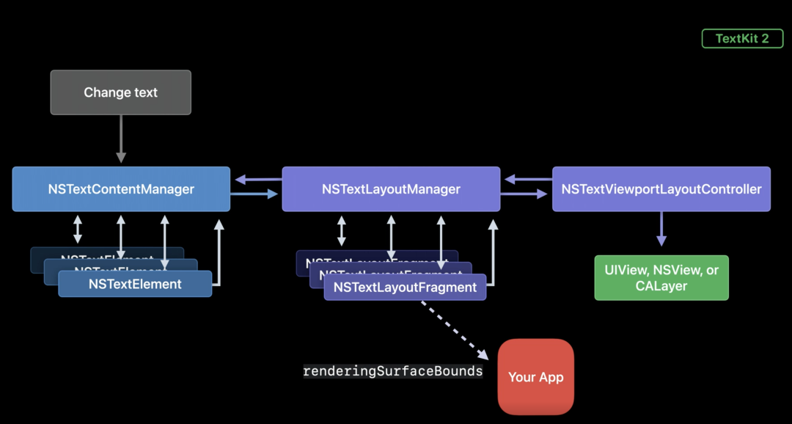

通过本文你将会了解到 TextKit 1 到 TextKit 2 的变化内容，并且可以深入了解 TextKit 2 的内部的工作原理和机制。

## 什么是TextKit
TextKit 是 Apple 在 iOS 7 中推出的文本处理工具包。用于驱动处理文本的计算、布局、渲染等文本相关的核心功能，它通过很少的几个类帮助开发者完成在之前必须使用 CoreText 通过复杂计算才能完成的任务，提高了 iOS 开发者对于文字展示和交互的开发效率，实际上它也是基于 CoreText 封装的高层次 API。然而在早在 20 多年前，TextKit 就已经首次出现在 OpenStep 的系统上。多年来，它从 macOS 10 就开始与我们一起成长和发展。从 iOS 第一个版本到 iOS 7 以及今天的 macOS 11 和 iOS 14，TextKit 在底层默默地为所有 Apple 的设备提供了最基本的文本功能服务着。

以上介绍的 TextKit 我们可以称之为 TextKit 1，几十年以来，设计和技术工程原理发生了很大变化，TextKit 1 最原始的设计原则，也已经有些过时了，因此提供与新技术完美集成的同时仍能提供高标准高性能的 API 变得更具挑战性。这也是为什么推出下一代 TextKit 的原因，TextKit 2 是 Apple 的下一代文本引擎，建立在一系列前瞻性设计原则之上。让我们一起来了解一下吧。

## TextKit 2
其实在 MacOS Big Sur 中，Apple 更新了操作系统中很多文本组件底层实现，在幕后已经使用了 TextKit 2。老生常谈，让我们来先看下 TextKit 2 的架构：


TextKit 1 和 TextKit 2 在系统中是共同存在的。就像它的前身一样，TextKit 2 建立在 Foundation、Quartz 和 Core Text 之上。UIKit 和 AppKit 中的文本控件建立在 TextKit 2 之上。

当然 TextKit 2 还保留了其前身的 MVC 设计。Model 和 Controller 是我们这次最大的变化部分，其中增加很多的新的朋友，当然也不要害怕，我们后文中会一一介绍。

那么先让我们从设计原则开始逐步深入我们今天的内容。TextKit 2 的核心设计原则是

* 准确性
* 安全性
* 高性能

所有三个原则都很重要，这是构建 TextKit 2 的最核心的思想，Apple 希望可以尽可能的去完美的实现这些特性，然而，现实中也做一些平衡。首先我会简单的介绍下各个核心原则的内容，以便让你对今天的内容有一个初步的概念：

* 为了准确性，TextKit 2 抽象了字形处理。
* 为了安全性，TextKit 2 更加关注值语义。
* 为了高性能，TextKit 2 使用基于视口的布局和渲染。

没错，这个就是我们今天介绍的核心内容，接下去，让我们一个个来深入了解。

## 准确性
首先我们将会从准确性开始介绍，在准确性方面，Apple 抽象了字形处理，为国际文本提供一致的体验。Apple 设备在被世界各地的用户使用着，因此为所有语言的文本提供正确的布局、渲染和交互是非常重要的。我们希望每个人都能够在他们的设备上阅读文本并与之交互。然而在 TextKit 1 的一些 API 的设计使得很难以正确的方式处理国际化文本。

在开始本章节之前，我们可以先了解下排版系统中关于文本显示部分的重要概念，也可以对排版系统做一个基本的入门。

### 字符（Characters）与字形（Glyphs）
排版系统中文本显示的一个重要的过程就是字符到字形的转换。

__字符（Characters）__：字符是信息本身的元素，而字形是字符的图形表征，字符还会有其它表征比如发音。字符在计算机中其实就是一个编码，某个字符集中的编码，比如 Unicode 字符集，就囊括了大都数存在的字符。

__字形（Glyphs）__：字形是图形，一般都存储在字体文件中，字形也有它的编码，也就是它在字体中的索引。一个字符可以对应多个字形（不同的字体，或者同种字体的不同样式：粗体斜体等）多个字符也可能对应一个字形。

许多西方语言中，一个字形 Glyphs 通常代表一个字符。

但这并不总是正确的。你可以有多个字形代表一个字符，也可以相反。一个字形可以代表多个字符。这种用于表示多个字符的单个字形称为连字。

在西方语言中没有太多的连字，它们通常不会影响文本的易读性。你可以在没有连字的情况下阅读它。但并非所有语言都如此。像阿拉伯语和梵文这样的语言使用了很多连字，连字则会影响可读性。如阿拉伯文字的这个词。这是一个乌尔都语单词，意思是"时刻"。右侧用连字绘制的完整单词与左侧的单个字符看起来非常不同。

在 TextKit 1 中的许多 API 需要使用字形索引或范围。例如要获取某些文本的边界矩形，你需要知道你想要的文本的字形范围，在西方语言中，索引的获取是相对容易且正确的，然而在连字的情况下，获取正确的索引则不是一个简单的事情。

由于许多 TextKit 1 API 需要字形范围，因此使用这些 API 可能会破坏复杂语言的布局和渲染的准确性。这就是 TextKit 2 抽象字形处理的原因。TextKit 2 使用 CoreText 渲染所有文本，在 TextKit 2 中，你不需要管理复杂字形。相反，你可以使用更高级别的抽象对象来控制文本布局和交互。

> 阅读参考资料：https://devma.cn/blog/2016/04/14/ios-coretextru-men-zhi-zi-xing/

> https://juejin.cn/post/6844903838252531725

### NSTextSelection & NSTextSelectionNavigation
它包含文本选择的所有必要上下文信息，例如其词语粒度、上下文关联性以及构成选择的文本范围。NSTextSelection 上的这些属性都是只读的，因此你不会修改选择对象的实例从而错误的更改它们。


如果需要改变选择的文本的信息，那么可以直接使用 NSTextSelectionNavigation 对象来查询和更新选择的文本范围。

### NSTextLocation & NSTextRange
它们与 UIKit 中的 UITextPosition 和 UITextRange 类非常相似，只是你不在需要对它们进行子类化。大多数情况下，你可以在 TextKit 2 中使用默认位置和范围对象。使用对象而不是数字而是更具表现力的文档模型，因为范围是根据彼此相对的位置定义的。如下的 HTML 文档对象模型就是一个很好的例子。

这就是 TextKit 2 中对准确性所做的一些改变。

### 安全性
接下来是安全性方面的介绍。在这方面，TextKit 2 更加强调值语义，以更好地与 Swift 和 SwiftUI 等技术的保持一致。什么是值语义呢？值类型保留数据的唯一副本，以防止该数据发生变更，这可以避免意外共享相关内存从而引发未感知的变化，从而让我们的代码更安全、更稳定。但是值类型并不是实现此效果的唯一方式。不可变类也具有初始化后无法更改的特性，这也可以防止了其数据的变化。这些类的行为类似于值类型，因此我们将它们称为具有值语义。

在 TextKit 2 中的许多类都是以这种方式设计的。为了说明这种设计的优势，让我们重新梳理一下 TextKit 1 渲染流程：

简短的说明：文字更新导致文本存储的变化并且通知布局管理器，然后布局管理器将生成字形、定位它们并将它们直接绘制到视图中。使用这种方式直接绘制到视图中的方式，很难弄清楚在何处分隔文本以创建自定义绘制空间。

让我们在来看下 TextKit 2 的渲染流程：

新的流程则会是：

文本的更新通过一个称为 NSTextContentManager 的新对象。NSTextContentManager 对象将文本分成 NSTextElement。当需要进行布局时，NSTextLayoutManager 会向 NSTextContentManager 获取 NSTextElement。然后 NSTextLayoutManager 将 NSTextElement 布局到文本容器中，并生成包含布局和定位信息的 NSTextLayoutFragment 。当需要显示时，NSTextLayoutFragment 会传递给 NSTextViewportLayoutController 控制器，它会在你选择的渲染对象（无论是 View 还是 Layer）中处理这些片段的定位和布局。此过程涉及许多新对象。这也是强调值语义的地方，我们可以通过在正确的时机（ delegate 方法）进行更改，创建新的对象实例并将它们返回给系统，系统使用替换对象来进行布局和显示。

### NSTextElement
NSTextElement 是文档的构建块，每个 NSTextElement 代表内容的一部分，并包含描述它在文档中的位置的范围。NSTextElement 具有值语义。它们的属性（包括范围）是不可变的，并且在创建后无法更改。将文档建模为一系列 NSTextElement 而不是字符给了我们更高的自由度。我们能够轻松区分给定元素代表的内容类型，是一段文本、附件还是其他一些自定义类型以便我们可以根据元素的类型决定如何布置元素。


### NSTextContentManager
NSTextContentManager 知道如何从文本内容生成 NSTextElement 并在整个文档中并且追踪这些元素的使用。NSTextContentManager 提供了将原始数据转换为 NSTextElement 的接口。NSTextContentManager 和 NSTextElement 都是抽象类型，如果需要使用自定义文档模型可以对它们进行子类化操作。但大多数情况下，你可以直接使用 TextKit 2 提供的默认设置。

### NSTextContentStorage & NSTextParagraph
NSTextContentStorage 是一个使用 NSTextStorage 作为存储的内容管理器。它知道如何将文本存储的内容划分为段落元素，这些元素也就是 NSTextParagraph 的实例。NSTextContentStorage 还知道如何在文本发生变化时生成更新的段落元素。

> 在对文本进行更改时，应该将更新包装在 performEditingTransaction 方法中。这可确保 TextKit 2 系统的其他部分感知到变化。

### NSTextLayoutManager
NSTextLayoutManager 与 TextKit 1 中旧的 NSLayoutManager 类似，但 NSTextLayoutManager 不处理字形。并且 NSTextLayoutManager 可以获取文本元素，并将它们布置到文本容器中，并为这些元素生成布局片段信息 NSTextLayoutFragment。

### NSTextLayoutFragment
NSTextLayoutFragment 包含一个或多个文本元素的布局信息。它们使用值语义并且它们的属性是不可变的。NSTextLayoutFragment 通过三个属性传达布局信息：textLineFragments 数组、layoutFragmentFrame 和 renderingSurfaceBounds 方法。如果你想自定义或更改布局，可以从这几个方法入手。

如下的代码示例，我们可以添加在文字布局外层添加一个气泡的背景：

```swift 

class BubbleLayoutFragment: NSTextLayoutFragment {

    // 返回渲染布局范围
    override var renderingSurfaceBounds: CGRect {
        return bubbleRect.union(super.renderingSurfaceBounds)
    }

    // 气泡绘制的实现
    override func draw(at renderingOrigin: CGPoint, in ctx: CGContext) {
        ctx.saveGState()
        let bubblePath = createBubblePath(with: ctx)
        ctx.addPath(bubblePath)
        ctx.setFillColor(bubbleColor.cgColor)
        ctx.fillPath()
        ctx.restoreGState()
        super.draw(at: renderingOrigin, in: ctx)
    }
}

```

那么我们可以从哪个时机给系统我们自定义的 NSTextLayoutFragment 呢？答案是在 NSTextLayoutManagerDelegate 协议中。

代码示例：

```swift 
func textLayoutManager(_ textLayoutManager: NSTextLayoutManager,
                           textLayoutFragmentFor location: NSTextLocation,
                           in textElement: NSTextElement) -> NSTextLayoutFragment {
            // Something Code
            return NSTextLayoutFragment(textElement: textElement, range: textElement.elementRange)
        }
    }

```
以上的部分就是 TextKit 2 在安全性方面的工作。

## 高性能
高性能是任何文本引擎面临的最大挑战之一。TextKit 2 在日常生活的场景中速度非常快，从快速渲染只有几行的标签到以交互滚动数百兆字节的文档布局中都可以体现。对于这些场景，当你用可变速率滚动浏览这些非常大的文档时，不连续的文本布局对于性能来说绝对是必不可少的。

连续和非连续布局之间的区别是什么呢？用2张图来说明一下

在可视的范围之外，布局依然存在，这个叫做连续的布局。

只在可视的范围之内的布局，打破文档布局结构，这个叫做不连续的布局。

在 TextKit 2 中的布局总是不连续的。仅对屏幕上可见的文本部分执行布局以及额外的过度滚动区域来提高性能，从而产生更流畅的滚动体验。相比之下，非连续布局在 TextKit 1 中是可选的。使用 TextKit 1，你只能打开或关闭非连续布局。在 TextKit 2 中你可以在视口布局之前、期间和之后收到回调做出对文字部分排版和布局。为了获得最佳性能，你的代码应专注于处理视口区域内的布局信息，尽可能去避免为视口外的元素请求布局信息。

### NSTextViewportLayoutController
NSTextViewportLayoutController 是可见范围布局的控制器对象，NSTextViewportLayoutController在视口布局过程中对其 Delegate 调用三个重要方法：TextViewportLayoutControllerWillLayout、textViewportControllerConfigureRenderingSurface 和 textViewportLayoutControllerDidLayout。你可以在 TextViewportLayoutControllerWillLayout 执行任何准备工作以准备布局，例如清除视图或图层的内容。在处理布局中，NSTextViewportLayoutController为视口中可见的每个布局片段调用 textViewportControllerConfigureRenderingSurface 方法来达到渲染的目的。最后，NSTextViewportLayoutController 在完成对视口中可见的所有布局片段的布局后调用 didLayout 方法，可以在此处执行任何所需的更新。

这就是 TextKit 2 对保持高性能所做的努力。

## 系统组件的兼容
TextKit 2 所有新类都可以在 iOS 15 的 UIKit 和 macOS 12 的 AppKit 中使用，如果你想，今天就可以开始使用 TextKit 2 编写新代码。由于 TextKit 1 是内置文本控件不可或缺的一部分，所以系统组件也并非完全切换到 TextKit 2。下面是一些使用的注意事项：

* 对于 AppKit 开发人员，NSTextView 不会自动使用 TextKit 2。如果要将 TextKit 2 与 NSTextView 一起使用，则需要在创建时动态加入支持。
    

* 对于 NSTextField 的组件则默认使用 TextKit 2。
* 对于 UIKit 来说，UITextField 在 iOS 15 中自动使用 TextKit 2。
* 带有 TextKit 2 的 UITextView 在 iOS 15 中则不可用。
> 更多详细的可以查看 Apple 的开发者文档：https://developer.apple.com/documentation/appkit/textkit/using_textkit_2_to_interact_with_text

# 总结
TextKit 2 在今年给我们带来了大量更新。通过抽象字形的处理，让我们在处理多语言的情况下的得心应手避免了准确性的问题。通过对文档模型的抽象和计算布局流程的更新，赋予我们在整个文本渲染的流程中有更高的定制性，高效的实现我们对文本排版的自定义要求。高性能的秘密则是在只针对视野范围内的区域高效率的绘制，避免了视野外区域的排版和渲染的性能损耗，这也是让 TextKit 2 高效的原因。最后希望各位开发者可以利用 TextKit 2 的新特性，创造更多的创意和实现更酷炫效果。


> 在 Session 视频中带了一个 TextKit 2 的 Demo App，感兴趣的同学可以下载体验一下：https://docs-assets.developer.apple.com/published/fe5abca8d6/UsingTextKit2ToInteractWithText.zip?language=objc