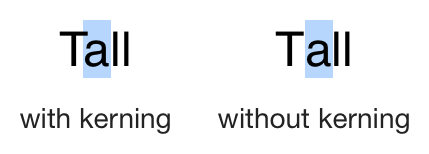
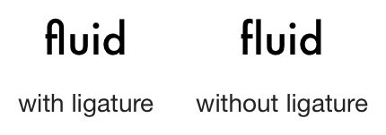
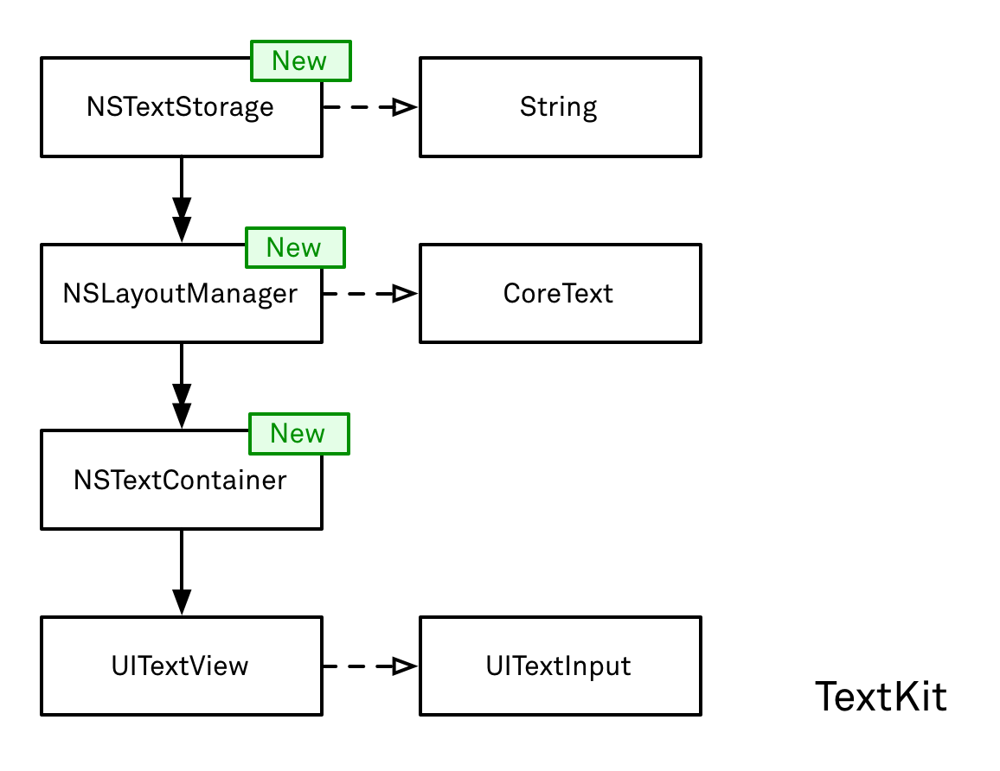
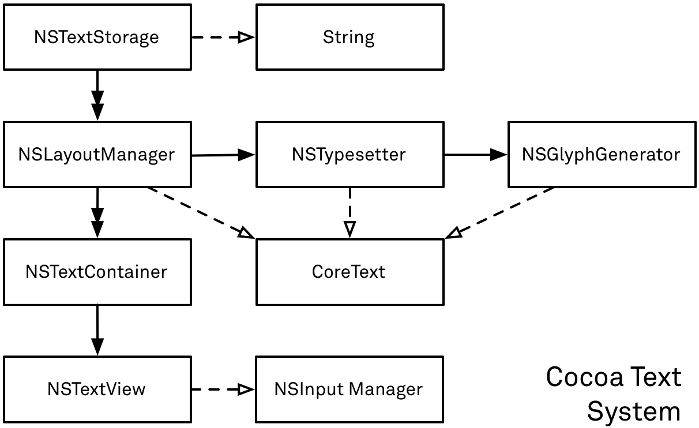

# TextKit

iOS 7 的发布为开发人员带来了许多新工具。其中之一是TextKit。TextKit 由 UIKit 中的一堆新类组成，顾名思义，它们以某种方式处理文本。在这里，我们将介绍 TextKit 是如何诞生的，它的全部内容，以及——通过几个例子——开发人员如何充分利用它。

但让我们先来看看：TextKit 可能是UIKit 中最重要的最新成员。iOS 7 的新界面用纯文本按钮替换了很多图标和边框。总体而言，文本和文本布局在操作系统的所有视觉方面都扮演着更为重要的角色。可以毫不夸张地说，iOS 7 的重新设计是由文本驱动的——文本全部由 TextKit 处理。

为了说明这种变化到底有多大：在 iOS 7 之前的每个版本中，（几乎）所有文本都由 WebKit 处理。没错：WebKit，Web 浏览器引擎。所有UILabels、UITextFields 和UITextViews 都以某种方式在后台使用 Web 视图来布局和呈现文本。对于新的界面风格，它们都经过重新设计以利用 TextKit。

## iOS 上的文字简史
这些新类不能替代以前可供开发人员使用的东西。TextKit 所做的对 SDK 来说是全新的。在 iOS 7 之前，TextKit 现在所做的所有事情都必须手动完成。它是现有功能之间缺失的环节。

很长一段时间以来，都有一个框架用于简单的文本布局和渲染：CoreText。还有一种方法可以直接从键盘获取用户的输入：UITextInput协议。在 iOS 6 中，甚至有一种方法几乎可以免费获得系统的文本选择：通过子类化UITextView.

（这可能是我应该透露我在运送文本编辑器方面 10 年经验的地方。）呈现文本和抓取键盘输入之间存在巨大（阅读：巨大）差距。这种差距可能也是为什么富文本或语法高亮编辑器总是如此之少的原因——毫无疑问，获得一个正确的文本编辑器需要几个月的工作。

所以这里是 - iOS 上（不是那么）简短的文本历史的简短概述：

__iOS 2__：第一个公共 SDK 包括一个简单的文本显示组件 ( UILabel)、一个简单的文本输入组件 ( UITextField)，以及一个用于大量文本的简单、可滚动、可编辑的组件：UITextView. 这些都是纯文本，没有选择支持（只有插入点），除了设置字体和文本颜色之外几乎不允许自定义。

__iOS 3__：新功能是复制和粘贴，并且作为这些功能的要求，还有文本选择。数据检测器引入了一种在文本视图中突出显示电话号码和 URL 的方法。但是，除了关闭或打开这些功能之外，开发人员基本上仍然无法影响任何事情。

__iOS 3.2__：iPad 的引入带来了 CoreText，前面提到的低级文本布局和渲染引擎（从 Mac OS X 10.5 移植而来），以及UITextInput前面提到的键盘访问。Apple 将 Pages 演示为移动设备上文本编辑的新灯塔 1。但是，由于我之前谈到的框架差距，只有极少数应用程序效仿。

__iOS 4__：在 iOS 3.2 之后几个月才发布，文本没有什么新东西。 （轶事：我在 WWDC，我走到工程师面前，告诉他们我想要 iOS 上的完全成熟的文本布局系统。答案：“是的......归档雷达。”并不意外......）

__iOS 5__：没有关于文本的消息。 （轶事：我在 WWDC 上向工程师介绍了 iOS 上的文本系统。答案是：“我们没有看到很多对此的请求……”Doh！）

__iOS 6__：一些动作：属性文本编辑来到UITextView. 不幸的是，它很难定制。默认 UI 使用粗体、斜体和下划线。用户可以设置字体大小和颜色。虽然乍一看这很好，但仍然无法控制布局或自定义文本属性的便捷方式。然而，对于（文本编辑）开发人员来说，有一个很大的新功能：UITextView除了以前可用的键盘输入之外，现在可以进行子类化以“免费”获得文本选择。必须实现完全自定义的文本选择可能会使以前大多数非纯文本工具的尝试停止。 （轶事：我，WWDC，工程师。我想要一个 iOS 上的文本系统。回答：“嗯。嗯。是的。也许吧？看，它只是不执行......”所以毕竟有希望，不是吗？ )

__iOS 7__：最后。文本套件。

## 特点 
所以我们在这里。带有 TextKit 的 iOS 7-land。让我们看看它能做什么！在我们深入探讨之前，我仍然想提一下，严格来说，这些事情中的大多数以前都是可能的。如果您有足够的资源和时间在 CoreText 之上构建文本引擎，那么这些都是可行的。但是，如果您以前想构建一个成熟的富文本编辑器，这可能意味着几个月的工作。现在，只需在 Xcode 中打开一个界面文件并将其UITextView放入您的视图控制器即可获得所有这些功能：

__字距调整__：放弃所有字符都具有简单的二次形状并且这些形状必须彼此完全相邻放置的想法。现代文本布局考虑到，例如，大写字母“T”在其“翅膀”下确实有很多可用空间，并将后面的小写字母靠得更近。这会显着提高文本的易读性，尤其是在较长的文章中。

 

__连字__：我认为这主要是一种艺术特征，但是当某些字符组合（如“f”后跟“l”）使用组合符号（所谓的字形）绘制时，某些文本确实看起来更好（更具艺术性）。

 

__图像附件__：现在可以在文本视图中包含图像。

__连字符__：对于编辑文本不是那么重要，但对于以一种漂亮且易读的方式呈现文本而言。断字意味着在行边界处拆分较长的单词，从而创建更均匀的流和整体文本的外观。 轶事：在 iOS 7 之前，开发人员必须直接使用 CoreText。像这样：首先检测每个句子的文本语言，然后获取句子中每个单词的可能断字点，然后在每个建议点插入自定义断字占位符。准备完成后，运行 CoreText 的布局并手动在换行中插入连字符。如果您想要很好的结果，请稍后检查带有连字符的文本是否仍然适合行的边界，如果不适合，请在不使用先前使用的连字符点的情况下重新运行行的布局。使用 TextKit，启用断字就像设置hyphenationFactor属性一样简单。

__可定制性__：对我来说，比改进的排版更重要的是，这是新功能。以前，开发人员可以选择使用现有的东西还是自己从头开始重写。现在有一组类具有委托协议或可以被覆盖以更改其部分行为。例如，您现在可以影响某些单词的换行行为，而无需重新编写完整的文本组件。我认为这是一场胜利。

__更多富文本属性__：现在可以设置不同的下划线样式（双线、粗线、虚线、点线或它们的组合）。移动文本基线非常容易，例如，用于上标数字。此外，开发人员不再需要自己为自定义渲染文本绘制背景颜色（CoreText 不支持这些）。

__序列化__：以前，没有内置方法可以从磁盘读取具有文本属性的字符串。或者重新写出来。现在有。

__文本样式__：iOS 7 的界面引入了全局预定义文本类型的新概念。这些类型的文本被分配了一个全局预定义的外观。理想情况下，这将导致标题和连续文本在整个系统中看起来都相同。用户可以从首选项应用程序定义他们的阅读习惯（如文本大小），使用文本样式的应用程序将自动具有正确的文本大小和外观。

__文字效果__：最后也是最少的。在 iOS 7 中，只有一种文字效果：凸版印刷。具有这种效果的文本看起来像是被物理地印在一张纸上。内部阴影等。 意见：真的吗？什么……？在一个完全、彻底、不可原谅地杀死无用的拟物化的操作系统中，谁需要在纸上印上文字的外观？

## 结构
获得系统概览的最佳方式可能是绘制图像。这是 UIKit 的文本系统 TextKit 的示意图：

 

从图片中可以看出，让文本引擎工作需要几个演员。我们将从外部开始介绍它们：

__字符串__：有文本要绘制的地方，必须有一个字符串来保存它。在默认配置中，字符串包含在NSTextStorage，在这些情况下，它可能会从绘图中省略。但不一定如此。使用 TextKit，文本可以来自适合用例的任何来源。例如，对于代码编辑器，字符串实际上可以是一个带注释的语法树 (AST)，其中包含有关显示代码结构的所有信息。使用自定义构建的文本存储，此文本仅在稍后使用文本属性（如字体或颜色突出显示）动态丰富。开发人员第一次能够直接将自己的模型用于文本组件。所需要的只是一个专门设计的文本存储。这导致我们：

__NSTextStorage__：如果您将文本系统视为模型-视图-控制器（MVC）架构，则此类表示模型。文本存储是了解有关文本及其属性的所有信息的中心对象。它仅通过两个访问器方法提供对它们的访问，并允许仅通过另外两个方法更改文本和属性。我们将在下面详细介绍它们。现在，重要的是要理解NSTextStorage从它的超类继承这些方法，NSAttributedString. 这清楚地表明，文本存储——如文本系统所见——只是一个带有属性的字符串，尽管有一些扩展。两者之间唯一的显着区别是文本存储包含一种发布有关对其内容所做的所有更改的通知的方法。我们稍后也会介绍。

__UITextView__: 在堆栈的另一端是实际视图。在 TextKit 中，文本视图有两个用途：第一，它是由文本系统绘制的视图。文本视图本身不做任何绘图；它只是提供了一个其他人绘制的区域。作为视图层次结构中包含的唯一组件，第二个目的是处理所有用户交互。具体来说，文本视图实现了UITextInput处理键盘事件的协议，它为用户提供了一种设置插入点或选择文本的方法。它不会对文本进行任何实际更改，而只是将这些更改转发到刚刚讨论的文本存储。

__NSTextContainer__：每个文本视图都定义了一个可以绘制文本的区域。为此，每个文本视图都有一个精确描述可用区域的文本容器。在简单的情况下，这是一个垂直的无限大的矩形区域。然后将文本填充到该区域中，并且文本视图使用户能够滚动浏览它。然而，在更高级的情况下，该区域可能是一个有限大的矩形。例如，在渲染一本书时，每一页都有最大的高度和宽度。然后，文本容器将定义此大小，并且不接受任何超出的文本。在同样的情况下，图像可能会覆盖页面的某些部分，并且文本应该围绕其边缘重新流动。这也由文本容器处理，稍后我们将在示例中看到。

__NSLayoutManager__：布局管理器是将所有组件组合在一起的核心组件：

1. 管理器侦听文本存储中的文本或属性更改通知，并在接收时触发布局过程。

2. 从文本存储提供的文本开始，它将所有字符转换为字形 2。

3. 生成字形后，管理器会咨询其文本容器以获取可用的文本区域。

4. 然后用线条逐步填充这些区域，再用字形逐步填充这些区域。填满一行后，开始下一行。

5. 对于每一行，布局管理器必须考虑换行行为（单词不适合必须移到下一行）、断字、内联图像附件等。

6. 布局完成后，文本视图的当前显示状态无效，布局管理器将之前设置的文本绘制到文本视图中。

__CoreText__：不直接包含在 TextKit 中，CoreText 是进行实际排版的库。对于布局管理器的每个步骤，都会以一种或另一种方式咨询 CoreText。它提供从字符到字形的翻译，用它们填充线段，并建议断字点。

## 可可文本系统
构建一个像 TextKit 这样大而复杂的系统肯定不是一件容易或快速的事情，而且肯定需要大量的经验和专业知识才能成功。iOS 在随后的六个主要版本中都缺少“真正的”文本组件这一事实也很能说明问题。Apple 将其作为一项重要的新功能进行销售绝对是正确的。但它真的是新的吗？

这是一个数字：在 UIKit 的 131 个公共类中，除了 9 个之外，其他所有类UI的名称中都有前缀。这九个类带有遗留的旧世界（阅读：Mac OS）前缀NS。在这九个类中，有七个处理文本。巧合？好…

这是 Cocoa 文本系统的示意图。随意将其与上面的 TextKit 进行比较。 

 

相似性是惊人的。很明显，至少在很大程度上，两者是相同的。显然——除了右边的NSTextView和UITextView——基本类都是一样的。TextKit 是 Cocoa 文本系统到 iOS 的（至少部分）端口。（我在轶事中要求的那个，耶！）

当仔细观察时，会有一些差异。其中最值得注意的是：

* iOS 上没有NSTypesetter也没有NSGlyphGenerator课程。虽然在 Mac OS 上，有各种可以想象的自定义排版方式，但这些可能性已大大简化。这允许消除一些抽象，并允许将整个过程合并到NSLayoutManager. 剩下的就是一些改变文本布局和换行行为的委托方法。

* 这些类的 iOS 变体中有几个新的、很好的便利。从文本容器中排除某些区域（见上文）必须在 Cocoa 中手动完成。然而，UIKit 类提供了一个简单的exclusionPaths属性。

* 一些遗漏功能的示例是支持内联表格和与图像不同的附件。

总而言之，系统仍然是相同的。NSTextStorage在两个平台上是完全相同的类，NSLayoutManager并且NSTextContainer差异不大。所做的更改似乎（在某些情况下是显着的）简化了文本系统的使用，同时没有减少太多特殊情况。我认为这是一件好事。

回顾一下我从 Apple 工程师那里得到的关于将 Cocoa 文本系统移植到 iOS 的回答，可以发现相当多的背景信息。延迟和功能减少的原因很简单：性能、性能、性能。文本布局可能是一项极其昂贵的任务——内存方面、功率方面和时间方面——尤其是在移动设备上。Apple 不得不选择更简单的解决方案，并等待更多的处理能力能够至少部分支持完全成熟的文本布局引擎。

## 例子
为了说明 TextKit 的可能性，我创建了一个可以在 [GitHub 上找到的小演示项目](https://github.com/objcio/issue-5-textkit)。在这个演示中，我只做了以前不容易做到的事情。我必须承认，编写它只花了一个星期天的早晨。类似的事情可能会在几天或几周前花费我。

TextKit 包含超过 100 种方法，篇幅太大，无法在一篇文章中详尽介绍。除了大多数时候，您只需要一个正确的方法，TextKit 的使用和可定制性还有待探索。因此，我决定做四个较小的演示，而不是做一个涵盖所有内容的大型演示。在每一个中，我都试图展示不同的方面和不同的定制类。

