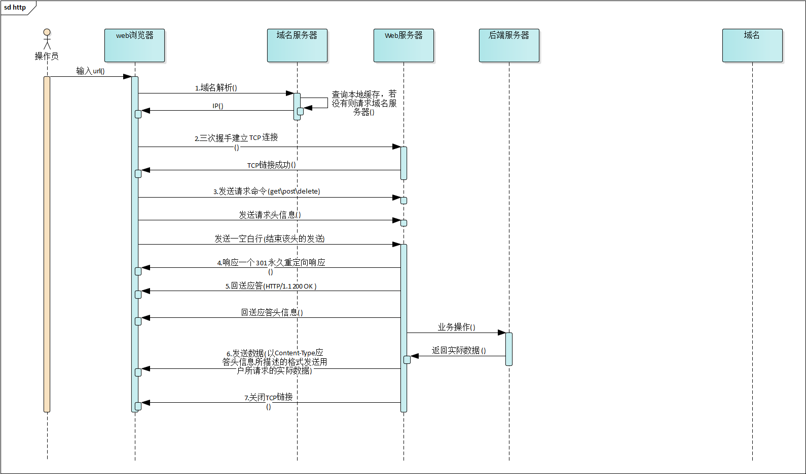

# 基于URLProtocol 实现网络流量监控  
在iOS性能监控以及优化中， 网络流量管控是很重要的一部分。不合理的网络请求造成一下问题：   

* 浪费用户数据流量  
* 应用性能降低  
* 耗电量增加  


针对以上问题，通过对网络请求的监控方式来实现性能优化。 本文主要涉及到关于请求的数据大小统计，请求耗时等相关内容          
> 本文将不包含 Socket 长连接等操作       

### HTTP   
HTTP 请求是 iOS 中最常用的获取数据的方式，也是使用最多的一种数据获取交换方式，针对特殊场景下有更高效的方式，例如 IM 中最常用的是Socket长连接进行数据交换。本文主要针对的是 HTTP 方式，在具体实现之前，需要明确一个HTTP都包含了那些内容以及一个完整的HTTP请求的整个链路过程   
     

  
> HTTP请求头，图片来自网络   


上图是一个HTTP请求中所携带的所有信息格式，其每个HTTP请求都包含`请求行`，`请求头`,`空行`,`请求数据` 针对不同的请求方式传输的数据有所变化   

#### GET  
``` 
// 请求行
GET /users/solomonxie HTTP/1.1

// 请求头
Host: api.github.com
Accept: text/html,application/xhtml+xml,application/xml;q=0.9,*/*;q=0.8
Cookie: _ga=GA1.2.2100813623.1559025524; _gid=GA1.2.531772292.1559030000; _gat=1; dotcom_user=zhuamaodeyu; logged_in=yes; _octo=GH1.1.838022779.1539058895
User-Agent: Mozilla/5.0 (Macintosh; Intel Mac OS X 10_14_4) AppleWebKit/605.1.15 (KHTML, like Gecko) Version/12.1 Safari/605.1.15
Accept-Language: zh-cn
Accept-Encoding: br, gzip, deflate
Connection: keep-alive

// 空行  


// 数据(此处为restful 接口，没有请求数据)


```


#### POST

```

POST / HTTP1.1

Host:www.github.com 
User-Agent:Mozilla/4.0 (compatible; MSIE 6.0; Windows NT 5.1; SV1; .NET CLR 2.0.50727; .NET CLR 3.0.04506.648; .NET CLR 3.5.21022)
Content-Type:application/x-www-form-urlencoded
Content-Length:40
Connection: Keep-Alive

name=xxx&publisher=xxx
```

以上给出了最常用的HTTP请求方式 GET/POST 的请求体数据结构。

#### Response  
Response 同样也是4部分，包括`状态行`,`消息报头`,`空行`,`正文`   

```
HTTP/1.1 200 OK  

Server: GitHub.com
Date: Tue, 28 May 2019 07:53:47 GMT
Content-Type: application/json; charset=utf-8
Transfer-Encoding: chunked
Status: 200 OK
X-RateLimit-Limit: 60
X-RateLimit-Remaining: 53
X-RateLimit-Reset: 1559033627
Cache-Control: public, max-age=60, s-maxage=60
Vary: Accept
ETag: W/"63de70a7cc65d2f5fa1f418a54ff66bd"
Last-Modified: Thu, 23 May 2019 16:14:40 GMT
X-GitHub-Media-Type: unknown, github.v3
Access-Control-Expose-Headers: ETag, Link, Location, Retry-After, X-GitHub-OTP, X-RateLimit-Limit, X-RateLimit-Remaining, X-RateLimit-Reset, X-OAuth-Scopes, X-Accepted-OAuth-Scopes, X-Poll-Interval, X-GitHub-Media-Type
Access-Control-Allow-Origin: *
Strict-Transport-Security: max-age=31536000; includeSubdomains; preload
X-Frame-Options: deny
X-Content-Type-Options: nosniff
X-XSS-Protection: 1; mode=block
Referrer-Policy: origin-when-cross-origin, strict-origin-when-cross-origin
Content-Security-Policy: default-src 'none'
Content-Encoding: gzip
X-GitHub-Request-Id: 4263:04B7:28AE9F6:5175233:5CECE8E0
Connection: keep-alive

{
  "login": "solomonxie",
  "id": 14041622,
  "node_id": "MDQ6VXNlcjE0MDQxNjIy",
  "avatar_url": "https://avatars2.githubusercontent.com/u/14041622?v=4",
  "gravatar_id": "",
  "url": "https://api.github.com/users/solomonxie",
  "html_url": "https://github.com/solomonxie",
  "followers_url": "https://api.github.com/users/solomonxie/followers",
  "following_url": "https://api.github.com/users/solomonxie/following{/other_user}",
  "gists_url": "https://api.github.com/users/solomonxie/gists{/gist_id}",
  "starred_url": "https://api.github.com/users/solomonxie/starred{/owner}{/repo}"
}

```
#### HTTP 请求过程  



> HTTPS 会多一步授权校验过程


## 实现方案  
1. NSURLProtocol    
	* 优点： 上层接口，简单方便  
	* 缺点： 支持协议有限，有局限性，部分功能无法正常实现
2. Hook
	* 优点： 更全面，通过 hook `CFNetwork`/`CFStream`框架或者私有API 
	* 缺点： 复杂，技术难度高，需要hook C 代码, 使用私有API，有被拒风险   


## 实现    
__采用`NSURLProtocol ` 方式实现__, 基于 `URL Loading System` 体系来实现，虽然一定程度上可以达到网络监控的目的，但是由于采用了更上层次的API，实现难度虽然降低，但是功能有一定的欠缺，比如：iOS 10以下的无法获取到更详细的时间   


明确下目标：  

1. 请求数据流量统计(请求数据大小)
2. 请求耗时统计   

#### 流量统计  
针对流量统计起始就是统计一个请求上行与下行的数据大小统计，计算整个请求消耗数据流量大小  
> 此统计不会十分准确，其中请求域名解析，🤝等都是需要消耗少量流量，可以忽略不记   


#### 请求耗时 
* iOS 9 及以下  
	通过请求开始时间与请求结束时间计算请求总耗时  
* iOS 10 及以上  
	* 请求总耗时     
	* TCP 连接时间 
	* DNS 解析耗时 
	* SSL 耗时  


### 代码实现  
```
  override class func canInit(with request: URLRequest) -> Bool {
        guard let scheme = request.url?.scheme else {
            return false
        }
        guard scheme == "http" || scheme == "https" else {
            return false
        }
        guard URLProtocol.property(forKey: kEyeKey, in: request) == nil  else {
            return false
        }
        return true
    }
    
    override class func canonicalRequest(for request: URLRequest) -> URLRequest {
        guard let req = (request as? NSMutableURLRequest)?.mutableCopy() as? NSMutableURLRequest else {
            return request
        }
        URLProtocol.setProperty(true, forKey: kEyeKey, in: req)
        return req.copy() as! URLRequest
    }
    override class func requestIsCacheEquivalent(_ a: URLRequest, to b: URLRequest) -> Bool {
        return super.requestIsCacheEquivalent(a, to: b)
    }
    
    override func startLoading() {
        // request
        let request = self.classForCoder.canonicalRequest(for: self.request)
        self.eye_request = request
        
        self.startRequest(request: request)
        
        if #available(iOS 8.0, *) {
            // 高于 8.0
            self.eye_task = URLSession.init(configuration: URLSessionConfiguration.default, delegate: self, delegateQueue: nil).dataTask(with: request)
            self.eye_task?.resume()
        }else {
            self.eye_connection = NSURLConnection(request: request, delegate: self, startImmediately: true)
            self.eye_connection?.start()
        }
    }
    
    override func stopLoading() {
        if self.eye_connection != nil {
            self.eye_connection?.cancel()
            self.eye_connection = nil
        }
        if self.eye_task != nil  {
            self.eye_task?.cancel()
            self.eye_task = nil
        }
        // end
        self.endResponse(response: self.eye_response as? HTTPURLResponse)
        
        //TODO:  此处进行落库
    }
}
```

##### 注意点： 
1. `NSURLProtocol`是位于`URL Loading System` 体系中,应用中所有关于URL操作都会交由此系统进行处理，所以针对自定义URL也会转到此处进行处理，因此此处需要针对这种自定义URL操作进行过滤   
2. 避免 `canInitWithRequest` 以及 `canonicalRequestForRequest` 出现死循环, 通过给每个请求添加自定义属性，避免死循环   

```
extension NetworkEyeProtocol: NSURLConnectionDataDelegate {
	 ......
    func connection(_ connection: NSURLConnection, didReceive data: Data){
        self.client?.urlProtocol(self, didLoad: data)
        self.eye_data.append(data)
    }
    func connection(_ connection: NSURLConnection, didReceive response: URLResponse) {
        self.client?.urlProtocol(self, didReceive: response, cacheStoragePolicy: URLCache.StoragePolicy.allowed)
        self.eye_response = response
    }
}

extension NetworkEyeProtocol: URLSessionDataDelegate {
    func urlSession(_ session: URLSession, dataTask: URLSessionDataTask, didReceive response: URLResponse, completionHandler: @escaping (URLSession.ResponseDisposition) -> Void) {
        self.client?.urlProtocol(self, didReceive: response, cacheStoragePolicy: .allowed)
        self.eye_response = response
        completionHandler(.allow)
    }
    func urlSession(_ session: URLSession, dataTask: URLSessionDataTask, didReceive data: Data) {
        self.client?.urlProtocol(self, didLoad: data)
        self.eye_data.append(data)
    }
    
    func urlSession(_ session: URLSession, task: URLSessionTask, willPerformHTTPRedirection response: HTTPURLResponse, newRequest request: URLRequest, completionHandler: @escaping (URLRequest?) -> Void) {
        self.eye_response = response
        self.client?.urlProtocol(self, wasRedirectedTo: request, redirectResponse: response)
    }
    
    @available(iOS 10.0, *)
    func urlSession(_ session: URLSession, task: URLSessionTask, didFinishCollecting metrics: URLSessionTaskMetrics) {
    
    }
}

```

以上给出了协议代理中会涉及到修改的部分   
通过 `metrics` 对象会最后更正部分数据

__通过此处可以获取到请求时间，TCP、DNS、SSL 耗时等内容__   
 


#### 具体计算Request、Response 数据大小  

```
 private func requestLineLen() -> Int {
        if let method = self.request.httpMethod, let path = self.request.url?.path {
            let string = NSString.init(format: "%@ %@ %@\n", method, path, "HTTP/1.1")
            return string.data(using: String.Encoding.utf8.rawValue)?.count ?? 0
        }
        return 0
    }
    
    private func requestHeadersLen() -> Int {
        var header = self.request.allHTTPHeaderFields ?? [:]
        
        for dic in self.cookie() {
            header.updateValue(dic.value, forKey: dic.key)
        }
        
        var headerString = ""
        for (key , value) in header {
            headerString.append("\(key)")
            headerString.append(": ")
            headerString.append("\(value)")
            headerString.append("\n")
        }
        return headerString.data(using: String.Encoding.utf8)?.count ?? 0
    }
    
    private func requestBodyLen() -> Int {
        var bodyLength = self.request.httpBody?.count ?? 0
         if self.request.allHTTPHeaderFields?.contains(where: { (key,value) -> Bool in
            key == "Accept-Encoding"
        }) ?? false  {
            var data: Data = Data.init()
            if let body =  self.request.httpBody  {
                data = body
            }else {
                if let stream = self.request.httpBodyStream{
                    stream.open()
                    let bufferSize = 1024
                    let buffer = UnsafeMutablePointer<UInt8>.allocate(capacity: bufferSize)
                    while stream.hasBytesAvailable {
                        let read = stream.read(buffer, maxLength: bufferSize)
                        data.append(buffer, count: read)
                    }
                    buffer.deallocate()
                    defer {
                        stream.close()
                    }
                }
            }
            // 进行压缩
            bodyLength = data.zip().count
        }
        return bodyLength
    }
    
    private func requestLen() -> Int {
        return self.requestBodyLen() + self.requestLineLen() + self.requestHeadersLen()
    }
    private func cookie() -> [String: String] {
        if let cookies = HTTPCookieStorage.shared.cookies(for: self.request.url ?? URL.init(string: "")!) {
            return HTTPCookie.requestHeaderFields(with: cookies)
        }
        return [:]
    }
    
    /// response
    private func responseStatusLineLen() -> Int {
        return 0
    }
    
    private func responseHeaderLen() -> Int {
        
        if  let response = self.eye_response as? HTTPURLResponse {
            let header = response.allHeaderFields
            var headerString = ""
            for (key , value ) in header {
                headerString.append("\(key)")
                headerString.append(": ")
                headerString.append("\(value)")
                headerString.append("\n")
            }
            return headerString.data(using: String.Encoding.utf8)?.count ?? 0
        }
        return 0
    }
    
    private func responseBodyLen() -> Int {
        if let response = self.eye_response as? HTTPURLResponse { 
        		// 
        }else {
            return self.eye_data.count
        }
        return 0
    }
    
    private func responseLen() -> Int {
        return self.responseBodyLen() + self.responseHeaderLen() + self.responseStatusLineLen()
    }
```

##### 注意点：  
1. 数据压缩问题，一般请求中，都会对数据进行压缩操作，此处需要处理压缩问题  
2. 通过`URL Loading System`层方法无法获取response StatusLine 部分内容， 此部分内容不同请求中会有微小变化，可以通过给定不定的值来实现(__此种方式会有微小的差别,可以忽略不记__)  


#### 落库  
关于落库的一些想法，考虑到网络请求监控数据非敏感数据，允许丢失原则，可以实现两种方式落库：  

1. 直接操作数据库  
2. 通过子线程 Runloop + queue 的形式     

	> 此种方式适合大量数据写入


#### 优化  
1. 可以将数据转模型这块操作转入到子线程队列中去操作，此处涉及到数据的解压缩操作。


## 总结  
通过以上方式可以实现网络流量监测功能， 从数据中可以分析出具体的网络请求问题可以解决以下问题：  

1. 网络请求慢  
	* DNS 解析耗时多(优化DNS解析，可以采用IP直连方式)
	* TCP 连接耗时多(服务器压力过大，TCP连接数过大等)
	* 业务逻辑处理耗时多(业务逻辑复杂，数据库压力大耗时过长等)
	* 剔除不必要的接口请求

2. 流量消耗  
	* 分析接口请求数， 剔除不必要的接口请求

#### 其他
关于为什么通过 `NSURLProtocol` 来实现，主要出于以下几个方面考虑： 
  
1. 网络监控的目的只是为了辅助解决部分问题，例如：找到部分耗时较长请求，找到部分无用请求等。但其目的只是一定程度上降低
2. 数据， 数据并不是请必须，考虑用户基数的问题，如果强一致将造成存在大量冗余数据情况。对数据抽样是较好方式    


#### Tips:  
* 可以通过 Runloop 实现延迟(提前)任务执行，充分利用线程性能


