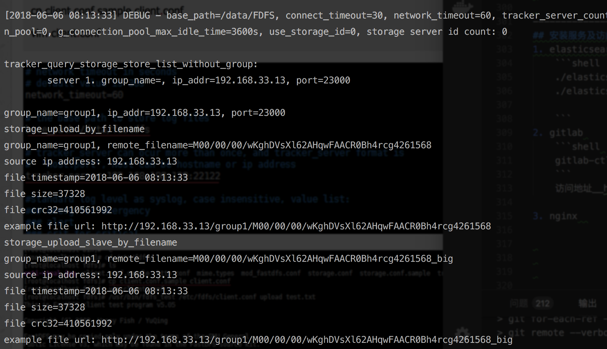
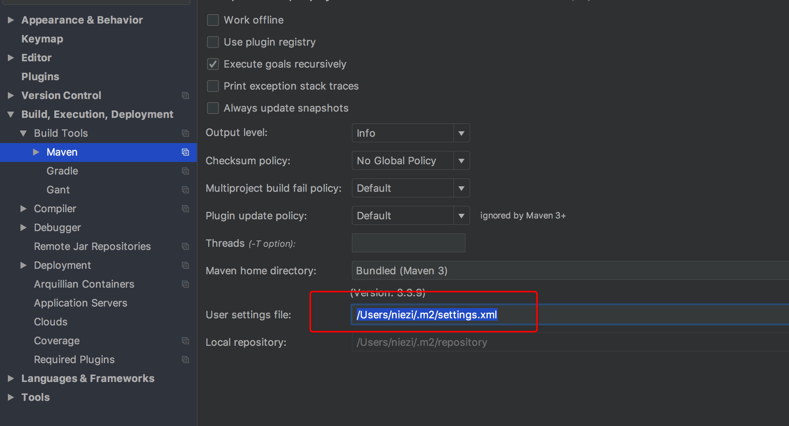
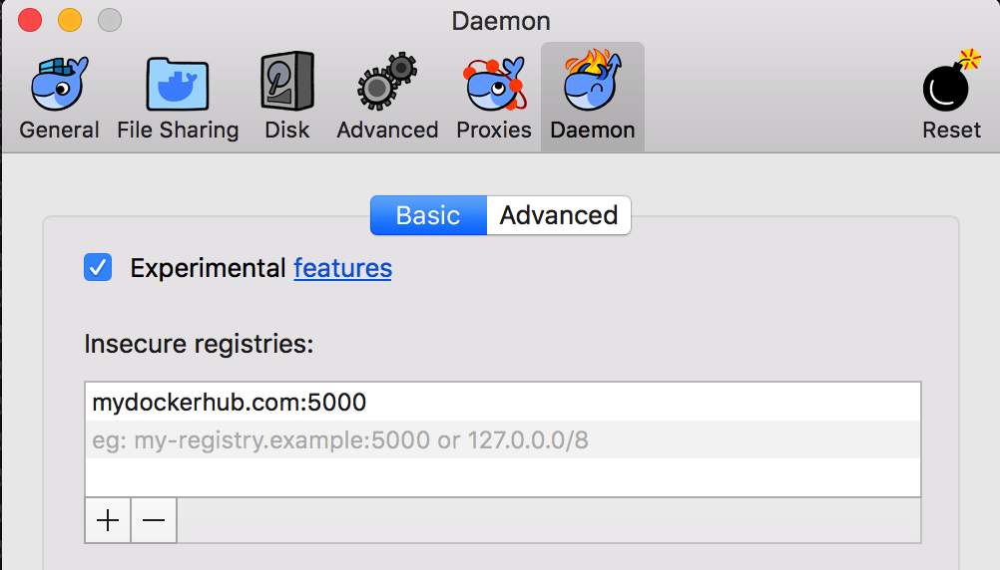

# 环境搭建  

## 环境  
* Ceontos 7 系统
* MacOS 系统 
### java  
> 添加环境变量即可
### Maven  
> 添加环境变量即可
### tomcat 
> 添加环境变量即可
### zookeeper
1. download
2. 设置环境变量
    ```bash 
    #  ~/.bash_profile      用户环境变量 
    #  /etc/profile         系统环境变量  
    MAVEN_HOME=/opt/apache-maven-3.5.3
    MAIL=/var/spool/mail/vagrant
    export JAVA=/opt/jdk1.8.0_171/bin/java
    export PATH=$JAVA_HOME/bin:$JAVA_JRE/bin:$JAVA:$PATH
    # elasticsearch
    export ELASTICSEARCH_HOME=/opt/elasticsearch-6.2.4
    export PATH=$ELASTICSEARCH_HOME/bin:$PATH

    #tomcat
    export CATALINA_HOME=/opt/apache-tomcat-8.5.30
    export PATH=$CATALINA_HOME/bin:$PATH

    #zookeeper
    export ZOOKEEPER_HOME=/opt/zookeeper-3.4.12
    export PATH=$PATH:$ZOOKEEPER_HOME/bin

    # marathon
    export MARATHON_HOME=/opt/marathon-1.6
    export PATH=$PATH:$MARATHON_HOME/bin

    # Maven 环境变量
    export MAVEN_HOME=/opt/apache-maven-3.5.3
    export PATH=$MAVEN_HOME/bin:$PATH

    ```

### Docker
1. 查看内核 
    ```bash 
    uname -r 
    # 更新  
    sudo yum update 
    ```
2. 安装 
    ```bash 
    # remove old docker 
     sudo yum remove docker  docker-common docker-selinux docker-engine
    # 安装 
    sudo yum install -y yum-utils device-mapper-persistent-data lvm2
    sudo yum-config-manager --add-repo 
    #  https://download.docker.com/linux/centos/docker-ce.repo

    # 查看版本 
    yum list docker-ce --showduplicates | sort -r 

    # 安装 
    sudo yum install docker-ce
    ```
3. 设置开机启动 
    ```bash 
    sudo systemctl start docker
    sudo systemctl enable docker
    ```


### gitlab 
1. 前期工作 
    ```bash
    sudo yum install curl policycoreutils policycoreutils-python openssh-server openssh-clients
    sudo systemctl enable sshd
    sudo systemctl start sshd

    sudo yum install postfix
    sudo systemctl enable postfix
    sudo systemctl start postfix

    sudo firewall-cmd --permanent --add-service=http
    sudo systemctl reload firewalld

    ```
2. download 
    ```bash
    # 下载  
    wget https://mirrors.tuna.tsinghua.edu.cn/gitlab-ce/yum/el7/gitlab-ce-8.0.0-ce.0.el7.x86_64.rpm
    # 解压 
    rpm -i gitlab-ce-8.0.0-ce.0.el7.x86_64.rpm

    # 方式2  
    curl -s https://packages.gitlab.com/install/repositories/gitlab/gitlab-ce/script.rpm.sh | sudo bash  
    sudo yum install gitlab-ce-10.1.0-ce.0.el7.x86_64
    ```
3. 配置 
    ```bash 
    vim  /etc/gitlab/gitlab.rb
    # 配置访问地址 
    external_url  '本机地址'   # 此处尽量填写服务器地址或者域名，如果不是80 端口，需要填写端口，不然后边runner会出问题
    # 默认是80端口，如果80已经使用
    ```
4. 更新配置 
    ```bash
    gitlab-ctl reconfigure
    gitlab-ctl restart
    ```
5. 修改nginx(gitlab 默认有nginx)  
    ```bash 
    vi /etc/gitlab/gitlab.rb

    # 访问端口改为 8000
    # 此处还关闭了nginx 使用自己安装的nginx  
    nginx['listen_port'] = 8000       # 默认80

    vi /var/opt/gitlab/nginx/conf/gitlab-http.conf
    listen *:82; #默认值listen *:80;

    vi /etc/gitlab/gitlab.rb
    unicorn['port'] = 8001 #原值unicorn['port'] = 8080

    vi /var/opt/gitlab/gitlab-rails/etc/
    listen "127.0.0.1:8082", :tcp_nopush => true
    #原值listen "127.0.0.1:8080", :tcp_nopush => true
    ```


### mysql


### nginx
1. download  
    ```bash 
         sudo yum install wget 
         # 根据自己需要下载版本 
         wget -c https://nginx.org/download/nginx-1.10.1.tar.gz   
         # ssl 功能需要openssl库
         wget https://www.openssl.org/source/openssl-1.1.0h.tar.gz  
         #  rewrite模块需要 pcre 库
         wget https://ftp.pcre.org/pub/pcre/pcre-8.02.tar.gz  
         # gzip模块需要 zlib 库
         wget http://www.zlib.net/zlib-1.2.11.tar.gz  
         #  fastdfs-nginx-module
         wget https://github.com/happyfish100/fastdfs-nginx-module/archive/master.zip
    ```
2. 解压  
    ```bash 
    #  unzip  xxx.zip  
    # tar -zxvf xxx.tar.gz
    ```
3. 编译  
    ```bash 
    # ssl 
    # pcre
    # gzip 
    cd /xxx  
    ./configure 
    make  
    # 安装到/usr/local/bin (可无) 
    make install 
    ```
4. 编译 nginx  

    ```bash 
    cd nginx/  
     sudo ./configure  --prefix=/opt/nginx-1.14.0/bin --with-http_stub_status_module --with-http_ssl_module --with-ipv6  --with-openssl=/opt/nginx-1.14.0/openssl-1.1.0h --with-pcre=/opt/nginx-1.14.0/pcre-8.42 --with-zlib=/opt/nginx-1.14.0/zlib-1.2.11 --add-module=/opt/nginx-1.14.0/fastdfs-nginx-module/src
     # 安装  
    make && make install
    ```
5. 创建systemctl
    ```
    [Unit]
    Description=The NGINX HTTP and reverse proxy server
    After=syslog.target network.target remote-fs.target nss-lookup.target

    [Service]
    Type=forking
    # PIDFile=/run/nginx.pid
    ExecStartPre=/opt/opt/nginx-1.14.0/bin/sbin/nginx -t
    ExecStart=/opt/opt/nginx-1.14.0/bin/sbin/nginx
    ExecReload=/opt/opt/nginx-1.14.0/bin/sbin/nginx -s reload
    ExecStop=/bin/kill -s QUIT $MAINPID
    PrivateTmp=true

    [Install]
    WantedBy=multi-user.target
    ```
6. 启动服务 
    


### runner  
1. 安装 
    ```bash 
    sudo yum install gitlab-ci-multi-runner
    ```
2. 注册 
    通过 `register` 命令来注册(`gitlab-runner register`)  
    ```bash
        sudo gitlab-ci-multi-runner register
        ## 配置
        [root@localhost ~]# gitlab-runner register
        Running in system-mode.
        Please enter the gitlab-ci coordinator URL (e.g. https://gitlab.com/):
        http://192.168.33.13:8000  # 此处需要填写gitlab 服务器地址，如果不是80 端口，需要填写端口
        Please enter the gitlab-ci token for this runner:
        wiA1tLGKsBM3aCBdepN2        # token
        Please enter the gitlab-ci description for this runner:
        [localhost.localdomain]: test       # descrition 描述
        Please enter the gitlab-ci tags for this runner (comma separated):
        test                        # tags  
        Whether to run untagged builds [true/false]:
        # [false]: true
        Whether to lock Runner to current project [true/false]:
        # [false]: true
        Registering runner... succeeded                     runner=wiA1tLGK
        Please enter the executor: kubernetes, docker, docker-ssh, parallels, virtualbox, docker-ssh+machine, shell, ssh, docker+machine:
        shell           # 填写执行器类型  一般可以填shell  将会采用执行shell 脚本的形式
        Runner registered successfully. Feel free to start it, but if it's running already the config should be automatically reloaded!
    ```
<!-- __具体注册内容，请查看具体的`gitlab`文章部分__   -->


### FastDFS  
1. download  
    ```bash 
    # libfastcommon
    wget https://github.com/happyfish100/libfastcommon/archive/master.zip 
    # FastDFS 
    wget https://github.com/happyfish100/fastdfs/archive/master.zip 
    ```
2. make  
    ```bash 
    # libfastcommon  
    # FastDFS
    unzip master.zip 
    cd /xxxx  
    ./make.sh && make.sh install
    ```
3. 配置  
    主要配置 tracker 和 Storage    
    * 配置 Tracker 服务     
        ```bash     
        cd /etc/fdfs 
        cp tracker.conf.sample tracker.conf  
        vi tracker.conf    
        # 修改一下内容
        # the base path to store data and log files 数据存放地址  
        base_path=/data/fastdfs
        # HTTP port on this tracker server
        http.server_port=80
        # 启动 
        /usr/bin/fdfs_trackerd /etc/fdfs/tracker.conf start
        # 软连接 
        ln -s /usr/bin/fdfs_trackerd /usr/local/bin
        ln -s /usr/bin/stop.sh /usr/local/bin
        ln -s /usr/bin/restart.sh /usr/local/bin
        # service 服务启动形式
        service fdfs_trackerd start
        # 查看监听
        netstat -unltp|grep fdfs
        ```

    * 配置Storage 服务    

        ```bash    
        cp storage.conf.sample storage.conf
        vim storage.conf
        # the base path to store data and log files
        base_path=/data/fastdfs/storage
        # store_path#, based 0, if store_path0 not exists, it's value is base_path
        # the paths must be exist
        store_path0=/data/fastdfs/storage
        #store_path1=/home/yuqing/fastdfs2
        # tracker_server can ocur more than once, and tracker_server format is
        #  "host:port", host can be hostname or ip address
        # 地址如果是本地环境，就是本地机器地址  
        tracker_server=192.168.198.129:22122
        # 软连接 
        ln -s /usr/bin/fdfs_storaged /usr/local/bin
        service fdfs_storaged start
        ```
    
    * 验证服务     

        ```bash    
        netstat -unltp|grep fdfs
        /usr/bin/fdfs_monitor /etc/fdfs/storage.conf
        ```
        __注意： 有时候却验证不通过，这时候就需要查看日志信息 看看日志信息是否有错误，如果没有错误那么久没问题__ 

    * 修改 NGINX 模块  

        ```bash    
        # mod-fastdfs.conf
        tracker_server=192.168.198.129:22122
        url_have_group_name = true  
        store_path0=/data/fastdfs/storage  
        # 以上三个属性配置成自己的地址和 存放地址  
        ```

    * 修改NGINX 配置 

        ```yaml    
          #添加以下内容
        location /group1/M00 {
            root /data/fastdfs/storage/;
            ngx_fastdfs_module;
        }
        ```

    * 创建软连接等 

        ```bash   
        mkdir /data/fastdfs/storage/data/group1
        ln -s /data/fastdfs/storage/data /data/fastdfs/storage/data/group1/M00
        ```
    
    * 重启NGINX 
    
    * 配置 client.conf
    
        ```bash   
        cp /usr/fdfs/client.conf.sample client.conf  
        # 修改一下内容 
        base_path = 
        tracker_server = 
        ```
    * 测试上传  
    
        ```bash    
        cd /usr/bin
        /usr/bin/fdfs_test /etc/fdfs/client.conf upload /usr/bin/test.txt
        ```
          
        出现以上内容代表上传成功  
        

### Maven Respository
1. 下载 nexus 
    ```bash    
    https://sonatype-download.global.ssl.fastly.net/repository/repositoryManager/3/nexus-3.12.0-01-unix.tar.gz  

    # 解压 
    tar -zxvf nexus.tar.gz 
    ```
2. 添加环境变量  
    ```bash   
    export NEXUS_HOME=/opt/nexus
    export PATH=$NEXUS_HOME/bin:$PATH
    ```
3. 修改nexus.rc 文件 
    ```
    run_as_user="nexus"  # root
    ```
4. 添加新用户并赋予权限 
    ```bash
    sudo useradd nexus
    sudo chown -R nexus:nexus /opt/nexus
    sudo chown -R nexus:nexus /opt/sonatype-work/
    ```
5. 创建开机启动服务(systemd)
    ```bash
    sudo vi /etc/systemd/system/nexus.service

    # 添加如下内容 (3.2 之前的) 
    [Unit]
    Description=nexus service
    After=network.target
        
    [Service]
    Type=forking
    ExecStart=/opt/nexus/bin/nexus start
    ExecStop=/opt/nexus/bin/nexus stop
    User=nexus #root
    Restart=on-abort
        
    [Install]
    WantedBy=multi-user.target

    # 3.2 之后 用之前的无法启动 
    [Unit]
    Description=nexus service
    After=network.target

    [Service]
    Type=forking
    ExecStart=/opt/nexus/bin/nexus start
    ExecStop=/opt/nexus/bin/nexus stop
    User=root
    Restart=on-abort
    Environment=INSTALL4J_JAVA_HOME=/opt/jdk1.8.0_171/jre
    LimitNOFILE=65536
    [Install]
    WantedBy=multi-user.target
    ```
6. 安装并启动服务 
    ```bash
    sudo systemctl daemon-reload
    sudo systemctl enable nexus
    sudo systemctl start nexus
    ```
7. 查看服务 
    ```bash
    sudo systemctl status nexus
    ```
8. 添加防火墙 
    ```bash 
    sudo firewall-cmd --zone=public --permanent --add-port=8081/tcp
    sudo firewall-cmd --reload 
    ```
9. 测试服务 
    ```bash 
    # http://ip:8081/
    username: admin
    password: admin123
    ```
10. 更开nexus 的 cntext path  
    ```bash 
    sudo vi /opt/nexus/nexus/etc/nexus.properties
    nexus-context-path=/nexus
    ```
    __注意：需要切换到root 用户下才可以启动服务额，不然会报Java问题__  

11. 查看启动日志 
    ```bash
    tail -f /opt/nexus/sonatype-work/nexus3/log/nexus.log
    ``` 
    
12. 配置maven 
      
    以上是用户配置文件(可以在maven/conf 下直接修改全局配置文件)
    ```xml
    <server>
      <id>nexus-releases</id>
      <username>admin</username>
      <password>admin123</password>
    </server>

    <server>
        <id>nexus-snapshots</id>
        <username>admin</username>
        <password>admin123</password>
    </server>
    ```
13. 使用 
    直接在`pom.xml` 文件中添加一下内容
    ```xml
    <distributionManagement>
        <repository>
            <id>nexus-release</id>
            <name>Nexus Release Repository</name>
            <url>http://192.168.33.13:8081/nexus/content/repositories/release/</url>
        </repository>
        <snapshotRepository>
            <id>nexus-snapshots</id>
            <name>Nexus Snapshot Repository</name>
            <url>http://192.168.33.13:8081/nexus/content/repositories/snapshots/</url>
        </snapshotRepository>
    </distributionManagement>

    ```

### docker Respository
1. 运行 docker  
    ```bash
    docker run -d -p 5000:5000 -v /opt/docker/registry:/var/lib/registry restart=always registry
    ```
2. 测试是否可以push/pull 
    ```bash
    docker tag drone/agent 192.168.33.13:5000/drone
    docker push 192.168.33.13:5000/drone
    ```
   __此步一般会提示HTTPS 访问的错误__
    
   * 绕过https 访问(此种方式需要所有的主机上都要配置)
    ```bash
    sudo vi /etc/docker/daemon.json

    # 添加一下内容
    "insecure-registries": ["192.168.33.13:5000"]

    # 重启服务 
    systemctl restart docker
    # sudo service docker restart
    ```
3. 生成证书  
    ```bash 
    sudo openssl req -nodes -subj "/C=CN/ST=ZheJiang/L=HangZhou/CN=192.168.33.13" -newkey rsa:4096 -keyout /opt/docker/certs/cert.key -out /opt/docker/certs/cert.csr
    # 验证
    sudo openssl x509 -req -days 3650 -in /opt/docker/certs/cert.csr -signkey /opt/docker/certs/cert.key -out /opt/docker/certs/cert.crt
    # 会出现 Signature ok
    ```
4. 运行带证书docker images 
    ```bash 
    #运行registry容器
    sudo docker run \n
    -d              \n
    -p 5000:5000    \n
    --name registry \n
    -v /opt/docker/certs:/certs     \n
    -e REGISTRY_HTTP_TLS_CERTIFICATE=/certs/cert.crt    \n
    -e REGISTRY_HTTP_TLS_KEY=/certs/cert.key    \n
    -v /opt/docker/registry:/var/lib/registry   \n
    --restart=always  \n
    registry    

    #docker run -d -p 5000:5000 --name registry -v /opt/docker/certs:/certs  -e REGISTRY_HTTP_TLS_CERTIFICATE=/certs/cert.crt -e REGISTRY_HTTP_TLS_KEY=/certs/cert.key -v /opt/docker/registry:/var/lib/registry  registry
    ```

5. 复制证书到主机  
    ```bash 
    # 复制证书文件到各个主机下的 
    # /etc/docker/cert.d/192.168.33.13:5000目录  
    sudo mkdir /etc/docker/certs.d/
    sudo mkdir /etc/docker/certs.d/192.168.33.13:5000
    ```

    __注意__：Mac 下 `Vagrant 2.0.2` 默认的Ceontos 7 box 无法实时同步目录，所以要想从主机复制文件到共享目录，需要重启虚拟机，从虚拟机复制文件到共享目录，无法成功，(虚拟机中成功，但是宿主机看不到),需要修改配置`Vagrantfile`  
    ```ruby 
        config.vm.synced_folder 
        "./", 
        "/vagrant", 
        create:true,
        type:"nfs" # rsync , smb
    ```
6. 解决(because it doesn't contain any IP SANs)
    ```bash 
    # /etc/ssl/openssl.cnf      ubuntu
    # /etc/pki/tls/openssl.cnf  centos 

    [v3_ca]
    subjectAltName = IP:XX.XX.XX.XX
    ```
    __重新操作以上步骤__ 
    __无法解决问题__  

7. 通过域名方式生成证书并实现 
    * 生成证书
        ```bash
        # 方式2 
        sudo openssl req -newkey rsa:4096 -nodes -sha256 -keyout /opt/docker/certs/cert.key -x509 -days 365 -out /opt/docker/certs/cert.csr

        #You are about to be asked to enter information that will be incorporated
        #into your certificate request.
        #What you are about to enter is what is called a Distinguished Name or a DN.
        #There are quite a few fields but you can leave some blank
        #For some fields there will be a default value,
        #If you enter '.', the field will be left blank.
        #-----
        #Country Name (2 letter code) [AU]:CN
        #State or Province Name (full name) [Some-State]:guangdong
        #Locality Name (eg, city) []:shenzhen
        #Organization Name (eg, company) [Internet Widgits Pty Ltd]:tao
        #Organizational Unit Name (eg, section) []:tao
        #Common Name (e.g. server FQDN or YOUR name) []:mydockerhub.com
        #Email Address []:playtomandjerry@gmail.com
        ```
    * 启动镜像
        ```bash
            docker run -d -p 5000:5000 --name registry -v /opt/docker/certs:/certs  -e REGISTRY_HTTP_TLS_CERTIFICATE=/certs/cert.csr -e REGISTRY_HTTP_TLS_KEY=/certs/cert.key -v /opt/docker/registry:/var/lib/registry   
            #-v /opt/docker/registry/config/config.yml:/etc/docker/registry/config.yml  无法添加不知道为什么
            registry
        ```
    * 修改hosts 
        ```bash
        # cd /etc/hosts
        192.168.33.13  mydockerhub.com
        ```
    * 配置物理机证书(Mac 可以绕过此步)
        ```bash
            # linux 下
            # /etc/docker/cert.d/mydockerhub.com:5000目录  
            sudo mkdir /etc/docker/certs.d/
            sudo mkdir /etc/docker/certs.d/mydockerhub.com:5000
        ```
        * Mac 配置  
            
    * 测试 
        __根据文末方式进行验证__  
        __以上方式通过配置Docker 不需要配置nginx了__ 
    * 配置nginx  
        ```yaml
            server {
                listen 8000;
                server_name mydockerhub.com;
                ssl on;
                ssl_certificate /opt/nginx/ssl/nginx.crt;
                ssl_certificate_key /opt/nginx/ssl/nginx.key;
            }
        ```
        * 生成证书   
            ```bash
                sudo openssl req -newkey rsa:4096 -nodes -sha256 -keyout /opt/nginx/ssl/nginx.key -x509 -days 365 -out /opt/nginx/ssl/nginx.crt
            ```
        * 创建config.yml  (不知道怎么映射不进去，无效)     
        * 创建密码文件    
            ```bash
            docker run --entrypoint htpasswd registry -Bbn root root  > auth/htpasswd
            ```
        * 启动带有鉴权registry    
            ```bash
            docker run -d -p 5000:5000 --restart=always --name registry \
                -v `pwd`/auth:/auth \
                -e "REGISTRY_AUTH=htpasswd" \
                -e "REGISTRY_AUTH_HTPASSWD_REALM=Registry Realm" \
                -e REGISTRY_AUTH_HTPASSWD_PATH=/auth/htpasswd \
                -v `pwd`/data:/var/lib/registry \
                -v `pwd`/certs:/certs \
                -e REGISTRY_HTTP_TLS_CERTIFICATE=/certs/domain.crt \
                -e REGISTRY_HTTP_TLS_KEY=/certs/domain.key \
                registry:2
            ```
    * Registry操作 
        1. docker run 添加配置的映射 
        2. 修改配置 
            ```
            delete:
                enabled: true
            ```
        3. 查看仓库大小 
            ```bash
            docker exec -it registry /bin/bash
            du -sch /var/lib/registry
            ```
        4. 删除镜像 
            ```bash
            # DELETE /v2/<name>/manifests/<reference>
            # name:镜像名称 
            # reference: 镜像对应sha256值
            curl -I -X DELETE http://mydockerhub.com:5000/v2/xcb/centos/manifests/sha256:5b367dbc03
            # 直接删除 
            # docker exec <容器名> rm -rf /var/lib/registry/docker/registry/v2/repositories/<镜像名>
            ```
        5. 清空垃圾 
            ```bash
            # 在镜像内部 执行
            registry garbage-collect /etc/docker/registry/config.yml  
            # docker exec registry bin/registry garbage-collect /etc/docker/registry/config.yml
            ```

    0. 使用  
        ```bash 
        # 搜索
        curl  http://10.10.105.71:5000/v2/_catalog
        # 查看
        curl  http://10.10.105.71:5000/v2/tonybai/busybox/tags/list
        ```

## RocketMQ  
1. download
2. 配置 nameserver  
    ```properties
        rocketmqHome=/opt/rocketmq
        kvConfigPath=/opt/rocketmq/store/namesrv/kvConfig.json
        listenPort=9876
        serverWorkerThreads=16
        serverCallbackExecutorThreads=0
        serverSelectorThreads=6
        serverOnewaySemaphoreValue=512
        serverAsyncSemaphoreValue=128
        serverChannelMaxIdleTimeSeconds=240
        serverSocketSndBufSize=4096
        serverSocketRcvBufSize=2048
        serverPooledByteBufAllocatorEnable=false
    ```
3. 配置broker  
    ```
    # 所属集群名称
    brokerClusterName = DefaultCluster
    # broker 名称，此处不同的配置文件填写的不同
    brokerName = broker-a
    # 0 表示master ， > 0 表示 slave
    brokerId = 0
    # nameServer 地址，分号分隔符
    namesrvAddr=192.168.33.13:9876
    # 在发送消息时，自动创建服务器不存在的topic,默认创建的队列数
    defaultTopicQueueNums=4
    # 是否允许Broker 自动创建Topic,间隙线下开启，线上关闭
    autoCreateTopicEnable=true
    # 是否允许Broker 自动创建订阅组，建议线下开启，线上关闭
    autoCreateSubscriptionGroup=true
    # Broker 对外服务监听端口
    listenPort=10991
    #删除问价时间点，默认凌晨 4点
    deleteWhen = 04
    # 文件保留时间，默认 48 小时
    fileReservedTime=120
    # commitLog每个文件的大小默认 1G
    mapedFileSizeCommitLog=1073741824
    # ConsumeQueue每个文件默认存30W条，根据业务情况调整
    mapedFileSizeConsumeQueue=300000
    # 检测物理磁盘空间
    disMaxUsedSpaceRatio=88
    # 存储路径
    storePathRootDir=/opt/rocketmq/store
    # commitLog 存储路径
    storePathCommitLog=/opt/rocketmq/store/commitlog
    #消息队列存储路径
    storePathConsumeQueue=/opt/rocketmq/store/consumequeue
    # 消息碎银存储路径
    storePathIndex=/opt/rocketmq/store/index
    #checkpoint 文件存储路径
    storeCheckpoint=/opt/rocketmq/store/checkpoint
    #abort 文件存储路径
    abortFile=/opt/rocketmq/store/abort
    brokerRole = ASYNC_MASTER
    flushDiskType = ASYNC_FLUSH
    ```
4. 修改启动脚本  
    主要修改的是java 内存部分  
    ```
    # vim bin/runserver.sh  
    # vim bin/runbroker.sh 
    
    #=======================================================================================
    # JVM Configuration
    #=======================================================================================
    JAVA_OPT="${JAVA_OPT} -server -Xms512m -Xmx512m -Xmn128m"
    ```

5. 创建开启启动服务  
    `vim /lib/systemd/system/namesrv.service`
    * 创建 namesrv.service
        ```
        [Unit]
        Description=RocketMQ-Nameserver
        After=network.target
        [Service]
        ExecStart=/opt/rocketmq/bin/mqnamesrv -c /opt/rocketmq/conf/product/namesrv.properties
        ExecStop=/opt/rocketmq/bin/mqshutdown namesrv
        [Install]
        WantedBy=multi-user.target
        ```   
    * 创建 broker.service 
        `vim /lib/systemd/system/broker.service`
        ```
        [Unit]
        Description=RocketMQ-Broker
        After=namesrv.service
        [Service]
        ExecStart=/opt/rocketmq/bin/mqbroker
        ExecStop=/opt/rocketmq/bin/mqshutdown broker
        [Install]
        WantedBy=multi-user.target
        ```
6. 启动 
    ```
    systemctl daemon-reload
    systemctl enable namesrv.service
    systemctl enable broker.service

    systemctl start namesrc.service
    systemctl start broker.service
    ```
7. 直接启动  
    ```
    nohup mqnamesrv -c /conf/pro/name.properties &
    nohup sh ./bin/mqbroker -n "192.168.33.11:9876" -c ./conf/broker.properties  &
    ```
8. 查看状态
    ```
    # 导出配置模板
    sh mqbroker -m > broker.p 
    ./mqadmin broker -m
     ./mqadmin clusterList -n 192.168.33.13:9876
     # 查看 broker 状态
     ./mqadmin brokerStatus -n 127.0.0.1:9876 -b 172.20.1.138:10911 
     # 查看 topic 列表
     ./mqadmin topicList -n 127.0.0.1:9876
     # 查看 topic 状态 
     ./mqadmin topicStatus -n 127.0.0.1:9876 -t MyTopic
    # 查看 topic 路由 
     ./mqadmin topicRoute -n 127.0.0.1:9876 -t MyTopic
    # 关闭namesrv服务
    sh bin/mqshutdown namesrv
    # 关闭broker服务
    sh bin/mqshutdown broker
    ```

### 安装 RocketMQ  console
1. clone 
    `https://github.com/apache/rocketmq-externals`  
2. maven  打包 
    ```
    cd rocketmq-console  
    mvn clean pockage -Dmaven.test.skip=true 
    # target下找到 rocketmq-console-ng-1.0.0.jar文件  
    ```
3. 启动 
    ```bash 
    java -jar rocketmq-console-ng-1.0.0.jar --server.port=12581 --rocketmq.config.namesrvAddr=10.89.0.64:9876
    ```


### 安装 RabbitMQ docker  
1. docker images
    ` docker pull rabbitmq:management-alpine`    
2. docker run  
    `docker run -d --name rabbitmq -p 56720:5672 -p 15672:15672 rabbitmq:management-alpine`


-------------------------  

## 安装服务及访问地址 
1. elasticsearch  
    * 查看服务是否启动    
    ```bash
    ./elasticsearch -Xms512m -Xmx512m
    ./elasticsearch -d -Xms512m -Xmx512m
    ```
2. gitlab    
    * 查看服务是否启动    
        ```bash
        #
        ```
    * 验证
        ```bash 
        gitlab-ctl restart
        http://192.168.33.13:8000/
        ```
            

3. nginx  
    * 查看服务是否启动     
        ```bash
        # 
        ```
    * 验证
        ```
        http://192.168.33.13  
        ```
4. docker registry
    * 查看服务是否启动   
       ```bash
       #
        ```
    * 验证   
        ```
        docker login mydocker.com:5000 -u root -p root
        docker tag drone/agent mydockerhub.com:5000/drone
        docker push mydockerhub.com:5000/drone
        ```
5. nexus 
    * 查看服务是否启动   
    ```bash
        sudo systemctl start nexus
        sudo systemctl stop  nexus
    ```

    * 验证   
        ```bash
        http://192.168.33.13:8081
        ```

6. FastDFS   
    * 查看服务是否启动   
        ```bash
            systemctl start fdfs_trackerd
            systemctl status fdfs_trackerd
            systemctl start fdfs_storaged
            systemctl status fdfs_storaged
        ```
    * 验证   
        ```
        /usr/bin/fdfs_test /etc/fdfs/client.conf upload /usr/bin/test.txt
        ```


##### 查看端口  
```bash 
# 查看所有端口 
netstat -ntlp  

# 查看端口占用进程 
netstat -lnp|grep 88
netstat -antp|grep 80

# 查看文件占用情况  
du -sh *


# 查看是否启动 
ps aux|grep elasticsearch
ps –ef|grep nginx

# kill 
kill -QUIT 主进程号

# 上传文件
sudo yum -y install lrzsz

## rz              上传文件
## sz  文件名       下载文件

```


