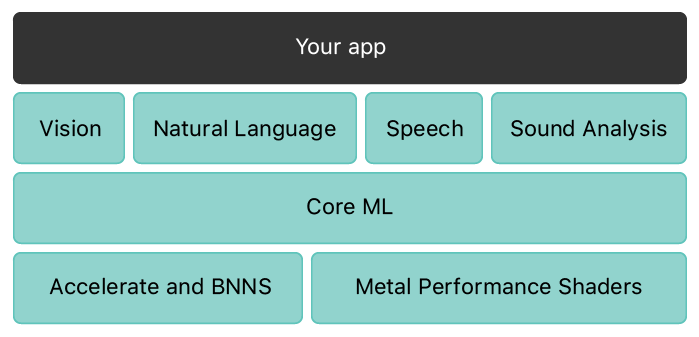
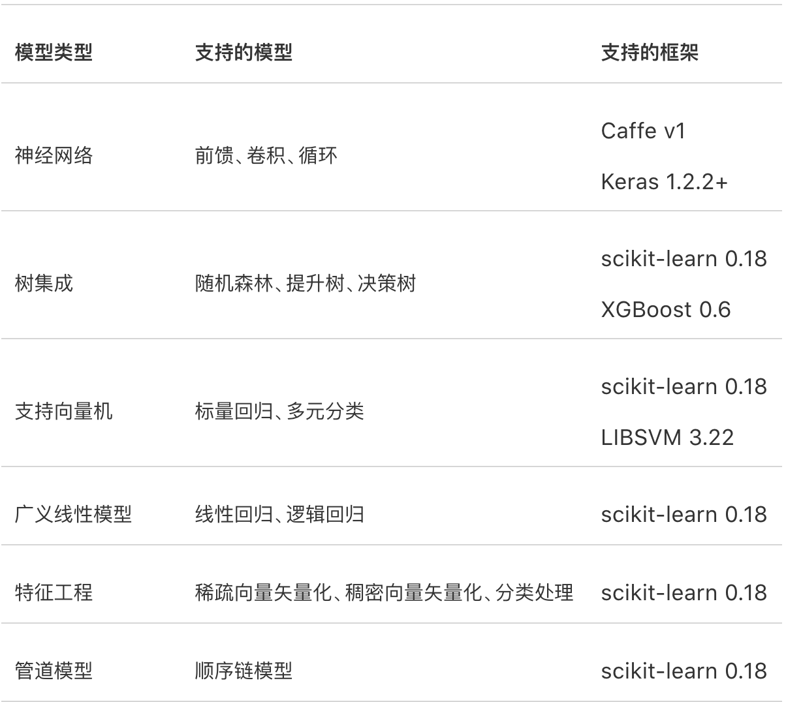

# Core ML 

## 概述 
利用Core ML 在app 中整合机器学习模型， Core ML 为所有的模型提供了统一的呈现方式。App 可以使用 Core ML API 和用户数据进行预测，以及训练或精调模型，一切都在用户设备上完成。  
“模型”是对一组数据应用机器学习算法得到的结果。可以使用模型来对新的是数据进行预测。有很多依靠编写代码仅能低效甚至很难完成的任务，使用模型能更好地完成。例如，可以训练模型来归类照片，或者直接根据像素检测照片内的特定对象。

可以使用Xcode 内置的 Create ML app 来构建和训练模型。使用 Create ML 训练的模型采用 Core ML 模型格式，并能直接在 app 中使用。另外，也可以使用许多其他机器学习资源库，再使用 Core ML 工具 将模型转换成 Core ML 格式。模型下载到用户设备上后，然后使用 Core ML 在设备端利用用户数据进行重新训练或优化。

Core ML 通过利用 CPU、GPU 和神经网络引擎，同时最大程度地减小内存占用空间和功耗，来优化设备端性能。由于模型严格地在用户设备上，因此无需任何网络连接，这有助于保护用户数据的私密性和 app 的响应速度。   

Core ML 支持使用计算机视觉框架分析图像， 使用自然语言框架处理文本， 使用语音框架将音频转换为文本。以及使用 SoudAnalysis 识别音频中的声音。__Core ML 本身是基于 Accelerate 和 BNNS  等底层语言以及 Metal Performance Shaders 而构建的__    

  

 ## 准备工作  
 ### 获取Core ML 模型  
 Core ML 支持多种机器学习模型，包括神经网络、树集成、向量机、广义线性模型。Core ML 要求使用 Core ML 模型格式(.mlmodel). 
 利用 Create ML 和自己的数据，可以自己训练模型，例如： 识别图像、提取文本以及查找数值之间的关系等。使用 Create ML 训练的模型使用 Core ML 模型格式，并能直接在 app 中使用。
Apple 还提供了多个热门的开源模型，这些模型已经是 Core ML 模型格式。您可以下载这些模型并在 app 中开始使用它们。  
[ 默认提供模型](https://developer.apple.com/cn/machine-learning/models/)  

 
 ### 将 Core ML 模型集成到 app 中 
 需要将 `.mlmodel`文件拖放到Xcode 工程中， Xcode提供了使用有关模型输入和输出的信息来自动生成模型的自定义编程接口，可以使用该接口与代码中的模型进行交互。 
 
 1. 初始化模型(此处是示例模型)
 	```
 	let model = MarssHabitatPricer()
 	```
 
 2. 获取输入值并进行预测  
	```
	guard let marsHabitatPricerOutput = try? model.prediction(solarPanels: solarPanels, greenhouses: greenhouses, size: size) else {
    fatalError("Unexpected runtime error.")
	}
	
	```
 > 注意： 输入的格式错误将导致 Core ML 提示错误
 
 
 ### 经过训练模型转化为 Core ML  
 将使用第三方机器学习工具创建且经过训练的模型转换为 Core ML 模型格式。  
 通过使用 Core ML 工具可以进行转化：  
   
 
1. 使用已有转换工具  
 将 Caffe 模型转换为 Core ML  
 
 ```
 import coremltools 
 
 // 转换 
 coreml_model = coremltools.converters.caffe.convert('xxxxx.caffemodel') 
 
 // 保存结果 
 coremltools.utilss.save_spec(coreml_model, 'my_model.mlmodel') 
 ```
 
 2. 自己编写自定义转换工具  
	
 
 
 
 ## 基础应用  
 
 
 ### 通过计算机视觉和 Core ML 对图像进行分类  
 
 
 ### 通过计算机视觉和对象监测了解掷色子  
 
 
 ###在文本中查找答案  
 
 
 ## 扩展优化  
 
 ### 缩减Core ML App 大小
 在APP中捆绑机器学习模型是开始使用Core ML 最简单的方法，随着模型变得越来越高级，它们会变得越来越大， 因此会占用相对多的存储空间。对于基于神经网络的模型，可以考虑使用精度更加低的表示法来缩减占用空间，如果模型不是能够使用较低精度的神经网络模型，或者需要进一步缩减 app 的大小时，您可以增加在设备上下载和编译模型的功能，而不要将模型捆绑到 app 中。
 
 
 #### 1. 转换为较低精度模型 
 Core ML 工具提供了可将神经网络模型的浮点权重从全精度值转换为半精度值， (将表示法中使用的位数从 32 位缩减至 16 位)，或者转换为更低精度的值 (1 到 8 位)  
 
 #### 2. 下载和编译模型  
 让 app 将模型下载到用户设备，然后在后台编译模型。例如，如果用户只使用 app 支持的一小部分模型，则无需将所有可能的模型都捆绑到 app 中。这时可以选择根据用户行为下载模型。   
 
* 使用此种方案有以下特点：  
	1. 减少app 在 app store 的下载量 
	2. 在安装后根据用户的需求，特定兴趣等为用户确定正确的模型  
	3. 通过网络提供模型更新  
 
 
 * 具体方式：  
	1. 通过URLSession， CloudKit 或者其他网络工具库将以 `.mlmodel`为后缀的文件下载在用户设备上  
	2. 通过以下方式进行编译模型, 将产生一个同名但以`.mlmodelc` 为后缀的文件 
		```
		let compiledModelURL = try MLModel.compileModel(at: url)
		``` 
	3. 使用编译结果  
		`let model = try MLModel(contentsOf: compiledModelURL)`
		通过网络下载的方式与打包到app 中的具有相同功能   
	
 * 优化点 
	* 将可重复使用的模型进行永久保存   
		MLModel默认将编译的模型保存到临时位置。如果应用程序以后可以重用模型，可以通过将编译后的模型保存到永久位置来减少应用程序的资源消耗。
	 	```
		let fileManager = FileManager.default
		let appSupportURL = fileManager.urls(for: .applicationSupportDirectory,
                                     in: .userDomainMask).first!
                                     
		let compiledModelName = compiledModelURL.lastPathComponent
		let  permanentURL = appSupportURL.appendingPathComponent(compiledModelName)
		
		// Copy the file to the to the permanent location, replacing it if necessary.
		_ = try fileManager.replaceItemAt(permanentURL,
                                  withItemAt: compiledModelURL)

		```
	
 
 
 
 
 
 
 
 
 
 
 
 
 
 
 
 