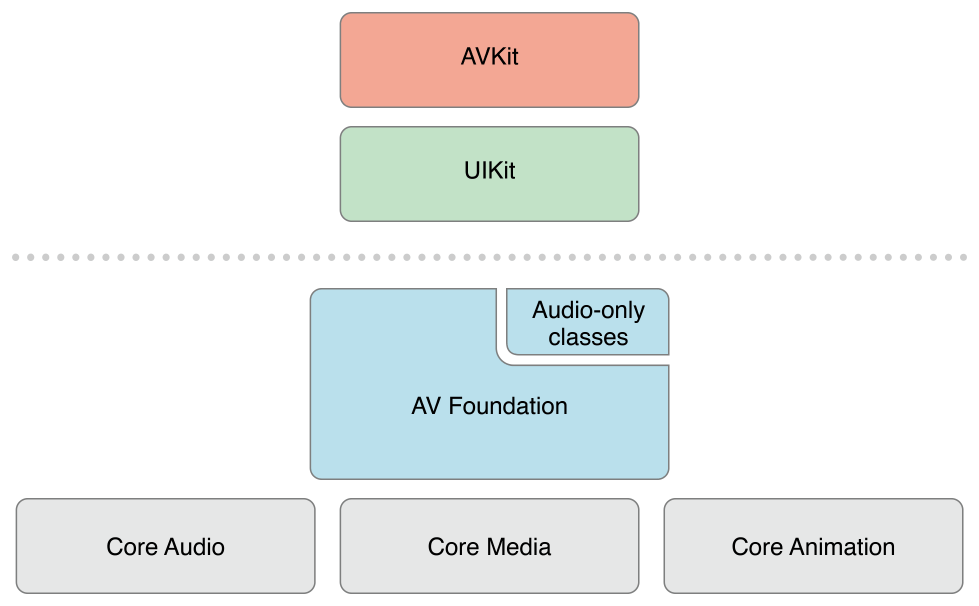
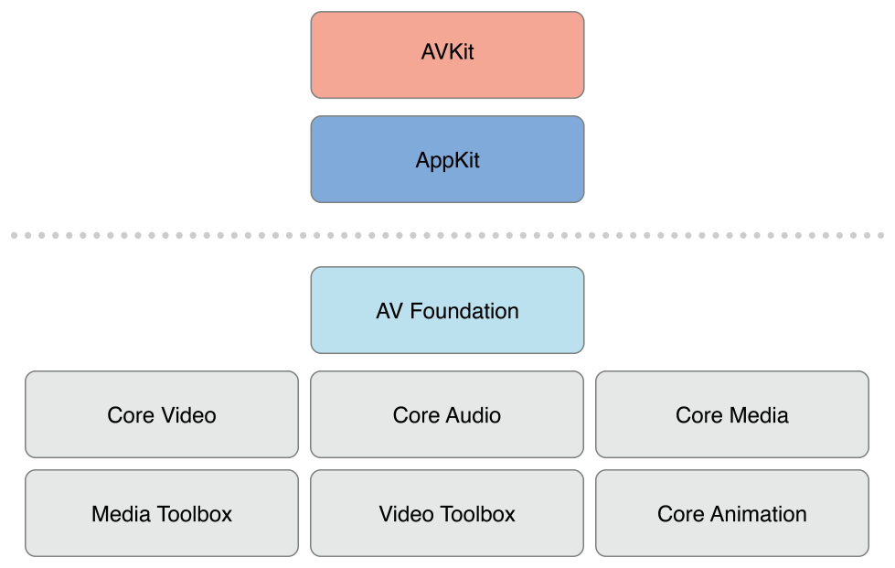

# AVFoundation 简介  
AVFoundation 是可用于播放和创建基于时间轴的多媒体框架之一。它提供了基于Objective-C 的应用程序接口，你可使用它来详细处理基于时间轴的音视频数据。例如， 可以用它来检查，创建，编辑以及重新编码媒体文件。可以从设备获取一个输入流，并且在实施捕获或回放期间处理视频。一下是iOS中架构部分：  
    
> iOS上的架构  

  
> OS X 上架构  

通常应该使用允许执行任务的最高级别的抽象接口  
* 如果只是简单的播放视频， 可以使用 AVKit 框架  
* 在iOS上，如果只是需要对格式最小控制的录制视频，请使用 UIKit 框架的(__UIImagePickerController__)  

但是，请注意， 在 AV Foundation 中使用的部分原始数据结构(包括时间相关的数据结构以及描述媒体数据的一些对象)是在 Core Media 框架中定义的。   

## 惊鸿一睹    
在 AVFoundation 框架中主要包含了两部分，一部分是关于视频录制的，一部分是关于音频录制的。其中音频相关的部分提供的简单的音频处理方法  
* 可以通过 `AVAudioPlayer` 播放音频文件  
* 可以通过 `AVAudioRecorder` 实现音频录制  

还可以使用 `AVAudioSession` 对象来针对应用程序的音频行为进行配置。详细的请参考[音频回话指南](https://developer.apple.com/library/archive/documentation/Audio/Conceptual/AudioSessionProgrammingGuide/Introduction/Introduction.html#//apple_ref/doc/uid/TP40007875)  

### AVFoundation 媒体操作 
`AVAsset` 是 AVFoundation 框架中用来表示媒体资源的类。框架的设计主要基于此，了解其内部结构将有助于你了解框架的工作原理。 一个AVAsset 实例是一个或多个媒体数据(音频和视频)的集合表示。 提供了关于整个集合数据的整体信息，例如标题，时间以及展示大小等。AVAsset 不受特定数据格式的约束。AVAsset 是其他类的超类，用于从URL地址创建一个资源以及用于编辑中的创建一个媒体合成资源对象。   

AVAsset 中每个媒体数据都属于同一类型，统称为 轨道(track)。典型情况下，一个轨道代表音频，一个轨道代表视频。 但在复杂的情况下，一个AVAsset会包含多个重叠的音频和视频轨道。 AVAsset 也可能会有元数据。  

AVFoundation 中一个重要的概念是__初始化 AVAsset 但并不意味着它可以直接使用。可能需要花费一些时间计算当前 item 持续时间。(例如： MP3文件可能不包含摘要信息)。但是可以在通过异步回调 block 的形式请求值，不会阻塞当前线程。

#### 播放  
AVFoundation 允许详细的去控制媒体资源的播放。为此，它将 asset 的呈现状态和资源本身拆分开来。例如： 可以同时播放不同分辨率渲染的同一资源的不同片段。资源的状态由一个 playter item 对象来管理，资源的每个track 的状态由另外的 player item track 管理。例如，在播放过程中，可以设置播放视频部分大小， 设置播放音频混合参数等，或禁用某部分。(这里很绕)  

#### 读写和编码资源  
AVFoundation 允许一下几种方式创建 asset. 可以简单的对现有 asset 进行重新编码。 也可以对 asset 中的内容进行操作，并将结另存为一个新的 asset. k可以通过 导出回话 的形式将现有的 asset 重新编码为一个由少数预设参数的格式。如果需要对转换进行更多的控制，可以串联使用 asset 读取 以及 asset 的写入对象，将 asset 资源从一种形式转化为另外一种形式。例如：使用这些对象，可以选择要在输出文件中的 track 以及指定输出格式或在过程中进行修改。

##### 缩略图  
要获取一个视频文件的缩略图，需要通过 asset 初始化一个 ` AVAssetImageGenerator` 对象，`AVAssetImageGenerator` 使用默认视频轨道生成图片。

##### 编辑  

##### 图片和视频捕获  

### AVFoundation 并发编程  

## 前提条件
AVFoundation 是一个高级的Cocoa 框架，要想使用它，必须具备以下条件： 
* 对基本Cocoa 开发工具和技术有深刻的了解
* 基本掌握 Block   
* 掌握 KVC 和 KVO  
* 关于播放，需要了解[Core Animation Programming Guide](https://developer.apple.com/library/archive/documentation/Cocoa/Conceptual/CoreAnimation_guide/Introduction/Introduction.html#//apple_ref/doc/uid/TP40004514) 和  [AVKit Framework](https://developer.apple.com/documentation/avkit)

## 其他参考  
下面有几个实例程序，其中两个实例对于理解和实现相机捕获功能有很大帮助：  
* [AVCam-iOS: s使用AVFoundation捕获图片和视频](https://developer.apple.com/library/archive/samplecode/AVCam/Introduction/Intro.html#//apple_ref/doc/uid/DTS40010112) 
      用于实现使用相机功能，涵盖了其中大部分相关功能
* [AVCamManual: 扩展 AVCam 使用 Manual Capture api](https://developer.apple.com/library/archive/samplecode/AVCamManual/Introduction/Intro.html#//apple_ref/doc/uid/TP40014578)  
    自定义的相机实现功能

* [AVLocationPlayer](https://developer.apple.com/library/archive/samplecode/AVLocationPlayer/Introduction/Intro.html#//apple_ref/doc/uid/TP40014495) 使用元数据读取API，演示如何使用元数据  