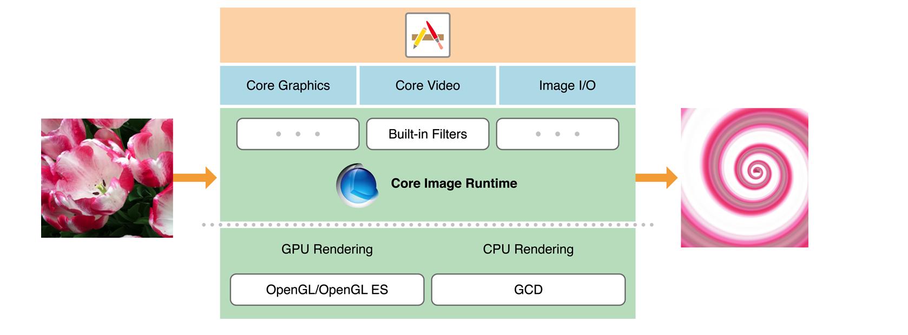

# About Core Image 

## 完成状态  

- [x] 开发中
- [ ] 未完成
- [ ] 已完成
- [ ] 维护中

 > 本文章并非直译原始文档，推荐结合原始文档阅读,针对文档中不是很好翻译的部分，采用不翻译的形式展现    

> [原文地址](https://developer.apple.com/library/archive/documentation/GraphicsImaging/Conceptual/CoreImaging/ci_intro/ci_intro.html#//apple_ref/doc/uid/TP30001185)

`Core Image` 是一种图像处理和分析技术，旨在为静态和视频图像提供近乎实时的处理能力。它使用GPU和CPU渲染来自 `Core Graphics`,`Core Video`,`Image I/O` 框架的图像数据进行处理。Core Image 通过提供简单的 API接口来隐藏底层的图形处理细节。通过 Core Image, 无需了解 OpenGL, OpenGL ES 或者 Metal 框架的细节就可以充分利用 GPU 的强大功能，也无需了解 GCD 来获取多核多线程支持    

  
> 图片来自官方文档

## 惊鸿一睹  
Core Image 支持：  
* 访问内置图像处理过滤器  
* 特征检测  
* 支持自动图像增强  
* 将多个过滤器连接在一起创建自定义效果  
* 支持创建在 GPU 上运行的自定义过滤器  
* `Feedback-based`图像处理能力

在macOS上，Core Image还提供了一种打包自定义过滤器以供其他应用程序使用的方法。   

## Core Image 高效简单的处理和分析图像  
Core Image 提供了近百种内置过滤器。通过对过滤器提供不同的入参来对其进行设置。一个过滤器的输出可以是另一个过滤器的输入，从而可以将多个过滤器连接起来来实现一些惊人的效果。 如果创建要再次使用的过滤器，可以考虑将 CIFilter 子类化。   

提供的内置过滤器分为十几种不同类别，一些目的是实现艺术效果，例如： 风格化，半色调滤镜等，有些更适合修复图像，例如颜色调整，锐化等   

Core Image 可以分析图像的质量并提供一组具有最佳设置的滤镜用于调整色调，对比度以及矫正瑕疵(红眼)等功能。可以通过一个方法调用来完成以上所有功能   
Core Image 还可以检测图像中的人脸特征，并在视频中实时跟踪。通过确定人脸位置来确定贴图或其他特殊过滤器的功能   

* [处理图像]()
* [面部识别]()  
* [图像自动增强]()
* [自定义CIFilter]()

## 内置过滤器及其属性列表  
Core Image 针对提供的内置过滤器都有详尽的文档。针对每个过滤器，可以查询到其包含的属性，例如： 名称，输入参数，默认参数值，最小值以及最大值等

[内置过滤器列表]()

## 实时视频处理  
如果您的应用需要实时处理视频，可以采取一些措施来优化性能。

## 使用 Image Accumulator 支持`Feedback-based`  
`CIImageAccumulator` 专为基于分亏的高效图像处理而设计，如果你的程序需要对图像进行动态操作，那将非常有用   

## 创建和分发自定义过滤器  
如果内置的单个或链接的过个过滤器都不能满足需求，可以通过自定义过滤器来实现。您需要了解基于像素级的操作，因为它是所有过滤器的核心   

在macOS中，您可以将一个或多个自定义过滤器打包为图像单元，以便其他应用程序可以加载和使用它们。   

* [自定义过滤器]()
* [macOS 打包过滤器]()

