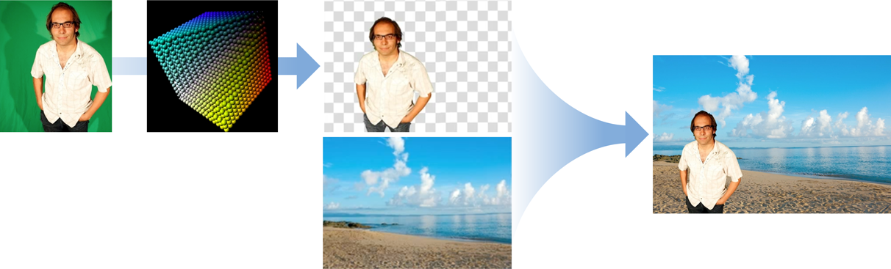
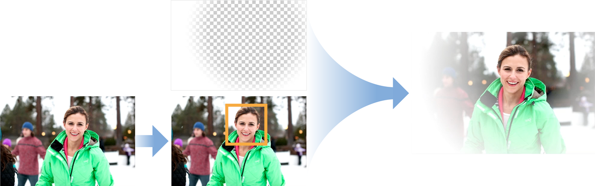
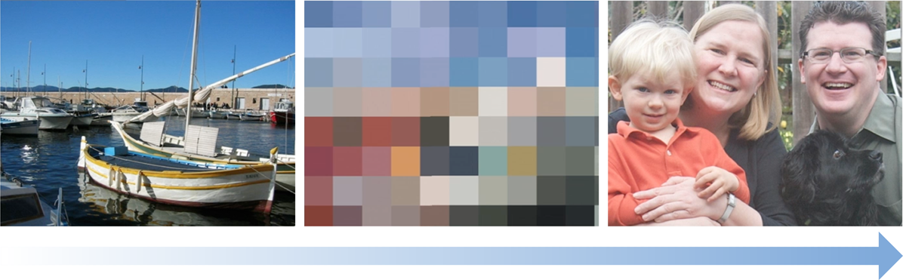
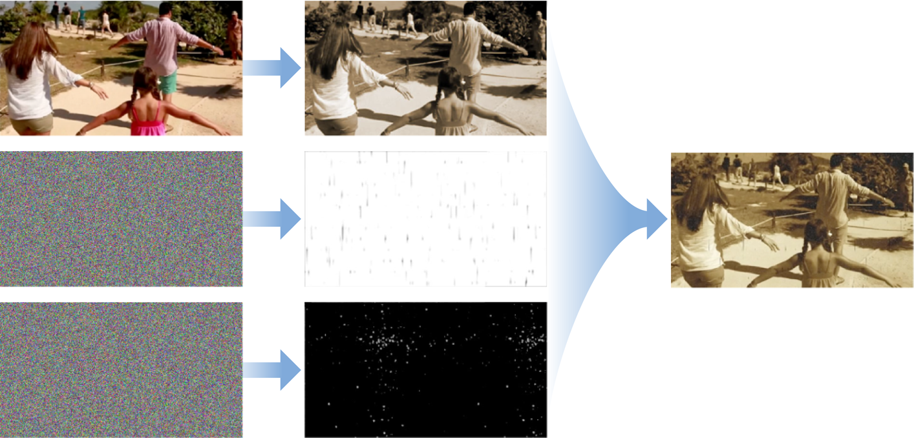

# 继承CIFilter实现自定义效果   

可以使用一个 Filter 的输出作为另一个Filter 的输入来实现自定义效果并根据需要将更多的Filter 链接在一起。当需要多次使用这种链式Filter时，可以考虑子类化`CIFilter`将其封装为一个过滤器   


本章介绍了CoreImage，如果子类化CIFilter 创建一个  `CIColorInvert`filter, 它通过将各种过滤器链接在一起实现有趣的效果。 通过创建 `CIColorInvert` 过滤器，可以从中学到如何通过内置过滤器创建自己有趣的过滤器组合，实现有趣的效果   


### 创建CIColorInvert(子类化 CIFilter)  
当子类化 CIFilter 时，可以通过设置默认值来修改现有过滤器(过滤器链)的效果。Core Image使用相同技术实现了一些内置过滤器。   

自定义过滤器步骤：  
* 声明过滤器输入参数属性，必须为每个输入参数添加前缀`input`,例如:inputImage   
* 如果需要设置默认值，需要重写`setDefaults`方法  
* 重写 `outputImage` 方法  


Core Image提供的`CIColorInvert`过滤器是`CIColorMatrix`过滤器的变种。CIColorInvert为CIColorMatrix提供了反转输入图像颜色的矢量(vectors)。  

```
@interface CIColorInvert: CIFilter {
    CIImage *inputImage;
}
@property (retain, nonatomic) CIImage *inputImage;
@end


@implementation CIColorInvert
@synthesize inputImage;
- (CIImage *) outputImage
{
    CIFilter *filter = [CIFilter filterWithName:@"CIColorMatrix"
                            withInputParameters: @{
            kCIInputImageKey: inputImage,
        @"inputRVector": [CIVector vectorWithX:-1 Y:0 Z:0],
        @"inputGVector": [CIVector vectorWithX:0 Y:-1 Z:0],
        @"inputBVector": [CIVector vectorWithX:0 Y:0 Z:-1],
        @"inputBiasVector": [CIVector vectorWithX:1 Y:1 Z:1],
        }];
    return filter.outputImage;
}
```
### 实现抠图效果滤镜
从源图像中删除颜色或颜色范围，然后将源图像与背景图像合成。  

   
> 色度键过滤器处理链  

#### 实现步骤：  
1. 创建一个颜色数据立方体贴图，用于映射要删除的颜色值，使其透明（Alpha值为0.0）。
2. 使用`CIColorCube`滤镜结合立方体贴图从源图像中删除颜色。
3. 使用`CISourceOverCompositing`过滤器将处理后的源图像混合在背景图像上

###### 创建多维度颜色Map   
颜色立方体是3D颜色查找表。 `CIColorCube`将颜色值作为输入，并将查找表应用于值。`CIColorCube`的默认查找表是一个单位矩阵 - 意味着它对提供的数据没有任何作用。但是，此配方要求您从图像中删除所有绿色。通过将绿色设置为 `alpha=0.0`来删除图像中的绿色。最直接的方式是将图像中的RGBA颜色转换为 HSV值。在HSV中，色调表示为围绕圆柱的中心轴的角度。在该表示中，您可以将颜色可视化为饼图切片，然后只需删除表示色度键颜色的切片。   
要删除绿色，您需要定义包含绿色色调的中央访问周围的最小和最大角度。然后，对于任何绿色的东西，将其alpha值设置为0.0。纯绿色的值相当于120º。最小和最大角度需要以该值为中心。

立方体贴图数据必须预乘alpha，因此创建立方体贴图的最后一步是将RGB值乘以刚刚计算的alpha值，对于绿色色调，该值为0.0，否则为1.0。清单5-3显示了如何创建此过滤器配方所需的颜色多维数据集。

> 注意：此处完全采用了Google 翻译的结果   

```
// Allocate memory
const unsigned int size = 64;
float *cubeData = (float *)malloc (size * size * size * sizeof (float) * 4);
float rgb[3], hsv[3], *c = cubeData;
 
// Populate cube with a simple gradient going from 0 to 1
for (int z = 0; z < size; z++){
    rgb[2] = ((double)z)/(size-1); // Blue value
    for (int y = 0; y < size; y++){
        rgb[1] = ((double)y)/(size-1); // Green value
        for (int x = 0; x < size; x ++){
            rgb[0] = ((double)x)/(size-1); // Red value
            // Convert RGB to HSV
            // You can find publicly available rgbToHSV functions on the Internet
            rgbToHSV(rgb, hsv);
            // Use the hue value to determine which to make transparent
            // The minimum and maximum hue angle depends on
            // the color you want to remove
            float alpha = (hsv[0] > minHueAngle && hsv[0] < maxHueAngle) ? 0.0f: 1.0f;
            // Calculate premultiplied alpha values for the cube
            c[0] = rgb[0] * alpha;
            c[1] = rgb[1] * alpha;
            c[2] = rgb[2] * alpha;
            c[3] = alpha;
            c += 4; // advance our pointer into memory for the next color value
        }
    }
}
// Create memory with the cube data
NSData *data = [NSData dataWithBytesNoCopy:cubeData
                       length:cubeDataSize
                       freeWhenDone:YES];
CIColorCube *colorCube = [CIFilter filterWithName:@"CIColorCube"];
[colorCube setValue:@(size) forKey:@"inputCubeDimension"];
// Set data for cube
[colorCube setValue:data forKey:@"inputCubeData"];


```

###### 从源图中删除绿色  
通过颜色数据表，通过`CIColorCube`滤镜实现删除颜色  
```
[colorCube setValue：myInputImage forKey：kCIInputImageKey];
CIImage * result = [colorCube valueForKey：kCIOutputImageKey];

```

###### 混合图像  
通过`CISourceOverCompositing`将处理后的图像和背景图混合：  
* 设置`inputImage`为从`CIColorCube`过滤器生成的图像。
* 设置`inputBackgroundImage`为显示新背景的图像。此示例使用海滩图像。


### 面部过滤实现白色蒙版模糊效果  
增强图像中人物脸部周围的图像亮度    
  
> 白色 Vignette 过滤器处理链  

#### 实现步骤：
1. 在图像中找到人脸  
2. 使用`CIRadialGradient`创建基本阴影贴图  
3. 将贴图与源图合并   

###### 找到人脸  
使用 `CIDetector` 类在图像中定位人脸位置，通过`featuresInImage:options:`返回检测到的所有面部对象。通过面部兑现提供的数据计算面部基于源图所在的中心位置，通过中心位置创建阴影贴图效果   

```
CIDetector *detector = [CIDector detectorOfType:CIDetectorTypeFace
                                        context:nil
                                        options:nil];
NSArray *faceArray = [detector featuresInImage:image options:nil];
CIFeature *face = faceArray[0];
CGFloat xCenter = face.bounds.origin.x + face.bounds.size.width/2.0;
CGFloat yCenter = face.bounds.origin.y + face.bounds.size.height/2.0;
CIVector *center = [CIVector vectorWithX:xCenter Y:yCenter];
```
> 使用 CIDetector 检测人脸  

###### 创建阴影效果  
使用 `CIRadialGradient` 过滤器创建以面部为中心店额阴影贴图。阴影贴图的中心应该是透明的，以保证图像中人脸部分是不变得，贴图边缘应该为不透明的白色。中间英爱是渐变效果     

要实现此效果，需要以下参数：  
* 设置`inputRadius0`为大于图像最长尺寸的值。
* 设置`inputRadius1`为大于脸部的值，例如face.bounds.size.height + 50。
* 设置`inputColor0`为不透明的白色。
* 设置`inputColor1`为透明白色。
* 设置`inputCenter`为上文中计算的面部中心点


###### 将渐变与源图合并  
设置 `CISourceOverCompositing` 过滤器输入参数为：  
* 设置 `inputImage`为原始图像  
* 设置 `inputBackgrountImage` 为以上生成的阴影贴图  


### 人脸马赛克过滤器  
通过识别图像中的人脸，并对其进行像素化处理   
   
#### 实现步骤：  
1. 创建图像的像素化版本。
2. 使用图像中检测到的面构建蒙版。
3. 使用蒙版将像素化图像与原始图像混合。


###### 创建像素化版本  
使用 `CIPixellate` 过滤器实现：  
* 设置 inputImage 为源图像  
* 设置`inputScale`为 `max(width,height)/60`或者另一个合适的值  

###### 检测面部  
使用 `CIDetector` 检测人脸。并针对每个人脸实现以下操作：  
* 使用 `CIRadialGradient` 创建围绕脸部的圆圈  
* 使用 `CISourceOverCompositing` 将渐变添加到蒙版    

```CIDetector *detector = [CIDetector detectorOfType:CIDetectorTypeFace
                                          context:nil
                                          options:nil];
NSArray *faceArray = [detector featuresInImage:image options:nil];
 
// Create a green circle to cover the rects that are returned.
 
CIImage *maskImage = nil;
 
for (CIFeature *f in faceArray) {
    CGFloat centerX = f.bounds.origin.x + f.bounds.size.width / 2.0;
    CGFloat centerY = f.bounds.origin.y + f.bounds.size.height / 2.0;
    CGFloat radius = MIN(f.bounds.size.width, f.bounds.size.height) / 1.5);
    CIFilter *radialGradient = [CIFilter filterWithName:@"CIRadialGradient" withInputParameters:@{
        @"inputRadius0": @(radius),
        @"inputRadius1": @(radius + 1.0f),
        @"inputColor0": [CIColor colorWithRed:0.0 green:1.0 blue:0.0 alpha:1.0],
        @"inputColor1": [CIColor colorWithRed:0.0 green:0.0 blue:0.0 alpha:0.0],
        kCIInputCenterKey: [CIVector vectorWithX:centerX Y:centerY],
        }];
    CIImage *circleImage = [radialGradient valueForKey:kCIOutputImageKey];
    if (nil == maskImage)
        maskImage = circleImage;
    else
        maskImage = [[CIFilter filterWithName:@"CISourceOverCompositing" withInputParameters:@{
            kCIInputImageKey: circleImage,
            kCIInputBackgroundImageKey: maskImage,
            }] valueForKey:kCIOutputImageKey];
}
```

###### 混合像素化图像，蒙版和原始图像   
应用`CIBlendWithMask`滤镜实现  
* 设置 `inputImage` 为像素化版本  
* 设置 `inputBackgrountImage` 为原始图像  
* 设置 `inputMaskImage`为合成的绿色圆圈   

### Pixellate Transition Filter(像素化过渡)



通过像素化从一个图像转换为另一个图像  

#### 实现步骤  
1. 使用CIDissolveTransition在源图像和目标图像之间进行转换。  
2. Pixellate过渡


###### 创建过度  
使用`CIDissolveTransition` 实现：  
* 设置`inputImage`为要转换的图像。
* 设置`inputTagetImage`为要转换的图像。
* 设置`inputTime`为类似的值`min(max(2*(time - 0.25), 0), 1)`，这是一个夹在两个值之间的斜坡函数。  


###### Pixellate过渡  
使用 `CIPixellate`滤镜实现：  
* 设置`inputImage`为`CIDissolveTransition`过滤器的输出图像。
* 设置`inputScale`为通过提供三角函数的值来改变时间：`90*(1 - 2*abs(time - 0.5))`
* 使用默认值`inputCenter`。


### 老电影效果滤镜   
将低图片的质量，使其看起来像老旧电影  
   

#### 实现步骤： 
1. 应用 `CISepiaTone` 滤镜  
2. 创建随机变化的白色斑点  
3. 创建随机变化的深色划痕  
4. 将斑点和划痕混合到棕褐色图像上   


###### 改变图片颜色为棕褐色  
应用 `CISepiaTone` 滤镜：  
* 设置 `inputImage` 为原始图像  
* 设置`inputIntensity` 为 1.0  

###### 创建随机变化白色斑点  
使用 `CIRandomGenerator` 产生彩色噪点。并通过`CIColorMatrix` 过滤器将其处理为白色斑点：  

* 设置 `inputImage`为`CIRandomGenerator`的输出
* 设置`inputRVector`，`inputGVector`和`inputBVector`（0,1,0,0）  
* 设置`inputBiasVector`为（0,0,0,0）


使用 `CISourceOverCompositing` 将斑点与图像混合   
* 设置`inputImage`为`CIColorMatrix`过滤器生成的白色斑点图像。
* 设置`inputBackgroundImage`为`CISepiaTone`过滤器生成的图像。


###### 创建随机变化的黑色划痕  
使用CIRandomGenerator过滤器生成彩色噪声。通过`CIAffineTransform`过滤器处理：  
* 设置`inputImage`为`CIRandomGenerator`过滤器生成的噪声。  
* 设置`inputTransform`为将x缩放1.5并将y缩放25.这会使像素变厚且变长，但它们仍会被着色。

> PS: 也可以通过`CIAffineTransform`的`方法是使用该imageByApplyingTransform:`方法转换噪声。   


使像素变暗，通过 `CIColorMatrix`过滤器先生成青色划痕：  
* 设置inputImage为转换后的视频图像。
* 设为inputRVector（4,0,0,0）。
* 设置inputGVector，inputBVector和inputAVector（0,0,0,0）。
* 设为inputBiasVector（0,1,1,1）。

要使青色划痕变暗，使用`CIMinimumComponent`过滤器应用于划痕。此滤镜使用r，g，b值的最小值来生成灰度图像。


###### 将斑点和划痕混合到棕褐色图像  
使用 `CIMultiplyCompositing` 滤镜实现此功能： 
* 设置`inputBackgroundImage`为已处理的图像（棕褐色调，白色斑点）。
* 设置`inputImage`为深色划痕，即CIMinimumComponent过滤器的输出。  


