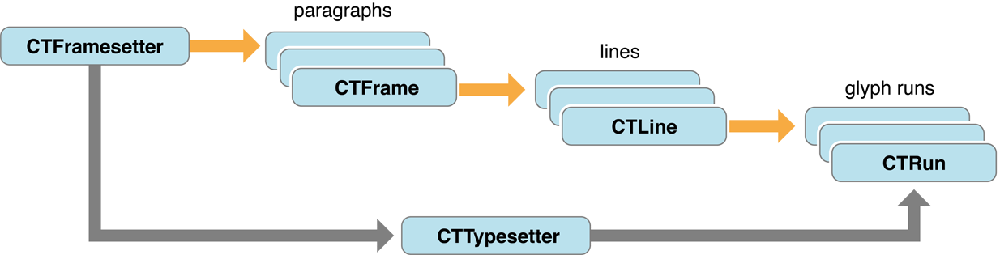

# Core Text  

Core Text 是用来高性能处理字体和布局文本的底层框架   

> 

## 简介  
Core Text 适用于在 Core Greaphics 框架级别用来处理文本情况，如果需要使用 Quartz 并且需要绘制文本，可以使用 Core Text 来完成。例如： 在页面布局中，需要绘制部分文本，可以使用Core Text 生成具体文本并进行绘制。Core Text 可以提供例如：字间距调整，连字，断线，对其等精细排版     

### Core Text 布局文本  
Core Text 生成字形(来自字符代码和字体数据)。提供与字形和布局相关的数据，例如字形位置以及线条和帧的测量，处理字符数形和段落样式等  

### 管理字体 
Core Text 字体API 提供字体集合，字体描述符以及对字体数据的轻松访问。支持多种主字体，字体变体，字体联级等  
Core Text 提供了 Quartz 替代方法，可以将自己的字体加载的当前进程中。

### 其他资源  
* [CoreTextPageView](https://developer.apple.com/library/archive/samplecode/CoreTextPageViewer/Introduction/Intro.html#//apple_ref/doc/uid/DTS40010699) 显示了如何使用Core Text 显示大量文本   
* [DownloadFont](https://developer.apple.com/library/archive/samplecode/DownloadFont/Introduction/Intro.html#//apple_ref/doc/uid/DTS40013404) 如何下载字体 
* [CoreTextRTF](https://developer.apple.com/library/archive/samplecode/CoreTextRTF/Introduction/Intro.html#//apple_ref/doc/uid/DTS40007772) 展示了如何使用Core Text在Cocoa应用程序的窗口中布局和绘制RTF内容。  
* [沿着路径绘制](https://developer.apple.com/library/archive/samplecode/CoreTextArcCocoa/Introduction/Intro.html#//apple_ref/doc/uid/DTS40007771) 显示了如何使用Core Text在曲线上布局和绘制字形。  
* [Core Foundation Design Concepts](https://developer.apple.com/library/archive/documentation/CoreFoundation/Conceptual/CFDesignConcepts/CFDesignConcepts.html#//apple_ref/doc/uid/10000122i) 和 [ Core Foundation Framework Reference](https://developer.apple.com/documentation/corefoundation)这是一个框架，提供Core Text使用的常见数据类型和基本软件服务的抽象。
* [文本布局编程指南](https://developer.apple.com/library/archive/documentation/Cocoa/Conceptual/TextLayout/TextLayout.html#//apple_ref/doc/uid/10000158i) 描述了Cocoa文本布局引擎。