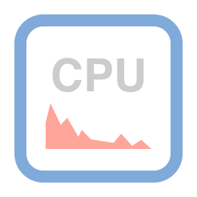
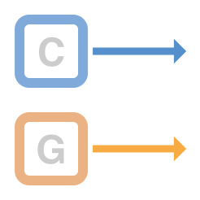
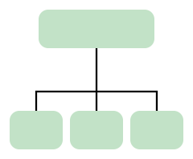

# Metal 最佳实践  

## 基础概念  
Metal提供对GPU的最低开销访问，使您能够在iOS，macOS和tvOS上最大化应用程序的图形和计算潜力。每毫秒和每一点都是Metal应用程序和用户体验不可或缺的一部分。通过遵循本指南中描述的最佳实践来确保Metal应用程序尽可能高效地运行。这些最佳实践适用于所有支持Metal平台，除非另有说明   

#### 高效  
1. __低CPU开销__  

       

    Metal旨在减少或消除许多CPU端性能瓶颈。只有按照建议使用API，才会从中受益   
2. __最佳GPU性能__  

       

    Metal 允许创建并向GPU提交命令，要优化GPU性能，首先应该优化这些命令的实现     
3. __并行性能力__  

       

    Metal 旨在最大化CPU和GPU并行性，应用应该让处理器并行工作   
4. __有效资源管理__  

      

    Metal为您的资源对象提供简单而强大的接口。应用应该有效地管理这些资源，以减少内存消耗并提高访问速度。  

## 资源管理   
__最佳实践__:应该今早创建持久化对象，并重用   
### 持久化对象  
Metal 框架提供了再应用程序生命周期中管理持久化对象的协议。 这些对象的创建成本很高，但通常会创建一次并多次重用。  不需要再每个渲染或计算开始之前创建    

#### 初始化设备和命令队列  
* `MTLCreateSystemDefaultDevice`: 在具体任务开始之前调用该函数获取默认系统设备   
* `newCommandQueueor/newCommandQueueWithMaxCommandBufferCount:` 调用方法创建一个命令队列，用于在该设备上执行GPU命令    

所有应用程序应该每个GPU只会创建一个 `MTLDevice`对象，并将其重用于GPU 上所有的 Metal 任务。大多数应用程序应该每个GPU只创建一个MTLCommandQueue对象，但如果每个命令队列代表不同的Metal工作（例如，非实时计算处理和实时图形渲染），您可能需要更多。    

>   一些macOS设备具有多个GPU,如果需要使用多个GPU，可以调用`MTLCopyAllDevices`函数以获取可用设备,并为使用的每个GPU创建并保留至少一个命令队列

#### 早构建期编译函数库  
有关在构建时编译函数和构建库的概述，请查看 __函数和库__ 最佳实践。  
在运行时， 使用`MTLLibrary`和`MTLFunction`对象访问图形库和计算函数。 避免在运行时构件库或在渲染，计算循环时获取函数   

如果需要配置多个渲染或计算管道，尽可能的重用`MTLFunction`对象。 在构建依赖于它们的所有渲染和计算管道之后，您可以释放`MTLLibrary`和`MTLFunction`对象   

#### 构建管道并重用   
构建一个可编程管道需要消耗大量资源对GPU状态进行评估。此时应该只构建一次MTLRenderPipelineState和MTLComputePipelineState对象，然后在创建的每个新渲染或计算命令编码器进行重用。不要对单个编码器构建新的管道

> 除了渲染器和计算管道，还可以选择创建封装深度，模板和采样器状态的`MTLDepthStencilState`和`MTLSamplerState`对象.这些对象相对轻量级，但也应仅创建一次并重复使用

#### 预先分配存储资源  
资源数据可以是静态的或动态的，并且可以在应用程序的整个生命周期都可访问，但是，也应尽早创建代表数据的`MTLBuffer`和`MTLTexture`对象。创建这些对象后，资源属性和内存分配是不可变的，但数据本身不是;可以在必要时更新数据。尽可能重用MTLBuffer和MTLTexture对象, 特别是针对静态数据。避免在渲染或计算循环期间创建新资源，即使动态数据也是如此。

#### 总结
* 每个GPU只会创建一个 `MTLDevice`对象  
* 每个GPU只创建一个MTLCommandQueue对象(__除非运行不同类型任务__)     
* 在构建期编译函数库，不要在运行期(渲染，计算任务)时   
* 尽量重用`MTLLibrary`和`MTLFunction`   
* 不要为编码器构建新的管道，应该只构建一次   

#### 重复 重复 重复  使用 ， 核心就是重复使用   

### 资源操作  
__最佳实践:__  设置适当的资源存储模式和使用合适的纹理  

必须正确配置 Metal 资源，以快速访问内存和优化启动程序性能。资源存储模式运行自定义`MTLBuffer`和`MTLTexture`对象的存储位置和访问权限; 纹理使用选项允许显式声明如何使用`MTLTexture`对象。

## 显示管理  

## 命令操作  

## 汇编  
### Functions and Libraries

__最佳实践：__ 在构建时编译您的函数并构建库。

编译Metal着色语言源代码是Metal应用程序生命周期中资源消耗最多的阶段之一。Metal允许在构建时编译图形和计算函数，然后在运行时将它们作为库加载，从而最大限度地降低了成本。

#### 构建期编译库  
在构建应用程序时，Xcode会自动编译`.metal`源文件并将它们构建到单个默认库中。要获取生成的`MTLLibrary`对象，在初始化 Metal 设置时调用`newDefaultLibrary`获取   
>  

在运行期构建库会造成大量的性能消耗。仅仅是动态创建时才可以在运行期操作，通常情况下，都应该编译器构件库    
> 用户文件在runtime不支持#include指令。   

### Pipelines  

