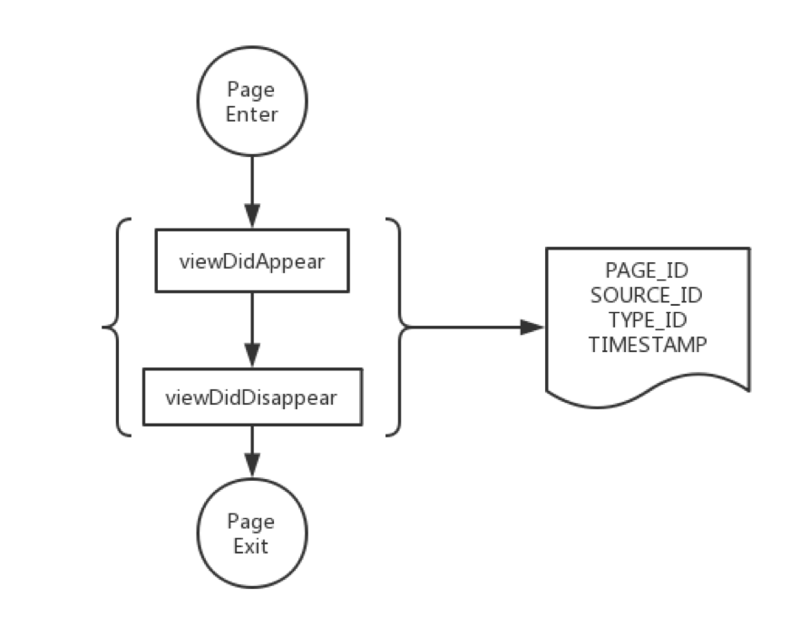
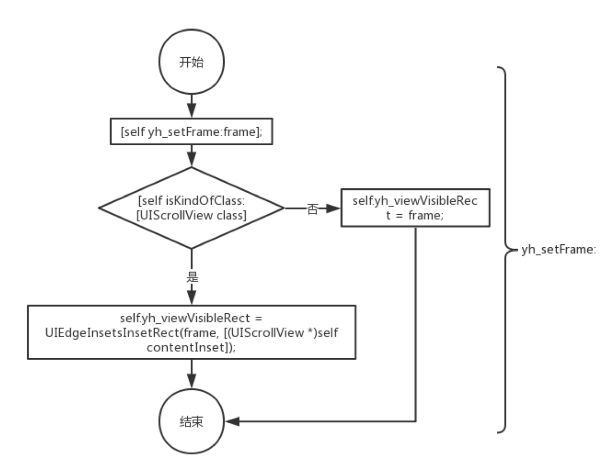
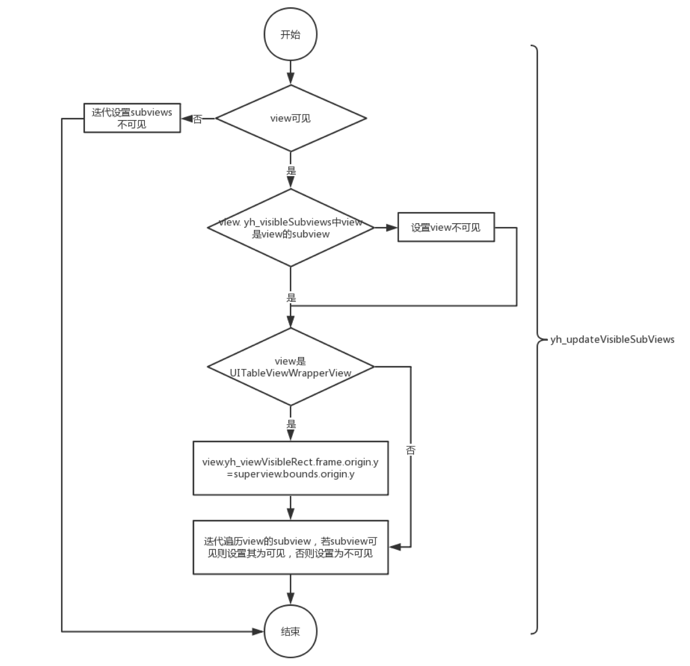
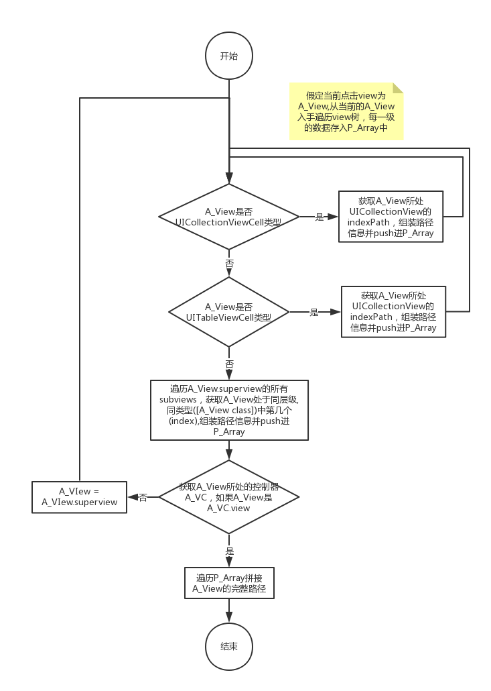
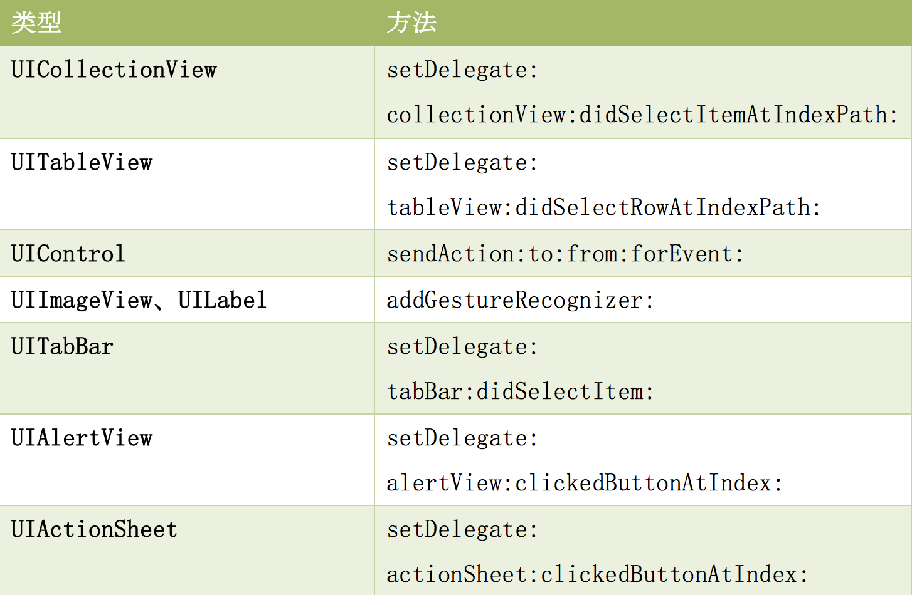
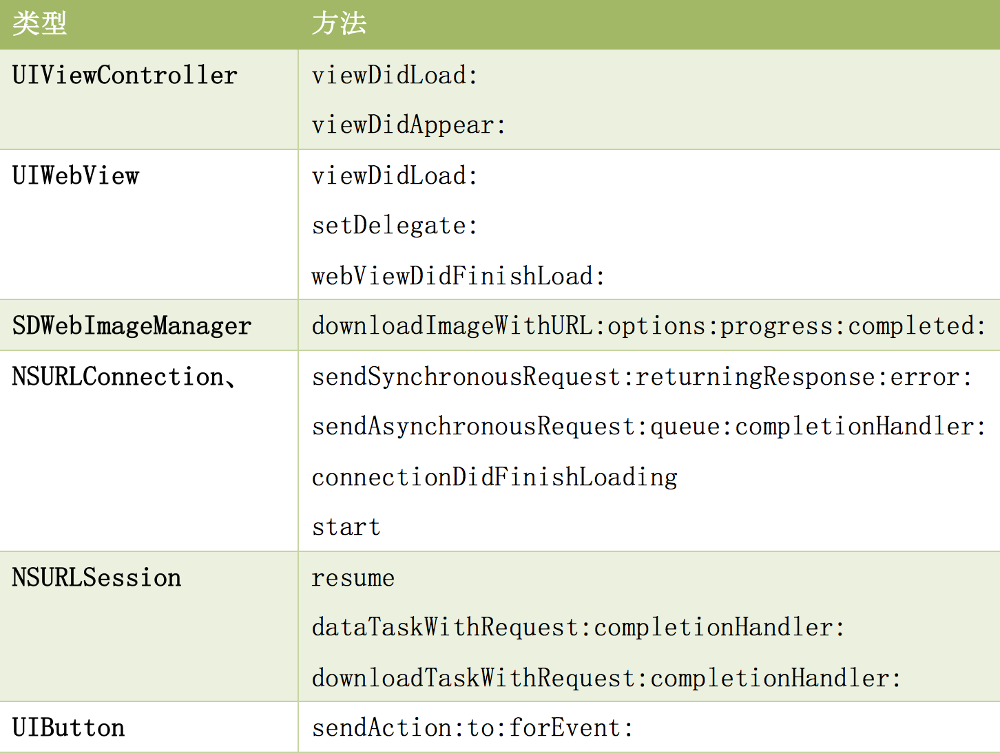

# 第一周  
### 完成状态
  
- [x] 进行中
- [ ] 已完成
- [ ] 维护中

### 日期
####2019/06/03-2019/06/09    


## 列表  

1. [~~swift 注解属性~~](http://www.russbishop.net/more-swift-attributes) 
    * [~~通过减少动态派送提升性能~~](http://ios.jobbole.com/81937/)
2. [~~GCD系列~~](https://juejin.im/user/5cb1643e6fb9a0687177ae02/posts)


## Knowledge Merge   

### swift 注解属性  
swift语言虽然不允许开发者自定义注解属性，但是其自己定义了一些注解属性来解决特定的问题， 下面是一些比较常见的注解属性  

* `@IBOutlet`  
* `@IBAction`  
    以上两个是最常见的，在使用 storyboard 开发时，通过这两个属性来标记 变量和事件方法， storyboard将识别这些内容  

* `IBInspectable`  
* `GKInspectable`  
    通过以上注解标记属性，属性将在storyboard(GK) 面板中可进行编辑，通常用在兼容 storyboard 等可视化面板开发时，标注自定义属性，使其可以再面板中进行操作   

* `@IBDesignable`  
    通过此注解标记 UIView 或者 NSView 的子类， 其可显示在 Interface Builder 中，可以实时反馈修改   
    `@IBDesignable class myView: UIView {}`

* `@UIApplicationMain` 
* `@NSApplicationMain`  
    以上两个注解，替代了 main.swift 文件的实现

* `@available`  
    通过此注解标记方法或属性适用于不同的平台或系统   
    `@available(iOS 11, *)`   

* `@NSCopying`  
    通过此注解标记一个属性，复制它， 而不是属性本身的值。例如，标记一个引用类型，那么将复制出一个新的值

* `@nonobjc`
* `@objc` 
    标记一个方法或者属性以及类等是否 objective-C 可见   

* `@objcMembers`  
    此注解给类中属性批量的添加 `@objc` 注解   

* `@escaping`  
    此注解标记的值可以存储起来，以便后续代码可以继续使用，一般用作在闭包中  
    `func action(handler:@escaping () -> Void) {}`

* `@discardableResult` 
    标记当前方法的返回值可以不使用， 默认情况下，方法的返回值如果不使用编译器将报错   

    ```
    func add(a : int , b : int) -> int {}
    // 不使用  
    add(1,2)       // 系统警告，返回值没有接收使用
    _ = add(1,2)  // 不使用需要通过 _ 无效变量标记，后续丢弃  

    // 使用注解后  
    add(1,2)     // 系统不会警告

    ```
* `@inline`  
    这个注解提供编译器内联提示。有效值为 `__always`和 `never`  

* `@availability` 
    此注解标记方法或者属性仅在某些平台或者版本中可用  
    ```
    @availability(*, unavailable) 
    func test(){}  
    @availability(iOS, unavailable, message="you can't call this")
    func foo2() {}

    @availability(OSX, introduced=10.4, deprecated=10.6, obsoleted=10.10)
    @availability(iOS, introduced=5.0, deprecated=7.0)
    func foo3() {}
    ```

* `@noreturn`  
    标记一个方法或者函数一旦调用，将永远不会返回  

* `@testable`  
    在测试类中通过此注解导入模块，通过此种方式可以访问模块中的`internal`属性和方法，不过 private, fileprivate 不能访问   

* `@convention`  
    一般在C 与 swift 代码混用的地方容易出现，通过此注解，将其与之不同的语言转化为可用的形式      


* `@autoclosure`

### GCD系列  
* 串行： 任务一个个的执行，上一个执行完毕开始执行下一个，不会出现时间重叠   
* 并行： 多个任务同时执行，会出现时间上的重叠，一个任务没执行完毕， 另一个任务已经开始执行   
* 队列： 遵守 `FIFO(先进先出)`原则。 


###### GCD 队列  
* 串行队列(Serial Dispatch Queue )  
* 并行队列 (Concurrent Dispatch Queue )


* 主队列 (Main Dispatch Queue)
* 全局并发队列 (Global Dispatch Queue )
* 自定义队列   

```
1. 主队列  
    dispatch_get_main_queue()  

2. 全局并发队列
    dispatch_get_global_queue(DISPATCH_QUEUE_PRIORITY_DEFAULT,NULL)  
        参数1： 指定队列优先级 
        参数2： 保留字，当前无意义    

3. 自定义队列  
    dispatch_queue_create(,)  --->   dispatch_queue_t
        参数1： 对列名， 一般推荐使用逆序域名形式  
        参数2： 指定队列是串行/ 并行  
            DISPATCH_QUEUE_CONCURRENT    ========> 并行  
            DISPATCH_QUEUE_SERIAL / NULL ========> 串行


```

###### 任务  
* 同步执行  
    `dispatch_sync()` 添加任务，当任务执行完毕之前，当前线程阻塞     
* 异步执行
    `dispatch_async()` 此方法可能会开启新的线程执行(不一定开启，也可以使用已有线程，此处根据系统自动调度)    


###### 队列 + 执行 方式  
* 同步 + 并发  
    1. 所有任务在当前线程执行，不会开启新的线程(同步不会开启新线程)  
    2. 任务按顺序执行，没有并发的执行(并发队列，但只有一个线程执行任务)
    3. 会阻塞当前线程

* 异步 + 并发    
    1. 采用额外线程执行任务 
    2. 不会阻塞当前线程  

* 同步 + 串行 
    1. 所有任务在当前线程执行  
    2. 阻塞当前线程   

* 异步 + 串行   
    1. 任务会在额外线程执行，但任务是被在额外线程串行执行的  
    2. 不会阻塞当前线程
* 同步 + 主队列   
    1. __不可用，会导致当前线程死锁__   
    
* 异步 + 主队列  
    1. 任务都在当前线程执行  
    2. 不会阻塞当前线程  


###### GCD 死锁  
系统调用`__DISPATCH_WAIT_FOR_QUEUE__` 会导致死锁    
 
 * __原因__   

    ```
    1. thread =====> add ==========>任务1   
            任务1    runing   

    2. (同步) thread =====> add ==========> 任务2   
            阻塞  thread 
            暂停 任务1 ， 执行任务2  

    串行队列： 任务1 ， 任务2  

    当前： 
        任务1 执行需要依赖  任务2 执行完毕  

    总结：  
        串行队列保证了 任务1 执行完 执行任务2, 所以   任务2 执行依赖于 任务1   
        同步执行， 暂停 任务1 执行 任务2 ， 任务2 执行完毕接着执行 任务 1, 所以 任务1 执行依赖于 任务2 

    ```

* __方案__
    1. 不要在主线程中使用同步方式添加任务到主队列   
    2. 不要在自定义的串行队列中同步方式嵌套添加任务到该串行队列


    |               | 串行                           | 并行             |  主队列  |
    | ------------- |:----------------------------: | :-----:| :-----: |
    | 同步           | 不开辟新线程；当前线程串行执行     | 不开辟新线程；当前线程串行执行 | 死锁 |
    | 异步           | 开辟新线程，新线程串行执行任务      |  开辟新线程(1/n条线程)； 并发执行任务 |  在当前线程顺序执行 |


##### 总结
* __同步提交block(任务), 首先是阻塞当前提交 block 线程__    
* __使用同步方式，提交一个任务到一个串行队列时， 如果提交这个任务的操作所在线程，也是处于串行队列中，那么将造成死锁__  


###### Group   
`dispatch_group` 本质是提交一组任务到队列中，采用异步方式执行，同时在执行完毕，可以给予响应   

1. 创建  
   `dispatch_group_t group = dispatch_group_create();`        

2. 添加任务  
    * 使用异步代码块的方式添加  `dispatch_group_async`  
    * 使用手动通知，在任务代码执行前 `dispatch_group_enter()`通知进入任务， 在任务执行完毕`dispatch_group_leave()`离开    
        > __此种方式可适用 异步网络请求__ 


3. 任务全部执行完毕回调   
    * `dispatch_group_wait`  
        此种方式会阻塞当前线程， 直到所有任务执行完毕，才会继续往下执行，所有 执行完毕的回调是写在 此代码之后的  
    * `dispatch_group_notify`
        添加一个异步执行的任务作为结束任务，当group中的任务全部完成，才会执行`dispatch_group_notify`中添加的异步任务，这种方式不会阻塞当前线程


######信号量(dispatch_semaphore)  
`dispatch_semaphore`俗称信号量，也称为信号锁，通常用在多线程编程中控制线程访问资源的数量， 一般主要有两个用途 1. __线程同步__ , 2. __资源加锁__   

1. `dispatch_semaphore_create`  
     创建一个带有初始值的信号量   
     > 初始值 =  0 ： 主要用于处理两个线程需要协调 =========》 线程同步
     > 初始值 > 0 : 主要用于管理有限资源， 资源大小等于值(通常用于多个线程操作) =========》 资源加锁   

2. `dispatch_semaphore_wait`
    __主要用于等待或减小信号量__, 每次调用此方法，信号量值会 - 1 一般有两种情况：  
    * `< 0`， 这个方法会一直等待，阻塞当前线程，直到信号量 + 1或者超时    
        ```
        主要用在线程同步中, 当  dispatch_semaphore_create(0)  时， 使用   dispatch_semaphore_wait() 使信号量减一， 
        此时会阻塞当前线程， 直到另外一个线程调用  dispatch_semaphore_signal 使信号量 + 1 等于 0 时， 当前线程被唤醒， 执行接下来的代码        
        ```  
    * `>= 0`, 此方法会直接返回，不会阻塞当前线程   
        ```
        当想对资源进行加锁， 控制资源同时最大访问数时， 可以使用  dispatch_semaphore_create(n)   初始化信号量为 n(对资源同时访问最大数为n)  
        在开始访问资源之前  dispatch_semaphore_wait()  信号量 - 1  
        在资源访问结束     dispatch_semaphore_signal() 信号量 + 1  

        当 n 个资源访问对象都没有访问结束时， 会阻塞当前线程，并且阻塞接下来的资源访问请求，直到有一个结束资源访问  

        ```

3. `dispatch_semaphore_signal`  
    当前信号量的值 `+ 1` , 直接返回，如果信号量的值当前 => 0 , 那么唤醒当前线程，继续执行    


4. 信号量释放  
    * 在使用阶段不能针对信号量释放 `semaphore = nil`  
    * 使用阶段不能针对信号量进行重新赋值   


###### 栅栏(dispatch_barrier)     
是一个类似于`dispatch_async()/dispatch_sync()` 的API， 可以将 block 任务添加到队列中， `barrier block` 只有提交到自定义的并发队列中才能真正成为一个 `栅栏`。 只有比它先提交任务执行完毕，才会去执行 `barrier block`, 只有 `barrier block` 执行完毕，在它之后添加的任务才会执行，__当`barrier block` 提交到并行队列或者全局队列上，其与`dispatch_async()/dispatch_sync()`无差别    

1. `dispatch_barrier_async`  
    在`dispatch_barrier_async` 之前添加到队列中的任务，会在 `barrier block` 执行前并发执行完毕， 执行 `barrier block`, 执行完毕， 开始并发执行在 `barrier block` 之后添加的任务   
2. `dispatch_barrier_sync`
    必须等待 当前  `barrier block` 执行完毕，才会将之后的任务加入队列， `dispatch_barrier_async` 则不会阻塞之后的任务入队列   

> ⚠️： 尽量不要在串行队列中使用 `dispatch_barrier_sync`


3. 应用  
    * 实现多读单写， 写操作写入到 `barrier block`执行， 读操作在一般的异步任务中   


###### Other  

* 延迟执行  
    `dispatch_after`   
* 一次执行  
    `dispatch_once`  
* 快速迭代  
    `dispatch_apply`  
    按照一定的次数将制定的任务追加到指定的队列中，并等待全部任务执行完毕 

* 线程挂起和恢复队列  
    * `dispatch_suspend`可以用来挂起队列，但是并不是立即停止，当前正在执行的任务还是会接着执行，只有当 `dispatch_suspend` 挂起操作执行过后，当前线程才会被终止挂起; 可以挂起串行、并行队列，但不能挂起全局并行队列 
    * `dispatch_resume` 回复队列，


### 从 NSObject 的初始化了解 isa   
1. Objective-C 语言的所有对象都是C语言结构体   
    ```
    struct objc_object {
        isa_t isa;
    };
    ```
2. 新的OC语言采用了 `isa_t`结构体代替老的`isa` 指针  
3. 所有继承自NSObject 的类实例化对象都包含一个类型为 `isa_t` 的结构体   
4. 所有的类也包含`isa`  
    ```
    struct objc_class : objc_object {
        isa_t isa;
        Class superclass;
        cache_t cache;
        class_data_bits_t bits;
    };
    ```
5. Objective-C 中类也是一个对象。   
6. 对象的方法并没有存储在对象的结构体中(避免每个对象保存自己执行方法造成内存占用过大)   

##### isa 指针与元类    
* 当`实例方法`被调用时，通过自己持有的`isa` 查找对应的类，然后再`class_data_bits_t` 结构体中查找对应的方法实现。   
* 每个`objc_class` 有一个指向自己父类的指针`super_class` 用来查找继承的方法   
* 元类的引入是为了解决通过相同方法查找类方法的实现    
    * 实例方法调用时， 通过对象的`isa` 在类种获取方法的实现
    * 类方法调用时，通过类的`isa` 在元类中获取方法的实现   

* `isa_t` 是一个 `union`类型的结构体
    ```
    union isa_t {
        isa_t() { }
        isa_t(uintptr_t value) : bits(value) { }

        Class cls;
        uintptr_t bits;

        struct {
            uintptr_t indexed           : 1;
            uintptr_t has_assoc         : 1;
            uintptr_t has_cxx_dtor      : 1;
            uintptr_t shiftcls          : 44;
            uintptr_t magic             : 6;
            uintptr_t weakly_referenced : 1;
            uintptr_t deallocating      : 1;
            uintptr_t has_sidetable_rc  : 1;
            uintptr_t extra_rc          : 8;
        };
    };
    ``` 
    * `isa_t`,`cls`,`bits` 共同使用一块内存   
* 每个 `isa_t`实例会占用 64 位内存空间(结构体决定)
* 通过`initIsa` 方法初始化 `isa` ,为一个 objc 对象分配内存时，会掉用以下方法    
    ```
    inline void 
    objc_object::initInstanceIsa(Class cls, bool hasCxxDtor)
    {
        initIsa(cls, true, hasCxxDtor);
    }

    inline void 
    objc_object::initIsa(Class cls, bool indexed, bool hasCxxDtor) 
    { 
        if (!indexed) {
            isa.cls = cls;
        } else {
            isa.bits = ISA_MAGIC_VALUE;
            isa.has_cxx_dtor = hasCxxDtor;
            isa.shiftcls = (uintptr_t)cls >> 3;
        }
    }

    ```


### 基于 CocoaPods 的组件二进制化实践  
##### 二进制化要求 
* 不影响未接入二进制化方案的业务组  
* 组件源码/二进制切换功能 
* 无二进制时，自动采用源码版本(此功能可以绕过)  
* 接近原生 CocoaPods 的使用体验  
* 不增加过多额外的工作量   
##### 制作二进制包  
1. cocoapods-package    
    `pod package xxxx.podspec --exclude-deps --force --no-mangle --spec-sources=http://git.xxxxx.net/ios/cocoapods-spec.git`  

    * 原理： 
        通过podspec 动态生成Podfile 文件，然后 pod install创建出一个目标工程，最后通过`xcodebuild` 命令构建出二进制包    
    * 优点：
        cocoapod完美结合  
    * 缺点:    
        已经不维护，针对swift支持较弱  
2. carthage   
    * 原理：
        将需要打包的 scheme 设置为 shared   
    `zip --symlinks -r xxxxx.framework.zip xxxxx.framework`  

    新的打包工具，swift支持良好  


##### 存储二进制包  
* 与源码一同存储  
    * 优点 
        对 `subspec` 支持较好  
        对源码/二进制包切换支持较好，通过创建 subspec 可以完美实现切换   
    * 缺点：  
        随着版本增多，git 仓库会越来越大，clone会变慢，
* 静态文件服务器  
    将zip 包放入到静态文件服务器上  
    * 单源  
        需要创建与源码不同的spec 文件，例如源码spec 文件是 `xxxx.podspec` ， 那么久需要另外一个 `xxxx-bin.podspec` 等命名的方式，将源码和二进制包进行区分开来，变成两个表面不相关的库    
        ```
        source 'https://github.com/xxxxxx/Specs.git'

        # 使用源码  
        pod 'xxxxxxx'

        # 使用二进制  
        pod 'xxxxxxx-bin'   

        ``` 
    * 双源  
        一个源放源码 spec 文件，一个源放二进制spec文件，在使用时，需要指定版本， 将二进制源优先级提高，如果二进制没有找到，会默认采用源码源   
        ```
        source 'https://github.com/xxxxxx/LibSpecs.git'
        source 'https://github.com/xxxxxx/Specs.git'

        pod 'xxxxxxx','0.1.5'
        ```


##### 依赖切换  
二进制化后，整体构建速度变快了，但是不利于开发人员跟踪调试，所以就需要有依赖切换功能。依赖切换包括以下几部分 ：
* 整个工程  
* 单个组件  

###### 解决方案  
* 组件内切换，如果是单个组件，通过切换引用实现  
    ```
    # 源码方式 
    pod ‘xxxxxx’ 

    #二进制方式 
    pod 'xxxxxx-bin'
    ```
* 多个组件切换  
    通过引用注解的方式实现， 此种方式需要自定义 cocoapods 插件，实现自己的命令，替代 `pod install` 命令 

    ``` 
    # Podfile 文件中可以添加 注解，标注需要引用二进制的组件
    user_binrary :=> ['','','']

    ```


##### 切换依赖方式  
* 单私有源单版本  
    在不更改私有源和组件版本的前提下，通过动态变更源码 podspec，达到切换依赖的目的     
    * 主要问题: __如何在切换依赖时避免缓存带来的影响__    
        cocoapod 会针对当前组件进行缓存操作，当cocoapod检测到当前组件有缓存时，会优先使用缓存，此处没有改变组件的源，也没有改变组件的名称，cocoapod 会默认先命中缓存，但是缓存中可能是源码，也可能是二进制，如果在使用二进制时，避免缓存命中源码   
    * 解决方案  
        * 确保缓存中同时存在源码和二进制文件，可以通过设置 `preserve_paths`  
        * 切换依赖前，删除目标主键缓存以及本地pods 下组件目录   

> 没有二进制服务器时， 采用的是 `pre_command` 下载脚本，然后设置 `preserve_paths`实现二进制化    

* 单私有源双版本  
    在不更改私有源的情况下，通过创建对应的的 `-bin` 后缀，实现二进制和源码切换，此处可以通过创建插件，然后再插件内部生成。  
    * 问题：  
        1. 插件内部生成，会造成有部分依赖插件(例如第三方)没有对应版本的二进制版本，这就造成引用失败   
        2. 通过在pod repo push 时， 创建对应的二进制 podspec 文件，当在需要时，用户手动切换对应库的依赖   


* 双私有源单版本
    在不更改组件版本的前提下，通过变更组件的私有源，达到切换依赖的目的    
    双私有源分别为源码私有源和二进制私有源，这两个私有源中有相同版本组件，只是 podspec 中的 source 和依赖等字段不一样，所以切换了组件对应的私有源即切换了组件的依赖方式。    
    * 可以 fork cocoapods 仓库，实现针对 `pod install`命令进行扩展  
    * 自定义插件实现。


### 有货 iOS 数据非侵入式自动采集探索实践  
__基于AOP 实现__    


#### 页面访问流  
用户在使用APP期间浏览了那些页面  

1. 问题 
    * 统计事件切入点，何时统计  
    * 统计数据字段，统计那些数据  


 
> 图片来自文章  


2. 解决方式 
    * 问题1  
        * app 进入活动状态上报用户进入活动事件
        * `viewDidAppear` 上报页面进入 
        * `viewDidDisapper` 上报页面退出  
        * app 进入后台或者杀死上报用户退出活动事件  

    * 问题2  
        * page_id: 当前页面标识  
        * previous_id: 上一个页面标识 
            * push方式： navigation 堆栈获取 
            * present: 
        * type_id: 当前页面的关键信息 
        * timetamp: 时间戳   

    
#### 浏览数据  
用户在某个页面上浏览了哪些商品。滑动了几屏，看了哪些活动、商品，以便于更好的为用户推荐喜欢的商品。  
资源位: 用户看到屏幕上的一块区域，代表一个资源位  
* 资源位从屏幕可视区域外，进入到可是区域内，记做一次曝光  
* 资源位从可视区域移出后，再次进入，记做一次曝光  
* 页面切换和下拉撒互信时，算作新的一次曝光   

原理: 判断view是佛在可视区域内，表示当前view上的资源是否曝光   

1. 问题:  
    * view 的可见性判断  
    * view 曝光数据采集  

2. 解决方案 
    * 问题1  
        setFrame: layoutSubviews 方法可用于设置 subview 的frame， 每次view frame 更新均会调用此方法， 可以通过 swizzle 此方法实现    
        1. 添加自定义属性
            * yh_viewVisible：view是否可见，默认否。可见性由否 -> 是的时候，触发一次曝光数据采集的操作。  
            * yh_viewVisibleRect：view 可见区域，默认 CGRectZero。  
            * yh_visibleSubviews：view 所有可见的 subview。     
        2. 判断view 是否可见  
            view 的subview 是否可见，需要满足以下几个条件 
            *  subview.hidden为 false，即 view 没有被隐藏。 
            * subview.alpha大于等于 0.01，即 view 是可见的。  
            * subview的 frame 是否在 view 的可见区域内。    
        3. 给属性赋值(需要在view可见性变化时操作)  
            * 设置view 可见  
                * 设置 yh_viewVisibleRect 为可见区域 frame。  
                * 设置 yh_viewVisible 为 true。  
                * 将 view 加入 superview 的 yh_visibleSubviews 数组。  
            * 设置 view 不可见  
                * 设置yh_viewVisibleRect为CGRectZero。
                * 设置yh_viewVisible为false。  
                * 将 view 自superview的yh_visibleSubviews数组移除。  

         
        > swizzel setFrame 图片来自文章  

        
        > swizzel layoutSubivews 图片来自文章    
        4. 注意： 
            * view 为 UIScrollView时， 根据当前frame和contentInset 计算当前 yh_viewVisibleRect； 不是则将当前frame 设置为 yh_viewVisibleRect   
            * 判断 view.yh_viewVisible 与view自身可见性，如果view不可见，则迭代其subview为不可见，并终止后续操作  
            * 判断view. yh_visibleSubviews中的 view 是否还是 view 的 subview，不是则设置 subview 为不可见。 
            * 判断是否是UITableViewWrapperView，是则 view 的yh_viewVisibleRect的 originy 取其 superview 的 bounds 的 origin y。这么做是因为实践中发现UITableView设置 bounds 的会使 view 的可见区域产生变化，需要重新设置。  
            * 遍历 view 的 subview，若 subview 可见则设置其为可见，否则设置为不可见。  
    * 问题2  
        给 view 添加 yh_exposureData：字典类型，用来存储此 view 节点需要曝光的数据。   
        * 问题：  
            * view 曝光数据的粒度 
                一般以UITableViewCell或者UICollectionViewCell为最小粒度。 同时在最末节点的yh_exposureData字典中，增加一个key：isEnd，用来标识是否已经是最末的节点。    
            * view及其subview 的节点的曝光数据组装时机   
                一般是在最末节点的可见性变化时，由下向上的遍历最末节点的 superview，组装所有数据。    
                重载 setYh_viewVisible:的方法，即yh_viewVisible的 set 方法。执行以下操作:  
                * 若当前self.yh_viewVisible变化为false->true，且self.yh_exposureData包含最末节点的标记，则由下向上的遍历最末节点的 superview，组装所有数据。  
                * 设置self.yh_viewVisible的值。  


3. 方案缺陷 
    * 需要手动设置曝光数据。 
    * 需要在合适时机手工调用view.yh_viewVisible触发数据采集，如 viewdidappear 等。  
    * 需要消耗一定的资源进行可视区域计算和曝光数据采集。  

4. 问题 
    * UITableView在setBounds:时会对 view 的 frame 造成改变，因此需要swizzle setBounds:方法，需要在设置 bounds 后，调用[self yh_updateVisibleSubViews];  
    * UIScrollView 在 setContentInset:时会影响 view 的可见区域，因此需要swizzle setContentInset:方法，需要在设置 contentInset 后，调用self.yh_viewVisibleRect = UIEdgeInsetsInsetRect(self.frame, contentInset);   


#### 业务数据采集 
用户在使用 APP 期间点击了哪些位置，触发了哪些操作。
1. 常用解决方案  
    * 手动埋点： 错埋、漏埋 
    * 无埋点采集： 自动埋点，部分特殊需要手动埋点   

2. 问题  
    * 自动采集的点位如何确保唯一性。  
    * 不同的点位类型，需要 swizzle 哪些方法。  
    * swizzle 过程中踩到的坑。  

3. 解决方案  
    * 问题1  
        基于页面 view 的树形结构  
        * view 唯一标识 
            `ViewController[0]/UIView[0]/UITableView[0]/UITableViewCell[0:2]/UIButton[0]  ` 
        * view唯一标识生成    
            由触发操作的最末端元素向上查询，一直到 viewController 为止(此处可能会遇到subViewController的情况)   
              
    * 问题2  
           
        * UICollectionView，UITableView，UITabBar，UIAlertView，UIActionSheet : ，先去执行原有的逻辑，再去获取对应的 viewPath  
        * UIControl: 先去获取对应的 view path，再去执行原有逻辑。  
        * UITapGestureRecognizer 的事件则只处理应用在 UIImageView、UILabel 上的. 先去执行原有逻辑，然后再给 view 加上一个自定义的回调方法，这样，当手势触发时，自定义的回调也会被调用，我们在这时获取 view path。  
    * 问题3  
        UICollectionView 的 yh_didSelectRowAtIndexPath: 自定义的函数被循环调用。  
        首先判断子类能否响应自定义的函数，如果能则不处理；如果不能说明子类及其父类没有被 swizzle 过，则执行以下逻辑：按照从子类到父类的顺序，判断是否实现了 collectionView:didSelectItemAtIndexPath:，如果有实现则执行原生函数 IMP 与自定义函数 IMP 的交换，swizzle 结束。这样就避免了重复 swizzle 的情况。
* 参考： 
    * [iOS无埋点数据SDK的整体设计与技术实现](https://www.jianshu.com/p/5f16e1de6d5a)  
    * [Sensors Analytics iOS SDK]()
    * [Mixpanel iPhone]()


#### 性能数据采集
用户使用 APP 期间，页面加载时长是多少，图片加载时长多少，网络请求时长多少等。  
1. 指标  
    * UIViewController 加载耗时。
    * UIWebView 加载耗时。
    * 图片加载耗时。
    * HTTP 请求耗时。
    * 点击操作响应耗时。
2. 解决方案 
    
    * view加载时间  
        loadView 中记录开始时间； viewDidAppear 中记录结束时间，如果是加载数据的，需要在数据加载完毕记录时间。这时需要手动埋点，并且记录结束时间是从哪里来的   
    * UIWebView  
        在 viewDidLoad 里记录开始时间，在 webViewDidFinishLoad 里记录结束时间，即可得出加载耗时。  
    * 点击操作的响应耗时  
        只需 swizzle sendAction:to:forEvent:，获取此方法原有逻辑的执行时间即可。   
        

### 3. 让CocoaPods组件支持Carthage打包  
1. `use_frameworks!` 
    Podfile 添加，满足 framework target   
2. shared framework target  
    `install! 'cocoapods', :share_schemes_for_development_pods => false`  
    `install! 'cocoapods', :share_schemes_for_development_pods => ['PodA']`   
3. 可以构建插件  
    ```
    Pod::HooksManager.register('cocoapods-xxx-plugin', :pre_install) do |context, _|
        first_target_definition = context.podfile.target_definition_list.select{ |d| d.name != 'Pods' }.first
        development_pod = first_target_definition.name.split('_').first unless first_target_definition.nil?
            
        Pod::UI.section("Auto set share scheme for development pod: \'#{development_pod}\'") do
            # carthage 需要 shared scheme 构建 framework
            context.podfile.install!('cocoapods', :share_schemes_for_development_pods => [development_pod])
        end unless development_pod.nil?
    end
    ```
4. 调用插件  
    Podfile 文件添加 `plugin 'cocoapods-xxx-plugin'`

5. 去除警告  
    `inhibit_all_warnings!`  
    `pod 'XXXXXX', :inhibit_warnings => true`


