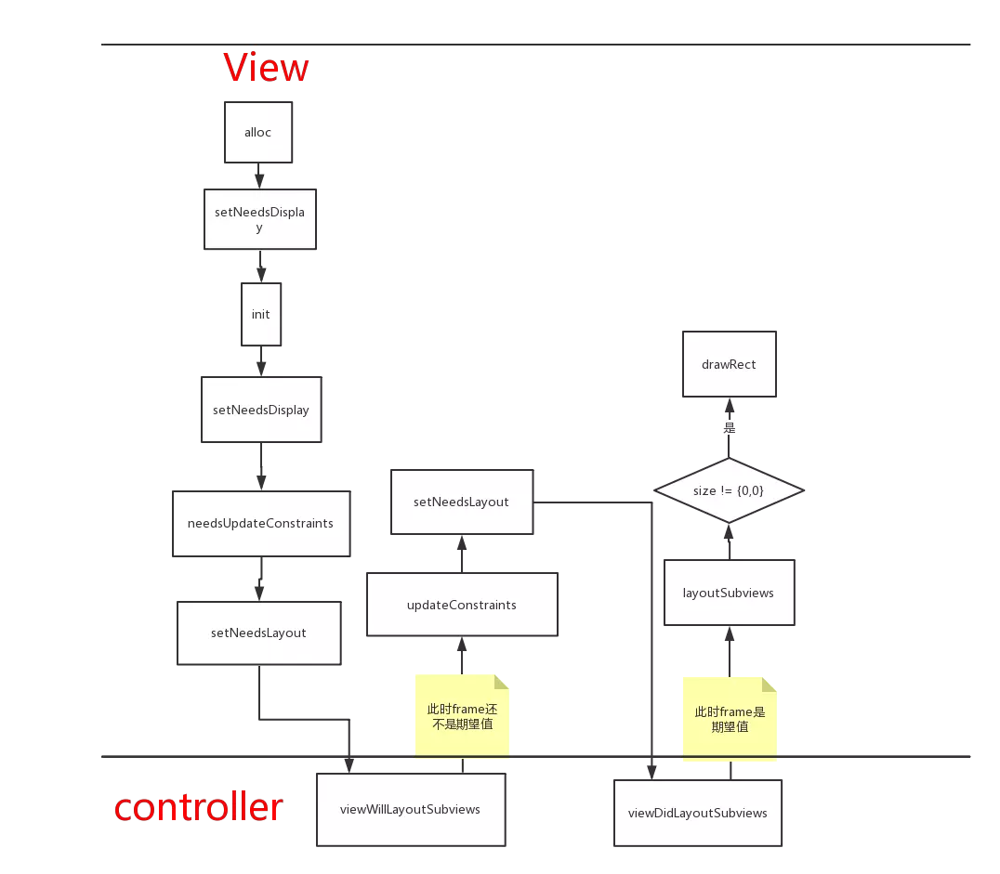

# 第二周  
### 完成状态
  
- [x] 进行中
- [ ] 已完成
- [ ] 维护中

### 日期
####2019/06/10-2019/06/16    

## 列表   
1. [使用 Metal 和 Core ML 评价照片质量](http://yulingtianxia.com/blog/2018/11/30/Photo-Assessment/)
2. [iOS 开发技术栈与进阶](https://blog.cnbang.net/tech/3354/)
3. [有了这些你们团队的代码肯定规范](https://juejin.im/post/5c7c7e0cf265da2ddb298123?utm_source=gold_browser_extension)
4. [基于LLVM开发Clang插件进行代码风格检查](https://juejin.im/post/5ce2cf306fb9a07ed440d3cc?utm_source=gold_browser_extension#heading-4)
5. [原子性内存栅栏问题简述](http://djs66256.github.io/2018/03/29/2018-03-29-%E5%86%85%E5%AD%98%E6%A0%85%E6%A0%8F%E9%97%AE%E9%A2%98%E7%AE%80%E8%BF%B0/)
6. [~~VC的布局时机、所用方法以及UIView内部布局执行顺序~~](https://juejin.im/post/5b629d2c6fb9a04fc436dc6c)
## Knowledge Merge   

### 1.  使用 Metal 和 Core ML 评价照片质量

### 6. VC的布局时机、所用方法以及UIView内部布局执行顺序     

1. VC view 布局生命周期  
    * alloc 
    * init(xib. storyboard)  
    * awakeFromNib
        是否关联，有就关联xib 
    * loadView 
        优先从nib载入控制器视图   
    * viewDidLoad 
        可以进行自定义数据以及动态创建其他控件。在这两个方法中实现约束  
    * viewWillAppear 
        拿不到frame， 可在实现约束后调用 `layoutIfNeeded` 此处才能拿到 
    * viewWillLayoutSubviews
        将要布局子控件
    * viewDidLayoutSubviews
        子控件布局完成  
    * viewDidAppear 
        已在屏幕上渲染完成  
    * viewWillDisappear 
    * viewDidDisappear  
    * dealloc  

2. layoutSubviews 调用时机  
    * 当view 被添加到另一个view上  
    * addSubview(子view需要有frame)  
    * 屏幕方向变更  
    * frame 发生变化  
    * 滚动一个UIScrollView会触发 layoutSubviews  
    * 改变 view 大小，触发父view layoutSubviews

3. view 内部执行顺序  
    * setNeedsUpdateConstraints：标记需要updateConstraints。 
    * needsUpdateConstraints：返回是否需要updateConstraints。
    * updateConstraintsIfNeeded：若需要，马上updateConstraints。
    * updateConstraints：更新约束
        自定义view应该重写此方法在其中建立constraints. __要在最后调用[super updateConstraints]__.     
        __不要手动调用__    
    * layoutIfNeeded
        使用此方法强制立即进行layout,从当前view开始，此方法会遍历整个view层次(包括superviews)请求layout。因此，调用此方法会强制整个view层次布局。
    * setNeedsLayout
        此方法会将view当前的layout设置为无效的，并在下一个upadte cycle里去触发layout更新。
    * layoutSubviews
        __不要手动调用__    
    * setNeedsDisplay
        标记整个视图的边界矩形需要重绘.   
        __不要手动调用__     
    * drawRect
        如果你的View画自定义的内容，就要实现该方法，否则避免覆盖该方法。

> 来源 《VC的布局时机、所用方法以及UIView内部布局执行顺序》  
