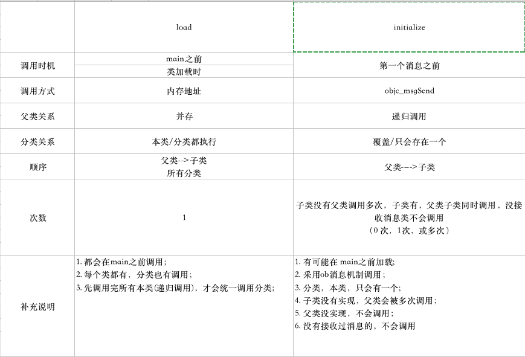

# 第四周  
### 完成状态
  
- [ ] 进行中
- [ ] 已完成
- [x] 维护中

### 日期
#### 2019/08/19-2019/08/25


## 目录 
* [~~Method Swizzling~~](tanhao.me/code/160723.html/)
* [~~load、initialize 调用时机等~~](https://juejin.im/post/5a31216ff265da431f4b1273)  
    * [~~参考~~](https://www.jianshu.com/p/bd82ef5ea186)


## Knowledge Merge   

### Method Swizzling  

1. 常用方式通过 `Category` 实现   

```
+ (void)load {
    static dispatch_once_t onceToken;
    dispatch_once(&onceToken, ^{
        Class class = [self class];
        SEL originalSelector = @selector(viewWillAppear:);
        SEL swizzledSelector = @selector(xxx_viewWillAppear:);

        Method originalMethod = class_getInstanceMethod(class, originalSelector);
        Method swizzledMethod = class_getInstanceMethod(class, swizzledSelector);
        //
        BOOL didAddMethod =
            class_addMethod(class,
                originalSelector,
                method_getImplementation(swizzledMethod),
                method_getTypeEncoding(swizzledMethod));
        if (didAddMethod) {
            class_replaceMethod(class,
                swizzledSelector,
                method_getImplementation(originalMethod),
                method_getTypeEncoding(originalMethod));
        } else {
            method_exchangeImplementations(originalMethod, swizzledMethod);
        }
    });
}
#pragma mark - Method Swizzling
- (void)xxx_viewWillAppear:(BOOL)animated {
    [self xxx_viewWillAppear:animated];
    NSLog(@"viewWillAppear: %@", self);
}
@end
```
* 在Category 的`load` 方法中添加Method Swizzling 代码，在类初始化加载时自动调用。__load方法按照父类到子类,类自身到Category的顺序被调用.__  
* `dispatch_once` 保证代码只会调用一次(load 方法也只会调用一次，此处可以不需要此操作)  
* 尝试先调用class_addMethod方法,以保证即便originalSelector只在父类中实现,也能达到Method Swizzling的目的.   
* __xxx_viewWillAppear:方法中[self xxx_viewWillAppear:animated];代码并不会造成死循环,因为Method Swizzling之后, 调用xxx_viewWillAppear:实际执行的代码已经是原来viewWillAppear中的代码了.__  

```
+ (void)load {
    Class class = [self class];
    
    SEL originalSelector = @selector(viewWillAppear:);
    SEL swizzledSelector = @selector(xxx_viewWillAppear:);
    Method originalMethod = class_getInstanceMethod(class, originalSelector);
    Method swizzledMethod = class_getInstanceMethod(class, swizzledSelector);
    if (!originalMethod || !swizzledMethod) {
        return;
    }
    
    IMP originalIMP = method_getImplementation(originalMethod);
    IMP swizzledIMP = method_getImplementation(swizzledMethod);
    const char *originalType = method_getTypeEncoding(originalMethod);
    const char *swizzledType = method_getTypeEncoding(swizzledMethod);
    
    // 这儿的先后顺序是有讲究的,如果先执行后一句,那么在执行完瞬间方法被调用容易引发死循环
    class_replaceMethod(class,swizzledSelector,originalIMP,originalType);
    class_replaceMethod(class,originalSelector,swizzledIMP,swizzledType);
}
```
__重点:__ 由于`class_replaceMethod`方法能够覆盖到 `class_addMethod`和`method_setImplementation`; 对于第一个 `class_replaceMethod`, 如果`viewWillApplear`实现在父类中，则执行`class_addMthod`，否则执行`method_setImplementation`将原方法的IMP指向新的代码块，而第二个 `class_replaceMethod`是将新方法的IMP 指向原代码块  


> 注意: __此处应该特别注意交换顺序，应该优先把新方法指向原IMP，再修改原有方法的IMP__  


#### 在不同类之间实现 Method Swizzing  
```

+ (void)load {
    Class originalClass = NSClassFromString(@"Car");
    Class swizzledClass = [self class];
    SEL originalSelector = NSSelectorFromString(@"run:");
    SEL swizzledSelector = @selector(xxx_run:);
    Method originalMethod = class_getInstanceMethod(originalClass, originalSelector);
    Method swizzledMethod = class_getInstanceMethod(swizzledClass, swizzledSelector);
    
    // 向Car类中新添加一个xxx_run:的方法
    BOOL registerMethod = class_addMethod(originalClass,
                                          swizzledSelector,
                                          method_getImplementation(swizzledMethod),
                                          method_getTypeEncoding(swizzledMethod));
    if (!registerMethod) {
        return;
    }
    
    // 需要更新swizzledMethod变量,获取当前Car类中xxx_run:的Method指针
    swizzledMethod = class_getInstanceMethod(originalClass, swizzledSelector);
    if (!swizzledMethod) {
        return;
    }
    
    // 后续流程与之前的一致
    BOOL didAddMethod = class_addMethod(originalClass,
                                        originalSelector,
                                        method_getImplementation(swizzledMethod),
                                        method_getTypeEncoding(swizzledMethod));
    if (didAddMethod) {
        class_replaceMethod(originalClass,
                            swizzledSelector,
                            method_getImplementation(originalMethod),
                            method_getTypeEncoding(originalMethod));
    } else {
        method_exchangeImplementations(originalMethod, swizzledMethod);
    }
}
- (void)xxx_run:(double)speed {
    if (speed < 120) {
        [self xxx_run:speed];
    }
}
```
__重点：__  
* 利用 runtime 向目标类中添加一个新的方法， 此时，目标类和当前类都存在相同的方法。当前类的左右就是提供在 `load` 方法中利用 runtime 给目标类提供这个方法  
* 需要更新 `swizzledMethod` 变量为目标类的 添加的方法对应的(初始时指向的是当前类)  

##### 简化方式  
```
+ (void)load {
    Class originalClass = NSClassFromString(@"Car");
    Class swizzledClass = [self class];
    SEL originalSelector = NSSelectorFromString(@"run:");
    SEL swizzledSelector = @selector(xxx_run:);
    Method originalMethod = class_getInstanceMethod(originalClass, originalSelector);
    Method swizzledMethod = class_getInstanceMethod(swizzledClass, swizzledSelector);
    
    IMP originalIMP = method_getImplementation(originalMethod);
    IMP swizzledIMP = method_getImplementation(swizzledMethod);
    const char *originalType = method_getTypeEncoding(originalMethod);
    const char *swizzledType = method_getTypeEncoding(swizzledMethod);
        
    class_replaceMethod(originalClass,swizzledSelector,originalIMP,originalType);
    class_replaceMethod(originalClass,originalSelector,swizzledIMP,swizzledType);
}
```
> 与Catetory 的方法无差异，但内部方法作用变了  

* 第一个 `class_replaceMethod` 在目标类中注册对应方法(`xxx_run:`)，并指定 IMP 为当前 被替换方法(`run:`)的 IMP   
* 第二个 `class_replaceMethod` 与之前的逻辑一致，当`run:` 方法是实现在`Car`或其父类，分别执行`method_setImplementation` 或`class_addMethod`  


#### 类方法的 Method Swizzling  
```

+ (void)load {
    Class cls = [self class];
    SEL originalSelector = @selector(dictionary);
    SEL swizzledSelector = @selector(xxx_dictionary);
    
    // 使用class_getClassMethod来获取类方法的Method
    Method originalMethod = class_getClassMethod(cls, originalSelector);
    Method swizzledMethod = class_getClassMethod(cls, swizzledSelector);
    if (!originalMethod || !swizzledMethod) {
        return;
    }
    
    IMP originalIMP = method_getImplementation(originalMethod);
    IMP swizzledIMP = method_getImplementation(swizzledMethod);
    const char *originalType = method_getTypeEncoding(originalMethod);
    const char *swizzledType = method_getTypeEncoding(swizzledMethod);
    
    // 类方法添加,需要将方法添加到MetaClass中
    Class metaClass = objc_getMetaClass(class_getName(cls));
    class_replaceMethod(metaClass,swizzledSelector,originalIMP,originalType);
    class_replaceMethod(metaClass,originalSelector,swizzledIMP,swizzledType);
}
+ (id)xxx_dictionary {
    id result = [self xxx_dictionary];
    return result;
}
```
__重点：__  
* 获取 Method 的方式变为 `class_getClassMethod(Class cls, SEL name)` 
* 对于类方法的动态添加，需要添加到 MetaClass中，__实例方法记录在class的 `method-list`中，类方法记录在 `meta-class` 的`letho-list`中   

#### 在类簇中实现  
__类簇:__ 例如常见的`__NSArrayI`，`__NSCFConstantString`等。[class cluster](https://developer.apple.com/library/ios/documentation/General/Conceptual/DevPedia-CocoaCore/ClassCluster.html)  
__针对类簇的 Method Swizzling 问题就转化为如何对这些类簇中的私有类做 Method Swizzling__  

```
+ (void)load {
    // 类簇类
    Class originalClass = NSClassFromString(@"__NSDictionaryM"); 
    // 当前自定义类
    Class swizzledClass = [self class];
    SEL originalSelector = @selector(setObject:forKey:);
    SEL swizzledSelector = @selector(safe_setObject:forKey:);
    Method originalMethod = class_getInstanceMethod(originalClass, originalSelector);
    Method swizzledMethod = class_getInstanceMethod(swizzledClass, swizzledSelector);
    
    IMP originalIMP = method_getImplementation(originalMethod);
    IMP swizzledIMP = method_getImplementation(swizzledMethod);
    const char *originalType = method_getTypeEncoding(originalMethod);
    const char *swizzledType = method_getTypeEncoding(swizzledMethod);
    
    class_replaceMethod(originalClass,swizzledSelector,originalIMP,originalType);
    class_replaceMethod(originalClass,originalSelector,swizzledIMP,swizzledType);
}
- (void)safe_setObject:(id)anObject forKey:(id<NSCopying>)aKey {
    if (anObject && aKey) {
        [self safe_setObject:anObject forKey:aKey];
    }
    else if (aKey) {
        [(NSMutableDictionary *)self removeObjectForKey:aKey];
    }
}
```
#### 恢复  
* 方案一 
    通过一个开关标识符， 在实现中判定如果设定了该标识符, 逻辑就直接调用原方法的实现  

* 方案二  
    针对方法交换的各种场景，主要做了两件事：  
    * `class_addMehod`: 添加一个新的方法.将其他类的实现添加到目标类中; 将父类方法添加一份到子类中；添加实例方法； 添加类方法     
    * 交换 IMP， 可以通过 `method_exchangeImplementations`交换，也可以通过`method_setImplementation`单独修改某个方法的IMP，  或者是采用在调用`class_addMethod`方法中设定了IMP而直接就完成了IMP的交换, 总之就是对IMP的交换.     


* 解决方案  
    * `class_copyMethodList`方法, 可以直接取出Method列表, 然后逐个遍历找到IMP所对应的Method

```
#import <objc/runtime.h>
@interface MySafeDictionary : NSObject
@end
static NSLock *kMySafeLock = nil;
static IMP kMySafeOriginalIMP = NULL;
static IMP kMySafeSwizzledIMP = NULL;
@implementation MySafeDictionary
+ (void)swizzlling {
    static dispatch_once_t onceToken;
    dispatch_once(&onceToken, ^{
        kMySafeLock = [[NSLock alloc] init];
    });
    
    [kMySafeLock lock];
    
    do {
        if (kMySafeOriginalIMP || kMySafeSwizzledIMP) break;
        
        Class originalClass = NSClassFromString(@"__NSDictionaryM");
        if (!originalClass) break;
        
        Class swizzledClass = [self class];
        SEL originalSelector = @selector(setObject:forKey:);
        SEL swizzledSelector = @selector(safe_setObject:forKey:);
        Method originalMethod = class_getInstanceMethod(originalClass, originalSelector);
        Method swizzledMethod = class_getInstanceMethod(swizzledClass, swizzledSelector);
        if (!originalMethod || !swizzledMethod) break;
        
        IMP originalIMP = method_getImplementation(originalMethod);
        IMP swizzledIMP = method_getImplementation(swizzledMethod);
        const char *originalType = method_getTypeEncoding(originalMethod);
        const char *swizzledType = method_getTypeEncoding(swizzledMethod);
        
        kMySafeOriginalIMP = originalIMP;
        kMySafeSwizzledIMP = swizzledIMP;
        
        class_replaceMethod(originalClass,swizzledSelector,originalIMP,originalType);
        class_replaceMethod(originalClass,originalSelector,swizzledIMP,swizzledType);
    } while (NO);
    
    [kMySafeLock unlock];
}
+ (void)restore {
    [kMySafeLock lock];
    
    do {
        if (!kMySafeOriginalIMP || !kMySafeSwizzledIMP) break;
        
        Class originalClass = NSClassFromString(@"__NSDictionaryM");
        if (!originalClass) break;
        
        Method originalMethod = NULL;
        Method swizzledMethod = NULL;
        unsigned int outCount = 0;
        Method *methodList = class_copyMethodList(originalClass, &outCount);
        for (unsigned int idx=0; idx < outCount; idx++) {
            Method aMethod = methodList[idx];
            IMP aIMP = method_getImplementation(aMethod);
            if (aIMP == kMySafeSwizzledIMP) {
                originalMethod = aMethod;
            }
            else if (aIMP == kMySafeOriginalIMP) {
                swizzledMethod = aMethod;
            }
        }
        // 尽可能使用exchange,因为它是atomic的
        if (originalMethod && swizzledMethod) {
            method_exchangeImplementations(originalMethod, swizzledMethod);
        }
        else if (originalMethod) {
            method_setImplementation(originalMethod, kMySafeOriginalIMP);
        }
        else if (swizzledMethod) {
            method_setImplementation(swizzledMethod, kMySafeSwizzledIMP);
        }
        kMySafeOriginalIMP = NULL;
        kMySafeSwizzledIMP = NULL;
    } while (NO);
    
    [kMySafeLock unlock];
}
- (void)safe_setObject:(id)anObject forKey:(id<NSCopying>)aKey {
    if (anObject && aKey) {
        [self safe_setObject:anObject forKey:aKey];
    }
    else if (aKey) {
        [(NSMutableDictionary *)self removeObjectForKey:aKey];
    }
}
@end


```


### load 和 initialize 等方法调用时机    


#### Load 
* 所有类和分类的 `load` 方法都是在被加入到运行时调用  
* 父类优先于子类加载  
    通过递归找到最根类然后依次加载   
* 在所有本类加载完毕后，才会加载分类    
    [所有本类] -----> [所有类分类]

* 同一个类的各个分类的加载顺序是按照 编译顺序决定的(Build Phases ----> Compile Sources)  

##### 测试  

```

@implementation Car

+ (void)load {
    NSLog(@"Car===>load");
}

+(void)initialize {
    NSLog(@"Car===>initialize");
}

@end

// Dog
@implementation Dog
+ (void)load {
    NSLog(@"Dog===>load");
}

+(void)initialize {
    NSLog(@"Dog===>initialize");
}
@end

// Car 子类
@implementation SmallCar
+ (void)load {
    NSLog(@"SmallCar===>load");
}

+(void)initialize {
    NSLog(@"Car =====>SmallCar===>initialize");
}
@end

```


##### 结果  
```
// log 
2019-08-24 15:45:58.543374+0800 OCTest[15023:5027880] Car===>load
2019-08-24 15:45:58.543763+0800 OCTest[15023:5027880] SmallCar===>load
2019-08-24 15:45:58.543799+0800 OCTest[15023:5027880] Dog===>load
2019-08-24 15:45:58.543923+0800 OCTest[15023:5027880] Main

```

类加载顺序(Build Phases ---> Compile Sources)  

```
SmallCar.m 
Dog.m 
Car.m 
main.m
```

##### 总结  
1. 所有的load 方法都会在main函数之前执行  
2. 会先执行父类的 load 方法再执行子类的  
3. 遇到 子类 在 `Complie Sources` 前列，会先执行对应的父类，然后按照顺序再往下执行，遇到子类在父类之前，先执行父类，再执行子类  


#### initialize  
*  不能主动通过 `[super initialize]`调用 `initialize` 方法 ，__此方法系统调用__  
*  runtime 会在每个类及其子类收到第一个消息之前调用 `initialize`方法 

*  父类早于子类调用  
*  初始化的时候，会在安全线程调用，尽量不要写复杂逻辑(容易引起死锁)  
*  如果子类没有实现 `initialize` 方法，其父类该方法会被调用多次
*  通过以下方法避免 调用多次  

    ```
    +(void)initialize {
        if (self == [ClassName self]) {
            // do something 
        }
    }

    ```

*  此方法每个类只会调用一次， 如果需要对某个类或分类进行独立初始化， 可以通过`load` 方法实现   

*  分类会会覆盖本类中的方法。 


> 此处可查看runtime源码 ` objc-runtime-new.mm ---->  lookUpImpOrForward` 方法  

##### 应用  
1. 可以在此方法中对部分静态变量赋值  


##### 测试  
```

+ (void)load {
    NSLog(@"Car===>load");
}

+(void)initialize {
    NSLog(@"Car===>initialize");
}

+(void)carTest {
    NSLog(@"Car===> class function test");
}

+ (void)load {
    NSLog(@"Dog===>load");
}

+(void)initialize {
    NSLog(@"Dog===>initialize");
}

+(void)dogTest {
     NSLog(@"Dog===> class function test");
}

+ (void)load {
    NSLog(@"SmallCar===>load");
}

+(void)initialize {
    NSLog(@"Car =====>SmallCar===>initialize");
}

+(void)test{
    NSLog(@"SmallCar=====>class foundation test");
}
```

##### 结果  
1. 调用子类的方法 ，两种情况   
    * 子类实现,父类也实现    
    先调用父类， 再调用子类  
        ```
        2019-08-24 15:58:53.764653+0800 OCTest[16463:5036604] Car===>load
        2019-08-24 15:58:53.765056+0800 OCTest[16463:5036604] SmallCar===>load
        2019-08-24 15:58:53.765076+0800 OCTest[16463:5036604] Dog===>load
        2019-08-24 15:58:53.765154+0800 OCTest[16463:5036604] Main
        2019-08-24 15:58:53.765178+0800 OCTest[16463:5036604] Car===>initialize
        2019-08-24 15:58:53.765200+0800 OCTest[16463:5036604] Car =====>SmallCar===>initialize
        2019-08-24 15:58:53.765222+0800 OCTest[16463:5036604] Car===> class function test
        ```
    * 子类未实现, 父类实现       
        父类的会被调用两次
        ```
        2019-08-24 16:00:35.230411+0800 OCTest[16734:5037852] Car===>load
        2019-08-24 16:00:35.231204+0800 OCTest[16734:5037852] SmallCar===>load
        2019-08-24 16:00:35.231232+0800 OCTest[16734:5037852] Dog===>load
        2019-08-24 16:00:35.231320+0800 OCTest[16734:5037852] Main
        2019-08-24 16:00:35.231347+0800 OCTest[16734:5037852] Car===>initialize
        2019-08-24 16:00:35.231369+0800 OCTest[16734:5037852] Car===>initialize
        2019-08-24 16:00:35.231389+0800 OCTest[16734:5037852] Car===> class function test
        ```
    * 子类实现，父类未实现    
        子类调用，父类的无  
        ```
        2019-08-24 16:03:01.106076+0800 OCTest[17017:5039492] Car===>load
        2019-08-24 16:03:01.106563+0800 OCTest[17017:5039492] SmallCar===>load
        2019-08-24 16:03:01.106586+0800 OCTest[17017:5039492] Dog===>load
        2019-08-24 16:03:01.106673+0800 OCTest[17017:5039492] Main
        2019-08-24 16:03:01.106705+0800 OCTest[17017:5039492] Car =====>SmallCar===>initialize
        2019-08-24 16:03:01.106726+0800 OCTest[17017:5039492] Car===> class function test

        ```


#### 特殊情况  
> 此种情况下会造成 `initialize` 在 `main` 函数之前执行   

```

+ (void)load {
    NSLog(@"Car===>load");
    [Car carTest];
}

+(void)initialize {
    NSLog(@"Car===>initialize");
}

+(void)carTest {
    NSLog(@"Car===> class function test");
}
```
在 类的 `load` 方法中调用类方法.    

__但这种情况并没违背整体调用顺序, 不过 initialize方法在 load之前调用了__  


#### 总结  
1. load 方法在 main 方法之前调用， `initialize`方法是在第一个消息之前调 用 (__都是在对象初始化之前调用__)  
    __参见特殊情况__   

2. 如果在A类的 load 方法中调用 B 类的类方法，那么A 类的 load 方法之后会调用 B 类的 `initialize`方法，然后执行调用的类方法， 最后， B类的 Load 方法按照 `Compile Source` 顺序调用   

    ```
    + (void)load {
        NSLog(@"Dog===>load");
        [Car carTest];
    }
    ```
    > 注意，此处需要调整 `Compile Source`的顺序，让 Dog 类先加载, 不同的加载顺序将导致不同的结果    

    结果
    ```
    2019-08-24 16:08:33.182855+0800 OCTest[17636:5043261] Dog===>load
    2019-08-24 16:08:33.183289+0800 OCTest[17636:5043261] Car===>initialize
    2019-08-24 16:08:33.183313+0800 OCTest[17636:5043261] Car===> class function test
    2019-08-24 16:08:33.183332+0800 OCTest[17636:5043261] Car===>load
    2019-08-24 16:08:33.183351+0800 OCTest[17636:5043261] SmallCar===>load
    2019-08-24 16:08:33.183475+0800 OCTest[17636:5043261] Main
    ```

    __此处有个问题，如果采用方法 Method Swizzing 方法，在 load 的方法中进行方法交换(交换类方法)， 那么可能调用到的是未交换的方法__   


3. 所有类都有 `load` 方法，都会被调用，分类也是， `initalize` 方法会被分类覆盖，子类父类分类只会执行一个  

4. load 方法内部一般用来实现 Method Swizzle，Initialize方法一般用来初始化全局变量或者静态变量  

5. 两个方法都不能主动调用，也不需要通过 super 继承父类方法，但是 Initialize 方法会在子类没有实现的时候调用父类的该方法，而 load 不会


#### 图片总结  

