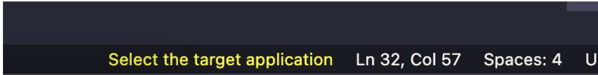
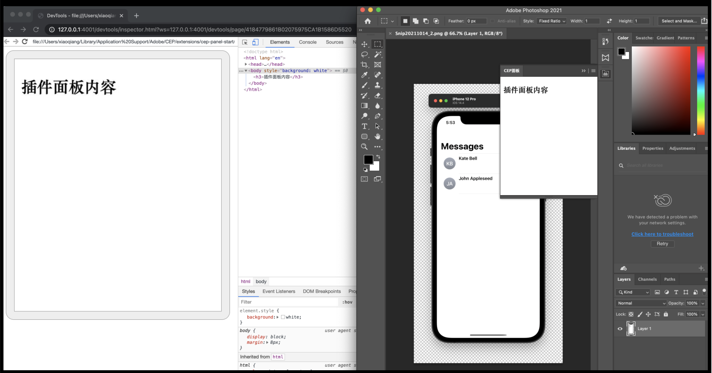

# 调试 

## 开发工具  Visual Studio Code

#### 插件： ExtendScript Debugger 


## 示例 
1. 创建 demo.js 

```JS

alert(app.documents.length);

```

2. launch.json

```json 

{
    "version": "0.2.0",
    "configurations": [
        {
            "type": "extendscript-debug",
            "request": "launch",
            "name": "demo.js",
            "program": "${workspaceFolder}/demo.js",
            "stopOnEntry": false
        },
    ]
}

```

3. 选择目标应用 
 


4. 调试 

> 停止维护更新. 经常不不动，就连不上Ps了，这个时候，可能可以通过重启Ps/VSCode/电脑等来恢复链接状态


##  ExtendScript Toolkit  (废弃)


## Padda  


## 插件面板调试 
1. debug文件 
    插件根目录新建 `.debug`文件     
    
    ```xml 

    <?xml version="1.0" encoding="UTF-8"?>
    <ExtensionList>
        <Extension Id="com.demo.cepstart">
            <HostList>
                <Host Name="PHXS" Port="4001"/>
            </HostList>
        </Extension>
    </ExtensionList>

    ```
    *  Id 就是在Manifest.xml文件中写的插件唯一ID  
    * PHXS指的是CC版本的Photoshop  
    * Port 是本地监听的端口

2. 重启 PS ,再打开插件面板, 通过Chrome的DevTool进行远程调试了
     


3. Devtool 出问题的解决方案 
    * [CefClient](https://github.com/Adobe-CEP/CEP-Resources/tree/master/CEP_10.x/Cefclient_v74)